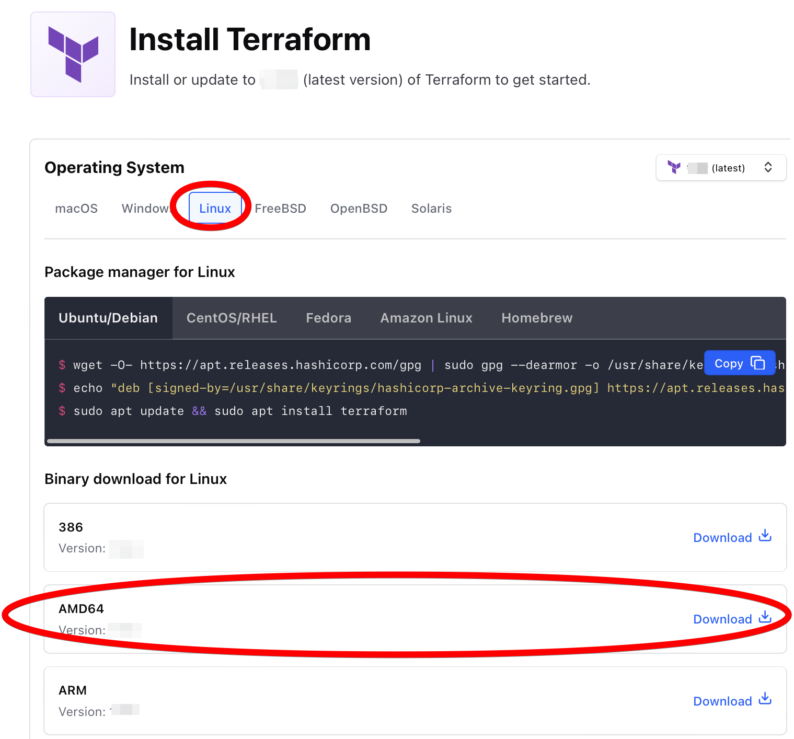

```bash

```

    2023-Jan-08:[TF-1.3.7] Lab updated on node tf[terraform missing]


<br/>

## Background:
In this initial setup we will download the Terraform binary from the https://terraform.io website.

<!-- You should already have the following: -->


<br/>

# 1.1 Login to the provided VM


<br/>

## 1.1.1 Download the Terraform binary from the VM command-line:

Go to [Terraform Downloads (https://www.terraform.io/downloads.html)](https://www.terraform.io/downloads.html).

**Note:** we can download or install Terraform in various ways for each operating system - we will simply download static binaries to the provided *virtual machine*

Download the latest binary for your platform - *linux-amd64* - in this case.

Right-click on the 64-bit link for Linux, as shown below, and copy the link:

<!--
    Why doesn't this work any more ?
       
    This does:
       
    But we'll use html to get a useful border
       
-->


In your VM, use wget to download the zip file containing terraform and then unzip that file


```bash
mkdir -p ~/tmp/
cd ~/tmp/

echo DOWNLOAD_URL=$DOWNLOAD_URL
echo
wget "https://releases.hashicorp.com/terraform/1.3.7/terraform_1.3.7_linux_amd64.zip"

unzip terraform_*_linux_amd64.zip
```

    DOWNLOAD_URL=https://releases.hashicorp.com/terraform/1.3.7/terraform_1.3.7_linux_amd64.zip
    
    --2023-01-08 19:19:23--  https://releases.hashicorp.com/terraform/1.3.7/terraform_1.3.7_linux_amd64.zip
    Resolving releases.hashicorp.com (releases.hashicorp.com)... 2600:9000:2450:a400:5:e2b6:b380:93a1, 2600:9000:2450:1a00:5:e2b6:b380:93a1, 2600:9000:2450:b400:5:e2b6:b380:93a1, ...
    Connecting to releases.hashicorp.com (releases.hashicorp.com)|2600:9000:2450:a400:5:e2b6:b380:93a1|:443... connected.
    HTTP request sent, awaiting response... 200 OK
    Length: 19464102 (19M) [application/zip]
    Saving to: ‘terraform_1.3.7_linux_amd64.zip’
    
    terraform_1.3.7_lin 100%[===================>]  18.56M  62.9MB/s    in 0.3s    
    
    2023-01-08 19:19:23 (62.9 MB/s) - ‘terraform_1.3.7_linux_amd64.zip’ saved [19464102/19464102]
    
    Archive:  terraform_1.3.7_linux_amd64.zip
      inflating: terraform               


<br/>

## 1.1.2 Check Terraform Version

Check the terraform version, you should see output similar to:


```bash
./terraform version
```

    Terraform v1.3.7
    on linux_amd64


<br/>

## 1.1.3 Move Terraform into ~/bin


```bash
mkdir -p ~/bin
mv terraform ~/bin

echo 'export PATH=~/bin:$PATH' >> ~/.bashrc
 . ~/.bashrc
```

Log out and then log in again and make sure that the command


```bash
terraform version
```

    Terraform v1.3.7
    on linux_amd64


works correctly

You can delete the zip file which you downloaded.


<br/>

# 1.2 Investigate Terraform sub-commands

Type ```terraform``` to see the Terraform sub-commands available


```bash
terraform
```

    Usage: terraform [global options] <subcommand> [args]
    
    The available commands for execution are listed below.
    The primary workflow commands are given first, followed by
    less common or more advanced commands.
    
    Main commands:
      init          Prepare your working directory for other commands
      validate      Check whether the configuration is valid
      plan          Show changes required by the current configuration
      apply         Create or update infrastructure
      destroy       Destroy previously-created infrastructure
    
    All other commands:
      console       Try Terraform expressions at an interactive command prompt
      fmt           Reformat your configuration in the standard style
      force-unlock  Release a stuck lock on the current workspace
      get           Install or upgrade remote Terraform modules
      graph         Generate a Graphviz graph of the steps in an operation
      import        Associate existing infrastructure with a Terraform resource
      login         Obtain and save credentials for a remote host
      logout        Remove locally-stored credentials for a remote host
      output        Show output values from your root module
      providers     Show the providers required for this configuration
      refresh       Update the state to match remote systems
      show          Show the current state or a saved plan
      state         Advanced state management
      taint         Mark a resource instance as not fully functional
      test          Experimental support for module integration testing
      untaint       Remove the 'tainted' state from a resource instance
      version       Show the current Terraform version
      workspace     Workspace management
    
    Global options (use these before the subcommand, if any):
      -chdir=DIR    Switch to a different working directory before executing the
                    given subcommand.
      -help         Show this help output, or the help for a specified subcommand.
      -version      An alias for the "version" subcommand.


Investigate this list of sub-commands


<br/>

## 1.2.1 Look for more information about sub-commands

#### Look for cli help for a sub-command

You can get help from the command-line tool using ```terraform <sub-command> --help```
e.g. ```terraform apply --help```

#### Look for online help for a sub-command

Browse to the ```Terraform Documentation``` site and look at the ```Commands``` section:

https://www.terraform.io/docs/commands/index.html

Look there for specific sub-commands, e.g. for ```terraform apply```
https://www.terraform.io/docs/commands/apply.html


<br/>

## 1.2.2 Investigate the Terraform CHANGELOG

Open a browser at https://github.com/hashicorp/terraform/blob/master/CHANGELOG.md

Look at the changes introduced in Terraform 1.0 & Terraform 1.1


<br/>

# 1.3 Starting with the smallest configurations ...

1. Make a new directory ~/labs/lab1.
2. Change to that directory


```bash
mkdir -p ~/labs/lab1
cd       ~/labs/lab1
```

Now that we have Terraform installed let's build up some minimalist configurations to discover the structure of a Terraform configuration.

In this step we won't yet create any resource, but we will see how we can interact with a Provider.


<br/>

## 1.3.1 the smallest configuration - without a provider

#### create the main.tf file

create an empty file main.tf

```
touch main.tf
```

This is the absolute minimum configuration possible and this simply tells Terraform which Provider we will be using

#### try a 'terraform plan'

Run the command ```terraform plan``` or ```terraform apply``` with this configuration.


```bash
terraform plan
```

    
    No changes. Your infrastructure matches the configuration.
    
    Terraform has compared your real infrastructure against your configuration and
    found no differences, so no changes are needed.


<br/>

## 1.3.2 simple variable definition - without a provider

#### add a variable definition

Now edit your main.tf and add the following lines at the end of the file:

```
variable test {
}
```

Re-run the ```terraform plan``` command.

Note that Terraform will now prompt you to provide a value for the test variable as we did not assign anything.

Enter any string at the prompt and see that the plan succeeds.

Try running ```terraform apply``` and you will be prompted again to enter a value.

You may also be prompted to enter "*yes*" to apply the config.

#### add a variable default value

Let's now define a default value for the variable to prevent these prompts.

Modify the variable definition to look like

```
variable test {
    description = "It is good practice to add a description to explain the variable's purpose"
    default = "a test value"
}
```

Rerun the ```terraform plan``` and ```terraform apply```

#### add an output definition

We will now add some output definitions which Terraform will use to report information.

```
output op_test  { value = var.test }
output op_test2 { value = "The same variablea' ${var.test}' using string interpolation" } 
```

Rerun the ```terraform plan``` and ```terraform apply```


Later we will see how the output command is useful to extract specific information such as an assigned IP address, to be easily accessible.


```bash
# EXCLUDE

cat > main.tf <<"EOF"

variable test {
  description = "It's good practice to add descriptions for variable'se"
  default = "a test value"
}

output op_test  {
  value = var.test
}
output op_test2 {
  value = "The same variablea' ${var.test}' using string interpolation"
} 

EOF

```


```bash
terraform plan
```

    
    Changes to Outputs:
      + op_test  = "a test value"
      + op_test2 = "The same variablea' a test value' using string interpolation"
    
    You can apply this plan to save these new output values to the Terraform state,
    without changing any real infrastructure.
    
    ───────────────────────────────────────────────────────────────────────────────
    
    Note: You didn't use the -out option to save this plan, so Terraform can't
    guarantee to take exactly these actions if you run "terraform apply" now.


```bash
terraform apply 
```

    
    Changes to Outputs:
      + op_test  = "a test value"
      + op_test2 = "The same variablea' a test value' using string interpolation"
    
    You can apply this plan to save these new output values to the Terraform state,
    without changing any real infrastructure.
    
    Apply complete! Resources: 0 added, 0 changed, 0 destroyed.
    
    Outputs:
    
    op_test = "a test value"
    op_test2 = "The same variablea' a test value' using string interpolation"


<br/>

# 1.4 Creating a first resource - with the AWS Provider

So far we have seen the most minimal configs, but they were of course useless as we created no resources !

Now let's create our first resource, an "*aws_instance*" which corresponds to an AWS EC2 Virtual Machine instance.

Recreate your main.tf file with the following content.

Note that we must now specify the *AWS* Provider to be used:


```bash
cat main.tf
```

    
    provider "aws" {
      region = "us-west-1"
    }
    
    resource "aws_instance" "example" {
      ami           = "ami-0e81aa4c57820bb57"
      instance_type = "t2.micro"
    
      tags = { LabName = "1.InstallTerraform" }
    }
    
    output  "public_ip"     { value = aws_instance.example.public_ip }
    


### Perform a Terraform plan

Now perform a Terraform plan with the new configuration - but this time we will get an error.

Because we now specify the *AWS* Provider we must first initialize our configuration using ```terraform init``` which will download the provider plugin.


```bash
terraform plan
```

    ╷
    │ Error: Inconsistent dependency lock file
    │ 
    │ The following dependency selections recorded in the lock file are
    │ inconsistent with the current configuration:
    │   - provider registry.terraform.io/hashicorp/aws: required by this configuration but no version is selected
    │ 
    │ To make the initial dependency selections that will initialize the dependency
    │ lock file, run:
    │   terraform init
    ╵


<br/>

## 1.4.1 terraform init

So perform ```terraform init``` and you will see that the plugin is downloaded automatically for us from the Terraform registry


```bash
terraform init
```

    
    Initializing the backend...
    
    Initializing provider plugins...
    - Finding latest version of hashicorp/aws...
    - Installing hashicorp/aws v4.49.0...
    - Installed hashicorp/aws v4.49.0 (signed by HashiCorp)
    
    Terraform has created a lock file .terraform.lock.hcl to record the provider
    selections it made above. Include this file in your version control repository
    so that Terraform can guarantee to make the same selections by default when
    you run "terraform init" in the future.
    
    Terraform has been successfully initialized!
    
    You may now begin working with Terraform. Try running "terraform plan" to see
    any changes that are required for your infrastructure. All Terraform commands
    should now work.
    
    If you ever set or change modules or backend configuration for Terraform,
    rerun this command to reinitialize your working directory. If you forget, other
    commands will detect it and remind you to do so if necessary.


Note that after performing ```terraform init``` a local file ```.terraform.lock.hcl``` is created and probably a ```.terraform``` directory where the aws provider is downloaded.

**Note:** The aws provider is large ~ 186Mbytes - we will see later how to store this file in a shared location


```bash
pwd

ls -altr
```

    /home/student/labs/lab1
    total 20
    drwxrwxr-x 3 student student 4096 Jan  8 19:21 ..
    -rw-rw-r-- 1 student student  387 Jan  8 19:24 terraform.tfstate
    -rw-rw-r-- 1 student student  267 Jan  8 19:24 main.tf
    -rw-r--r-- 1 student student 1377 Jan  8 19:24 .terraform.lock.hcl
    drwxrwxr-x 2 student student 4096 Jan  8 19:24 .


<br/>

## 1.4.2 terraform plan

#### retry 'terraform plan'

Now try again the ```terraform plan``` and you will see that this now succeeds

Terraform will also inform us of the changes it will make when we ```terraform apply``` this config.


```bash
terraform plan
```

    
    Terraform used the selected providers to generate the following execution plan.
    Resource actions are indicated with the following symbols:
      + create
    
    Terraform will perform the following actions:
    
      # aws_instance.example will be created
      + resource "aws_instance" "example" {
          + ami                                  = "ami-0e81aa4c57820bb57"
          + arn                                  = (known after apply)
          + associate_public_ip_address          = (known after apply)
          + availability_zone                    = (known after apply)
          + cpu_core_count                       = (known after apply)
          + cpu_threads_per_core                 = (known after apply)
          + disable_api_stop                     = (known after apply)
          + disable_api_termination              = (known after apply)
          + ebs_optimized                        = (known after apply)
          + get_password_data                    = false
          + host_id                              = (known after apply)
          + host_resource_group_arn              = (known after apply)
          + iam_instance_profile                 = (known after apply)
          + id                                   = (known after apply)
          + instance_initiated_shutdown_behavior = (known after apply)
          + instance_state                       = (known after apply)
          + instance_type                        = "t2.micro"
          + ipv6_address_count                   = (known after apply)
          + ipv6_addresses                       = (known after apply)
          + key_name                             = (known after apply)
          + monitoring                           = (known after apply)
          + outpost_arn                          = (known after apply)
          + password_data                        = (known after apply)
          + placement_group                      = (known after apply)
          + placement_partition_number           = (known after apply)
          + primary_network_interface_id         = (known after apply)
          + private_dns                          = (known after apply)
          + private_ip                           = (known after apply)
          + public_dns                           = (known after apply)
          + public_ip                            = (known after apply)
          + secondary_private_ips                = (known after apply)
          + security_groups                      = (known after apply)
          + source_dest_check                    = true
          + subnet_id                            = (known after apply)
          + tags                                 = {
              + "LabName" = "1.InstallTerraform"
            }
          + tags_all                             = {
              + "LabName" = "1.InstallTerraform"
            }
          + tenancy                              = (known after apply)
          + user_data                            = (known after apply)
          + user_data_base64                     = (known after apply)
          + user_data_replace_on_change          = false
          + vpc_security_group_ids               = (known after apply)
    
          + capacity_reservation_specification {
              + capacity_reservation_preference = (known after apply)
    
              + capacity_reservation_target {
                  + capacity_reservation_id                 = (known after apply)
                  + capacity_reservation_resource_group_arn = (known after apply)
                }
            }
    
          + ebs_block_device {
              + delete_on_termination = (known after apply)
              + device_name           = (known after apply)
              + encrypted             = (known after apply)
              + iops                  = (known after apply)
              + kms_key_id            = (known after apply)
              + snapshot_id           = (known after apply)
              + tags                  = (known after apply)
              + throughput            = (known after apply)
              + volume_id             = (known after apply)
              + volume_size           = (known after apply)
              + volume_type           = (known after apply)
            }
    
          + enclave_options {
              + enabled = (known after apply)
            }
    
          + ephemeral_block_device {
              + device_name  = (known after apply)
              + no_device    = (known after apply)
              + virtual_name = (known after apply)
            }
    
          + maintenance_options {
              + auto_recovery = (known after apply)
            }
    
          + metadata_options {
              + http_endpoint               = (known after apply)
              + http_put_response_hop_limit = (known after apply)
              + http_tokens                 = (known after apply)
              + instance_metadata_tags      = (known after apply)
            }
    
          + network_interface {
              + delete_on_termination = (known after apply)
              + device_index          = (known after apply)
              + network_card_index    = (known after apply)
              + network_interface_id  = (known after apply)
            }
    
          + private_dns_name_options {
              + enable_resource_name_dns_a_record    = (known after apply)
              + enable_resource_name_dns_aaaa_record = (known after apply)
              + hostname_type                        = (known after apply)
            }
    
          + root_block_device {
              + delete_on_termination = (known after apply)
              + device_name           = (known after apply)
              + encrypted             = (known after apply)
              + iops                  = (known after apply)
              + kms_key_id            = (known after apply)
              + tags                  = (known after apply)
              + throughput            = (known after apply)
              + volume_id             = (known after apply)
              + volume_size           = (known after apply)
              + volume_type           = (known after apply)
            }
        }
    
    Plan: 1 to add, 0 to change, 0 to destroy.
    
    Changes to Outputs:
      - op_test   = "a test value" -> null
      - op_test2  = "The same variablea' a test value' using string interpolation" -> null
      + public_ip = (known after apply)
    
    ───────────────────────────────────────────────────────────────────────────────
    
    Note: You didn't use the -out option to save this plan, so Terraform can't
    guarantee to take exactly these actions if you run "terraform apply" now.


Note that a new directory .terraform has been created, look at the contents of that directory

**Note**: If you have environment variable TF_DATA_DIR set, then this will point to a directory to be used - created if necessary - in place of .terraform

We see that a new "aws_instance" would be created.

Note the line **Plan: 1 to add, 0 to change, 0 to destroy.** informing us of the change which would be made


<br/>

## 1.4.3 terraform apply

We will now perform an apply to create that resource


```bash
terraform apply 
```

    
    Terraform used the selected providers to generate the following execution plan.
    Resource actions are indicated with the following symbols:
      + create
    
    Terraform will perform the following actions:
    
      # aws_instance.example will be created
      + resource "aws_instance" "example" {
          + ami                                  = "ami-0e81aa4c57820bb57"
          + arn                                  = (known after apply)
          + associate_public_ip_address          = (known after apply)
          + availability_zone                    = (known after apply)
          + cpu_core_count                       = (known after apply)
          + cpu_threads_per_core                 = (known after apply)
          + disable_api_stop                     = (known after apply)
          + disable_api_termination              = (known after apply)
          + ebs_optimized                        = (known after apply)
          + get_password_data                    = false
          + host_id                              = (known after apply)
          + host_resource_group_arn              = (known after apply)
          + iam_instance_profile                 = (known after apply)
          + id                                   = (known after apply)
          + instance_initiated_shutdown_behavior = (known after apply)
          + instance_state                       = (known after apply)
          + instance_type                        = "t2.micro"
          + ipv6_address_count                   = (known after apply)
          + ipv6_addresses                       = (known after apply)
          + key_name                             = (known after apply)
          + monitoring                           = (known after apply)
          + outpost_arn                          = (known after apply)
          + password_data                        = (known after apply)
          + placement_group                      = (known after apply)
          + placement_partition_number           = (known after apply)
          + primary_network_interface_id         = (known after apply)
          + private_dns                          = (known after apply)
          + private_ip                           = (known after apply)
          + public_dns                           = (known after apply)
          + public_ip                            = (known after apply)
          + secondary_private_ips                = (known after apply)
          + security_groups                      = (known after apply)
          + source_dest_check                    = true
          + subnet_id                            = (known after apply)
          + tags                                 = {
              + "LabName" = "1.InstallTerraform"
            }
          + tags_all                             = {
              + "LabName" = "1.InstallTerraform"
            }
          + tenancy                              = (known after apply)
          + user_data                            = (known after apply)
          + user_data_base64                     = (known after apply)
          + user_data_replace_on_change          = false
          + vpc_security_group_ids               = (known after apply)
    
          + capacity_reservation_specification {
              + capacity_reservation_preference = (known after apply)
    
              + capacity_reservation_target {
                  + capacity_reservation_id                 = (known after apply)
                  + capacity_reservation_resource_group_arn = (known after apply)
                }
            }
    
          + ebs_block_device {
              + delete_on_termination = (known after apply)
              + device_name           = (known after apply)
              + encrypted             = (known after apply)
              + iops                  = (known after apply)
              + kms_key_id            = (known after apply)
              + snapshot_id           = (known after apply)
              + tags                  = (known after apply)
              + throughput            = (known after apply)
              + volume_id             = (known after apply)
              + volume_size           = (known after apply)
              + volume_type           = (known after apply)
            }
    
          + enclave_options {
              + enabled = (known after apply)
            }
    
          + ephemeral_block_device {
              + device_name  = (known after apply)
              + no_device    = (known after apply)
              + virtual_name = (known after apply)
            }
    
          + maintenance_options {
              + auto_recovery = (known after apply)
            }
    
          + metadata_options {
              + http_endpoint               = (known after apply)
              + http_put_response_hop_limit = (known after apply)
              + http_tokens                 = (known after apply)
              + instance_metadata_tags      = (known after apply)
            }
    
          + network_interface {
              + delete_on_termination = (known after apply)
              + device_index          = (known after apply)
              + network_card_index    = (known after apply)
              + network_interface_id  = (known after apply)
            }
    
          + private_dns_name_options {
              + enable_resource_name_dns_a_record    = (known after apply)
              + enable_resource_name_dns_aaaa_record = (known after apply)
              + hostname_type                        = (known after apply)
            }
    
          + root_block_device {
              + delete_on_termination = (known after apply)
              + device_name           = (known after apply)
              + encrypted             = (known after apply)
              + iops                  = (known after apply)
              + kms_key_id            = (known after apply)
              + tags                  = (known after apply)
              + throughput            = (known after apply)
              + volume_id             = (known after apply)
              + volume_size           = (known after apply)
              + volume_type           = (known after apply)
            }
        }
    
    Plan: 1 to add, 0 to change, 0 to destroy.
    
    Changes to Outputs:
      + public_ip = (known after apply)
    aws_instance.example: Creating...
    aws_instance.example: Still creating... [10s elapsed]
    aws_instance.example: Still creating... [20s elapsed]
    aws_instance.example: Creation complete after 23s [id=i-04e94de79c6079761]
    
    Apply complete! Resources: 1 added, 0 changed, 0 destroyed.
    
    Outputs:
    
    public_ip = "54.241.193.137"


This time we are prompted to confirm that we wish to apply the plan.

After replying 'yes' the resource is created.

The output block statement provides us the public_ip of the created VM instance.

**Note**: For the moment we have not created a *Security Group* nor have we associated a keypair with this VM and so we cannot yet connect to it - we will do that in the next exercise.


<br/>

## 1.4.4 Inspecting the created resources

We can view the resulting resources by performing either through:

### terraform state list

This reads the information from the terraform.tfstate file to list each resource now being managed by Terraform.

Note that ```aws_instance.example``` corresponds to the name which Terraform asssociates with the resource as specified by the ```resource "aws_instance" "example"``` line in our config.

Try the
- ```terraform state list ``` and
- ```terraform state show``` commands, e.g. ```terraform state show aws_instance.example```.

### terraform show

This reads the information from the terraform.tfstate file

### aws ec2 describe-instances

Uses the aws cli to show all instances (very verbose!!)

### /usr/local/bin/get_instances.sh

A wrapper around *aws ec2 describe-instances* (quite succinct!!)

### terraform.tfstate

the raw terraform.tfstate json file

### jq

```
jq '.' terraform.tfstate
```

Extracting fields using jq:
```
jq '.resources[0].instances[].attributes.public_ip' terraform.tfstate
```

### terraform output

We can also obtain any output values using the ```terraform output``` command


<br/>

# 1.5 Cleanup

- Now cleanup the generated resource using the ```terraform destroy``` command
- Then also remove the .terraform directory (about 190 MBy in size)


```bash
terraform destroy 
```

    aws_instance.example: Refreshing state... [id=i-04e94de79c6079761]
    
    Terraform used the selected providers to generate the following execution plan.
    Resource actions are indicated with the following symbols:
      - destroy
    
    Terraform will perform the following actions:
    
      # aws_instance.example will be destroyed
      - resource "aws_instance" "example" {
          - ami                                  = "ami-0e81aa4c57820bb57" -> null
          - arn                                  = "arn:aws:ec2:us-west-1:816376574968:instance/i-04e94de79c6079761" -> null
          - associate_public_ip_address          = true -> null
          - availability_zone                    = "us-west-1c" -> null
          - cpu_core_count                       = 1 -> null
          - cpu_threads_per_core                 = 1 -> null
          - disable_api_stop                     = false -> null
          - disable_api_termination              = false -> null
          - ebs_optimized                        = false -> null
          - get_password_data                    = false -> null
          - hibernation                          = false -> null
          - id                                   = "i-04e94de79c6079761" -> null
          - instance_initiated_shutdown_behavior = "stop" -> null
          - instance_state                       = "running" -> null
          - instance_type                        = "t2.micro" -> null
          - ipv6_address_count                   = 0 -> null
          - ipv6_addresses                       = [] -> null
          - monitoring                           = false -> null
          - primary_network_interface_id         = "eni-040b6c6861e2f1261" -> null
          - private_dns                          = "ip-172-31-24-112.us-west-1.compute.internal" -> null
          - private_ip                           = "172.31.24.112" -> null
          - public_dns                           = "ec2-54-241-193-137.us-west-1.compute.amazonaws.com" -> null
          - public_ip                            = "54.241.193.137" -> null
          - secondary_private_ips                = [] -> null
          - security_groups                      = [
              - "default",
            ] -> null
          - source_dest_check                    = true -> null
          - subnet_id                            = "subnet-01f855549f3efdd85" -> null
          - tags                                 = {
              - "LabName" = "1.InstallTerraform"
            } -> null
          - tags_all                             = {
              - "LabName" = "1.InstallTerraform"
            } -> null
          - tenancy                              = "default" -> null
          - user_data_replace_on_change          = false -> null
          - vpc_security_group_ids               = [
              - "sg-07e7db9f93d86103e",
            ] -> null
    
          - capacity_reservation_specification {
              - capacity_reservation_preference = "open" -> null
            }
    
          - credit_specification {
              - cpu_credits = "standard" -> null
            }
    
          - enclave_options {
              - enabled = false -> null
            }
    
          - maintenance_options {
              - auto_recovery = "default" -> null
            }
    
          - metadata_options {
              - http_endpoint               = "enabled" -> null
              - http_put_response_hop_limit = 1 -> null
              - http_tokens                 = "optional" -> null
              - instance_metadata_tags      = "disabled" -> null
            }
    
          - private_dns_name_options {
              - enable_resource_name_dns_a_record    = false -> null
              - enable_resource_name_dns_aaaa_record = false -> null
              - hostname_type                        = "ip-name" -> null
            }
    
          - root_block_device {
              - delete_on_termination = true -> null
              - device_name           = "/dev/sda1" -> null
              - encrypted             = false -> null
              - iops                  = 100 -> null
              - tags                  = {} -> null
              - throughput            = 0 -> null
              - volume_id             = "vol-0c2e59c6fdcbdaa61" -> null
              - volume_size           = 8 -> null
              - volume_type           = "gp2" -> null
            }
        }
    
    Plan: 0 to add, 0 to change, 1 to destroy.
    
    Changes to Outputs:
      - public_ip = "54.241.193.137" -> null
    aws_instance.example: Destroying... [id=i-04e94de79c6079761]
    aws_instance.example: Still destroying... [id=i-04e94de79c6079761, 10s elapsed]
    aws_instance.example: Still destroying... [id=i-04e94de79c6079761, 20s elapsed]
    aws_instance.example: Still destroying... [id=i-04e94de79c6079761, 30s elapsed]
    aws_instance.example: Destruction complete after 31s
    
    Destroy complete! Resources: 1 destroyed.
    


<hr/>


<br/>

# 1.6 Blog Posts about recent Terraform releases:

- https://www.hashicorp.com/blog/announcing-hashicorp-terraform-1-0-general-availability
- https://www.hashicorp.com/blog/terraform-1-1-improves-refactoring-and-the-cloud-cli-experience
- https://www.hashicorp.com/blog/terraform-1-2-improves-exception-handling-and-updates-to-the-cli-driven-workflow
- https://www.hashicorp.com/blog/terraform-1-3-improves-extensibility-and-maintainability-of-terraform-modules


<hr/>


<br/>

# 1.7 Summary

In this section we downloaded the Terraform binary.

We then created a simple configuration in which we specified
- use of the AWS Provider
- the AWS region to use
- An *aws_instance* resource, i.e. an EC2 VM, called "example"
- the type of instance "*t2.micro*"
- the AMI (machine image) to use

We then performed a ```terraform init``` which downloads any modules or providers - in this case the "AWS" provider was downloaded.

We performed an execution plan using ```terraform plan``` to see what changes would be made by applying this plan.
Terraform plan never makes changes.

We then performed a ```terraform apply``` and confirmed that we wish to make the change

We saw that the instance was created with a public ip address.

We are not able to access the VM as no security group was specified.

**Note:** The *AWS Provider plugin* is maintained by *HashiCorp* the company behind Terraform - it is updated very frequently to match AWS service evolutions.


<br/><br/>

# STRETCH-GOALS

### 1: Variations on a theme

The *github* repo at ```https://github.com/mjbright/tf-scenarios``` contains various demos and also lab solutions (*work in progress*).

The ```main.tf``` file we created here is at https://github.com/mjbright/tf-scenarios/tree/main/Solutions/lab1

There is also a slightly extended example there.

Note that the file is named as ```main.tf_MORE``` so as not to conflict with the ```main.tf``` file.

If you want to try it you should replace ```cp main.tf_MORE main.tf``` before performing the apply.

### 2: Terraform Beta Releases

<!-- Well there isn't one ... for the moment, since the recent (December 2020) release of Terraform 0.14 -->

What alpha/beta/rc (*release candidate*) releases - ```if any``` have been made since the current stable release of Terraform ?

The latest binaries are downloadable from https://releases.hashicorp.com/terraform/

More information about full and intermediate releases is available on the github repository releases page: https://github.com/hashicorp/terraform/releases

### Releases

Any alpha/beta releases will appear on
- the github release page here: https://github.com/hashicorp/terraform/releases
- and also on the *HashiCorp* release page here: https://releases.hashicorp.com/terraform/

### Downloading

You can download a more recent beta or alpha release from either of those locations.

**Note**: Of course beta releases bring risk, but we're only in a lab environment (with real AWS resources).  You'll probably have less trouble if you use terraform or terraform_beta in the same workspace.  Switching between both could cause problems.

If you wish to try this, we recommend downloading and unpacking the binary as ```terraform_beta``` to differentiate from the current stable version.

You can refer to the CHANGELOG at https://github.com/hashicorp/terraform/blob/main/CHANGELOG.md to learn more about the different releases.

<!--
### Blog Post about the latest beta release:
https://www.hashicorp.com/blog/announcing-hashicorp-terraform-0-14-beta
-->

Verify the versions you have installed using the ```terraform version``` and ```terraform_beta version``` commands.

<hr/>

<!-- Why does this no longer work ??


-->


```bash

```

    2023-Jan-08:[TF-1.3.7] Lab updated on node tf[terraform 1.3.7]


```bash

```

    2023-Jan-08:[TF-1.3.7] Lab updated on node tf[terraform missing]


<br/>

## Background:
In this initial setup we will download the Terraform binary from the https://terraform.io website.

<!-- You should already have the following: -->


<br/>

# 1.1 Login to the provided VM


<br/>

## 1.1.1 Download the Terraform binary from the VM command-line:

Go to [Terraform Downloads (https://www.terraform.io/downloads.html)](https://www.terraform.io/downloads.html).

**Note:** we can download or install Terraform in various ways for each operating system - we will simply download static binaries to the provided *virtual machine*

Download the latest binary for your platform - *linux-amd64* - in this case.

Right-click on the 64-bit link for Linux, as shown below, and copy the link:

<!--
    Why doesn't this work any more ?
       
    This does:
       
    But we'll use html to get a useful border
       
-->


In your VM, use wget to download the zip file containing terraform and then unzip that file


```bash
mkdir -p ~/tmp/
cd ~/tmp/

echo DOWNLOAD_URL=$DOWNLOAD_URL
echo
wget "https://releases.hashicorp.com/terraform/1.3.7/terraform_1.3.7_linux_amd64.zip"

unzip terraform_*_linux_amd64.zip
```

    DOWNLOAD_URL=https://releases.hashicorp.com/terraform/1.3.7/terraform_1.3.7_linux_amd64.zip
    
    --2023-01-08 19:19:23--  https://releases.hashicorp.com/terraform/1.3.7/terraform_1.3.7_linux_amd64.zip
    Resolving releases.hashicorp.com (releases.hashicorp.com)... 2600:9000:2450:a400:5:e2b6:b380:93a1, 2600:9000:2450:1a00:5:e2b6:b380:93a1, 2600:9000:2450:b400:5:e2b6:b380:93a1, ...
    Connecting to releases.hashicorp.com (releases.hashicorp.com)|2600:9000:2450:a400:5:e2b6:b380:93a1|:443... connected.
    HTTP request sent, awaiting response... 200 OK
    Length: 19464102 (19M) [application/zip]
    Saving to: ‘terraform_1.3.7_linux_amd64.zip’
    
    terraform_1.3.7_lin 100%[===================>]  18.56M  62.9MB/s    in 0.3s    
    
    2023-01-08 19:19:23 (62.9 MB/s) - ‘terraform_1.3.7_linux_amd64.zip’ saved [19464102/19464102]
    
    Archive:  terraform_1.3.7_linux_amd64.zip
      inflating: terraform               


<br/>

## 1.1.2 Check Terraform Version

Check the terraform version, you should see output similar to:


```bash
./terraform version
```

    Terraform v1.3.7
    on linux_amd64


<br/>

## 1.1.3 Move Terraform into ~/bin


```bash
mkdir -p ~/bin
mv terraform ~/bin

echo 'export PATH=~/bin:$PATH' >> ~/.bashrc
 . ~/.bashrc
```

Log out and then log in again and make sure that the command


```bash
terraform version
```

    Terraform v1.3.7
    on linux_amd64


works correctly

You can delete the zip file which you downloaded.


<br/>

# 1.2 Investigate Terraform sub-commands

Type ```terraform``` to see the Terraform sub-commands available


```bash
terraform
```

    Usage: terraform [global options] <subcommand> [args]
    
    The available commands for execution are listed below.
    The primary workflow commands are given first, followed by
    less common or more advanced commands.
    
    Main commands:
      init          Prepare your working directory for other commands
      validate      Check whether the configuration is valid
      plan          Show changes required by the current configuration
      apply         Create or update infrastructure
      destroy       Destroy previously-created infrastructure
    
    All other commands:
      console       Try Terraform expressions at an interactive command prompt
      fmt           Reformat your configuration in the standard style
      force-unlock  Release a stuck lock on the current workspace
      get           Install or upgrade remote Terraform modules
      graph         Generate a Graphviz graph of the steps in an operation
      import        Associate existing infrastructure with a Terraform resource
      login         Obtain and save credentials for a remote host
      logout        Remove locally-stored credentials for a remote host
      output        Show output values from your root module
      providers     Show the providers required for this configuration
      refresh       Update the state to match remote systems
      show          Show the current state or a saved plan
      state         Advanced state management
      taint         Mark a resource instance as not fully functional
      test          Experimental support for module integration testing
      untaint       Remove the 'tainted' state from a resource instance
      version       Show the current Terraform version
      workspace     Workspace management
    
    Global options (use these before the subcommand, if any):
      -chdir=DIR    Switch to a different working directory before executing the
                    given subcommand.
      -help         Show this help output, or the help for a specified subcommand.
      -version      An alias for the "version" subcommand.


Investigate this list of sub-commands


<br/>

## 1.2.1 Look for more information about sub-commands

#### Look for cli help for a sub-command

You can get help from the command-line tool using ```terraform <sub-command> --help```
e.g. ```terraform apply --help```

#### Look for online help for a sub-command

Browse to the ```Terraform Documentation``` site and look at the ```Commands``` section:

https://www.terraform.io/docs/commands/index.html

Look there for specific sub-commands, e.g. for ```terraform apply```
https://www.terraform.io/docs/commands/apply.html


<br/>

## 1.2.2 Investigate the Terraform CHANGELOG

Open a browser at https://github.com/hashicorp/terraform/blob/master/CHANGELOG.md

Look at the changes introduced in Terraform 1.0 & Terraform 1.1


<br/>

# 1.3 Starting with the smallest configurations ...

1. Make a new directory ~/labs/lab1.
2. Change to that directory


```bash
mkdir -p ~/labs/lab1
cd       ~/labs/lab1
```

Now that we have Terraform installed let's build up some minimalist configurations to discover the structure of a Terraform configuration.

In this step we won't yet create any resource, but we will see how we can interact with a Provider.


<br/>

## 1.3.1 the smallest configuration - without a provider

#### create the main.tf file

create an empty file main.tf

```
touch main.tf
```

This is the absolute minimum configuration possible and this simply tells Terraform which Provider we will be using

#### try a 'terraform plan'

Run the command ```terraform plan``` or ```terraform apply``` with this configuration.


```bash
terraform plan
```

    
    No changes. Your infrastructure matches the configuration.
    
    Terraform has compared your real infrastructure against your configuration and
    found no differences, so no changes are needed.


<br/>

## 1.3.2 simple variable definition - without a provider

#### add a variable definition

Now edit your main.tf and add the following lines at the end of the file:

```
variable test {
}
```

Re-run the ```terraform plan``` command.

Note that Terraform will now prompt you to provide a value for the test variable as we did not assign anything.

Enter any string at the prompt and see that the plan succeeds.

Try running ```terraform apply``` and you will be prompted again to enter a value.

You may also be prompted to enter "*yes*" to apply the config.

#### add a variable default value

Let's now define a default value for the variable to prevent these prompts.

Modify the variable definition to look like

```
variable test {
    description = "It is good practice to add a description to explain the variable's purpose"
    default = "a test value"
}
```

Rerun the ```terraform plan``` and ```terraform apply```

#### add an output definition

We will now add some output definitions which Terraform will use to report information.

```
output op_test  { value = var.test }
output op_test2 { value = "The same variablea' ${var.test}' using string interpolation" } 
```

Rerun the ```terraform plan``` and ```terraform apply```


Later we will see how the output command is useful to extract specific information such as an assigned IP address, to be easily accessible.


```bash
# EXCLUDE

cat > main.tf <<"EOF"

variable test {
  description = "It's good practice to add descriptions for variable'se"
  default = "a test value"
}

output op_test  {
  value = var.test
}
output op_test2 {
  value = "The same variablea' ${var.test}' using string interpolation"
} 

EOF

```


```bash
terraform plan
```

    
    Changes to Outputs:
      + op_test  = "a test value"
      + op_test2 = "The same variablea' a test value' using string interpolation"
    
    You can apply this plan to save these new output values to the Terraform state,
    without changing any real infrastructure.
    
    ───────────────────────────────────────────────────────────────────────────────
    
    Note: You didn't use the -out option to save this plan, so Terraform can't
    guarantee to take exactly these actions if you run "terraform apply" now.


```bash
terraform apply 
```

    
    Changes to Outputs:
      + op_test  = "a test value"
      + op_test2 = "The same variablea' a test value' using string interpolation"
    
    You can apply this plan to save these new output values to the Terraform state,
    without changing any real infrastructure.
    
    Apply complete! Resources: 0 added, 0 changed, 0 destroyed.
    
    Outputs:
    
    op_test = "a test value"
    op_test2 = "The same variablea' a test value' using string interpolation"


<br/>

# 1.4 Creating a first resource - with the AWS Provider

So far we have seen the most minimal configs, but they were of course useless as we created no resources !

Now let's create our first resource, an "*aws_instance*" which corresponds to an AWS EC2 Virtual Machine instance.

Recreate your main.tf file with the following content.

Note that we must now specify the *AWS* Provider to be used:


```bash
cat main.tf
```

    
    provider "aws" {
      region = "us-west-1"
    }
    
    resource "aws_instance" "example" {
      ami           = "ami-0e81aa4c57820bb57"
      instance_type = "t2.micro"
    
      tags = { LabName = "1.InstallTerraform" }
    }
    
    output  "public_ip"     { value = aws_instance.example.public_ip }
    


### Perform a Terraform plan

Now perform a Terraform plan with the new configuration - but this time we will get an error.

Because we now specify the *AWS* Provider we must first initialize our configuration using ```terraform init``` which will download the provider plugin.


```bash
terraform plan
```

    ╷
    │ Error: Inconsistent dependency lock file
    │ 
    │ The following dependency selections recorded in the lock file are
    │ inconsistent with the current configuration:
    │   - provider registry.terraform.io/hashicorp/aws: required by this configuration but no version is selected
    │ 
    │ To make the initial dependency selections that will initialize the dependency
    │ lock file, run:
    │   terraform init
    ╵


<br/>

## 1.4.1 terraform init

So perform ```terraform init``` and you will see that the plugin is downloaded automatically for us from the Terraform registry


```bash
terraform init
```

    
    Initializing the backend...
    
    Initializing provider plugins...
    - Finding latest version of hashicorp/aws...
    - Installing hashicorp/aws v4.49.0...
    - Installed hashicorp/aws v4.49.0 (signed by HashiCorp)
    
    Terraform has created a lock file .terraform.lock.hcl to record the provider
    selections it made above. Include this file in your version control repository
    so that Terraform can guarantee to make the same selections by default when
    you run "terraform init" in the future.
    
    Terraform has been successfully initialized!
    
    You may now begin working with Terraform. Try running "terraform plan" to see
    any changes that are required for your infrastructure. All Terraform commands
    should now work.
    
    If you ever set or change modules or backend configuration for Terraform,
    rerun this command to reinitialize your working directory. If you forget, other
    commands will detect it and remind you to do so if necessary.


Note that after performing ```terraform init``` a local file ```.terraform.lock.hcl``` is created and probably a ```.terraform``` directory where the aws provider is downloaded.

**Note:** The aws provider is large ~ 186Mbytes - we will see later how to store this file in a shared location


```bash
pwd

ls -altr
```

    /home/student/labs/lab1
    total 20
    drwxrwxr-x 3 student student 4096 Jan  8 19:21 ..
    -rw-rw-r-- 1 student student  387 Jan  8 19:24 terraform.tfstate
    -rw-rw-r-- 1 student student  267 Jan  8 19:24 main.tf
    -rw-r--r-- 1 student student 1377 Jan  8 19:24 .terraform.lock.hcl
    drwxrwxr-x 2 student student 4096 Jan  8 19:24 .


<br/>

## 1.4.2 terraform plan

#### retry 'terraform plan'

Now try again the ```terraform plan``` and you will see that this now succeeds

Terraform will also inform us of the changes it will make when we ```terraform apply``` this config.


```bash
terraform plan
```

    
    Terraform used the selected providers to generate the following execution plan.
    Resource actions are indicated with the following symbols:
      + create
    
    Terraform will perform the following actions:
    
      # aws_instance.example will be created
      + resource "aws_instance" "example" {
          + ami                                  = "ami-0e81aa4c57820bb57"
          + arn                                  = (known after apply)
          + associate_public_ip_address          = (known after apply)
          + availability_zone                    = (known after apply)
          + cpu_core_count                       = (known after apply)
          + cpu_threads_per_core                 = (known after apply)
          + disable_api_stop                     = (known after apply)
          + disable_api_termination              = (known after apply)
          + ebs_optimized                        = (known after apply)
          + get_password_data                    = false
          + host_id                              = (known after apply)
          + host_resource_group_arn              = (known after apply)
          + iam_instance_profile                 = (known after apply)
          + id                                   = (known after apply)
          + instance_initiated_shutdown_behavior = (known after apply)
          + instance_state                       = (known after apply)
          + instance_type                        = "t2.micro"
          + ipv6_address_count                   = (known after apply)
          + ipv6_addresses                       = (known after apply)
          + key_name                             = (known after apply)
          + monitoring                           = (known after apply)
          + outpost_arn                          = (known after apply)
          + password_data                        = (known after apply)
          + placement_group                      = (known after apply)
          + placement_partition_number           = (known after apply)
          + primary_network_interface_id         = (known after apply)
          + private_dns                          = (known after apply)
          + private_ip                           = (known after apply)
          + public_dns                           = (known after apply)
          + public_ip                            = (known after apply)
          + secondary_private_ips                = (known after apply)
          + security_groups                      = (known after apply)
          + source_dest_check                    = true
          + subnet_id                            = (known after apply)
          + tags                                 = {
              + "LabName" = "1.InstallTerraform"
            }
          + tags_all                             = {
              + "LabName" = "1.InstallTerraform"
            }
          + tenancy                              = (known after apply)
          + user_data                            = (known after apply)
          + user_data_base64                     = (known after apply)
          + user_data_replace_on_change          = false
          + vpc_security_group_ids               = (known after apply)
    
          + capacity_reservation_specification {
              + capacity_reservation_preference = (known after apply)
    
              + capacity_reservation_target {
                  + capacity_reservation_id                 = (known after apply)
                  + capacity_reservation_resource_group_arn = (known after apply)
                }
            }
    
          + ebs_block_device {
              + delete_on_termination = (known after apply)
              + device_name           = (known after apply)
              + encrypted             = (known after apply)
              + iops                  = (known after apply)
              + kms_key_id            = (known after apply)
              + snapshot_id           = (known after apply)
              + tags                  = (known after apply)
              + throughput            = (known after apply)
              + volume_id             = (known after apply)
              + volume_size           = (known after apply)
              + volume_type           = (known after apply)
            }
    
          + enclave_options {
              + enabled = (known after apply)
            }
    
          + ephemeral_block_device {
              + device_name  = (known after apply)
              + no_device    = (known after apply)
              + virtual_name = (known after apply)
            }
    
          + maintenance_options {
              + auto_recovery = (known after apply)
            }
    
          + metadata_options {
              + http_endpoint               = (known after apply)
              + http_put_response_hop_limit = (known after apply)
              + http_tokens                 = (known after apply)
              + instance_metadata_tags      = (known after apply)
            }
    
          + network_interface {
              + delete_on_termination = (known after apply)
              + device_index          = (known after apply)
              + network_card_index    = (known after apply)
              + network_interface_id  = (known after apply)
            }
    
          + private_dns_name_options {
              + enable_resource_name_dns_a_record    = (known after apply)
              + enable_resource_name_dns_aaaa_record = (known after apply)
              + hostname_type                        = (known after apply)
            }
    
          + root_block_device {
              + delete_on_termination = (known after apply)
              + device_name           = (known after apply)
              + encrypted             = (known after apply)
              + iops                  = (known after apply)
              + kms_key_id            = (known after apply)
              + tags                  = (known after apply)
              + throughput            = (known after apply)
              + volume_id             = (known after apply)
              + volume_size           = (known after apply)
              + volume_type           = (known after apply)
            }
        }
    
    Plan: 1 to add, 0 to change, 0 to destroy.
    
    Changes to Outputs:
      - op_test   = "a test value" -> null
      - op_test2  = "The same variablea' a test value' using string interpolation" -> null
      + public_ip = (known after apply)
    
    ───────────────────────────────────────────────────────────────────────────────
    
    Note: You didn't use the -out option to save this plan, so Terraform can't
    guarantee to take exactly these actions if you run "terraform apply" now.


Note that a new directory .terraform has been created, look at the contents of that directory

**Note**: If you have environment variable TF_DATA_DIR set, then this will point to a directory to be used - created if necessary - in place of .terraform

We see that a new "aws_instance" would be created.

Note the line **Plan: 1 to add, 0 to change, 0 to destroy.** informing us of the change which would be made


<br/>

## 1.4.3 terraform apply

We will now perform an apply to create that resource


```bash
terraform apply 
```

    
    Terraform used the selected providers to generate the following execution plan.
    Resource actions are indicated with the following symbols:
      + create
    
    Terraform will perform the following actions:
    
      # aws_instance.example will be created
      + resource "aws_instance" "example" {
          + ami                                  = "ami-0e81aa4c57820bb57"
          + arn                                  = (known after apply)
          + associate_public_ip_address          = (known after apply)
          + availability_zone                    = (known after apply)
          + cpu_core_count                       = (known after apply)
          + cpu_threads_per_core                 = (known after apply)
          + disable_api_stop                     = (known after apply)
          + disable_api_termination              = (known after apply)
          + ebs_optimized                        = (known after apply)
          + get_password_data                    = false
          + host_id                              = (known after apply)
          + host_resource_group_arn              = (known after apply)
          + iam_instance_profile                 = (known after apply)
          + id                                   = (known after apply)
          + instance_initiated_shutdown_behavior = (known after apply)
          + instance_state                       = (known after apply)
          + instance_type                        = "t2.micro"
          + ipv6_address_count                   = (known after apply)
          + ipv6_addresses                       = (known after apply)
          + key_name                             = (known after apply)
          + monitoring                           = (known after apply)
          + outpost_arn                          = (known after apply)
          + password_data                        = (known after apply)
          + placement_group                      = (known after apply)
          + placement_partition_number           = (known after apply)
          + primary_network_interface_id         = (known after apply)
          + private_dns                          = (known after apply)
          + private_ip                           = (known after apply)
          + public_dns                           = (known after apply)
          + public_ip                            = (known after apply)
          + secondary_private_ips                = (known after apply)
          + security_groups                      = (known after apply)
          + source_dest_check                    = true
          + subnet_id                            = (known after apply)
          + tags                                 = {
              + "LabName" = "1.InstallTerraform"
            }
          + tags_all                             = {
              + "LabName" = "1.InstallTerraform"
            }
          + tenancy                              = (known after apply)
          + user_data                            = (known after apply)
          + user_data_base64                     = (known after apply)
          + user_data_replace_on_change          = false
          + vpc_security_group_ids               = (known after apply)
    
          + capacity_reservation_specification {
              + capacity_reservation_preference = (known after apply)
    
              + capacity_reservation_target {
                  + capacity_reservation_id                 = (known after apply)
                  + capacity_reservation_resource_group_arn = (known after apply)
                }
            }
    
          + ebs_block_device {
              + delete_on_termination = (known after apply)
              + device_name           = (known after apply)
              + encrypted             = (known after apply)
              + iops                  = (known after apply)
              + kms_key_id            = (known after apply)
              + snapshot_id           = (known after apply)
              + tags                  = (known after apply)
              + throughput            = (known after apply)
              + volume_id             = (known after apply)
              + volume_size           = (known after apply)
              + volume_type           = (known after apply)
            }
    
          + enclave_options {
              + enabled = (known after apply)
            }
    
          + ephemeral_block_device {
              + device_name  = (known after apply)
              + no_device    = (known after apply)
              + virtual_name = (known after apply)
            }
    
          + maintenance_options {
              + auto_recovery = (known after apply)
            }
    
          + metadata_options {
              + http_endpoint               = (known after apply)
              + http_put_response_hop_limit = (known after apply)
              + http_tokens                 = (known after apply)
              + instance_metadata_tags      = (known after apply)
            }
    
          + network_interface {
              + delete_on_termination = (known after apply)
              + device_index          = (known after apply)
              + network_card_index    = (known after apply)
              + network_interface_id  = (known after apply)
            }
    
          + private_dns_name_options {
              + enable_resource_name_dns_a_record    = (known after apply)
              + enable_resource_name_dns_aaaa_record = (known after apply)
              + hostname_type                        = (known after apply)
            }
    
          + root_block_device {
              + delete_on_termination = (known after apply)
              + device_name           = (known after apply)
              + encrypted             = (known after apply)
              + iops                  = (known after apply)
              + kms_key_id            = (known after apply)
              + tags                  = (known after apply)
              + throughput            = (known after apply)
              + volume_id             = (known after apply)
              + volume_size           = (known after apply)
              + volume_type           = (known after apply)
            }
        }
    
    Plan: 1 to add, 0 to change, 0 to destroy.
    
    Changes to Outputs:
      + public_ip = (known after apply)
    aws_instance.example: Creating...
    aws_instance.example: Still creating... [10s elapsed]
    aws_instance.example: Still creating... [20s elapsed]
    aws_instance.example: Creation complete after 23s [id=i-04e94de79c6079761]
    
    Apply complete! Resources: 1 added, 0 changed, 0 destroyed.
    
    Outputs:
    
    public_ip = "54.241.193.137"


This time we are prompted to confirm that we wish to apply the plan.

After replying 'yes' the resource is created.

The output block statement provides us the public_ip of the created VM instance.

**Note**: For the moment we have not created a *Security Group* nor have we associated a keypair with this VM and so we cannot yet connect to it - we will do that in the next exercise.


<br/>

## 1.4.4 Inspecting the created resources

We can view the resulting resources by performing either through:

### terraform state list

This reads the information from the terraform.tfstate file to list each resource now being managed by Terraform.

Note that ```aws_instance.example``` corresponds to the name which Terraform asssociates with the resource as specified by the ```resource "aws_instance" "example"``` line in our config.

Try the
- ```terraform state list ``` and
- ```terraform state show``` commands, e.g. ```terraform state show aws_instance.example```.

### terraform show

This reads the information from the terraform.tfstate file

### aws ec2 describe-instances

Uses the aws cli to show all instances (very verbose!!)

### /usr/local/bin/get_instances.sh

A wrapper around *aws ec2 describe-instances* (quite succinct!!)

### terraform.tfstate

the raw terraform.tfstate json file

### jq

```
jq '.' terraform.tfstate
```

Extracting fields using jq:
```
jq '.resources[0].instances[].attributes.public_ip' terraform.tfstate
```

### terraform output

We can also obtain any output values using the ```terraform output``` command


<br/>

# 1.5 Cleanup

- Now cleanup the generated resource using the ```terraform destroy``` command
- Then also remove the .terraform directory (about 190 MBy in size)


```bash
terraform destroy 
```

    aws_instance.example: Refreshing state... [id=i-04e94de79c6079761]
    
    Terraform used the selected providers to generate the following execution plan.
    Resource actions are indicated with the following symbols:
      - destroy
    
    Terraform will perform the following actions:
    
      # aws_instance.example will be destroyed
      - resource "aws_instance" "example" {
          - ami                                  = "ami-0e81aa4c57820bb57" -> null
          - arn                                  = "arn:aws:ec2:us-west-1:816376574968:instance/i-04e94de79c6079761" -> null
          - associate_public_ip_address          = true -> null
          - availability_zone                    = "us-west-1c" -> null
          - cpu_core_count                       = 1 -> null
          - cpu_threads_per_core                 = 1 -> null
          - disable_api_stop                     = false -> null
          - disable_api_termination              = false -> null
          - ebs_optimized                        = false -> null
          - get_password_data                    = false -> null
          - hibernation                          = false -> null
          - id                                   = "i-04e94de79c6079761" -> null
          - instance_initiated_shutdown_behavior = "stop" -> null
          - instance_state                       = "running" -> null
          - instance_type                        = "t2.micro" -> null
          - ipv6_address_count                   = 0 -> null
          - ipv6_addresses                       = [] -> null
          - monitoring                           = false -> null
          - primary_network_interface_id         = "eni-040b6c6861e2f1261" -> null
          - private_dns                          = "ip-172-31-24-112.us-west-1.compute.internal" -> null
          - private_ip                           = "172.31.24.112" -> null
          - public_dns                           = "ec2-54-241-193-137.us-west-1.compute.amazonaws.com" -> null
          - public_ip                            = "54.241.193.137" -> null
          - secondary_private_ips                = [] -> null
          - security_groups                      = [
              - "default",
            ] -> null
          - source_dest_check                    = true -> null
          - subnet_id                            = "subnet-01f855549f3efdd85" -> null
          - tags                                 = {
              - "LabName" = "1.InstallTerraform"
            } -> null
          - tags_all                             = {
              - "LabName" = "1.InstallTerraform"
            } -> null
          - tenancy                              = "default" -> null
          - user_data_replace_on_change          = false -> null
          - vpc_security_group_ids               = [
              - "sg-07e7db9f93d86103e",
            ] -> null
    
          - capacity_reservation_specification {
              - capacity_reservation_preference = "open" -> null
            }
    
          - credit_specification {
              - cpu_credits = "standard" -> null
            }
    
          - enclave_options {
              - enabled = false -> null
            }
    
          - maintenance_options {
              - auto_recovery = "default" -> null
            }
    
          - metadata_options {
              - http_endpoint               = "enabled" -> null
              - http_put_response_hop_limit = 1 -> null
              - http_tokens                 = "optional" -> null
              - instance_metadata_tags      = "disabled" -> null
            }
    
          - private_dns_name_options {
              - enable_resource_name_dns_a_record    = false -> null
              - enable_resource_name_dns_aaaa_record = false -> null
              - hostname_type                        = "ip-name" -> null
            }
    
          - root_block_device {
              - delete_on_termination = true -> null
              - device_name           = "/dev/sda1" -> null
              - encrypted             = false -> null
              - iops                  = 100 -> null
              - tags                  = {} -> null
              - throughput            = 0 -> null
              - volume_id             = "vol-0c2e59c6fdcbdaa61" -> null
              - volume_size           = 8 -> null
              - volume_type           = "gp2" -> null
            }
        }
    
    Plan: 0 to add, 0 to change, 1 to destroy.
    
    Changes to Outputs:
      - public_ip = "54.241.193.137" -> null
    aws_instance.example: Destroying... [id=i-04e94de79c6079761]
    aws_instance.example: Still destroying... [id=i-04e94de79c6079761, 10s elapsed]
    aws_instance.example: Still destroying... [id=i-04e94de79c6079761, 20s elapsed]
    aws_instance.example: Still destroying... [id=i-04e94de79c6079761, 30s elapsed]
    aws_instance.example: Destruction complete after 31s
    
    Destroy complete! Resources: 1 destroyed.
    


<hr/>


<br/>

# 1.6 Blog Posts about recent Terraform releases:

- https://www.hashicorp.com/blog/announcing-hashicorp-terraform-1-0-general-availability
- https://www.hashicorp.com/blog/terraform-1-1-improves-refactoring-and-the-cloud-cli-experience
- https://www.hashicorp.com/blog/terraform-1-2-improves-exception-handling-and-updates-to-the-cli-driven-workflow
- https://www.hashicorp.com/blog/terraform-1-3-improves-extensibility-and-maintainability-of-terraform-modules


<hr/>


<br/>

# 1.7 Summary

In this section we downloaded the Terraform binary.

We then created a simple configuration in which we specified
- use of the AWS Provider
- the AWS region to use
- An *aws_instance* resource, i.e. an EC2 VM, called "example"
- the type of instance "*t2.micro*"
- the AMI (machine image) to use

We then performed a ```terraform init``` which downloads any modules or providers - in this case the "AWS" provider was downloaded.

We performed an execution plan using ```terraform plan``` to see what changes would be made by applying this plan.
Terraform plan never makes changes.

We then performed a ```terraform apply``` and confirmed that we wish to make the change

We saw that the instance was created with a public ip address.

We are not able to access the VM as no security group was specified.

**Note:** The *AWS Provider plugin* is maintained by *HashiCorp* the company behind Terraform - it is updated very frequently to match AWS service evolutions.


<br/><br/>

# STRETCH-GOALS

### 1: Variations on a theme

The *github* repo at ```https://github.com/mjbright/tf-scenarios``` contains various demos and also lab solutions (*work in progress*).

The ```main.tf``` file we created here is at https://github.com/mjbright/tf-scenarios/tree/main/Solutions/lab1

There is also a slightly extended example there.

Note that the file is named as ```main.tf_MORE``` so as not to conflict with the ```main.tf``` file.

If you want to try it you should replace ```cp main.tf_MORE main.tf``` before performing the apply.

### 2: Terraform Beta Releases

<!-- Well there isn't one ... for the moment, since the recent (December 2020) release of Terraform 0.14 -->

What alpha/beta/rc (*release candidate*) releases - ```if any``` have been made since the current stable release of Terraform ?

The latest binaries are downloadable from https://releases.hashicorp.com/terraform/

More information about full and intermediate releases is available on the github repository releases page: https://github.com/hashicorp/terraform/releases

### Releases

Any alpha/beta releases will appear on
- the github release page here: https://github.com/hashicorp/terraform/releases
- and also on the *HashiCorp* release page here: https://releases.hashicorp.com/terraform/

### Downloading

You can download a more recent beta or alpha release from either of those locations.

**Note**: Of course beta releases bring risk, but we're only in a lab environment (with real AWS resources).  You'll probably have less trouble if you use terraform or terraform_beta in the same workspace.  Switching between both could cause problems.

If you wish to try this, we recommend downloading and unpacking the binary as ```terraform_beta``` to differentiate from the current stable version.

You can refer to the CHANGELOG at https://github.com/hashicorp/terraform/blob/main/CHANGELOG.md to learn more about the different releases.

<!--
### Blog Post about the latest beta release:
https://www.hashicorp.com/blog/announcing-hashicorp-terraform-0-14-beta
-->

Verify the versions you have installed using the ```terraform version``` and ```terraform_beta version``` commands.

<hr/>

<!-- Why does this no longer work ??


-->


```bash

```

    2023-Jan-08:[TF-1.3.7] Lab updated on node tf[terraform 1.3.7]


