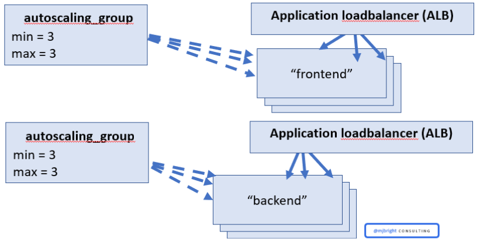

# Background:

In this lab, we'll refactor your configuration using some best practices to make it simpler, easier to maintain

We will obtain a simpler solution with reusable Microservices components.

You can do this lab in several ways

1. Refactor your configuration into modules, optionally followed by step 2 and 3
2. Refactor your configuration to use the appropriate AWS Modules, optionally followed by step 3
3. Validate the security of your configuration using the [tfsec](https://github.com/tfsec/tfsec) tool.

# Tasks

# 1. Refactor your configuration into modules

We will simplify this complex architecture by implementing the AutoScaling group and Loadbalancing as a reusable Microservices module.

In this lab, we're going to now create a 'back end' to our front end servers.

These instances will run in their own ASG.

You will create an auto scaling group with a desired capacity of both the web servers and the back end servers.

Use the template files from the previous lab.



## 1.1. restructure the terraform template directory.

As before, create a new directory ~/labs/lab10 and move to that directory.

Create a new "*microservices*" directory for the new module.

You might copy the lab9 files - resources.tf, main.tf and vars.tf - here as a starting point.

(resources.tf, main.tf and vars.tf)

**Note**: If you need, a solution to lab9 is under /tmp/lab9.

## 1.2. The top level main.tf file will contain calls to microservices for both the '*frontend*' and a '*backend*'.

Create a new main.tf template file in the root directory of lab10, with the following contents.

**Note**: the main.tf is now very simple as we make 2 calls to our new *microservice module* for both *frontend* and *backend* microservices.

**Note**: The user-data scripts are available at the links below:

- [user-data-backend.sh](./user-data-backend.sh)
- [user-data-frontend.sh](./user-data-frontend.sh)

You can use the *file* provisioner to copy the scripts to the machines


```tf
provider "aws" {
  region = var.aws_region
}

# ---------------------------------------------------------------------------------------------------------------------
# DEPLOY THE FRONTEND
# ---------------------------------------------------------------------------------------------------------------------

module "frontend" {
  source = "./microservice"

  name                  = "frontend"
  size                  = 3
  key_name              = var.key_name
  user_data_script_name = "user-data-frontend.sh"
  server_text           = var.frontend_server_text
  is_internal_alb       = false

  # Pass an output from the backend module to the frontend module. This is the URL of the backend microservice, which
  # the frontend will use for "service calls"
  backend_url = module.backend.url
}

# ---------------------------------------------------------------------------------------------------------------------
# DEPLOY THE BACKEND
# ---------------------------------------------------------------------------------------------------------------------

module "backend" {
  source = "./microservice"

  name                  = "backend"
  size                  = 3
  key_name              = var.key_name
  user_data_script_name = "user-data-backend.sh"
  server_text           = var.backend_server_text
  is_internal_alb       = true
}
```

Create an outputs.tf as below.

This will report the url of both the frontend and backend loadbalancers.

```tf
output "frontend_url" {
  value = module.frontend.url
}

output "backend_url" {
  value = module.backend.url
}
```

and a vars.tf as below.

We now specify frontend and backend server text.

```tf
variable "aws_region" {
  description = "The AWS region to deploy into (e.g. us-west-1)."
  default     = "us-west-1"
}

variable "key_name" {
  description = "The name of the EC2 Key Pair that can be used to SSH to the EC2 Instances. Leave blank to not associat
e a Key Pair with the Instances."
  default     = ""
}

variable "frontend_server_text" {
  description = "The text the frontend should return for HTTP requests"
  default     = "Hello from frontend"
}

variable "backend_server_text" {
  description = "The text the backend should return for HTTP requests"
  default     = "Hello from backend"
}

```

## 1.3. Change into the microservice directory.

Implement the following terraform configuration files within the microservices directory (adapting from lab9):

* main.tf

* outputs.tf

* vars.tf

Make sure that the webservers output their respective server_text but also the hostname on which they are running.

In this way when we make requests we'll be able to see the effects of frontend and backend load-balancing working independently.


## 1.4. Set default values for required variables in the vars.tf file.

## 1.5. Change to the root of ~/labs/lab10 and apply the new architecture

## 1.6. The configuration when visualized should look like

<div>
    <object data="graph.svg" type="image/svg+xml">
    </object>
</div>


## 1.7. Test the microsevice architecture

When the configuration is applied it will report the frontend and backend urls.

Test the service by repeatedly perfomring curl against the frontend_url.

**Note**: how both the frontend and backend servers perform independent round-robin loadbalancing.

<hr/>
# 2. Refactor your configuration for AWS Modules

## 2.1 Investigate the available AWS Modules

The [Terraform Registry](https://registry.terraform.io/) contains many helpful modules for Terraform including a set of community maintained [AWS Modules](https://registry.terraform.io/namespaces/terraform-aws-modules).

### 2.1.1 Investigate the Modules repository

Investigate the available Modules - not just AWS Modules - at [Browse Modules](https://registry.terraform.io/browse/modules)

### 2.1.2 Investigate the AWS Modules repository

1. Investigate the available [AWS Modules](https://registry.terraform.io/namespaces/terraform-aws-modules).

2. Which modules can we reuse in our existing configuration ?

3. Look at the modules and their source repository on github

e.g.  [terraform-aws-autoscaling](https://registry.terraform.io/modules/terraform-aws-modules/autoscaling/aws/latest)

Look at the
- examples
- resources
- the source code on github, e.g. [terraform-aws-autoscaling](https://github.com/terraform-aws-modules/terraform-aws-autoscaling)

Look at the module source code to understand how it is structured, implemented.

The author Anton Babenko is extremely active in the community and proposes Terraform Best Practices.

Examine the code

### 2.2 Refactor your configuration to use AWS Modules

Based on the modules you've seen now refactor your configuration to use one or more of the AWS Modules.

How is your code improved now?
- better use of best practices?
- less code to maintain - how many lines of your own code do you have now/before?
- code is easier to understand?


<hr/>
# 3. Validate the security of your configuration

1. Validate the security of your configuration using the [tfsec](https://github.com/tfsec/tfsec) tool.
2. Modify your code to remove some or all of the reported "*Problems*"

<hr/>
# 4. Cleanup
```bash
> terraform destroy
```
To destroy the formerly created AWS vpc, and all subnets.


