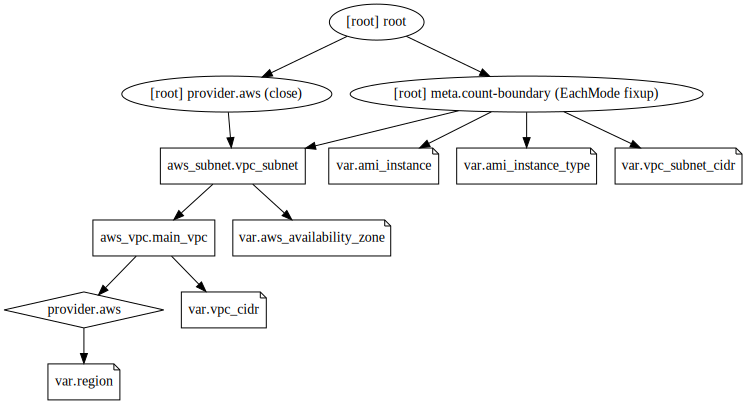

<br/>

# Terraform Variables


```bash

```

    2023-Jan-09:[TF-1.3.7] Lab updated on node tf[terraform 1.3.7]


<br/>

## Background:

Here, we will use terraform variables to parameterize our terraform templates and make them customizable rather than just supplying static values.


<br/>

# 3.1 Create the Terraform configuration 

### 1. Make a directory called ‘lab3’ underneath the labs directory.
### 2. Change into the directory.
### 3. Create the following files: main.tf resources.tf and vars.tf.

We will start to split our configuration across several files to make them more easily manageable.

The main.tf file should contain:


```bash

```

    
    terraform {
      required_version = ">= 1.1.0"
    
      required_providers {
        aws = {
          version = "~> 4.0"
        }
      }
    }
    
    provider "aws" {
      region = var.region
      
      default_tags {
        tags = {
          Environment = "Terraform Introduction"
        }
      }
    }


The resources.tf file should contain:


```bash

```

    resource "aws_vpc" "main_vpc" {
      cidr_block = var.vpc_cidr
      instance_tenancy = "default"
        
      tags = {
        Name = "Main"
        LabName = "3.TerraformVariables"
        Location = "London - with cidr ${var.vpc_cidr}"
      }
    }
    
    resource "aws_subnet" "vpc_subnet" {
      vpc_id = aws_vpc.main_vpc.id
      cidr_block = var.vpc_cidr
      availability_zone = var.aws_availability_zone
    
      tags = {
        Name = "subnet1"
        LabName = "3.TerraformVariables"
      }
    }


The vars.tf file should contain:


```bash

```

    variable "region" {
      # **** SET A BAD REGION DEFAULT FOR NOW: ****
      default = "bad-region-1"
    }
    variable "vpc_cidr" {
      default = "192.168.0.0/16"
    }
    variable "vpc_subnet_cidr" {
      default = "192.168.100.0/24"
    }
    variable "ami_instance" {
      default = "ami-0ac019f4fcb7cb7e6"
    }
    variable "ami_instance_type" {
      default = "t2.micro"
    }
    variable "aws_availability_zone" {
      default = "us-west-1a"
    }


<br/>

# 3.2 Initalize the configuration


```bash
terraform init 
```

    
    Initializing the backend...
    
    Initializing provider plugins...
    - Finding hashicorp/aws versions matching "~> 4.0"...
    - Installing hashicorp/aws v4.49.0...
    - Installed hashicorp/aws v4.49.0 (signed by HashiCorp)
    
    Terraform has created a lock file .terraform.lock.hcl to record the provider
    selections it made above. Include this file in your version control repository
    so that Terraform can guarantee to make the same selections by default when
    you run "terraform init" in the future.
    
    Terraform has been successfully initialized!
    
    You may now begin working with Terraform. Try running "terraform plan" to see
    any changes that are required for your infrastructure. All Terraform commands
    should now work.
    
    If you ever set or change modules or backend configuration for Terraform,
    rerun this command to reinitialize your working directory. If you forget, other
    commands will detect it and remind you to do so if necessary.


<br/>

# 3.3 Preview the configuration - experiment with variable settings

We will preview our configuration but in so doing we will experiment with the setting of the *region* variable to see the order of precedence of variable value definitions.

**Note**: You can learn about variable definition precedence at https://www.terraform.io/docs/configuration/variables.html#variable-definition-precedence


<br/>

# 3.4 terraform plan

Attempt to preview the configuration using ```terraform plan```.

<div class="alert alert-danger"> <b>NOTE</b> You may need to wait a minute or two before this plan completes - with an error. </div>
 

You should see an error because ```var.region``` was set to a non-existing AWS region:

```
╷
│ Error: error configuring Terraform AWS Provider: error validating provider credentials: error calling sts:GetCallerIdentity: operation error STS: GetCallerIdentity, exceeded maximum number of attempts, 9, https response error StatusCode: 0, RequestID: , request send failed, Post "https://sts.bad-region-1.amazonaws.com/": dial tcp: lookup sts.bad-region-1.amazonaws.com on 127.0.0.53:53: no such host
│
│   with provider["registry.terraform.io/hashicorp/aws"],
│   on main.tf line 12, in provider "aws":
│   12: provider "aws" {
│
```


Note that we purposefully configured a bad value for the region variable in *vars.tf* and so this plan should fail as 
*bad-region-1* is not an acceptable value to assign to the "aws_provider" attribute "*region*"


<br/>

## 3.4.1 terraform plan / TF_VAR_region

Now export an environment variable called TF_VAR_region as shown below.

Note that exporting an environment variable TF_VAR_&lt;name&gt; will cause the variable &lt;name&gt; to be set in your plan

**Note:** To make the following examples run quicker, let's force a timeout

So instead of ```terraform plan``` each time do rather ```timeout -k 0 --foreground 10 terraform plan``` which will force a timeout at 20 seconds.  Although the error message is not so clear, the timeout is due to the bad region being attempted - because of the bad setting of ```var.region```


```bash
export TF_VAR_region="another-bad-region-2"
```

Attempt to plan the configuration again

**Note**: that the error message is different now - what happened this time ?


<br/>

## 3.4.2 terraform plan / terraform.tfvars

Now create a file called *terraform.tfvars* with contents:


```region = "yet-another-bad-region-3"```

Attempt to plan the configuration again

Note again what happens


<br/>

## 3.4.3 terraform plan / \*.auto.tfvars

Now create a new file, with name ending in .auto.tfvars, e.g. anyname.auto.tfvars, with content

```region = "YET-ANOTHER-bad-region-4"```

Attempt the plan again and observe how this file now takes precedenece


<br/>

## 3.4.4 terraform plan / --var


Now try the command

```terraform plan --var region=BAD-region-5```


<br/>

## 3.4.5 terraform plan / --var-file

Now create a file called production.tfvars containing:

```region = "BAD-region-6"```

Try respectively the commands below and note the different errors obtained:

- **terraform plan**
- **terraform plan --var region=BAD-REGION-5**
- **terraform plan --var region=BAD-REGION-5 --var-file=production.tfvars**
- **terraform plan --var-file=production.tfvars --var region=BAD-REGION-5**
- **terraform plan --var region=BAD-region-7 --var region=BAD-REGION-5**

This exercise had demonstrated the different ways in which variables can be given default values or not and be overridden through a variety of methods.


<br/>

# 3.5 terraform plan / FINALLY

- Now remove, or move elsewhere, the various files \*.tfvars files

- Unset the TF_VAR_region variable


```bash
unset TF_VAR_region
```

- Edit the vars.tf file to set us-west-1 as the default region

- Run the plan again which should complete successfully now

**Note**: Your account is limited to use the *us-west-1* region.  If you set the default var.region to another value, *us-west-2* for example, the ```terraform plan``` will succeed, but the ```terraform apply``` will produce an error of the form


**Error:** ```Error creating VPC: UnauthorizedOperation: You are not authorized to perform this operation```

This would be an example where ```terraform plan``` succeeds but the subsequent ```terraform apply``` can fail due to Provider specific constraints


<br/>

# 3.6 Apply the configuration

1. remove the tfvars files you created earlier
2. Using the region *us-west-1* now configured in vars.tf, now apply the configuration:

**Note**: If you see an error message of the form ```Error: error creating subnet: InvalidParameterValue: Value (us-west-1a) for parameter availabilityZone is invalid. Subnets can currently only be created in the following availability zones: us-west-1b, us-west-1c.
	status code: 400, request id: 437fa72c-a0f1-41ea-b2b1-245baf0a8cb1``` you will need to modify the **aws_availability_zone** variable in vars.tf to use *us-west-1b* or us-west-1c*


```bash
rm *.tfvars
terraform apply 
```

    
    Terraform used the selected providers to generate the following execution plan.
    Resource actions are indicated with the following symbols:
      + create
    
    Terraform will perform the following actions:
    
      # aws_subnet.vpc_subnet will be created
      + resource "aws_subnet" "vpc_subnet" {
          + arn                                            = (known after apply)
          + assign_ipv6_address_on_creation                = false
          + availability_zone                              = "us-west-1b"
          + availability_zone_id                           = (known after apply)
          + cidr_block                                     = "192.168.0.0/16"
          + enable_dns64                                   = false
          + enable_resource_name_dns_a_record_on_launch    = false
          + enable_resource_name_dns_aaaa_record_on_launch = false
          + id                                             = (known after apply)
          + ipv6_cidr_block_association_id                 = (known after apply)
          + ipv6_native                                    = false
          + map_public_ip_on_launch                        = false
          + owner_id                                       = (known after apply)
          + private_dns_hostname_type_on_launch            = (known after apply)
          + tags                                           = {
              + "LabName" = "3.TerraformVariables"
              + "Name"    = "subnet1"
            }
          + tags_all                                       = {
              + "Environment" = "Terraform Introduction"
              + "LabName"     = "3.TerraformVariables"
              + "Name"        = "subnet1"
            }
          + vpc_id                                         = (known after apply)
        }
    
      # aws_vpc.main_vpc will be created
      + resource "aws_vpc" "main_vpc" {
          + arn                                  = (known after apply)
          + cidr_block                           = "192.168.0.0/16"
          + default_network_acl_id               = (known after apply)
          + default_route_table_id               = (known after apply)
          + default_security_group_id            = (known after apply)
          + dhcp_options_id                      = (known after apply)
          + enable_classiclink                   = (known after apply)
          + enable_classiclink_dns_support       = (known after apply)
          + enable_dns_hostnames                 = (known after apply)
          + enable_dns_support                   = true
          + enable_network_address_usage_metrics = (known after apply)
          + id                                   = (known after apply)
          + instance_tenancy                     = "default"
          + ipv6_association_id                  = (known after apply)
          + ipv6_cidr_block                      = (known after apply)
          + ipv6_cidr_block_network_border_group = (known after apply)
          + main_route_table_id                  = (known after apply)
          + owner_id                             = (known after apply)
          + tags                                 = {
              + "LabName"  = "3.TerraformVariables"
              + "Location" = "London - with cidr 192.168.0.0/16"
              + "Name"     = "Main"
            }
          + tags_all                             = {
              + "Environment" = "Terraform Introduction"
              + "LabName"     = "3.TerraformVariables"
              + "Location"    = "London - with cidr 192.168.0.0/16"
              + "Name"        = "Main"
            }
        }
    
    Plan: 2 to add, 0 to change, 0 to destroy.
    aws_vpc.main_vpc: Creating...
    aws_vpc.main_vpc: Creation complete after 3s [id=vpc-01738d3a6a6d7e6bf]
    aws_subnet.vpc_subnet: Creating...
    aws_subnet.vpc_subnet: Creation complete after 1s [id=subnet-092c4dc12f25cb69e]
    
    Apply complete! Resources: 2 added, 0 changed, 0 destroyed.
    


Assuming that this works correctly, AWS will create a VPC, and a subnet in the vpc.

Note that we have not created a VM instance this time, so we cannot use ssh to connect to anythng.

We will revisit *vpc* later.


<br/>

# 3.7. The configuration when visualized should look like

<div>
    <object data="graph.svg" type="image/svg+xml">
    </object>
</div>




<br/>

# 3.8. Environment

Look at the AWS and TF environment variables which are already set in your environment

Look at the AWS secret keys using: ```env | grep ^AWS_```

Look at the TF_DATA_DIR variable: ```env | grep ^TF_```


<br/>

# 3.9. Clean up


```bash
terraform destroy 
```

    aws_vpc.main_vpc: Refreshing state... [id=vpc-01738d3a6a6d7e6bf]
    aws_subnet.vpc_subnet: Refreshing state... [id=subnet-092c4dc12f25cb69e]
    
    Terraform used the selected providers to generate the following execution plan.
    Resource actions are indicated with the following symbols:
      - destroy
    
    Terraform will perform the following actions:
    
      # aws_subnet.vpc_subnet will be destroyed
      - resource "aws_subnet" "vpc_subnet" {
          - arn                                            = "arn:aws:ec2:us-west-1:816376574968:subnet/subnet-092c4dc12f25cb69e" -> null
          - assign_ipv6_address_on_creation                = false -> null
          - availability_zone                              = "us-west-1b" -> null
          - availability_zone_id                           = "usw1-az3" -> null
          - cidr_block                                     = "192.168.0.0/16" -> null
          - enable_dns64                                   = false -> null
          - enable_resource_name_dns_a_record_on_launch    = false -> null
          - enable_resource_name_dns_aaaa_record_on_launch = false -> null
          - id                                             = "subnet-092c4dc12f25cb69e" -> null
          - ipv6_native                                    = false -> null
          - map_customer_owned_ip_on_launch                = false -> null
          - map_public_ip_on_launch                        = false -> null
          - owner_id                                       = "816376574968" -> null
          - private_dns_hostname_type_on_launch            = "ip-name" -> null
          - tags                                           = {
              - "LabName" = "3.TerraformVariables"
              - "Name"    = "subnet1"
            } -> null
          - tags_all                                       = {
              - "Environment" = "Terraform Introduction"
              - "LabName"     = "3.TerraformVariables"
              - "Name"        = "subnet1"
            } -> null
          - vpc_id                                         = "vpc-01738d3a6a6d7e6bf" -> null
        }
    
      # aws_vpc.main_vpc will be destroyed
      - resource "aws_vpc" "main_vpc" {
          - arn                                  = "arn:aws:ec2:us-west-1:816376574968:vpc/vpc-01738d3a6a6d7e6bf" -> null
          - assign_generated_ipv6_cidr_block     = false -> null
          - cidr_block                           = "192.168.0.0/16" -> null
          - default_network_acl_id               = "acl-0ac2cb8fd7db99a33" -> null
          - default_route_table_id               = "rtb-0e8ff2d0c302e88a1" -> null
          - default_security_group_id            = "sg-0601d2790a93b5f17" -> null
          - dhcp_options_id                      = "dopt-5f798839" -> null
          - enable_classiclink                   = false -> null
          - enable_classiclink_dns_support       = false -> null
          - enable_dns_hostnames                 = false -> null
          - enable_dns_support                   = true -> null
          - enable_network_address_usage_metrics = false -> null
          - id                                   = "vpc-01738d3a6a6d7e6bf" -> null
          - instance_tenancy                     = "default" -> null
          - ipv6_netmask_length                  = 0 -> null
          - main_route_table_id                  = "rtb-0e8ff2d0c302e88a1" -> null
          - owner_id                             = "816376574968" -> null
          - tags                                 = {
              - "LabName"  = "3.TerraformVariables"
              - "Location" = "London - with cidr 192.168.0.0/16"
              - "Name"     = "Main"
            } -> null
          - tags_all                             = {
              - "Environment" = "Terraform Introduction"
              - "LabName"     = "3.TerraformVariables"
              - "Location"    = "London - with cidr 192.168.0.0/16"
              - "Name"        = "Main"
            } -> null
        }
    
    Plan: 0 to add, 0 to change, 2 to destroy.
    aws_subnet.vpc_subnet: Destroying... [id=subnet-092c4dc12f25cb69e]
    aws_subnet.vpc_subnet: Destruction complete after 1s
    aws_vpc.main_vpc: Destroying... [id=vpc-01738d3a6a6d7e6bf]
    aws_vpc.main_vpc: Destruction complete after 1s
    
    Destroy complete! Resources: 2 destroyed.
    


To destroy the formerly created AWS vpc, and all subnets.

**Note**: If you're really sure, really really sure, you can auto approve the destroy by using the -auto-approve option:

```terraform destroy -auto-approve```

<hr/>


<br/>

# Summary

In this exercise we experimented with different methods to define variable values in Terraform and the order of precedence between those methods


<br/>

# Solutions

Solutions are available in the *github* repo at ```https://github.com/mjbright/tf-scenarios``` under Solutions at https://github.com/mjbright/tf-scenarios/tree/main/Solutions/lab3


<br/>

# **Stretch Goal 1:** Outputs

1. Extend the current configuration to create an aws_instance resource as we did in the previous exercise
2. Add output blocks in outputs.tf to show
  - Each of public_ip, public_dns and private_ip values for the instance
  - One interpolated string containing each of the above values


<br/>

# **Stretch Goal 2:** *locals*

Look at the concept of locals

https://www.terraform.io/docs/configuration/locals.html

and especially "*When To Use Local Values*"

https://www.terraform.io/docs/configuration/locals.html#when-to-use-local-values

Look at your config: are there cases where we could use locals to simplify

Locals could be useful on more complex configurations especially


<br/>

# **Stretch Goal 3:** *terraform console*

The *terraform console* provides a REPL environment (Read-Eval-Print-Loop interpreter) which allows to manipulate variables of the current Terraform state

Launch the console using ```terraform console``` and inspect variables, attributes and outputs which you've defined in your configuration

<div class="alert alert-danger"> <b>NOTE</b> Terraform console is not very useable !! </div>


<br/>

## Cleanup

Again cleanup your config afterwards

```terraform destroy -auto-approve```

<hr/>

<!-- Why did this work before - but not now ??


-->


```bash

```

    2023-Jan-09:[TF-1.3.7] Lab updated on node tf[terraform 1.3.7]


<br/>

# Terraform Variables


```bash

```

    2023-Jan-09:[TF-1.3.7] Lab updated on node tf[terraform 1.3.7]


<br/>

## Background:

Here, we will use terraform variables to parameterize our terraform templates and make them customizable rather than just supplying static values.


<br/>

# 3.1 Create the Terraform configuration 

### 1. Make a directory called ‘lab3’ underneath the labs directory.
### 2. Change into the directory.
### 3. Create the following files: main.tf resources.tf and vars.tf.

We will start to split our configuration across several files to make them more easily manageable.

The main.tf file should contain:


```bash

```

    
    terraform {
      required_version = ">= 1.1.0"
    
      required_providers {
        aws = {
          version = "~> 4.0"
        }
      }
    }
    
    provider "aws" {
      region = var.region
      
      default_tags {
        tags = {
          Environment = "Terraform Introduction"
        }
      }
    }


The resources.tf file should contain:


```bash

```

    resource "aws_vpc" "main_vpc" {
      cidr_block = var.vpc_cidr
      instance_tenancy = "default"
        
      tags = {
        Name = "Main"
        LabName = "3.TerraformVariables"
        Location = "London - with cidr ${var.vpc_cidr}"
      }
    }
    
    resource "aws_subnet" "vpc_subnet" {
      vpc_id = aws_vpc.main_vpc.id
      cidr_block = var.vpc_cidr
      availability_zone = var.aws_availability_zone
    
      tags = {
        Name = "subnet1"
        LabName = "3.TerraformVariables"
      }
    }


The vars.tf file should contain:


```bash

```

    variable "region" {
      # **** SET A BAD REGION DEFAULT FOR NOW: ****
      default = "bad-region-1"
    }
    variable "vpc_cidr" {
      default = "192.168.0.0/16"
    }
    variable "vpc_subnet_cidr" {
      default = "192.168.100.0/24"
    }
    variable "ami_instance" {
      default = "ami-0ac019f4fcb7cb7e6"
    }
    variable "ami_instance_type" {
      default = "t2.micro"
    }
    variable "aws_availability_zone" {
      default = "us-west-1a"
    }


<br/>

# 3.2 Initalize the configuration


```bash
terraform init 
```

    
    Initializing the backend...
    
    Initializing provider plugins...
    - Finding hashicorp/aws versions matching "~> 4.0"...
    - Installing hashicorp/aws v4.49.0...
    - Installed hashicorp/aws v4.49.0 (signed by HashiCorp)
    
    Terraform has created a lock file .terraform.lock.hcl to record the provider
    selections it made above. Include this file in your version control repository
    so that Terraform can guarantee to make the same selections by default when
    you run "terraform init" in the future.
    
    Terraform has been successfully initialized!
    
    You may now begin working with Terraform. Try running "terraform plan" to see
    any changes that are required for your infrastructure. All Terraform commands
    should now work.
    
    If you ever set or change modules or backend configuration for Terraform,
    rerun this command to reinitialize your working directory. If you forget, other
    commands will detect it and remind you to do so if necessary.


<br/>

# 3.3 Preview the configuration - experiment with variable settings

We will preview our configuration but in so doing we will experiment with the setting of the *region* variable to see the order of precedence of variable value definitions.

**Note**: You can learn about variable definition precedence at https://www.terraform.io/docs/configuration/variables.html#variable-definition-precedence


<br/>

# 3.4 terraform plan

Attempt to preview the configuration using ```terraform plan```.

<div class="alert alert-danger"> <b>NOTE</b> You may need to wait a minute or two before this plan completes - with an error. </div>
 

You should see an error because ```var.region``` was set to a non-existing AWS region:

```
╷
│ Error: error configuring Terraform AWS Provider: error validating provider credentials: error calling sts:GetCallerIdentity: operation error STS: GetCallerIdentity, exceeded maximum number of attempts, 9, https response error StatusCode: 0, RequestID: , request send failed, Post "https://sts.bad-region-1.amazonaws.com/": dial tcp: lookup sts.bad-region-1.amazonaws.com on 127.0.0.53:53: no such host
│
│   with provider["registry.terraform.io/hashicorp/aws"],
│   on main.tf line 12, in provider "aws":
│   12: provider "aws" {
│
```


Note that we purposefully configured a bad value for the region variable in *vars.tf* and so this plan should fail as 
*bad-region-1* is not an acceptable value to assign to the "aws_provider" attribute "*region*"


<br/>

## 3.4.1 terraform plan / TF_VAR_region

Now export an environment variable called TF_VAR_region as shown below.

Note that exporting an environment variable TF_VAR_&lt;name&gt; will cause the variable &lt;name&gt; to be set in your plan

**Note:** To make the following examples run quicker, let's force a timeout

So instead of ```terraform plan``` each time do rather ```timeout -k 0 --foreground 10 terraform plan``` which will force a timeout at 20 seconds.  Although the error message is not so clear, the timeout is due to the bad region being attempted - because of the bad setting of ```var.region```


```bash
export TF_VAR_region="another-bad-region-2"
```

Attempt to plan the configuration again

**Note**: that the error message is different now - what happened this time ?


<br/>

## 3.4.2 terraform plan / terraform.tfvars

Now create a file called *terraform.tfvars* with contents:


```region = "yet-another-bad-region-3"```

Attempt to plan the configuration again

Note again what happens


<br/>

## 3.4.3 terraform plan / \*.auto.tfvars

Now create a new file, with name ending in .auto.tfvars, e.g. anyname.auto.tfvars, with content

```region = "YET-ANOTHER-bad-region-4"```

Attempt the plan again and observe how this file now takes precedenece


<br/>

## 3.4.4 terraform plan / --var


Now try the command

```terraform plan --var region=BAD-region-5```


<br/>

## 3.4.5 terraform plan / --var-file

Now create a file called production.tfvars containing:

```region = "BAD-region-6"```

Try respectively the commands below and note the different errors obtained:

- **terraform plan**
- **terraform plan --var region=BAD-REGION-5**
- **terraform plan --var region=BAD-REGION-5 --var-file=production.tfvars**
- **terraform plan --var-file=production.tfvars --var region=BAD-REGION-5**
- **terraform plan --var region=BAD-region-7 --var region=BAD-REGION-5**

This exercise had demonstrated the different ways in which variables can be given default values or not and be overridden through a variety of methods.


<br/>

# 3.5 terraform plan / FINALLY

- Now remove, or move elsewhere, the various files \*.tfvars files

- Unset the TF_VAR_region variable


```bash
unset TF_VAR_region
```

- Edit the vars.tf file to set us-west-1 as the default region

- Run the plan again which should complete successfully now

**Note**: Your account is limited to use the *us-west-1* region.  If you set the default var.region to another value, *us-west-2* for example, the ```terraform plan``` will succeed, but the ```terraform apply``` will produce an error of the form


**Error:** ```Error creating VPC: UnauthorizedOperation: You are not authorized to perform this operation```

This would be an example where ```terraform plan``` succeeds but the subsequent ```terraform apply``` can fail due to Provider specific constraints


<br/>

# 3.6 Apply the configuration

1. remove the tfvars files you created earlier
2. Using the region *us-west-1* now configured in vars.tf, now apply the configuration:

**Note**: If you see an error message of the form ```Error: error creating subnet: InvalidParameterValue: Value (us-west-1a) for parameter availabilityZone is invalid. Subnets can currently only be created in the following availability zones: us-west-1b, us-west-1c.
	status code: 400, request id: 437fa72c-a0f1-41ea-b2b1-245baf0a8cb1``` you will need to modify the **aws_availability_zone** variable in vars.tf to use *us-west-1b* or us-west-1c*


```bash
rm *.tfvars
terraform apply 
```

    
    Terraform used the selected providers to generate the following execution plan.
    Resource actions are indicated with the following symbols:
      + create
    
    Terraform will perform the following actions:
    
      # aws_subnet.vpc_subnet will be created
      + resource "aws_subnet" "vpc_subnet" {
          + arn                                            = (known after apply)
          + assign_ipv6_address_on_creation                = false
          + availability_zone                              = "us-west-1b"
          + availability_zone_id                           = (known after apply)
          + cidr_block                                     = "192.168.0.0/16"
          + enable_dns64                                   = false
          + enable_resource_name_dns_a_record_on_launch    = false
          + enable_resource_name_dns_aaaa_record_on_launch = false
          + id                                             = (known after apply)
          + ipv6_cidr_block_association_id                 = (known after apply)
          + ipv6_native                                    = false
          + map_public_ip_on_launch                        = false
          + owner_id                                       = (known after apply)
          + private_dns_hostname_type_on_launch            = (known after apply)
          + tags                                           = {
              + "LabName" = "3.TerraformVariables"
              + "Name"    = "subnet1"
            }
          + tags_all                                       = {
              + "Environment" = "Terraform Introduction"
              + "LabName"     = "3.TerraformVariables"
              + "Name"        = "subnet1"
            }
          + vpc_id                                         = (known after apply)
        }
    
      # aws_vpc.main_vpc will be created
      + resource "aws_vpc" "main_vpc" {
          + arn                                  = (known after apply)
          + cidr_block                           = "192.168.0.0/16"
          + default_network_acl_id               = (known after apply)
          + default_route_table_id               = (known after apply)
          + default_security_group_id            = (known after apply)
          + dhcp_options_id                      = (known after apply)
          + enable_classiclink                   = (known after apply)
          + enable_classiclink_dns_support       = (known after apply)
          + enable_dns_hostnames                 = (known after apply)
          + enable_dns_support                   = true
          + enable_network_address_usage_metrics = (known after apply)
          + id                                   = (known after apply)
          + instance_tenancy                     = "default"
          + ipv6_association_id                  = (known after apply)
          + ipv6_cidr_block                      = (known after apply)
          + ipv6_cidr_block_network_border_group = (known after apply)
          + main_route_table_id                  = (known after apply)
          + owner_id                             = (known after apply)
          + tags                                 = {
              + "LabName"  = "3.TerraformVariables"
              + "Location" = "London - with cidr 192.168.0.0/16"
              + "Name"     = "Main"
            }
          + tags_all                             = {
              + "Environment" = "Terraform Introduction"
              + "LabName"     = "3.TerraformVariables"
              + "Location"    = "London - with cidr 192.168.0.0/16"
              + "Name"        = "Main"
            }
        }
    
    Plan: 2 to add, 0 to change, 0 to destroy.
    aws_vpc.main_vpc: Creating...
    aws_vpc.main_vpc: Creation complete after 3s [id=vpc-01738d3a6a6d7e6bf]
    aws_subnet.vpc_subnet: Creating...
    aws_subnet.vpc_subnet: Creation complete after 1s [id=subnet-092c4dc12f25cb69e]
    
    Apply complete! Resources: 2 added, 0 changed, 0 destroyed.
    


Assuming that this works correctly, AWS will create a VPC, and a subnet in the vpc.

Note that we have not created a VM instance this time, so we cannot use ssh to connect to anythng.

We will revisit *vpc* later.


<br/>

# 3.7. The configuration when visualized should look like

<div>
    <object data="graph.svg" type="image/svg+xml">
    </object>
</div>


<br/>

# 3.8. Environment

Look at the AWS and TF environment variables which are already set in your environment

Look at the AWS secret keys using: ```env | grep ^AWS_```

Look at the TF_DATA_DIR variable: ```env | grep ^TF_```


<br/>

# 3.9. Clean up


```bash
terraform destroy 
```

    aws_vpc.main_vpc: Refreshing state... [id=vpc-01738d3a6a6d7e6bf]
    aws_subnet.vpc_subnet: Refreshing state... [id=subnet-092c4dc12f25cb69e]
    
    Terraform used the selected providers to generate the following execution plan.
    Resource actions are indicated with the following symbols:
      - destroy
    
    Terraform will perform the following actions:
    
      # aws_subnet.vpc_subnet will be destroyed
      - resource "aws_subnet" "vpc_subnet" {
          - arn                                            = "arn:aws:ec2:us-west-1:816376574968:subnet/subnet-092c4dc12f25cb69e" -> null
          - assign_ipv6_address_on_creation                = false -> null
          - availability_zone                              = "us-west-1b" -> null
          - availability_zone_id                           = "usw1-az3" -> null
          - cidr_block                                     = "192.168.0.0/16" -> null
          - enable_dns64                                   = false -> null
          - enable_resource_name_dns_a_record_on_launch    = false -> null
          - enable_resource_name_dns_aaaa_record_on_launch = false -> null
          - id                                             = "subnet-092c4dc12f25cb69e" -> null
          - ipv6_native                                    = false -> null
          - map_customer_owned_ip_on_launch                = false -> null
          - map_public_ip_on_launch                        = false -> null
          - owner_id                                       = "816376574968" -> null
          - private_dns_hostname_type_on_launch            = "ip-name" -> null
          - tags                                           = {
              - "LabName" = "3.TerraformVariables"
              - "Name"    = "subnet1"
            } -> null
          - tags_all                                       = {
              - "Environment" = "Terraform Introduction"
              - "LabName"     = "3.TerraformVariables"
              - "Name"        = "subnet1"
            } -> null
          - vpc_id                                         = "vpc-01738d3a6a6d7e6bf" -> null
        }
    
      # aws_vpc.main_vpc will be destroyed
      - resource "aws_vpc" "main_vpc" {
          - arn                                  = "arn:aws:ec2:us-west-1:816376574968:vpc/vpc-01738d3a6a6d7e6bf" -> null
          - assign_generated_ipv6_cidr_block     = false -> null
          - cidr_block                           = "192.168.0.0/16" -> null
          - default_network_acl_id               = "acl-0ac2cb8fd7db99a33" -> null
          - default_route_table_id               = "rtb-0e8ff2d0c302e88a1" -> null
          - default_security_group_id            = "sg-0601d2790a93b5f17" -> null
          - dhcp_options_id                      = "dopt-5f798839" -> null
          - enable_classiclink                   = false -> null
          - enable_classiclink_dns_support       = false -> null
          - enable_dns_hostnames                 = false -> null
          - enable_dns_support                   = true -> null
          - enable_network_address_usage_metrics = false -> null
          - id                                   = "vpc-01738d3a6a6d7e6bf" -> null
          - instance_tenancy                     = "default" -> null
          - ipv6_netmask_length                  = 0 -> null
          - main_route_table_id                  = "rtb-0e8ff2d0c302e88a1" -> null
          - owner_id                             = "816376574968" -> null
          - tags                                 = {
              - "LabName"  = "3.TerraformVariables"
              - "Location" = "London - with cidr 192.168.0.0/16"
              - "Name"     = "Main"
            } -> null
          - tags_all                             = {
              - "Environment" = "Terraform Introduction"
              - "LabName"     = "3.TerraformVariables"
              - "Location"    = "London - with cidr 192.168.0.0/16"
              - "Name"        = "Main"
            } -> null
        }
    
    Plan: 0 to add, 0 to change, 2 to destroy.
    aws_subnet.vpc_subnet: Destroying... [id=subnet-092c4dc12f25cb69e]
    aws_subnet.vpc_subnet: Destruction complete after 1s
    aws_vpc.main_vpc: Destroying... [id=vpc-01738d3a6a6d7e6bf]
    aws_vpc.main_vpc: Destruction complete after 1s
    
    Destroy complete! Resources: 2 destroyed.
    


To destroy the formerly created AWS vpc, and all subnets.

**Note**: If you're really sure, really really sure, you can auto approve the destroy by using the -auto-approve option:

```terraform destroy -auto-approve```

<hr/>


<br/>

# Summary

In this exercise we experimented with different methods to define variable values in Terraform and the order of precedence between those methods


<br/>

# Solutions

Solutions are available in the *github* repo at ```https://github.com/mjbright/tf-scenarios``` under Solutions at https://github.com/mjbright/tf-scenarios/tree/main/Solutions/lab3


<br/>

# **Stretch Goal 1:** Outputs

1. Extend the current configuration to create an aws_instance resource as we did in the previous exercise
2. Add output blocks in outputs.tf to show
  - Each of public_ip, public_dns and private_ip values for the instance
  - One interpolated string containing each of the above values


<br/>

# **Stretch Goal 2:** *locals*

Look at the concept of locals

https://www.terraform.io/docs/configuration/locals.html

and especially "*When To Use Local Values*"

https://www.terraform.io/docs/configuration/locals.html#when-to-use-local-values

Look at your config: are there cases where we could use locals to simplify

Locals could be useful on more complex configurations especially


<br/>

# **Stretch Goal 3:** *terraform console*

The *terraform console* provides a REPL environment (Read-Eval-Print-Loop interpreter) which allows to manipulate variables of the current Terraform state

Launch the console using ```terraform console``` and inspect variables, attributes and outputs which you've defined in your configuration

<div class="alert alert-danger"> <b>NOTE</b> Terraform console is not very useable !! </div>


<br/>

## Cleanup

Again cleanup your config afterwards

```terraform destroy -auto-approve```

<hr/>

<!-- Why did this work before - but not now ??


-->


```bash

```

    2023-Jan-09:[TF-1.3.7] Lab updated on node tf[terraform 1.3.7]


