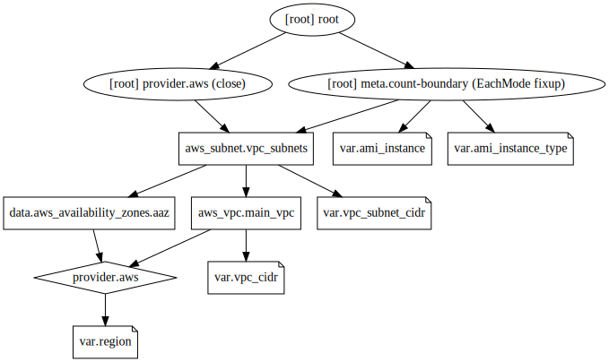

```bash

```

    2023-Jan-09:[TF-1.3.7] Lab updated on node tf[terraform 1.3.7]


<br/>

# Data Sources


<br/>

## Background:

In previous exercises we have used map variables to get AMIs or availability_zones according to the region value.
But we are reproducing data that the provider knows about.

so, in this lab we will use data sources to get data directly from the provider.


<br/>

## Tasks:
### 1. Make a directory called ‘lab5’ underneath the labs directory.
### 2. Change into the directory.
### 3. Create the following files: main.tf, resources.tf, vars.tf

The main.tf file should contain:


```bash
cat main.tf
```

    
    terraform {
      # Enforce Terraform version to be 1.3.x
      required_version = "~> 1.3"
      
      # Enforce AWS Provider version to be 4.x
    
      required_providers {
        aws = {
          source  = "hashicorp/aws"
          version = "~> 4.0"
        }
      }
    }
    
    provider "aws" {
        region = var.region
    }
    


The vars.tf file should contain:


```bash
cat vars.tf
```

    
    variable "region" {
        description = "Region in which to create resources"
    }
    
    variable "vpc_cidr" {
        description = "CIDR range to use for the VPC"
    }
    
    variable "vpc_subnet_cidr" {
        type = list(string)
        description = "list of subnet CIDR ranges to use for VPC subnets"
        # ranges must all lie within the vpc_cidr
    }
    
    variable "ami_instance" {
        description = "AMI instance to use (region specific)"
    }
    
    variable "instance_type" {
       description = "Type of instance to use (AWS EC2 instance type)"
    }
    
    data "aws_availability_zones" "aaz" {}
    


The terraform.tfvars file should contain:


```bash
cat terraform.tfvars
```

    
    region = "us-west-1"
    
    vpc_cidr = "192.168.0.0/16"
    
    vpc_subnet_cidr = ["192.168.100.0/24","192.168.101.0/24","192.168.102.0/24"]
    
    ami_instance = "ami-0ac019f4fcb7cb7e6"
    
    instance_type = "t2.micro"
    


The resources.tf file should contain:


```bash
cat resources.tf
```

    
    resource "aws_vpc" "main_vpc" {
        cidr_block = var.vpc_cidr
        instance_tenancy = "default"
        tags = {
            LabName = "5.TerraformDataSources"
            Name = "Main"
            Location = "London"
        }
    }
    
    resource "aws_subnet" "vpc_subnets" {
        count             = length(var.vpc_subnet_cidr)
    
        vpc_id            = aws_vpc.main_vpc.id
        cidr_block        = element(var.vpc_subnet_cidr,count.index)
        availability_zone = element(data.aws_availability_zones.aaz.names,count.index)
    
        tags = {
            LabName = "5.TerraformDataSources"
            Name = "subnet-${count.index+1}"
        }
    }
    


<!-- NO LONGER NEEDED with linked accounts:
  Note: For each student, change the CIDR for the VPC and subnets to a unique value!
-->

### 4. Output the availability zones data source

Create an outputs.tf
 to show the available "*availability_zones*" from the provider


```bash
cat outputs.tf
```

    
    output  "aazs"    { value = data.aws_availability_zones.aaz.names }
    


### 5. Initialize the configuration


```bash
terraform init
```

    
    Initializing the backend...
    
    Initializing provider plugins...
    - Finding hashicorp/aws versions matching "~> 4.0"...
    - Installing hashicorp/aws v4.49.0...
    - Installed hashicorp/aws v4.49.0 (signed by HashiCorp)
    
    Terraform has created a lock file .terraform.lock.hcl to record the provider
    selections it made above. Include this file in your version control repository
    so that Terraform can guarantee to make the same selections by default when
    you run "terraform init" in the future.
    
    Terraform has been successfully initialized!
    
    You may now begin working with Terraform. Try running "terraform plan" to see
    any changes that are required for your infrastructure. All Terraform commands
    should now work.
    
    If you ever set or change modules or backend configuration for Terraform,
    rerun this command to reinitialize your working directory. If you forget, other
    commands will detect it and remind you to do so if necessary.


### 6.  Preview the configuration


```bash
terraform plan
```

    data.aws_availability_zones.aaz: Reading...
    data.aws_availability_zones.aaz: Read complete after 1s [id=us-west-1]
    
    Terraform used the selected providers to generate the following execution plan.
    Resource actions are indicated with the following symbols:
      + create
    
    Terraform will perform the following actions:
    
      # aws_subnet.vpc_subnets[0] will be created
      + resource "aws_subnet" "vpc_subnets" {
          + arn                                            = (known after apply)
          + assign_ipv6_address_on_creation                = false
          + availability_zone                              = "us-west-1b"
          + availability_zone_id                           = (known after apply)
          + cidr_block                                     = "192.168.100.0/24"
          + enable_dns64                                   = false
          + enable_resource_name_dns_a_record_on_launch    = false
          + enable_resource_name_dns_aaaa_record_on_launch = false
          + id                                             = (known after apply)
          + ipv6_cidr_block_association_id                 = (known after apply)
          + ipv6_native                                    = false
          + map_public_ip_on_launch                        = false
          + owner_id                                       = (known after apply)
          + private_dns_hostname_type_on_launch            = (known after apply)
          + tags                                           = {
              + "LabName" = "5.TerraformDataSources"
              + "Name"    = "subnet-1"
            }
          + tags_all                                       = {
              + "LabName" = "5.TerraformDataSources"
              + "Name"    = "subnet-1"
            }
          + vpc_id                                         = (known after apply)
        }
    
      # aws_subnet.vpc_subnets[1] will be created
      + resource "aws_subnet" "vpc_subnets" {
          + arn                                            = (known after apply)
          + assign_ipv6_address_on_creation                = false
          + availability_zone                              = "us-west-1c"
          + availability_zone_id                           = (known after apply)
          + cidr_block                                     = "192.168.101.0/24"
          + enable_dns64                                   = false
          + enable_resource_name_dns_a_record_on_launch    = false
          + enable_resource_name_dns_aaaa_record_on_launch = false
          + id                                             = (known after apply)
          + ipv6_cidr_block_association_id                 = (known after apply)
          + ipv6_native                                    = false
          + map_public_ip_on_launch                        = false
          + owner_id                                       = (known after apply)
          + private_dns_hostname_type_on_launch            = (known after apply)
          + tags                                           = {
              + "LabName" = "5.TerraformDataSources"
              + "Name"    = "subnet-2"
            }
          + tags_all                                       = {
              + "LabName" = "5.TerraformDataSources"
              + "Name"    = "subnet-2"
            }
          + vpc_id                                         = (known after apply)
        }
    
      # aws_subnet.vpc_subnets[2] will be created
      + resource "aws_subnet" "vpc_subnets" {
          + arn                                            = (known after apply)
          + assign_ipv6_address_on_creation                = false
          + availability_zone                              = "us-west-1b"
          + availability_zone_id                           = (known after apply)
          + cidr_block                                     = "192.168.102.0/24"
          + enable_dns64                                   = false
          + enable_resource_name_dns_a_record_on_launch    = false
          + enable_resource_name_dns_aaaa_record_on_launch = false
          + id                                             = (known after apply)
          + ipv6_cidr_block_association_id                 = (known after apply)
          + ipv6_native                                    = false
          + map_public_ip_on_launch                        = false
          + owner_id                                       = (known after apply)
          + private_dns_hostname_type_on_launch            = (known after apply)
          + tags                                           = {
              + "LabName" = "5.TerraformDataSources"
              + "Name"    = "subnet-3"
            }
          + tags_all                                       = {
              + "LabName" = "5.TerraformDataSources"
              + "Name"    = "subnet-3"
            }
          + vpc_id                                         = (known after apply)
        }
    
      # aws_vpc.main_vpc will be created
      + resource "aws_vpc" "main_vpc" {
          + arn                                  = (known after apply)
          + cidr_block                           = "192.168.0.0/16"
          + default_network_acl_id               = (known after apply)
          + default_route_table_id               = (known after apply)
          + default_security_group_id            = (known after apply)
          + dhcp_options_id                      = (known after apply)
          + enable_classiclink                   = (known after apply)
          + enable_classiclink_dns_support       = (known after apply)
          + enable_dns_hostnames                 = (known after apply)
          + enable_dns_support                   = true
          + enable_network_address_usage_metrics = (known after apply)
          + id                                   = (known after apply)
          + instance_tenancy                     = "default"
          + ipv6_association_id                  = (known after apply)
          + ipv6_cidr_block                      = (known after apply)
          + ipv6_cidr_block_network_border_group = (known after apply)
          + main_route_table_id                  = (known after apply)
          + owner_id                             = (known after apply)
          + tags                                 = {
              + "LabName"  = "5.TerraformDataSources"
              + "Location" = "London"
              + "Name"     = "Main"
            }
          + tags_all                             = {
              + "LabName"  = "5.TerraformDataSources"
              + "Location" = "London"
              + "Name"     = "Main"
            }
        }
    
    Plan: 4 to add, 0 to change, 0 to destroy.
    
    Changes to Outputs:
      + aazs = [
          + "us-west-1b",
          + "us-west-1c",
        ]
    
    ───────────────────────────────────────────────────────────────────────────────
    
    Note: You didn't use the -out option to save this plan, so Terraform can't
    guarantee to take exactly these actions if you run "terraform apply" now.


### 7. Apply the configuration


```bash
terraform apply 
```

    data.aws_availability_zones.aaz: Reading...
    data.aws_availability_zones.aaz: Read complete after 1s [id=us-west-1]
    
    Terraform used the selected providers to generate the following execution plan.
    Resource actions are indicated with the following symbols:
      + create
    
    Terraform will perform the following actions:
    
      # aws_subnet.vpc_subnets[0] will be created
      + resource "aws_subnet" "vpc_subnets" {
          + arn                                            = (known after apply)
          + assign_ipv6_address_on_creation                = false
          + availability_zone                              = "us-west-1b"
          + availability_zone_id                           = (known after apply)
          + cidr_block                                     = "192.168.100.0/24"
          + enable_dns64                                   = false
          + enable_resource_name_dns_a_record_on_launch    = false
          + enable_resource_name_dns_aaaa_record_on_launch = false
          + id                                             = (known after apply)
          + ipv6_cidr_block_association_id                 = (known after apply)
          + ipv6_native                                    = false
          + map_public_ip_on_launch                        = false
          + owner_id                                       = (known after apply)
          + private_dns_hostname_type_on_launch            = (known after apply)
          + tags                                           = {
              + "LabName" = "5.TerraformDataSources"
              + "Name"    = "subnet-1"
            }
          + tags_all                                       = {
              + "LabName" = "5.TerraformDataSources"
              + "Name"    = "subnet-1"
            }
          + vpc_id                                         = (known after apply)
        }
    
      # aws_subnet.vpc_subnets[1] will be created
      + resource "aws_subnet" "vpc_subnets" {
          + arn                                            = (known after apply)
          + assign_ipv6_address_on_creation                = false
          + availability_zone                              = "us-west-1c"
          + availability_zone_id                           = (known after apply)
          + cidr_block                                     = "192.168.101.0/24"
          + enable_dns64                                   = false
          + enable_resource_name_dns_a_record_on_launch    = false
          + enable_resource_name_dns_aaaa_record_on_launch = false
          + id                                             = (known after apply)
          + ipv6_cidr_block_association_id                 = (known after apply)
          + ipv6_native                                    = false
          + map_public_ip_on_launch                        = false
          + owner_id                                       = (known after apply)
          + private_dns_hostname_type_on_launch            = (known after apply)
          + tags                                           = {
              + "LabName" = "5.TerraformDataSources"
              + "Name"    = "subnet-2"
            }
          + tags_all                                       = {
              + "LabName" = "5.TerraformDataSources"
              + "Name"    = "subnet-2"
            }
          + vpc_id                                         = (known after apply)
        }
    
      # aws_subnet.vpc_subnets[2] will be created
      + resource "aws_subnet" "vpc_subnets" {
          + arn                                            = (known after apply)
          + assign_ipv6_address_on_creation                = false
          + availability_zone                              = "us-west-1b"
          + availability_zone_id                           = (known after apply)
          + cidr_block                                     = "192.168.102.0/24"
          + enable_dns64                                   = false
          + enable_resource_name_dns_a_record_on_launch    = false
          + enable_resource_name_dns_aaaa_record_on_launch = false
          + id                                             = (known after apply)
          + ipv6_cidr_block_association_id                 = (known after apply)
          + ipv6_native                                    = false
          + map_public_ip_on_launch                        = false
          + owner_id                                       = (known after apply)
          + private_dns_hostname_type_on_launch            = (known after apply)
          + tags                                           = {
              + "LabName" = "5.TerraformDataSources"
              + "Name"    = "subnet-3"
            }
          + tags_all                                       = {
              + "LabName" = "5.TerraformDataSources"
              + "Name"    = "subnet-3"
            }
          + vpc_id                                         = (known after apply)
        }
    
      # aws_vpc.main_vpc will be created
      + resource "aws_vpc" "main_vpc" {
          + arn                                  = (known after apply)
          + cidr_block                           = "192.168.0.0/16"
          + default_network_acl_id               = (known after apply)
          + default_route_table_id               = (known after apply)
          + default_security_group_id            = (known after apply)
          + dhcp_options_id                      = (known after apply)
          + enable_classiclink                   = (known after apply)
          + enable_classiclink_dns_support       = (known after apply)
          + enable_dns_hostnames                 = (known after apply)
          + enable_dns_support                   = true
          + enable_network_address_usage_metrics = (known after apply)
          + id                                   = (known after apply)
          + instance_tenancy                     = "default"
          + ipv6_association_id                  = (known after apply)
          + ipv6_cidr_block                      = (known after apply)
          + ipv6_cidr_block_network_border_group = (known after apply)
          + main_route_table_id                  = (known after apply)
          + owner_id                             = (known after apply)
          + tags                                 = {
              + "LabName"  = "5.TerraformDataSources"
              + "Location" = "London"
              + "Name"     = "Main"
            }
          + tags_all                             = {
              + "LabName"  = "5.TerraformDataSources"
              + "Location" = "London"
              + "Name"     = "Main"
            }
        }
    
    Plan: 4 to add, 0 to change, 0 to destroy.
    
    Changes to Outputs:
      + aazs = [
          + "us-west-1b",
          + "us-west-1c",
        ]
    aws_vpc.main_vpc: Creating...
    aws_vpc.main_vpc: Creation complete after 3s [id=vpc-075666587b30dc7c7]
    aws_subnet.vpc_subnets[1]: Creating...
    aws_subnet.vpc_subnets[2]: Creating...
    aws_subnet.vpc_subnets[0]: Creating...
    aws_subnet.vpc_subnets[1]: Creation complete after 2s [id=subnet-052095bbbc7de838f]
    aws_subnet.vpc_subnets[0]: Creation complete after 2s [id=subnet-0401a56d620806ee4]
    aws_subnet.vpc_subnets[2]: Creation complete after 2s [id=subnet-0ecaa7f2931d95631]
    
    Apply complete! Resources: 4 added, 0 changed, 0 destroyed.
    
    Outputs:
    
    aazs = tolist([
      "us-west-1b",
      "us-west-1c",
    ])


### 8. The configuration when visualized should look like

<div>
    <object data="graph.svg" type="image/svg+xml">
    </object>
</div>



#### Viewing your terraform.tfstate file as a graph

**Note:** Remember that you **once you have applied this config** can obtain a representation of this graph using the ```terraform graph``` command which you can copy into the web site https://dreampuf.github.io/GraphvizOnline/

The output of ```terraform graph``` should look something like:
```
digraph {
        compound = "true"
        newrank = "true"
        subgraph "root" {
                "[root] aws_subnet.vpc_subnets (expand)" [label = "aws_subnet.vpc_subnets", shape = "box"]
                "[root] aws_vpc.main_vpc (expand)" [label = "aws_vpc.main_vpc", shape = "box"]
                "[root] data.aws_availability_zones.aaz (expand)" [label = "data.aws_availability_zones.aaz", shape = "box"]
                "[root] output.aazs" [label = "output.aazs", shape = "note"]
                "[root] provider[\"registry.terraform.io/hashicorp/aws\"]" [label = "provider[\"registry.terraform.io/hashicorp/aws\"]", shape = "diamond"]
                "[root] var.ami_instance" [label = "var.ami_instance", shape = "note"]
                "[root] var.instance_type" [label = "var.instance_type", shape = "note"]
                "[root] var.region" [label = "var.region", shape = "note"]
                "[root] var.vpc_cidr" [label = "var.vpc_cidr", shape = "note"]
                "[root] var.vpc_subnet_cidr" [label = "var.vpc_subnet_cidr", shape = "note"]
                "[root] aws_subnet.vpc_subnets (expand)" -> "[root] aws_vpc.main_vpc (expand)"
                "[root] aws_subnet.vpc_subnets (expand)" -> "[root] data.aws_availability_zones.aaz (expand)"
                "[root] aws_subnet.vpc_subnets (expand)" -> "[root] var.vpc_subnet_cidr"
                "[root] aws_vpc.main_vpc (expand)" -> "[root] provider[\"registry.terraform.io/hashicorp/aws\"]"
                "[root] aws_vpc.main_vpc (expand)" -> "[root] var.vpc_cidr"
                "[root] data.aws_availability_zones.aaz (expand)" -> "[root] provider[\"registry.terraform.io/hashicorp/aws\"]"
                "[root] meta.count-boundary (EachMode fixup)" -> "[root] aws_subnet.vpc_subnets (expand)"
                "[root] meta.count-boundary (EachMode fixup)" -> "[root] output.aazs"
                "[root] meta.count-boundary (EachMode fixup)" -> "[root] var.ami_instance"
                "[root] meta.count-boundary (EachMode fixup)" -> "[root] var.instance_type"
                "[root] output.aazs" -> "[root] data.aws_availability_zones.aaz (expand)"
                "[root] provider[\"registry.terraform.io/hashicorp/aws\"] (close)" -> "[root] aws_subnet.vpc_subnets (expand)"
                "[root] provider[\"registry.terraform.io/hashicorp/aws\"]" -> "[root] var.region"
                "[root] root" -> "[root] meta.count-boundary (EachMode fixup)"
                "[root] root" -> "[root] provider[\"registry.terraform.io/hashicorp/aws\"] (close)"
        }
}
```

When this config is applied AWS will create a VPC, with 3 subnets which will be assigned to one of the availability zones for the specified region.

### Stretch goal

Modify the code to

- use array indexed notation ```array[index]``` rather than using the ```element()``` function
- use modulo arithmetic (A % N) so that if only 2 availability zones are present, the 3rd subnet will use the 0th aaz
- extend the variable to include a 4th subnet to check that the resulting config changes
- create an *aws_instance* for each subnet, connect to that machine


**Hint:** use locals

To simplify individual lines you can use "*local* variables, e.g. create local variables for aaz_names and num_aaz and use these in your resource definitions

Note: locals blocks look like:

```
locals {
    aaz_names       = ... for you to fill in ...
    num_vpc_subnets = ... for you to fill in ...
}  
```

which can then be referenced as ```local.aaz-names``` and ```local.num_vpc_subnets```

This will help to make your code more readable

The solution is available in the https://github.com/mjbright/tf-scenarios repository - **but have a try yourself first ... !!**


### 9. Cleanup

#### Investigating the terraform.tfstate files before & after running *terraform destroy*

Before we destroy our configuration first investigate the terraform.tfstate and it's backup file terraform.tfstate.backup

#### Cleanup the resources from this config before proceding to the next step


```bash
terraform destroy 
```

    data.aws_availability_zones.aaz: Reading...
    aws_vpc.main_vpc: Refreshing state... [id=vpc-075666587b30dc7c7]
    data.aws_availability_zones.aaz: Read complete after 0s [id=us-west-1]
    aws_subnet.vpc_subnets[2]: Refreshing state... [id=subnet-0ecaa7f2931d95631]
    aws_subnet.vpc_subnets[0]: Refreshing state... [id=subnet-0401a56d620806ee4]
    aws_subnet.vpc_subnets[1]: Refreshing state... [id=subnet-052095bbbc7de838f]
    
    Terraform used the selected providers to generate the following execution plan.
    Resource actions are indicated with the following symbols:
      - destroy
    
    Terraform will perform the following actions:
    
      # aws_subnet.vpc_subnets[0] will be destroyed
      - resource "aws_subnet" "vpc_subnets" {
          - arn                                            = "arn:aws:ec2:us-west-1:816376574968:subnet/subnet-0401a56d620806ee4" -> null
          - assign_ipv6_address_on_creation                = false -> null
          - availability_zone                              = "us-west-1b" -> null
          - availability_zone_id                           = "usw1-az3" -> null
          - cidr_block                                     = "192.168.100.0/24" -> null
          - enable_dns64                                   = false -> null
          - enable_resource_name_dns_a_record_on_launch    = false -> null
          - enable_resource_name_dns_aaaa_record_on_launch = false -> null
          - id                                             = "subnet-0401a56d620806ee4" -> null
          - ipv6_native                                    = false -> null
          - map_customer_owned_ip_on_launch                = false -> null
          - map_public_ip_on_launch                        = false -> null
          - owner_id                                       = "816376574968" -> null
          - private_dns_hostname_type_on_launch            = "ip-name" -> null
          - tags                                           = {
              - "LabName" = "5.TerraformDataSources"
              - "Name"    = "subnet-1"
            } -> null
          - tags_all                                       = {
              - "LabName" = "5.TerraformDataSources"
              - "Name"    = "subnet-1"
            } -> null
          - vpc_id                                         = "vpc-075666587b30dc7c7" -> null
        }
    
      # aws_subnet.vpc_subnets[1] will be destroyed
      - resource "aws_subnet" "vpc_subnets" {
          - arn                                            = "arn:aws:ec2:us-west-1:816376574968:subnet/subnet-052095bbbc7de838f" -> null
          - assign_ipv6_address_on_creation                = false -> null
          - availability_zone                              = "us-west-1c" -> null
          - availability_zone_id                           = "usw1-az1" -> null
          - cidr_block                                     = "192.168.101.0/24" -> null
          - enable_dns64                                   = false -> null
          - enable_resource_name_dns_a_record_on_launch    = false -> null
          - enable_resource_name_dns_aaaa_record_on_launch = false -> null
          - id                                             = "subnet-052095bbbc7de838f" -> null
          - ipv6_native                                    = false -> null
          - map_customer_owned_ip_on_launch                = false -> null
          - map_public_ip_on_launch                        = false -> null
          - owner_id                                       = "816376574968" -> null
          - private_dns_hostname_type_on_launch            = "ip-name" -> null
          - tags                                           = {
              - "LabName" = "5.TerraformDataSources"
              - "Name"    = "subnet-2"
            } -> null
          - tags_all                                       = {
              - "LabName" = "5.TerraformDataSources"
              - "Name"    = "subnet-2"
            } -> null
          - vpc_id                                         = "vpc-075666587b30dc7c7" -> null
        }
    
      # aws_subnet.vpc_subnets[2] will be destroyed
      - resource "aws_subnet" "vpc_subnets" {
          - arn                                            = "arn:aws:ec2:us-west-1:816376574968:subnet/subnet-0ecaa7f2931d95631" -> null
          - assign_ipv6_address_on_creation                = false -> null
          - availability_zone                              = "us-west-1b" -> null
          - availability_zone_id                           = "usw1-az3" -> null
          - cidr_block                                     = "192.168.102.0/24" -> null
          - enable_dns64                                   = false -> null
          - enable_resource_name_dns_a_record_on_launch    = false -> null
          - enable_resource_name_dns_aaaa_record_on_launch = false -> null
          - id                                             = "subnet-0ecaa7f2931d95631" -> null
          - ipv6_native                                    = false -> null
          - map_customer_owned_ip_on_launch                = false -> null
          - map_public_ip_on_launch                        = false -> null
          - owner_id                                       = "816376574968" -> null
          - private_dns_hostname_type_on_launch            = "ip-name" -> null
          - tags                                           = {
              - "LabName" = "5.TerraformDataSources"
              - "Name"    = "subnet-3"
            } -> null
          - tags_all                                       = {
              - "LabName" = "5.TerraformDataSources"
              - "Name"    = "subnet-3"
            } -> null
          - vpc_id                                         = "vpc-075666587b30dc7c7" -> null
        }
    
      # aws_vpc.main_vpc will be destroyed
      - resource "aws_vpc" "main_vpc" {
          - arn                                  = "arn:aws:ec2:us-west-1:816376574968:vpc/vpc-075666587b30dc7c7" -> null
          - assign_generated_ipv6_cidr_block     = false -> null
          - cidr_block                           = "192.168.0.0/16" -> null
          - default_network_acl_id               = "acl-0fdd799f7b8676d19" -> null
          - default_route_table_id               = "rtb-02df8d0be4c03dbec" -> null
          - default_security_group_id            = "sg-039ccf601abfcdbcf" -> null
          - dhcp_options_id                      = "dopt-5f798839" -> null
          - enable_classiclink                   = false -> null
          - enable_classiclink_dns_support       = false -> null
          - enable_dns_hostnames                 = false -> null
          - enable_dns_support                   = true -> null
          - enable_network_address_usage_metrics = false -> null
          - id                                   = "vpc-075666587b30dc7c7" -> null
          - instance_tenancy                     = "default" -> null
          - ipv6_netmask_length                  = 0 -> null
          - main_route_table_id                  = "rtb-02df8d0be4c03dbec" -> null
          - owner_id                             = "816376574968" -> null
          - tags                                 = {
              - "LabName"  = "5.TerraformDataSources"
              - "Location" = "London"
              - "Name"     = "Main"
            } -> null
          - tags_all                             = {
              - "LabName"  = "5.TerraformDataSources"
              - "Location" = "London"
              - "Name"     = "Main"
            } -> null
        }
    
    Plan: 0 to add, 0 to change, 4 to destroy.
    
    Changes to Outputs:
      - aazs = [
          - "us-west-1b",
          - "us-west-1c",
        ] -> null
    aws_subnet.vpc_subnets[1]: Destroying... [id=subnet-052095bbbc7de838f]
    aws_subnet.vpc_subnets[0]: Destroying... [id=subnet-0401a56d620806ee4]
    aws_subnet.vpc_subnets[2]: Destroying... [id=subnet-0ecaa7f2931d95631]
    aws_subnet.vpc_subnets[2]: Destruction complete after 2s
    aws_subnet.vpc_subnets[0]: Destruction complete after 2s
    aws_subnet.vpc_subnets[1]: Destruction complete after 2s
    aws_vpc.main_vpc: Destroying... [id=vpc-075666587b30dc7c7]
    aws_vpc.main_vpc: Destruction complete after 1s
    
    Destroy complete! Resources: 4 destroyed.
    


```bash
ls -al terraform.tfstate*

wc -l terraform.tfstate*

cat terraform.tfstate
```

    -rw-rw-r-- 1 student student  181 Jan  9 18:39 terraform.tfstate
    -rw-rw-r-- 1 student student 8125 Jan  9 18:39 terraform.tfstate.backup
       9 terraform.tfstate
     229 terraform.tfstate.backup
     238 total
    {
      "version": 4,
      "terraform_version": "1.3.7",
      "serial": 11,
      "lineage": "dc9ba3cc-28c2-4ab6-97ab-e673f750cf30",
      "outputs": {},
      "resources": [],
      "check_results": null
    }


Now let's investigate the terraform.tfstate files again


```bash
ls -al terraform.tfstate*

wc -l terraform.tfstate*
```

    -rw-rw-r-- 1 student student  181 Jan  9 18:39 terraform.tfstate
    -rw-rw-r-- 1 student student 8125 Jan  9 18:39 terraform.tfstate.backup
       9 terraform.tfstate
     229 terraform.tfstate.backup
     238 total


Look at the backuped up state:

```cat terraform.tfstate.backup```

Look at the new empty state:


```bash
cat terraform.tfstate
```

    {
      "version": 4,
      "terraform_version": "1.3.7",
      "serial": 11,
      "lineage": "dc9ba3cc-28c2-4ab6-97ab-e673f750cf30",
      "outputs": {},
      "resources": [],
      "check_results": null
    }


### 10. Investigate other data sources available in the AWS resources

Go to https://www.terraform.io/docs/providers/aws/

From there you will need to look for specific services/data sources, e.g.

- "Select "EC2" in the left-hand menu
  - collapse the "Resource" sub-menu
  - expand the "Data Sources" sub-menu
  - look at the example data sources, e.g. aws_instance
  - Write a configuration to create an aws_instance (a VM!)
    - add a tag to identify the instance
  - In the same configuration find your own instance using aws_instance:
    - https://registry.terraform.io/providers/hashicorp/aws/latest/docs/data-sources/instance
    - look for running instances and set a filter on
      - the ami_id you are using
      - the tag you are using

#### Experiment with other data sources

See https://www.terraform.io/docs/language/data-sources/index.html#local-only-data-sources

Try the local data sources, go to https://registry.terraform.io/browse/providers?category=utility (Note the *"utility"* category selected).

Try some of these data source types especially
- Archive
  - e.g. archive_file at 
  
  https://registry.terraform.io/providers/hashicorp/archive/latest/docs/data-sources/archive_file


- Random
  - e.g. random_string (*could be used for creating unique S3 bucket names*) at 
  
  https://registry.terraform.io/providers/hashicorp/random/latest/docs/resources/string

  - Note: there are several interesting *Resources* in this provider, see random_id, random_integer etc


- Local
  - e.g. local_file at 
  
  https://registry.terraform.io/providers/hashicorp/local/latest/docs/data-sources/file


### 11. Cleanup

Now destroy any resources you created


```bash
terraform destroy 
```

    
    No changes. No objects need to be destroyed.
    
    Either you have not created any objects yet or the existing objects were
    already deleted outside of Terraform.
    
    Destroy complete! Resources: 0 destroyed.
    


```bash

```

    2023-Jan-09:[TF-1.3.7] Lab updated on node tf[terraform 1.3.7]


<hr/>

<!-- Why does this no longer work ??


-->


```bash

```

    2023-Jan-09:[TF-1.3.7] Lab updated on node tf[terraform 1.3.7]


<br/>

# Data Sources


<br/>

## Background:

In previous exercises we have used map variables to get AMIs or availability_zones according to the region value.
But we are reproducing data that the provider knows about.

so, in this lab we will use data sources to get data directly from the provider.


<br/>

## Tasks:
### 1. Make a directory called ‘lab5’ underneath the labs directory.
### 2. Change into the directory.
### 3. Create the following files: main.tf, resources.tf, vars.tf

The main.tf file should contain:


```bash
cat main.tf
```

    
    terraform {
      # Enforce Terraform version to be 1.3.x
      required_version = "~> 1.3"
      
      # Enforce AWS Provider version to be 4.x
    
      required_providers {
        aws = {
          source  = "hashicorp/aws"
          version = "~> 4.0"
        }
      }
    }
    
    provider "aws" {
        region = var.region
    }
    


The vars.tf file should contain:


```bash
cat vars.tf
```

    
    variable "region" {
        description = "Region in which to create resources"
    }
    
    variable "vpc_cidr" {
        description = "CIDR range to use for the VPC"
    }
    
    variable "vpc_subnet_cidr" {
        type = list(string)
        description = "list of subnet CIDR ranges to use for VPC subnets"
        # ranges must all lie within the vpc_cidr
    }
    
    variable "ami_instance" {
        description = "AMI instance to use (region specific)"
    }
    
    variable "instance_type" {
       description = "Type of instance to use (AWS EC2 instance type)"
    }
    
    data "aws_availability_zones" "aaz" {}
    


The terraform.tfvars file should contain:


```bash
cat terraform.tfvars
```

    
    region = "us-west-1"
    
    vpc_cidr = "192.168.0.0/16"
    
    vpc_subnet_cidr = ["192.168.100.0/24","192.168.101.0/24","192.168.102.0/24"]
    
    ami_instance = "ami-0ac019f4fcb7cb7e6"
    
    instance_type = "t2.micro"
    


The resources.tf file should contain:


```bash
cat resources.tf
```

    
    resource "aws_vpc" "main_vpc" {
        cidr_block = var.vpc_cidr
        instance_tenancy = "default"
        tags = {
            LabName = "5.TerraformDataSources"
            Name = "Main"
            Location = "London"
        }
    }
    
    resource "aws_subnet" "vpc_subnets" {
        count             = length(var.vpc_subnet_cidr)
    
        vpc_id            = aws_vpc.main_vpc.id
        cidr_block        = element(var.vpc_subnet_cidr,count.index)
        availability_zone = element(data.aws_availability_zones.aaz.names,count.index)
    
        tags = {
            LabName = "5.TerraformDataSources"
            Name = "subnet-${count.index+1}"
        }
    }
    


<!-- NO LONGER NEEDED with linked accounts:
  Note: For each student, change the CIDR for the VPC and subnets to a unique value!
-->

### 4. Output the availability zones data source

Create an outputs.tf
 to show the available "*availability_zones*" from the provider


```bash
cat outputs.tf
```

    
    output  "aazs"    { value = data.aws_availability_zones.aaz.names }
    


### 5. Initialize the configuration


```bash
terraform init
```

    
    Initializing the backend...
    
    Initializing provider plugins...
    - Finding hashicorp/aws versions matching "~> 4.0"...
    - Installing hashicorp/aws v4.49.0...
    - Installed hashicorp/aws v4.49.0 (signed by HashiCorp)
    
    Terraform has created a lock file .terraform.lock.hcl to record the provider
    selections it made above. Include this file in your version control repository
    so that Terraform can guarantee to make the same selections by default when
    you run "terraform init" in the future.
    
    Terraform has been successfully initialized!
    
    You may now begin working with Terraform. Try running "terraform plan" to see
    any changes that are required for your infrastructure. All Terraform commands
    should now work.
    
    If you ever set or change modules or backend configuration for Terraform,
    rerun this command to reinitialize your working directory. If you forget, other
    commands will detect it and remind you to do so if necessary.


### 6.  Preview the configuration


```bash
terraform plan
```

    data.aws_availability_zones.aaz: Reading...
    data.aws_availability_zones.aaz: Read complete after 1s [id=us-west-1]
    
    Terraform used the selected providers to generate the following execution plan.
    Resource actions are indicated with the following symbols:
      + create
    
    Terraform will perform the following actions:
    
      # aws_subnet.vpc_subnets[0] will be created
      + resource "aws_subnet" "vpc_subnets" {
          + arn                                            = (known after apply)
          + assign_ipv6_address_on_creation                = false
          + availability_zone                              = "us-west-1b"
          + availability_zone_id                           = (known after apply)
          + cidr_block                                     = "192.168.100.0/24"
          + enable_dns64                                   = false
          + enable_resource_name_dns_a_record_on_launch    = false
          + enable_resource_name_dns_aaaa_record_on_launch = false
          + id                                             = (known after apply)
          + ipv6_cidr_block_association_id                 = (known after apply)
          + ipv6_native                                    = false
          + map_public_ip_on_launch                        = false
          + owner_id                                       = (known after apply)
          + private_dns_hostname_type_on_launch            = (known after apply)
          + tags                                           = {
              + "LabName" = "5.TerraformDataSources"
              + "Name"    = "subnet-1"
            }
          + tags_all                                       = {
              + "LabName" = "5.TerraformDataSources"
              + "Name"    = "subnet-1"
            }
          + vpc_id                                         = (known after apply)
        }
    
      # aws_subnet.vpc_subnets[1] will be created
      + resource "aws_subnet" "vpc_subnets" {
          + arn                                            = (known after apply)
          + assign_ipv6_address_on_creation                = false
          + availability_zone                              = "us-west-1c"
          + availability_zone_id                           = (known after apply)
          + cidr_block                                     = "192.168.101.0/24"
          + enable_dns64                                   = false
          + enable_resource_name_dns_a_record_on_launch    = false
          + enable_resource_name_dns_aaaa_record_on_launch = false
          + id                                             = (known after apply)
          + ipv6_cidr_block_association_id                 = (known after apply)
          + ipv6_native                                    = false
          + map_public_ip_on_launch                        = false
          + owner_id                                       = (known after apply)
          + private_dns_hostname_type_on_launch            = (known after apply)
          + tags                                           = {
              + "LabName" = "5.TerraformDataSources"
              + "Name"    = "subnet-2"
            }
          + tags_all                                       = {
              + "LabName" = "5.TerraformDataSources"
              + "Name"    = "subnet-2"
            }
          + vpc_id                                         = (known after apply)
        }
    
      # aws_subnet.vpc_subnets[2] will be created
      + resource "aws_subnet" "vpc_subnets" {
          + arn                                            = (known after apply)
          + assign_ipv6_address_on_creation                = false
          + availability_zone                              = "us-west-1b"
          + availability_zone_id                           = (known after apply)
          + cidr_block                                     = "192.168.102.0/24"
          + enable_dns64                                   = false
          + enable_resource_name_dns_a_record_on_launch    = false
          + enable_resource_name_dns_aaaa_record_on_launch = false
          + id                                             = (known after apply)
          + ipv6_cidr_block_association_id                 = (known after apply)
          + ipv6_native                                    = false
          + map_public_ip_on_launch                        = false
          + owner_id                                       = (known after apply)
          + private_dns_hostname_type_on_launch            = (known after apply)
          + tags                                           = {
              + "LabName" = "5.TerraformDataSources"
              + "Name"    = "subnet-3"
            }
          + tags_all                                       = {
              + "LabName" = "5.TerraformDataSources"
              + "Name"    = "subnet-3"
            }
          + vpc_id                                         = (known after apply)
        }
    
      # aws_vpc.main_vpc will be created
      + resource "aws_vpc" "main_vpc" {
          + arn                                  = (known after apply)
          + cidr_block                           = "192.168.0.0/16"
          + default_network_acl_id               = (known after apply)
          + default_route_table_id               = (known after apply)
          + default_security_group_id            = (known after apply)
          + dhcp_options_id                      = (known after apply)
          + enable_classiclink                   = (known after apply)
          + enable_classiclink_dns_support       = (known after apply)
          + enable_dns_hostnames                 = (known after apply)
          + enable_dns_support                   = true
          + enable_network_address_usage_metrics = (known after apply)
          + id                                   = (known after apply)
          + instance_tenancy                     = "default"
          + ipv6_association_id                  = (known after apply)
          + ipv6_cidr_block                      = (known after apply)
          + ipv6_cidr_block_network_border_group = (known after apply)
          + main_route_table_id                  = (known after apply)
          + owner_id                             = (known after apply)
          + tags                                 = {
              + "LabName"  = "5.TerraformDataSources"
              + "Location" = "London"
              + "Name"     = "Main"
            }
          + tags_all                             = {
              + "LabName"  = "5.TerraformDataSources"
              + "Location" = "London"
              + "Name"     = "Main"
            }
        }
    
    Plan: 4 to add, 0 to change, 0 to destroy.
    
    Changes to Outputs:
      + aazs = [
          + "us-west-1b",
          + "us-west-1c",
        ]
    
    ───────────────────────────────────────────────────────────────────────────────
    
    Note: You didn't use the -out option to save this plan, so Terraform can't
    guarantee to take exactly these actions if you run "terraform apply" now.


### 7. Apply the configuration


```bash
terraform apply 
```

    data.aws_availability_zones.aaz: Reading...
    data.aws_availability_zones.aaz: Read complete after 1s [id=us-west-1]
    
    Terraform used the selected providers to generate the following execution plan.
    Resource actions are indicated with the following symbols:
      + create
    
    Terraform will perform the following actions:
    
      # aws_subnet.vpc_subnets[0] will be created
      + resource "aws_subnet" "vpc_subnets" {
          + arn                                            = (known after apply)
          + assign_ipv6_address_on_creation                = false
          + availability_zone                              = "us-west-1b"
          + availability_zone_id                           = (known after apply)
          + cidr_block                                     = "192.168.100.0/24"
          + enable_dns64                                   = false
          + enable_resource_name_dns_a_record_on_launch    = false
          + enable_resource_name_dns_aaaa_record_on_launch = false
          + id                                             = (known after apply)
          + ipv6_cidr_block_association_id                 = (known after apply)
          + ipv6_native                                    = false
          + map_public_ip_on_launch                        = false
          + owner_id                                       = (known after apply)
          + private_dns_hostname_type_on_launch            = (known after apply)
          + tags                                           = {
              + "LabName" = "5.TerraformDataSources"
              + "Name"    = "subnet-1"
            }
          + tags_all                                       = {
              + "LabName" = "5.TerraformDataSources"
              + "Name"    = "subnet-1"
            }
          + vpc_id                                         = (known after apply)
        }
    
      # aws_subnet.vpc_subnets[1] will be created
      + resource "aws_subnet" "vpc_subnets" {
          + arn                                            = (known after apply)
          + assign_ipv6_address_on_creation                = false
          + availability_zone                              = "us-west-1c"
          + availability_zone_id                           = (known after apply)
          + cidr_block                                     = "192.168.101.0/24"
          + enable_dns64                                   = false
          + enable_resource_name_dns_a_record_on_launch    = false
          + enable_resource_name_dns_aaaa_record_on_launch = false
          + id                                             = (known after apply)
          + ipv6_cidr_block_association_id                 = (known after apply)
          + ipv6_native                                    = false
          + map_public_ip_on_launch                        = false
          + owner_id                                       = (known after apply)
          + private_dns_hostname_type_on_launch            = (known after apply)
          + tags                                           = {
              + "LabName" = "5.TerraformDataSources"
              + "Name"    = "subnet-2"
            }
          + tags_all                                       = {
              + "LabName" = "5.TerraformDataSources"
              + "Name"    = "subnet-2"
            }
          + vpc_id                                         = (known after apply)
        }
    
      # aws_subnet.vpc_subnets[2] will be created
      + resource "aws_subnet" "vpc_subnets" {
          + arn                                            = (known after apply)
          + assign_ipv6_address_on_creation                = false
          + availability_zone                              = "us-west-1b"
          + availability_zone_id                           = (known after apply)
          + cidr_block                                     = "192.168.102.0/24"
          + enable_dns64                                   = false
          + enable_resource_name_dns_a_record_on_launch    = false
          + enable_resource_name_dns_aaaa_record_on_launch = false
          + id                                             = (known after apply)
          + ipv6_cidr_block_association_id                 = (known after apply)
          + ipv6_native                                    = false
          + map_public_ip_on_launch                        = false
          + owner_id                                       = (known after apply)
          + private_dns_hostname_type_on_launch            = (known after apply)
          + tags                                           = {
              + "LabName" = "5.TerraformDataSources"
              + "Name"    = "subnet-3"
            }
          + tags_all                                       = {
              + "LabName" = "5.TerraformDataSources"
              + "Name"    = "subnet-3"
            }
          + vpc_id                                         = (known after apply)
        }
    
      # aws_vpc.main_vpc will be created
      + resource "aws_vpc" "main_vpc" {
          + arn                                  = (known after apply)
          + cidr_block                           = "192.168.0.0/16"
          + default_network_acl_id               = (known after apply)
          + default_route_table_id               = (known after apply)
          + default_security_group_id            = (known after apply)
          + dhcp_options_id                      = (known after apply)
          + enable_classiclink                   = (known after apply)
          + enable_classiclink_dns_support       = (known after apply)
          + enable_dns_hostnames                 = (known after apply)
          + enable_dns_support                   = true
          + enable_network_address_usage_metrics = (known after apply)
          + id                                   = (known after apply)
          + instance_tenancy                     = "default"
          + ipv6_association_id                  = (known after apply)
          + ipv6_cidr_block                      = (known after apply)
          + ipv6_cidr_block_network_border_group = (known after apply)
          + main_route_table_id                  = (known after apply)
          + owner_id                             = (known after apply)
          + tags                                 = {
              + "LabName"  = "5.TerraformDataSources"
              + "Location" = "London"
              + "Name"     = "Main"
            }
          + tags_all                             = {
              + "LabName"  = "5.TerraformDataSources"
              + "Location" = "London"
              + "Name"     = "Main"
            }
        }
    
    Plan: 4 to add, 0 to change, 0 to destroy.
    
    Changes to Outputs:
      + aazs = [
          + "us-west-1b",
          + "us-west-1c",
        ]
    aws_vpc.main_vpc: Creating...
    aws_vpc.main_vpc: Creation complete after 3s [id=vpc-075666587b30dc7c7]
    aws_subnet.vpc_subnets[1]: Creating...
    aws_subnet.vpc_subnets[2]: Creating...
    aws_subnet.vpc_subnets[0]: Creating...
    aws_subnet.vpc_subnets[1]: Creation complete after 2s [id=subnet-052095bbbc7de838f]
    aws_subnet.vpc_subnets[0]: Creation complete after 2s [id=subnet-0401a56d620806ee4]
    aws_subnet.vpc_subnets[2]: Creation complete after 2s [id=subnet-0ecaa7f2931d95631]
    
    Apply complete! Resources: 4 added, 0 changed, 0 destroyed.
    
    Outputs:
    
    aazs = tolist([
      "us-west-1b",
      "us-west-1c",
    ])


### 8. The configuration when visualized should look like

<div>
    <object data="graph.svg" type="image/svg+xml">
    </object>
</div>


#### Viewing your terraform.tfstate file as a graph

**Note:** Remember that you **once you have applied this config** can obtain a representation of this graph using the ```terraform graph``` command which you can copy into the web site https://dreampuf.github.io/GraphvizOnline/

The output of ```terraform graph``` should look something like:
```
digraph {
        compound = "true"
        newrank = "true"
        subgraph "root" {
                "[root] aws_subnet.vpc_subnets (expand)" [label = "aws_subnet.vpc_subnets", shape = "box"]
                "[root] aws_vpc.main_vpc (expand)" [label = "aws_vpc.main_vpc", shape = "box"]
                "[root] data.aws_availability_zones.aaz (expand)" [label = "data.aws_availability_zones.aaz", shape = "box"]
                "[root] output.aazs" [label = "output.aazs", shape = "note"]
                "[root] provider[\"registry.terraform.io/hashicorp/aws\"]" [label = "provider[\"registry.terraform.io/hashicorp/aws\"]", shape = "diamond"]
                "[root] var.ami_instance" [label = "var.ami_instance", shape = "note"]
                "[root] var.instance_type" [label = "var.instance_type", shape = "note"]
                "[root] var.region" [label = "var.region", shape = "note"]
                "[root] var.vpc_cidr" [label = "var.vpc_cidr", shape = "note"]
                "[root] var.vpc_subnet_cidr" [label = "var.vpc_subnet_cidr", shape = "note"]
                "[root] aws_subnet.vpc_subnets (expand)" -> "[root] aws_vpc.main_vpc (expand)"
                "[root] aws_subnet.vpc_subnets (expand)" -> "[root] data.aws_availability_zones.aaz (expand)"
                "[root] aws_subnet.vpc_subnets (expand)" -> "[root] var.vpc_subnet_cidr"
                "[root] aws_vpc.main_vpc (expand)" -> "[root] provider[\"registry.terraform.io/hashicorp/aws\"]"
                "[root] aws_vpc.main_vpc (expand)" -> "[root] var.vpc_cidr"
                "[root] data.aws_availability_zones.aaz (expand)" -> "[root] provider[\"registry.terraform.io/hashicorp/aws\"]"
                "[root] meta.count-boundary (EachMode fixup)" -> "[root] aws_subnet.vpc_subnets (expand)"
                "[root] meta.count-boundary (EachMode fixup)" -> "[root] output.aazs"
                "[root] meta.count-boundary (EachMode fixup)" -> "[root] var.ami_instance"
                "[root] meta.count-boundary (EachMode fixup)" -> "[root] var.instance_type"
                "[root] output.aazs" -> "[root] data.aws_availability_zones.aaz (expand)"
                "[root] provider[\"registry.terraform.io/hashicorp/aws\"] (close)" -> "[root] aws_subnet.vpc_subnets (expand)"
                "[root] provider[\"registry.terraform.io/hashicorp/aws\"]" -> "[root] var.region"
                "[root] root" -> "[root] meta.count-boundary (EachMode fixup)"
                "[root] root" -> "[root] provider[\"registry.terraform.io/hashicorp/aws\"] (close)"
        }
}
```

When this config is applied AWS will create a VPC, with 3 subnets which will be assigned to one of the availability zones for the specified region.

### Stretch goal

Modify the code to

- use array indexed notation ```array[index]``` rather than using the ```element()``` function
- use modulo arithmetic (A % N) so that if only 2 availability zones are present, the 3rd subnet will use the 0th aaz
- extend the variable to include a 4th subnet to check that the resulting config changes
- create an *aws_instance* for each subnet, connect to that machine


**Hint:** use locals

To simplify individual lines you can use "*local* variables, e.g. create local variables for aaz_names and num_aaz and use these in your resource definitions

Note: locals blocks look like:

```
locals {
    aaz_names       = ... for you to fill in ...
    num_vpc_subnets = ... for you to fill in ...
}  
```

which can then be referenced as ```local.aaz-names``` and ```local.num_vpc_subnets```

This will help to make your code more readable

The solution is available in the https://github.com/mjbright/tf-scenarios repository - **but have a try yourself first ... !!**


### 9. Cleanup

#### Investigating the terraform.tfstate files before & after running *terraform destroy*

Before we destroy our configuration first investigate the terraform.tfstate and it's backup file terraform.tfstate.backup

#### Cleanup the resources from this config before proceding to the next step


```bash
terraform destroy 
```

    data.aws_availability_zones.aaz: Reading...
    aws_vpc.main_vpc: Refreshing state... [id=vpc-075666587b30dc7c7]
    data.aws_availability_zones.aaz: Read complete after 0s [id=us-west-1]
    aws_subnet.vpc_subnets[2]: Refreshing state... [id=subnet-0ecaa7f2931d95631]
    aws_subnet.vpc_subnets[0]: Refreshing state... [id=subnet-0401a56d620806ee4]
    aws_subnet.vpc_subnets[1]: Refreshing state... [id=subnet-052095bbbc7de838f]
    
    Terraform used the selected providers to generate the following execution plan.
    Resource actions are indicated with the following symbols:
      - destroy
    
    Terraform will perform the following actions:
    
      # aws_subnet.vpc_subnets[0] will be destroyed
      - resource "aws_subnet" "vpc_subnets" {
          - arn                                            = "arn:aws:ec2:us-west-1:816376574968:subnet/subnet-0401a56d620806ee4" -> null
          - assign_ipv6_address_on_creation                = false -> null
          - availability_zone                              = "us-west-1b" -> null
          - availability_zone_id                           = "usw1-az3" -> null
          - cidr_block                                     = "192.168.100.0/24" -> null
          - enable_dns64                                   = false -> null
          - enable_resource_name_dns_a_record_on_launch    = false -> null
          - enable_resource_name_dns_aaaa_record_on_launch = false -> null
          - id                                             = "subnet-0401a56d620806ee4" -> null
          - ipv6_native                                    = false -> null
          - map_customer_owned_ip_on_launch                = false -> null
          - map_public_ip_on_launch                        = false -> null
          - owner_id                                       = "816376574968" -> null
          - private_dns_hostname_type_on_launch            = "ip-name" -> null
          - tags                                           = {
              - "LabName" = "5.TerraformDataSources"
              - "Name"    = "subnet-1"
            } -> null
          - tags_all                                       = {
              - "LabName" = "5.TerraformDataSources"
              - "Name"    = "subnet-1"
            } -> null
          - vpc_id                                         = "vpc-075666587b30dc7c7" -> null
        }
    
      # aws_subnet.vpc_subnets[1] will be destroyed
      - resource "aws_subnet" "vpc_subnets" {
          - arn                                            = "arn:aws:ec2:us-west-1:816376574968:subnet/subnet-052095bbbc7de838f" -> null
          - assign_ipv6_address_on_creation                = false -> null
          - availability_zone                              = "us-west-1c" -> null
          - availability_zone_id                           = "usw1-az1" -> null
          - cidr_block                                     = "192.168.101.0/24" -> null
          - enable_dns64                                   = false -> null
          - enable_resource_name_dns_a_record_on_launch    = false -> null
          - enable_resource_name_dns_aaaa_record_on_launch = false -> null
          - id                                             = "subnet-052095bbbc7de838f" -> null
          - ipv6_native                                    = false -> null
          - map_customer_owned_ip_on_launch                = false -> null
          - map_public_ip_on_launch                        = false -> null
          - owner_id                                       = "816376574968" -> null
          - private_dns_hostname_type_on_launch            = "ip-name" -> null
          - tags                                           = {
              - "LabName" = "5.TerraformDataSources"
              - "Name"    = "subnet-2"
            } -> null
          - tags_all                                       = {
              - "LabName" = "5.TerraformDataSources"
              - "Name"    = "subnet-2"
            } -> null
          - vpc_id                                         = "vpc-075666587b30dc7c7" -> null
        }
    
      # aws_subnet.vpc_subnets[2] will be destroyed
      - resource "aws_subnet" "vpc_subnets" {
          - arn                                            = "arn:aws:ec2:us-west-1:816376574968:subnet/subnet-0ecaa7f2931d95631" -> null
          - assign_ipv6_address_on_creation                = false -> null
          - availability_zone                              = "us-west-1b" -> null
          - availability_zone_id                           = "usw1-az3" -> null
          - cidr_block                                     = "192.168.102.0/24" -> null
          - enable_dns64                                   = false -> null
          - enable_resource_name_dns_a_record_on_launch    = false -> null
          - enable_resource_name_dns_aaaa_record_on_launch = false -> null
          - id                                             = "subnet-0ecaa7f2931d95631" -> null
          - ipv6_native                                    = false -> null
          - map_customer_owned_ip_on_launch                = false -> null
          - map_public_ip_on_launch                        = false -> null
          - owner_id                                       = "816376574968" -> null
          - private_dns_hostname_type_on_launch            = "ip-name" -> null
          - tags                                           = {
              - "LabName" = "5.TerraformDataSources"
              - "Name"    = "subnet-3"
            } -> null
          - tags_all                                       = {
              - "LabName" = "5.TerraformDataSources"
              - "Name"    = "subnet-3"
            } -> null
          - vpc_id                                         = "vpc-075666587b30dc7c7" -> null
        }
    
      # aws_vpc.main_vpc will be destroyed
      - resource "aws_vpc" "main_vpc" {
          - arn                                  = "arn:aws:ec2:us-west-1:816376574968:vpc/vpc-075666587b30dc7c7" -> null
          - assign_generated_ipv6_cidr_block     = false -> null
          - cidr_block                           = "192.168.0.0/16" -> null
          - default_network_acl_id               = "acl-0fdd799f7b8676d19" -> null
          - default_route_table_id               = "rtb-02df8d0be4c03dbec" -> null
          - default_security_group_id            = "sg-039ccf601abfcdbcf" -> null
          - dhcp_options_id                      = "dopt-5f798839" -> null
          - enable_classiclink                   = false -> null
          - enable_classiclink_dns_support       = false -> null
          - enable_dns_hostnames                 = false -> null
          - enable_dns_support                   = true -> null
          - enable_network_address_usage_metrics = false -> null
          - id                                   = "vpc-075666587b30dc7c7" -> null
          - instance_tenancy                     = "default" -> null
          - ipv6_netmask_length                  = 0 -> null
          - main_route_table_id                  = "rtb-02df8d0be4c03dbec" -> null
          - owner_id                             = "816376574968" -> null
          - tags                                 = {
              - "LabName"  = "5.TerraformDataSources"
              - "Location" = "London"
              - "Name"     = "Main"
            } -> null
          - tags_all                             = {
              - "LabName"  = "5.TerraformDataSources"
              - "Location" = "London"
              - "Name"     = "Main"
            } -> null
        }
    
    Plan: 0 to add, 0 to change, 4 to destroy.
    
    Changes to Outputs:
      - aazs = [
          - "us-west-1b",
          - "us-west-1c",
        ] -> null
    aws_subnet.vpc_subnets[1]: Destroying... [id=subnet-052095bbbc7de838f]
    aws_subnet.vpc_subnets[0]: Destroying... [id=subnet-0401a56d620806ee4]
    aws_subnet.vpc_subnets[2]: Destroying... [id=subnet-0ecaa7f2931d95631]
    aws_subnet.vpc_subnets[2]: Destruction complete after 2s
    aws_subnet.vpc_subnets[0]: Destruction complete after 2s
    aws_subnet.vpc_subnets[1]: Destruction complete after 2s
    aws_vpc.main_vpc: Destroying... [id=vpc-075666587b30dc7c7]
    aws_vpc.main_vpc: Destruction complete after 1s
    
    Destroy complete! Resources: 4 destroyed.
    


```bash
ls -al terraform.tfstate*

wc -l terraform.tfstate*

cat terraform.tfstate
```

    -rw-rw-r-- 1 student student  181 Jan  9 18:39 terraform.tfstate
    -rw-rw-r-- 1 student student 8125 Jan  9 18:39 terraform.tfstate.backup
       9 terraform.tfstate
     229 terraform.tfstate.backup
     238 total
    {
      "version": 4,
      "terraform_version": "1.3.7",
      "serial": 11,
      "lineage": "dc9ba3cc-28c2-4ab6-97ab-e673f750cf30",
      "outputs": {},
      "resources": [],
      "check_results": null
    }


Now let's investigate the terraform.tfstate files again


```bash
ls -al terraform.tfstate*

wc -l terraform.tfstate*
```

    -rw-rw-r-- 1 student student  181 Jan  9 18:39 terraform.tfstate
    -rw-rw-r-- 1 student student 8125 Jan  9 18:39 terraform.tfstate.backup
       9 terraform.tfstate
     229 terraform.tfstate.backup
     238 total


Look at the backuped up state:

```cat terraform.tfstate.backup```

Look at the new empty state:


```bash
cat terraform.tfstate
```

    {
      "version": 4,
      "terraform_version": "1.3.7",
      "serial": 11,
      "lineage": "dc9ba3cc-28c2-4ab6-97ab-e673f750cf30",
      "outputs": {},
      "resources": [],
      "check_results": null
    }


### 10. Investigate other data sources available in the AWS resources

Go to https://www.terraform.io/docs/providers/aws/

From there you will need to look for specific services/data sources, e.g.

- "Select "EC2" in the left-hand menu
  - collapse the "Resource" sub-menu
  - expand the "Data Sources" sub-menu
  - look at the example data sources, e.g. aws_instance
  - Write a configuration to create an aws_instance (a VM!)
    - add a tag to identify the instance
  - In the same configuration find your own instance using aws_instance:
    - https://registry.terraform.io/providers/hashicorp/aws/latest/docs/data-sources/instance
    - look for running instances and set a filter on
      - the ami_id you are using
      - the tag you are using

#### Experiment with other data sources

See https://www.terraform.io/docs/language/data-sources/index.html#local-only-data-sources

Try the local data sources, go to https://registry.terraform.io/browse/providers?category=utility (Note the *"utility"* category selected).

Try some of these data source types especially
- Archive
  - e.g. archive_file at 
  
  https://registry.terraform.io/providers/hashicorp/archive/latest/docs/data-sources/archive_file


- Random
  - e.g. random_string (*could be used for creating unique S3 bucket names*) at 
  
  https://registry.terraform.io/providers/hashicorp/random/latest/docs/resources/string

  - Note: there are several interesting *Resources* in this provider, see random_id, random_integer etc


- Local
  - e.g. local_file at 
  
  https://registry.terraform.io/providers/hashicorp/local/latest/docs/data-sources/file


### 11. Cleanup

Now destroy any resources you created


```bash
terraform destroy 
```

    
    No changes. No objects need to be destroyed.
    
    Either you have not created any objects yet or the existing objects were
    already deleted outside of Terraform.
    
    Destroy complete! Resources: 0 destroyed.
    


```bash

```

    2023-Jan-09:[TF-1.3.7] Lab updated on node tf[terraform 1.3.7]


<hr/>

<!-- Why does this no longer work ??


-->


