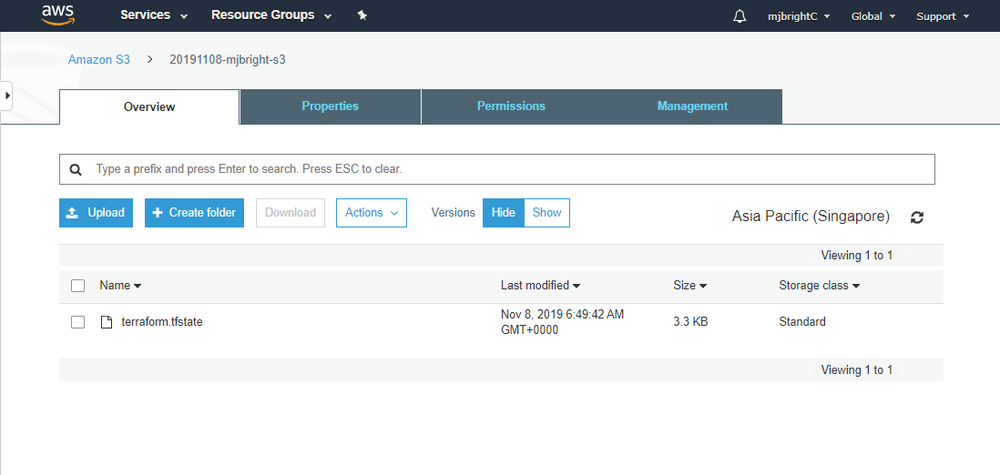
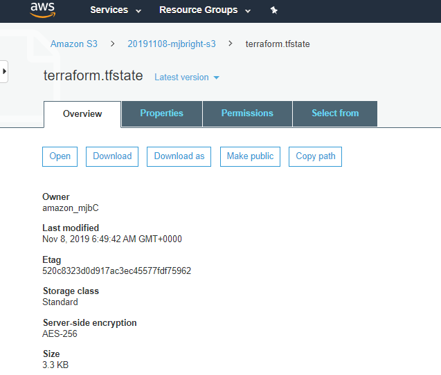
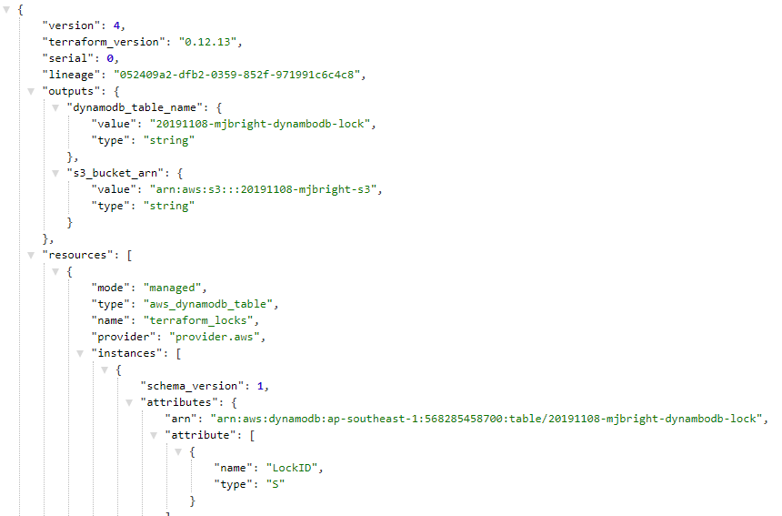
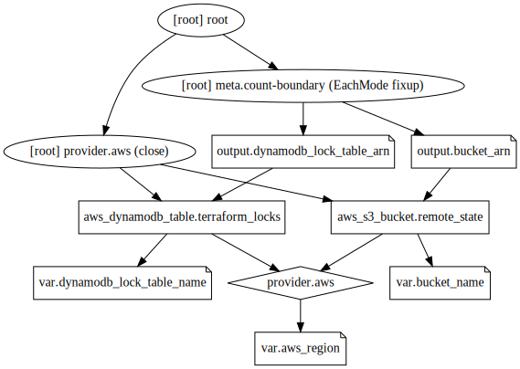

```bash

```

    2023-Jan-09:[TF-1.3.7] Lab updated on node tf[terraform 1.3.7]


<br/>

# Working with Remote State


<br/>

## Background:  
Here, we learn how to create S3 buckets for persistent storage and use DynamoDB to store our states in tables.  We do this so that we can store our tfstate files remotely, and securely and allow versioning control so that recovery and rollbacks can be achieved as required.  

See http://aws-cloud.guru/terraform-aws-backend-for-remote-state-files-with-s3-and-dynamodb/ for more details.


<br/>

## Tasks:

### 1. Make a directory called ‘lab6’ underneath the labs directory.

### 2. Change into the directory.

### 3. Create a file main.tf

In that file define "*aws_s3_bucket*" and "*aws_dynamodb_table*" resources as below


```bash
cat main.tf
```

    
    provider "aws" {
      region = var.region
    }
    
    resource "aws_s3_bucket" "remote_state" {
      bucket = var.unique_bucket_name
    
      # Removed in hashicorp/aws version 4.0.0: now use aws_s3_bucket_acl if needed:
      # acl    = "private"
    
      # Removed in hashicorp/aws version 4.0.0: now use aws_s3_bucket_versioning if needed:
      # versioning {    enabled = true  }
    
      lifecycle { prevent_destroy = false }
      
      tags = {
          LabName = "6.StoringPersistentStates"
      }
    
      # All objects to be deleted from bucket to allow bucket deletion without error
      force_destroy = true
    }
    
    resource "aws_dynamodb_table" "terraform_locks" {
      name           = var.dynamodb_lock_table_name
      read_capacity  = 1
      write_capacity = 1
      hash_key       = "LockID" 
    
      tags = {
          LabName = "6.StoringPersistentStates"
      }
    
      attribute {
        name = "LockID"
        type = "S"
      }
    }
    


```bash
cat vars.tf
```

    variable region {
        default = "us-west-1"
    }
    
    variable unique_bucket_name {
        # e.g. default = "20201020-student21"
        default = "20230109-mjbrightc"
    }
    
    variable dynamodb_lock_table_name {
        default = "dynamodb-lock"
    }


**Note**: The table **must** have a primary key '*hash_key*' named '*LockID*'. If not present, locking will be disabled

Here we tie the state file to the dynamodb instance by creating a table in the database that uses the .tfstate file as its data source.

### 4. Create a file vars.tf - enter *your* unique values here

**Note**: I suggest you name the bucket including your student name e.g. 20230110-student21

Your vars.tf should look something like:

```
variable region {
    default = "us-west-1"
}

variable unique_bucket_name {
    # e.g. default = "20230110-student21"
    default = "<your-unique-name-here>"
}

variable dynamodb_lock_table_name {
    default = "dynamodb-lock"
}
```


### 5. Create the S3 and DynamoDB Resources

We will now perform a terraform init and a terraform apply

**Note**: We do this before creating the backend definition file

**Note**: Alternatively we could have manually created the bucket via the AWS Console or using the cli (```aws s3 mb s3://20230110-student21``` ) **or** Created the bucket from a separate Terraform environment
 
**Note**: Alternatively, it is also possible to pass the variables directly to the init command as described here
https://www.terraform.io/docs/commands/init.html#backend-initialization

#### Initializing the workspace - *without the backend*

We first initalize the workspace.


```bash
terraform init
```

    
    Initializing the backend...
    
    Initializing provider plugins...
    - Finding latest version of hashicorp/aws...
    - Installing hashicorp/aws v4.49.0...
    - Installed hashicorp/aws v4.49.0 (signed by HashiCorp)
    
    Terraform has created a lock file .terraform.lock.hcl to record the provider
    selections it made above. Include this file in your version control repository
    so that Terraform can guarantee to make the same selections by default when
    you run "terraform init" in the future.
    
    Terraform has been successfully initialized!
    
    You may now begin working with Terraform. Try running "terraform plan" to see
    any changes that are required for your infrastructure. All Terraform commands
    should now work.
    
    If you ever set or change modules or backend configuration for Terraform,
    rerun this command to reinitialize your working directory. If you forget, other
    commands will detect it and remind you to do so if necessary.


In case of errors you may wish to re-run init with trace logging:


```bash
TF_LOG=TRACE terraform init | tee terraform.init.log.1
```

    2023-01-09T18:44:31.906Z [INFO]  Terraform version: 1.3.7
    2023-01-09T18:44:31.906Z [DEBUG] using github.com/hashicorp/go-tfe v1.9.0
    2023-01-09T18:44:31.906Z [DEBUG] using github.com/hashicorp/hcl/v2 v2.15.0
    2023-01-09T18:44:31.906Z [DEBUG] using github.com/hashicorp/terraform-config-inspect v0.0.0-20210209133302-4fd17a0faac2
    2023-01-09T18:44:31.906Z [DEBUG] using github.com/hashicorp/terraform-svchost v0.0.0-20200729002733-f050f53b9734
    2023-01-09T18:44:31.906Z [DEBUG] using github.com/zclconf/go-cty v1.12.1
    2023-01-09T18:44:31.906Z [INFO]  Go runtime version: go1.19.4
    2023-01-09T18:44:31.906Z [INFO]  CLI args: []string{"terraform", "init"}
    2023-01-09T18:44:31.906Z [TRACE] Stdout is not a terminal
    2023-01-09T18:44:31.906Z [TRACE] Stderr is a terminal of width 80
    2023-01-09T18:44:31.906Z [TRACE] Stdin is a terminal
    2023-01-09T18:44:31.906Z [DEBUG] Attempting to open CLI config file: /home/student/.terraformrc
    2023-01-09T18:44:31.906Z [DEBUG] File doesn't exist, but doesn't need to. Ignoring.
    2023-01-09T18:44:31.906Z [DEBUG] ignoring non-existing provider search directory terraform.d/plugins
    2023-01-09T18:44:31.906Z [DEBUG] ignoring non-existing provider search directory /home/student/.terraform.d/plugins
    2023-01-09T18:44:31.906Z [DEBUG] ignoring non-existing provider search directory /home/student/.local/share/terraform/plugins
    2023-01-09T18:44:31.906Z [DEBUG] ignoring non-existing provider search directory /usr/local/share/terraform/plugins
    2023-01-09T18:44:31.906Z [DEBUG] ignoring non-existing provider search directory /usr/share/terraform/plugins
    2023-01-09T18:44:31.906Z [DEBUG] ignoring non-existing provider search directory /var/lib/snapd/desktop/terraform/plugins
    2023-01-09T18:44:31.907Z [INFO]  CLI command args: []string{"init"}
    
    Initializing the backend...
    2023-01-09T18:44:31.917Z [TRACE] Meta.Backend: no config given or present on disk, so returning nil config
    2023-01-09T18:44:31.917Z [TRACE] Meta.Backend: backend has not previously been initialized in this working directory
    2023-01-09T18:44:31.917Z [DEBUG] New state was assigned lineage "39053fe4-4d44-d3b7-b4f4-e289ad333620"
    2023-01-09T18:44:31.917Z [TRACE] Meta.Backend: using default local state only (no backend configuration, and no existing initialized backend)
    2023-01-09T18:44:31.917Z [TRACE] Meta.Backend: instantiated backend of type <nil>
    2023-01-09T18:44:31.919Z [TRACE] providercache.fillMetaCache: scanning directory /home/student/dot.terraform/providers
    2023-01-09T18:44:31.919Z [TRACE] getproviders.SearchLocalDirectory: found registry.terraform.io/hashicorp/aws v4.49.0 for linux_amd64 at /home/student/dot.terraform/providers/registry.terraform.io/hashicorp/aws/4.49.0/linux_amd64
    2023-01-09T18:44:31.919Z [TRACE] getproviders.SearchLocalDirectory: found registry.terraform.io/hashicorp/kubernetes v2.16.1 for linux_amd64 at /home/student/dot.terraform/providers/registry.terraform.io/hashicorp/kubernetes/2.16.1/linux_amd64
    2023-01-09T18:44:31.919Z [TRACE] getproviders.SearchLocalDirectory: found registry.terraform.io/hashicorp/local v2.2.3 for linux_amd64 at /home/student/dot.terraform/providers/registry.terraform.io/hashicorp/local/2.2.3/linux_amd64
    2023-01-09T18:44:31.919Z [TRACE] getproviders.SearchLocalDirectory: found registry.terraform.io/hashicorp/tls v4.0.4 for linux_amd64 at /home/student/dot.terraform/providers/registry.terraform.io/hashicorp/tls/4.0.4/linux_amd64
    2023-01-09T18:44:31.919Z [TRACE] getproviders.SearchLocalDirectory: found registry.terraform.io/kreuzwerker/docker v2.25.0 for linux_amd64 at /home/student/dot.terraform/providers/registry.terraform.io/kreuzwerker/docker/2.25.0/linux_amd64
    2023-01-09T18:44:31.919Z [TRACE] providercache.fillMetaCache: including /home/student/dot.terraform/providers/registry.terraform.io/hashicorp/tls/4.0.4/linux_amd64 as a candidate package for registry.terraform.io/hashicorp/tls 4.0.4
    2023-01-09T18:44:31.919Z [TRACE] providercache.fillMetaCache: including /home/student/dot.terraform/providers/registry.terraform.io/kreuzwerker/docker/2.25.0/linux_amd64 as a candidate package for registry.terraform.io/kreuzwerker/docker 2.25.0
    2023-01-09T18:44:31.919Z [TRACE] providercache.fillMetaCache: including /home/student/dot.terraform/providers/registry.terraform.io/hashicorp/aws/4.49.0/linux_amd64 as a candidate package for registry.terraform.io/hashicorp/aws 4.49.0
    2023-01-09T18:44:31.919Z [TRACE] providercache.fillMetaCache: including /home/student/dot.terraform/providers/registry.terraform.io/hashicorp/kubernetes/2.16.1/linux_amd64 as a candidate package for registry.terraform.io/hashicorp/kubernetes 2.16.1
    2023-01-09T18:44:31.919Z [TRACE] providercache.fillMetaCache: including /home/student/dot.terraform/providers/registry.terraform.io/hashicorp/local/2.2.3/linux_amd64 as a candidate package for registry.terraform.io/hashicorp/local 2.2.3
    2023-01-09T18:44:32.825Z [DEBUG] checking for provisioner in "."
    2023-01-09T18:44:32.825Z [DEBUG] checking for provisioner in "/home/student/bin"
    2023-01-09T18:44:32.825Z [TRACE] Meta.Backend: backend <nil> does not support operations, so wrapping it in a local backend
    2023-01-09T18:44:32.825Z [TRACE] backend/local: state manager for workspace "default" will:
     - read initial snapshot from terraform.tfstate
     - write new snapshots to terraform.tfstate
     - create any backup at terraform.tfstate.backup
    2023-01-09T18:44:32.825Z [TRACE] statemgr.Filesystem: reading initial snapshot from terraform.tfstate
    2023-01-09T18:44:32.825Z [TRACE] statemgr.Filesystem: snapshot file has nil snapshot, but that's okay
    2023-01-09T18:44:32.825Z [TRACE] statemgr.Filesystem: read nil snapshot
    
    Initializing provider plugins...
    - Reusing previous version of hashicorp/aws from the dependency lock file
    2023-01-09T18:44:32.825Z [DEBUG] Service discovery for registry.terraform.io at https://registry.terraform.io/.well-known/terraform.json
    2023-01-09T18:44:32.826Z [TRACE] HTTP client GET request to https://registry.terraform.io/.well-known/terraform.json
    2023-01-09T18:44:32.908Z [DEBUG] GET https://registry.terraform.io/v1/providers/hashicorp/aws/versions
    2023-01-09T18:44:32.908Z [TRACE] HTTP client GET request to https://registry.terraform.io/v1/providers/hashicorp/aws/versions
    2023-01-09T18:44:32.980Z [TRACE] providercache.fillMetaCache: scanning directory /home/student/dot.terraform/providers
    2023-01-09T18:44:32.980Z [TRACE] getproviders.SearchLocalDirectory: found registry.terraform.io/hashicorp/aws v4.49.0 for linux_amd64 at /home/student/dot.terraform/providers/registry.terraform.io/hashicorp/aws/4.49.0/linux_amd64
    2023-01-09T18:44:32.982Z [TRACE] getproviders.SearchLocalDirectory: found registry.terraform.io/hashicorp/kubernetes v2.16.1 for linux_amd64 at /home/student/dot.terraform/providers/registry.terraform.io/hashicorp/kubernetes/2.16.1/linux_amd64
    2023-01-09T18:44:32.983Z [TRACE] getproviders.SearchLocalDirectory: found registry.terraform.io/hashicorp/local v2.2.3 for linux_amd64 at /home/student/dot.terraform/providers/registry.terraform.io/hashicorp/local/2.2.3/linux_amd64
    2023-01-09T18:44:32.983Z [TRACE] getproviders.SearchLocalDirectory: found registry.terraform.io/hashicorp/tls v4.0.4 for linux_amd64 at /home/student/dot.terraform/providers/registry.terraform.io/hashicorp/tls/4.0.4/linux_amd64
    2023-01-09T18:44:32.983Z [TRACE] getproviders.SearchLocalDirectory: found registry.terraform.io/kreuzwerker/docker v2.25.0 for linux_amd64 at /home/student/dot.terraform/providers/registry.terraform.io/kreuzwerker/docker/2.25.0/linux_amd64
    2023-01-09T18:44:32.983Z [TRACE] providercache.fillMetaCache: including /home/student/dot.terraform/providers/registry.terraform.io/hashicorp/local/2.2.3/linux_amd64 as a candidate package for registry.terraform.io/hashicorp/local 2.2.3
    2023-01-09T18:44:32.983Z [TRACE] providercache.fillMetaCache: including /home/student/dot.terraform/providers/registry.terraform.io/hashicorp/tls/4.0.4/linux_amd64 as a candidate package for registry.terraform.io/hashicorp/tls 4.0.4
    2023-01-09T18:44:32.983Z [TRACE] providercache.fillMetaCache: including /home/student/dot.terraform/providers/registry.terraform.io/kreuzwerker/docker/2.25.0/linux_amd64 as a candidate package for registry.terraform.io/kreuzwerker/docker 2.25.0
    2023-01-09T18:44:32.983Z [TRACE] providercache.fillMetaCache: including /home/student/dot.terraform/providers/registry.terraform.io/hashicorp/aws/4.49.0/linux_amd64 as a candidate package for registry.terraform.io/hashicorp/aws 4.49.0
    2023-01-09T18:44:32.983Z [TRACE] providercache.fillMetaCache: including /home/student/dot.terraform/providers/registry.terraform.io/hashicorp/kubernetes/2.16.1/linux_amd64 as a candidate package for registry.terraform.io/hashicorp/kubernetes 2.16.1
    - Using previously-installed hashicorp/aws v4.49.0
    
    Terraform has been successfully initialized!
    
    You may now begin working with Terraform. Try running "terraform plan" to see
    any changes that are required for your infrastructure. All Terraform commands
    should now work.
    
    If you ever set or change modules or backend configuration for Terraform,
    rerun this command to reinitialize your working directory. If you forget, other
    commands will detect it and remind you to do so if necessary.


#### Creating the resources

We can now create the resources

**Note**: At this stage the file *backend.tf* must not be present


```bash
terraform apply 
```

    
    Terraform used the selected providers to generate the following execution plan.
    Resource actions are indicated with the following symbols:
      + create
    
    Terraform will perform the following actions:
    
      # aws_dynamodb_table.terraform_locks will be created
      + resource "aws_dynamodb_table" "terraform_locks" {
          + arn              = (known after apply)
          + billing_mode     = "PROVISIONED"
          + hash_key         = "LockID"
          + id               = (known after apply)
          + name             = "dynamodb-lock"
          + read_capacity    = 1
          + stream_arn       = (known after apply)
          + stream_label     = (known after apply)
          + stream_view_type = (known after apply)
          + tags             = {
              + "LabName" = "6.StoringPersistentStates"
            }
          + tags_all         = {
              + "LabName" = "6.StoringPersistentStates"
            }
          + write_capacity   = 1
    
          + attribute {
              + name = "LockID"
              + type = "S"
            }
    
          + point_in_time_recovery {
              + enabled = (known after apply)
            }
    
          + server_side_encryption {
              + enabled     = (known after apply)
              + kms_key_arn = (known after apply)
            }
    
          + ttl {
              + attribute_name = (known after apply)
              + enabled        = (known after apply)
            }
        }
    
      # aws_s3_bucket.remote_state will be created
      + resource "aws_s3_bucket" "remote_state" {
          + acceleration_status         = (known after apply)
          + acl                         = (known after apply)
          + arn                         = (known after apply)
          + bucket                      = "20230109-mjbrightc"
          + bucket_domain_name          = (known after apply)
          + bucket_regional_domain_name = (known after apply)
          + force_destroy               = true
          + hosted_zone_id              = (known after apply)
          + id                          = (known after apply)
          + object_lock_enabled         = (known after apply)
          + policy                      = (known after apply)
          + region                      = (known after apply)
          + request_payer               = (known after apply)
          + tags                        = {
              + "LabName" = "6.StoringPersistentStates"
            }
          + tags_all                    = {
              + "LabName" = "6.StoringPersistentStates"
            }
          + website_domain              = (known after apply)
          + website_endpoint            = (known after apply)
    
          + cors_rule {
              + allowed_headers = (known after apply)
              + allowed_methods = (known after apply)
              + allowed_origins = (known after apply)
              + expose_headers  = (known after apply)
              + max_age_seconds = (known after apply)
            }
    
          + grant {
              + id          = (known after apply)
              + permissions = (known after apply)
              + type        = (known after apply)
              + uri         = (known after apply)
            }
    
          + lifecycle_rule {
              + abort_incomplete_multipart_upload_days = (known after apply)
              + enabled                                = (known after apply)
              + id                                     = (known after apply)
              + prefix                                 = (known after apply)
              + tags                                   = (known after apply)
    
              + expiration {
                  + date                         = (known after apply)
                  + days                         = (known after apply)
                  + expired_object_delete_marker = (known after apply)
                }
    
              + noncurrent_version_expiration {
                  + days = (known after apply)
                }
    
              + noncurrent_version_transition {
                  + days          = (known after apply)
                  + storage_class = (known after apply)
                }
    
              + transition {
                  + date          = (known after apply)
                  + days          = (known after apply)
                  + storage_class = (known after apply)
                }
            }
    
          + logging {
              + target_bucket = (known after apply)
              + target_prefix = (known after apply)
            }
    
          + object_lock_configuration {
              + object_lock_enabled = (known after apply)
    
              + rule {
                  + default_retention {
                      + days  = (known after apply)
                      + mode  = (known after apply)
                      + years = (known after apply)
                    }
                }
            }
    
          + replication_configuration {
              + role = (known after apply)
    
              + rules {
                  + delete_marker_replication_status = (known after apply)
                  + id                               = (known after apply)
                  + prefix                           = (known after apply)
                  + priority                         = (known after apply)
                  + status                           = (known after apply)
    
                  + destination {
                      + account_id         = (known after apply)
                      + bucket             = (known after apply)
                      + replica_kms_key_id = (known after apply)
                      + storage_class      = (known after apply)
    
                      + access_control_translation {
                          + owner = (known after apply)
                        }
    
                      + metrics {
                          + minutes = (known after apply)
                          + status  = (known after apply)
                        }
    
                      + replication_time {
                          + minutes = (known after apply)
                          + status  = (known after apply)
                        }
                    }
    
                  + filter {
                      + prefix = (known after apply)
                      + tags   = (known after apply)
                    }
    
                  + source_selection_criteria {
                      + sse_kms_encrypted_objects {
                          + enabled = (known after apply)
                        }
                    }
                }
            }
    
          + server_side_encryption_configuration {
              + rule {
                  + bucket_key_enabled = (known after apply)
    
                  + apply_server_side_encryption_by_default {
                      + kms_master_key_id = (known after apply)
                      + sse_algorithm     = (known after apply)
                    }
                }
            }
    
          + versioning {
              + enabled    = (known after apply)
              + mfa_delete = (known after apply)
            }
    
          + website {
              + error_document           = (known after apply)
              + index_document           = (known after apply)
              + redirect_all_requests_to = (known after apply)
              + routing_rules            = (known after apply)
            }
        }
    
    Plan: 2 to add, 0 to change, 0 to destroy.
    aws_dynamodb_table.terraform_locks: Creating...
    aws_s3_bucket.remote_state: Creating...
    aws_s3_bucket.remote_state: Creation complete after 5s [id=20230109-mjbrightc]
    aws_dynamodb_table.terraform_locks: Creation complete after 8s [id=dynamodb-lock]
    
    Apply complete! Resources: 2 added, 0 changed, 0 destroyed.
    


#### If you get the 'Table already exists' error

If you get the following error:

```
aws_s3_bucket.remote_state: Creating...
aws_dynamodb_table.terraform_locks: Creating...
aws_s3_bucket.remote_state: Still creating... [10s elapsed]
aws_s3_bucket.remote_state: Creation complete after 13s [id=20210203-mjbrightc]

Error: error creating DynamoDB Table: ResourceInUseException: Table already exists: dynamodb-lock
```

(**in this lab environment, not in production**) you will first need to delete the existing table using:

```
aws dynamodb delete-table --table-name dynamodb-lock
```

#### Verifying the resources

Verify that your S3 bucket has been created using

```
    aws s3 ls 
    
```

Verify that your "*dynamodb-lock*" table has been created:


```bash
aws dynamodb list-tables
```

    {
        "TableNames": [
            "dynamodb-lock"
        ]
    }


### 6. Create a file backend.tf

Now that we have created the necessary resources we will
1. create a backend configuration
2. re-perform the init
3. verify the configuration

We will create a file backend.tf

This file will be used to make S3 - with DynamoDB locking - our remote_backend for storing state

Unfortunately we cannot use variables in this file as they will not be interpreted by "*terraform init*".

So you must manually enter the **same bucket name** in the content below:


```bash

```

    
    terraform {
        backend "s3" {
            #key = path/to/my/key
            key = "terraform.tfstate"
    
            #region = var.region
            region = "us-west-1"
    
            # ENTRY MUST BE UPDATED !!
            # e.g. bucket = "20201020-student21"
            bucket = "20230109-mjbrightc"
    
            #dynamodb_table = var.dynamodb_lock_table_name
            dynamodb_table = "dynamodb-lock"
    
            encrypt = true # Optional, S3 Bucket Server Side Encryption
         }
    }


### 7. Initialize, preview and apply the complete configuration

### 7.1 Init


```bash
 terraform  init -migrate-state
echo yes | EXEC terraform init --backend=true  -migrate-state #--lock=false 
```

    
    Initializing the backend...
    Acquiring state lock. This may take a few moments...
    Do you want to copy existing state to the new backend?
      Pre-existing state was found while migrating the previous "local" backend to the
      newly configured "s3" backend. No existing state was found in the newly
      configured "s3" backend. Do you want to copy this state to the new "s3"
      backend? Enter "yes" to copy and "no" to start with an empty state.
    
      Enter a value: 
    Releasing state lock. This may take a few moments...
    
    Successfully configured the backend "s3"! Terraform will automatically
    use this backend unless the backend configuration changes.
    
    Initializing provider plugins...
    - Reusing previous version of hashicorp/aws from the dependency lock file
    - Using previously-installed hashicorp/aws v4.49.0
    
    Terraform has been successfully initialized!
    
    You may now begin working with Terraform. Try running "terraform plan" to see
    any changes that are required for your infrastructure. All Terraform commands
    should now work.
    
    If you ever set or change modules or backend configuration for Terraform,
    rerun this command to reinitialize your working directory. If you forget, other
    commands will detect it and remind you to do so if necessary.


#### In case of errors

In case of errors also use the TF_LOG trace option again:

```TF_LOG=TRACE terraform init --backend=true -migrate-state |& tee terraform.init.log.2```

You can use the following command to verify that your dynamoDB table is still present (as it should be !)


```bash
aws dynamodb list-tables
```

    {
        "TableNames": [
            "dynamodb-lock"
        ]
    }


### 7.2 Verifying the state

If all went well you got no errors and you local terraform.tfstate file is now empty as state is written to the S3 bucket


```bash
ls -al terraform.tfstate*
```

    -rw-rw-r-- 1 student student    0 Jan  9 18:46 terraform.tfstate
    -rw-rw-r-- 1 student student 4260 Jan  9 18:46 terraform.tfstate.backup


### 7.3 Viewing the state in the S3 bucket

#### Accessing the state via the cli


```bash
aws s3 ls s3://$BUCKET
```

    2023-01-09 18:46:39       4260 terraform.tfstate


and you should see a terraform.tfstate file there

You can obtain a local copy to look at the file as follows:


```bash
aws s3 cp s3://$BUCKET/terraform.tfstate terraform.tfstate.localcopy
```

    download: s3://20230109-mjbrightc/terraform.tfstate to ./terraform.tfstate.localcopy


#### Investigating the remote state

Now using ```terraform state list``` and ```terraform state show RESOURCE``` we can investigate resources as before.

You will notice that it is slower to respond as the state is obtained from our S3 bucket.


```bash
terraform state list 
```

    aws_dynamodb_table.terraform_locks
    aws_s3_bucket.remote_state


```bash
terraform state show aws_s3_bucket.remote_state
```

    # aws_s3_bucket.remote_state:
    resource "aws_s3_bucket" "remote_state" {
        arn                         = "arn:aws:s3:::20230109-mjbrightc"
        bucket                      = "20230109-mjbrightc"
        bucket_domain_name          = "20230109-mjbrightc.s3.amazonaws.com"
        bucket_regional_domain_name = "20230109-mjbrightc.s3.us-west-1.amazonaws.com"
        force_destroy               = true
        hosted_zone_id              = "Z2F56UZL2M1ACD"
        id                          = "20230109-mjbrightc"
        object_lock_enabled         = false
        region                      = "us-west-1"
        request_payer               = "BucketOwner"
        tags                        = {
            "LabName" = "6.StoringPersistentStates"
        }
        tags_all                    = {
            "LabName" = "6.StoringPersistentStates"
        }
    
        grant {
            id          = "968fa2d82a42737a0bed914a047f15154b89bf1bcc8c50a320a36a56c60f1ad1"
            permissions = [
                "FULL_CONTROL",
            ]
            type        = "CanonicalUser"
        }
    
        versioning {
            enabled    = false
            mfa_delete = false
        }
    }


#### Investigating the local copy

We can also use ```terraform state list``` and ```terraform state show RESOURCE``` with the option ```-state=terraform.tfstate.localcopy ``` to investigate the state as stored in the local copy we just made.


```bash
terraform state list -state=terraform.tfstate.localcopy 
```

    aws_dynamodb_table.terraform_locks
    aws_s3_bucket.remote_state


```bash
terraform state show -state=terraform.tfstate.localcopy aws_s3_bucket.remote_state
```

    # aws_s3_bucket.remote_state:
    resource "aws_s3_bucket" "remote_state" {
        arn                         = "arn:aws:s3:::20230109-mjbrightc"
        bucket                      = "20230109-mjbrightc"
        bucket_domain_name          = "20230109-mjbrightc.s3.amazonaws.com"
        bucket_regional_domain_name = "20230109-mjbrightc.s3.us-west-1.amazonaws.com"
        force_destroy               = true
        hosted_zone_id              = "Z2F56UZL2M1ACD"
        id                          = "20230109-mjbrightc"
        object_lock_enabled         = false
        region                      = "us-west-1"
        request_payer               = "BucketOwner"
        tags                        = {
            "LabName" = "6.StoringPersistentStates"
        }
        tags_all                    = {
            "LabName" = "6.StoringPersistentStates"
        }
    
        grant {
            id          = "968fa2d82a42737a0bed914a047f15154b89bf1bcc8c50a320a36a56c60f1ad1"
            permissions = [
                "FULL_CONTROL",
            ]
            type        = "CanonicalUser"
        }
    
        versioning {
            enabled    = false
            mfa_delete = false
        }
    }


### 8. Add a new resource

Add a new resource - a 2nd bucket with a unique name

Apply this config and see that the local state file doesn't change


The local terraform.tfstate file should remain empty despite the new resource created

e.g.


```bash
cat test_bucket.tf
```

    resource "aws_s3_bucket" "test_bucket" {
      bucket = "${var.unique_bucket_name}test"
    
      lifecycle { prevent_destroy = false }
    
      tags = {
          LabName = "6.StoringPersistentStates"
      }
    
      force_destroy = true 
    }


```bash
terraform apply -auto-approve

terraform state list

ls -al terraform.tfstate
```

    Acquiring state lock. This may take a few moments...
    aws_s3_bucket.remote_state: Refreshing state... [id=20230109-mjbrightc]
    aws_dynamodb_table.terraform_locks: Refreshing state... [id=dynamodb-lock]
    
    Terraform used the selected providers to generate the following execution plan.
    Resource actions are indicated with the following symbols:
      + create
    
    Terraform will perform the following actions:
    
      # aws_s3_bucket.test_bucket will be created
      + resource "aws_s3_bucket" "test_bucket" {
          + acceleration_status         = (known after apply)
          + acl                         = (known after apply)
          + arn                         = (known after apply)
          + bucket                      = "20230109-mjbrightctest"
          + bucket_domain_name          = (known after apply)
          + bucket_regional_domain_name = (known after apply)
          + force_destroy               = true
          + hosted_zone_id              = (known after apply)
          + id                          = (known after apply)
          + object_lock_enabled         = (known after apply)
          + policy                      = (known after apply)
          + region                      = (known after apply)
          + request_payer               = (known after apply)
          + tags                        = {
              + "LabName" = "6.StoringPersistentStates"
            }
          + tags_all                    = {
              + "LabName" = "6.StoringPersistentStates"
            }
          + website_domain              = (known after apply)
          + website_endpoint            = (known after apply)
    
          + cors_rule {
              + allowed_headers = (known after apply)
              + allowed_methods = (known after apply)
              + allowed_origins = (known after apply)
              + expose_headers  = (known after apply)
              + max_age_seconds = (known after apply)
            }
    
          + grant {
              + id          = (known after apply)
              + permissions = (known after apply)
              + type        = (known after apply)
              + uri         = (known after apply)
            }
    
          + lifecycle_rule {
              + abort_incomplete_multipart_upload_days = (known after apply)
              + enabled                                = (known after apply)
              + id                                     = (known after apply)
              + prefix                                 = (known after apply)
              + tags                                   = (known after apply)
    
              + expiration {
                  + date                         = (known after apply)
                  + days                         = (known after apply)
                  + expired_object_delete_marker = (known after apply)
                }
    
              + noncurrent_version_expiration {
                  + days = (known after apply)
                }
    
              + noncurrent_version_transition {
                  + days          = (known after apply)
                  + storage_class = (known after apply)
                }
    
              + transition {
                  + date          = (known after apply)
                  + days          = (known after apply)
                  + storage_class = (known after apply)
                }
            }
    
          + logging {
              + target_bucket = (known after apply)
              + target_prefix = (known after apply)
            }
    
          + object_lock_configuration {
              + object_lock_enabled = (known after apply)
    
              + rule {
                  + default_retention {
                      + days  = (known after apply)
                      + mode  = (known after apply)
                      + years = (known after apply)
                    }
                }
            }
    
          + replication_configuration {
              + role = (known after apply)
    
              + rules {
                  + delete_marker_replication_status = (known after apply)
                  + id                               = (known after apply)
                  + prefix                           = (known after apply)
                  + priority                         = (known after apply)
                  + status                           = (known after apply)
    
                  + destination {
                      + account_id         = (known after apply)
                      + bucket             = (known after apply)
                      + replica_kms_key_id = (known after apply)
                      + storage_class      = (known after apply)
    
                      + access_control_translation {
                          + owner = (known after apply)
                        }
    
                      + metrics {
                          + minutes = (known after apply)
                          + status  = (known after apply)
                        }
    
                      + replication_time {
                          + minutes = (known after apply)
                          + status  = (known after apply)
                        }
                    }
    
                  + filter {
                      + prefix = (known after apply)
                      + tags   = (known after apply)
                    }
    
                  + source_selection_criteria {
                      + sse_kms_encrypted_objects {
                          + enabled = (known after apply)
                        }
                    }
                }
            }
    
          + server_side_encryption_configuration {
              + rule {
                  + bucket_key_enabled = (known after apply)
    
                  + apply_server_side_encryption_by_default {
                      + kms_master_key_id = (known after apply)
                      + sse_algorithm     = (known after apply)
                    }
                }
            }
    
          + versioning {
              + enabled    = (known after apply)
              + mfa_delete = (known after apply)
            }
    
          + website {
              + error_document           = (known after apply)
              + index_document           = (known after apply)
              + redirect_all_requests_to = (known after apply)
              + routing_rules            = (known after apply)
            }
        }
    
    Plan: 1 to add, 0 to change, 0 to destroy.
    aws_s3_bucket.test_bucket: Creating...
    aws_s3_bucket.test_bucket: Creation complete after 4s [id=20230109-mjbrightctest]
    Releasing state lock. This may take a few moments...
    
    Apply complete! Resources: 1 added, 0 changed, 0 destroyed.
    
    aws_dynamodb_table.terraform_locks
    aws_s3_bucket.remote_state
    aws_s3_bucket.test_bucket
    -rw-rw-r-- 1 student student 0 Jan  9 18:46 terraform.tfstate


#### Accessing the state via the AWS Console

If you are performing this lab with your own AWS credentials, you can access the AWS Console to investigate the state their in the S3 bucket - see the below screen capture

**Note:** the S3 bucket name is different here as this was a previous run with a differented dated bucket name.

<!-- The S3 bucket:
 -->

#### The S3 bucket description:


#### The terraform.tfstate file in the S3 bucket:


### 9. The configuration when visualized should look like

<div>
    <object data="graph.svg" type="image/svg+xml">
    </object>
</div>



#### Viewing your terraform.tfstate file as a graph

**Note:** Remember that **once you have applied this config** can obtain a representation of this graph using the ```terraform graph``` command which you can copy into the web site https://dreampuf.github.io/GraphvizOnline/

The output of ```terraform graph``` should look something like:
```
digraph {
        compound = "true"
        newrank = "true"
        subgraph "root" {
                "[root] aws_subnet.vpc_subnets (expand)" [label = "aws_subnet.vpc_subnets", shape = "box"]
                "[root] aws_vpc.main_vpc (expand)" [label = "aws_vpc.main_vpc", shape = "box"]
                "[root] data.aws_availability_zones.aaz (expand)" [label = "data.aws_availability_zones.aaz", shape = "box"]
                "[root] output.aazs" [label = "output.aazs", shape = "note"]
                "[root] provider[\"registry.terraform.io/hashicorp/aws\"]" [label = "provider[\"registry.terraform.io/hashicorp/aws\"]", shape = "diamond"]
                "[root] var.ami_instance" [label = "var.ami_instance", shape = "note"]
                "[root] var.instance_type" [label = "var.instance_type", shape = "note"]
                "[root] var.region" [label = "var.region", shape = "note"]
                "[root] var.vpc_cidr" [label = "var.vpc_cidr", shape = "note"]
                "[root] var.vpc_subnet_cidr" [label = "var.vpc_subnet_cidr", shape = "note"]
                "[root] aws_subnet.vpc_subnets (expand)" -> "[root] aws_vpc.main_vpc (expand)"
                "[root] aws_subnet.vpc_subnets (expand)" -> "[root] data.aws_availability_zones.aaz (expand)"
                "[root] aws_subnet.vpc_subnets (expand)" -> "[root] var.vpc_subnet_cidr"
                "[root] aws_vpc.main_vpc (expand)" -> "[root] provider[\"registry.terraform.io/hashicorp/aws\"]"
                "[root] aws_vpc.main_vpc (expand)" -> "[root] var.vpc_cidr"
                "[root] data.aws_availability_zones.aaz (expand)" -> "[root] provider[\"registry.terraform.io/hashicorp/aws\"]"
                "[root] meta.count-boundary (EachMode fixup)" -> "[root] aws_subnet.vpc_subnets (expand)"
                "[root] meta.count-boundary (EachMode fixup)" -> "[root] output.aazs"
                "[root] meta.count-boundary (EachMode fixup)" -> "[root] var.ami_instance"
                "[root] meta.count-boundary (EachMode fixup)" -> "[root] var.instance_type"
                "[root] output.aazs" -> "[root] data.aws_availability_zones.aaz (expand)"
                "[root] provider[\"registry.terraform.io/hashicorp/aws\"] (close)" -> "[root] aws_subnet.vpc_subnets (expand)"
                "[root] provider[\"registry.terraform.io/hashicorp/aws\"]" -> "[root] var.region"
                "[root] root" -> "[root] meta.count-boundary (EachMode fixup)"
                "[root] root" -> "[root] provider[\"registry.terraform.io/hashicorp/aws\"] (close)"
        }
}
```


### 10. Reverting to local state -  Removing the remote_backend

Now to revert back to using a local terraform.tfstate file:

Remove the backend definition from your config: ```rm backend.tf```
- or move the backend.tf file or change to another folder

Then re-init your config: ```terraform init  -migrate-state```

This will disable the "S3" remote_backend

```
Terraform has detected you're unconfiguring your previously set "s3" backend.
Do you want to copy existing state to the new backend?
  Pre-existing state was found while migrating the previous "s3" backend to the
  newly configured "local" backend. No existing state was found in the newly
  configured "local" backend. Do you want to copy this state to the new "local"
  backend? Enter "yes" to copy and "no" to start with an empty state.

  Enter a value: yes


Successfully unset the backend "s3". Terraform will now operate locally.

Initializing provider plugins...
- Reusing previous version of hashicorp/aws from the dependency lock file
- Installing hashicorp/aws v3.26.0...
- Installed hashicorp/aws v3.26.0 (signed by HashiCorp)

Terraform has been successfully initialized!

You may now begin working with Terraform. Try running "terraform plan" to see
any changes that are required for your infrastructure. All Terraform commands
should now work.

If you ever set or change modules or backend configuration for Terraform,
rerun this command to reinitialize your working directory. If you forget, other
commands will detect it and remind you to do so if necessary.
```


```bash
rm backend.tf

echo yes | terraform init  -migrate-state

# Then perform ```terraform init --backend=false```

ls -al terraform.tfstate
```

    
    Initializing the backend...
    Terraform has detected you're unconfiguring your previously set "s3" backend.
    Acquiring state lock. This may take a few moments...
    Do you want to copy existing state to the new backend?
      Pre-existing state was found while migrating the previous "s3" backend to the
      newly configured "local" backend. No existing state was found in the newly
      configured "local" backend. Do you want to copy this state to the new "local"
      backend? Enter "yes" to copy and "no" to start with an empty state.
    
      Enter a value: 
    Releasing state lock. This may take a few moments...
    
    
    Successfully unset the backend "s3". Terraform will now operate locally.
    
    Initializing provider plugins...
    - Reusing previous version of hashicorp/aws from the dependency lock file
    - Using previously-installed hashicorp/aws v4.49.0
    
    Terraform has been successfully initialized!
    
    You may now begin working with Terraform. Try running "terraform plan" to see
    any changes that are required for your infrastructure. All Terraform commands
    should now work.
    
    If you ever set or change modules or backend configuration for Terraform,
    rerun this command to reinitialize your working directory. If you forget, other
    commands will detect it and remind you to do so if necessary.
    -rw-rw-r-- 1 student student 6445 Jan  9 18:49 terraform.tfstate


### In case of errors

If you hit errors reverting to a local state, perform the following steps:

**Note:** This assumes that you have TF_DATA_DIR exported as ~/dot.terraform

```
mv ~/dot.terraform/terraform.tfstate ~/dot.terraform/terraform.tfstate.remote.backup

terraform init
```


```bash
terraform state list
```

    aws_dynamodb_table.terraform_locks
    aws_s3_bucket.remote_state
    aws_s3_bucket.test_bucket


### 10. Cleanup

Now destroy the formerly created AWS S3 bucket and dynamoDB table


```bash
terraform destroy 
```

    aws_dynamodb_table.terraform_locks: Refreshing state... [id=dynamodb-lock]
    aws_s3_bucket.test_bucket: Refreshing state... [id=20230109-mjbrightctest]
    aws_s3_bucket.remote_state: Refreshing state... [id=20230109-mjbrightc]
    
    Terraform used the selected providers to generate the following execution plan.
    Resource actions are indicated with the following symbols:
      - destroy
    
    Terraform will perform the following actions:
    
      # aws_dynamodb_table.terraform_locks will be destroyed
      - resource "aws_dynamodb_table" "terraform_locks" {
          - arn            = "arn:aws:dynamodb:us-west-1:816376574968:table/dynamodb-lock" -> null
          - billing_mode   = "PROVISIONED" -> null
          - hash_key       = "LockID" -> null
          - id             = "dynamodb-lock" -> null
          - name           = "dynamodb-lock" -> null
          - read_capacity  = 1 -> null
          - stream_enabled = false -> null
          - tags           = {
              - "LabName" = "6.StoringPersistentStates"
            } -> null
          - tags_all       = {
              - "LabName" = "6.StoringPersistentStates"
            } -> null
          - write_capacity = 1 -> null
    
          - attribute {
              - name = "LockID" -> null
              - type = "S" -> null
            }
    
          - point_in_time_recovery {
              - enabled = false -> null
            }
    
          - ttl {
              - enabled = false -> null
            }
        }
    
      # aws_s3_bucket.remote_state will be destroyed
      - resource "aws_s3_bucket" "remote_state" {
          - arn                         = "arn:aws:s3:::20230109-mjbrightc" -> null
          - bucket                      = "20230109-mjbrightc" -> null
          - bucket_domain_name          = "20230109-mjbrightc.s3.amazonaws.com" -> null
          - bucket_regional_domain_name = "20230109-mjbrightc.s3.us-west-1.amazonaws.com" -> null
          - force_destroy               = true -> null
          - hosted_zone_id              = "Z2F56UZL2M1ACD" -> null
          - id                          = "20230109-mjbrightc" -> null
          - object_lock_enabled         = false -> null
          - region                      = "us-west-1" -> null
          - request_payer               = "BucketOwner" -> null
          - tags                        = {
              - "LabName" = "6.StoringPersistentStates"
            } -> null
          - tags_all                    = {
              - "LabName" = "6.StoringPersistentStates"
            } -> null
    
          - grant {
              - id          = "968fa2d82a42737a0bed914a047f15154b89bf1bcc8c50a320a36a56c60f1ad1" -> null
              - permissions = [
                  - "FULL_CONTROL",
                ] -> null
              - type        = "CanonicalUser" -> null
            }
    
          - versioning {
              - enabled    = false -> null
              - mfa_delete = false -> null
            }
        }
    
      # aws_s3_bucket.test_bucket will be destroyed
      - resource "aws_s3_bucket" "test_bucket" {
          - arn                         = "arn:aws:s3:::20230109-mjbrightctest" -> null
          - bucket                      = "20230109-mjbrightctest" -> null
          - bucket_domain_name          = "20230109-mjbrightctest.s3.amazonaws.com" -> null
          - bucket_regional_domain_name = "20230109-mjbrightctest.s3.us-west-1.amazonaws.com" -> null
          - force_destroy               = true -> null
          - hosted_zone_id              = "Z2F56UZL2M1ACD" -> null
          - id                          = "20230109-mjbrightctest" -> null
          - object_lock_enabled         = false -> null
          - region                      = "us-west-1" -> null
          - request_payer               = "BucketOwner" -> null
          - tags                        = {
              - "LabName" = "6.StoringPersistentStates"
            } -> null
          - tags_all                    = {
              - "LabName" = "6.StoringPersistentStates"
            } -> null
    
          - grant {
              - id          = "968fa2d82a42737a0bed914a047f15154b89bf1bcc8c50a320a36a56c60f1ad1" -> null
              - permissions = [
                  - "FULL_CONTROL",
                ] -> null
              - type        = "CanonicalUser" -> null
            }
    
          - versioning {
              - enabled    = false -> null
              - mfa_delete = false -> null
            }
        }
    
    Plan: 0 to add, 0 to change, 3 to destroy.
    aws_s3_bucket.test_bucket: Destroying... [id=20230109-mjbrightctest]
    aws_dynamodb_table.terraform_locks: Destroying... [id=dynamodb-lock]
    aws_s3_bucket.remote_state: Destroying... [id=20230109-mjbrightc]
    aws_s3_bucket.test_bucket: Destruction complete after 0s
    aws_s3_bucket.remote_state: Destruction complete after 2s
    aws_dynamodb_table.terraform_locks: Destruction complete after 4s
    
    Destroy complete! Resources: 3 destroyed.
    


```bash
terraform state list
```


```bash

```

    2023-Jan-09:[TF-1.3.7] Lab updated on node tf[terraform 1.3.7]


<hr/>

<!-- Why does this no longer work ??


-->


```bash

```

    2023-Jan-09:[TF-1.3.7] Lab updated on node tf[terraform 1.3.7]


<br/>

# Working with Remote State


<br/>

## Background:  
Here, we learn how to create S3 buckets for persistent storage and use DynamoDB to store our states in tables.  We do this so that we can store our tfstate files remotely, and securely and allow versioning control so that recovery and rollbacks can be achieved as required.  

See http://aws-cloud.guru/terraform-aws-backend-for-remote-state-files-with-s3-and-dynamodb/ for more details.


<br/>

## Tasks:

### 1. Make a directory called ‘lab6’ underneath the labs directory.

### 2. Change into the directory.

### 3. Create a file main.tf

In that file define "*aws_s3_bucket*" and "*aws_dynamodb_table*" resources as below


```bash
cat main.tf
```

    
    provider "aws" {
      region = var.region
    }
    
    resource "aws_s3_bucket" "remote_state" {
      bucket = var.unique_bucket_name
    
      # Removed in hashicorp/aws version 4.0.0: now use aws_s3_bucket_acl if needed:
      # acl    = "private"
    
      # Removed in hashicorp/aws version 4.0.0: now use aws_s3_bucket_versioning if needed:
      # versioning {    enabled = true  }
    
      lifecycle { prevent_destroy = false }
      
      tags = {
          LabName = "6.StoringPersistentStates"
      }
    
      # All objects to be deleted from bucket to allow bucket deletion without error
      force_destroy = true
    }
    
    resource "aws_dynamodb_table" "terraform_locks" {
      name           = var.dynamodb_lock_table_name
      read_capacity  = 1
      write_capacity = 1
      hash_key       = "LockID" 
    
      tags = {
          LabName = "6.StoringPersistentStates"
      }
    
      attribute {
        name = "LockID"
        type = "S"
      }
    }
    


```bash
cat vars.tf
```

    variable region {
        default = "us-west-1"
    }
    
    variable unique_bucket_name {
        # e.g. default = "20201020-student21"
        default = "20230109-mjbrightc"
    }
    
    variable dynamodb_lock_table_name {
        default = "dynamodb-lock"
    }


**Note**: The table **must** have a primary key '*hash_key*' named '*LockID*'. If not present, locking will be disabled

Here we tie the state file to the dynamodb instance by creating a table in the database that uses the .tfstate file as its data source.

### 4. Create a file vars.tf - enter *your* unique values here

**Note**: I suggest you name the bucket including your student name e.g. 20230110-student21

Your vars.tf should look something like:

```
variable region {
    default = "us-west-1"
}

variable unique_bucket_name {
    # e.g. default = "20230110-student21"
    default = "<your-unique-name-here>"
}

variable dynamodb_lock_table_name {
    default = "dynamodb-lock"
}
```


### 5. Create the S3 and DynamoDB Resources

We will now perform a terraform init and a terraform apply

**Note**: We do this before creating the backend definition file

**Note**: Alternatively we could have manually created the bucket via the AWS Console or using the cli (```aws s3 mb s3://20230110-student21``` ) **or** Created the bucket from a separate Terraform environment
 
**Note**: Alternatively, it is also possible to pass the variables directly to the init command as described here
https://www.terraform.io/docs/commands/init.html#backend-initialization

#### Initializing the workspace - *without the backend*

We first initalize the workspace.


```bash
terraform init
```

    
    Initializing the backend...
    
    Initializing provider plugins...
    - Finding latest version of hashicorp/aws...
    - Installing hashicorp/aws v4.49.0...
    - Installed hashicorp/aws v4.49.0 (signed by HashiCorp)
    
    Terraform has created a lock file .terraform.lock.hcl to record the provider
    selections it made above. Include this file in your version control repository
    so that Terraform can guarantee to make the same selections by default when
    you run "terraform init" in the future.
    
    Terraform has been successfully initialized!
    
    You may now begin working with Terraform. Try running "terraform plan" to see
    any changes that are required for your infrastructure. All Terraform commands
    should now work.
    
    If you ever set or change modules or backend configuration for Terraform,
    rerun this command to reinitialize your working directory. If you forget, other
    commands will detect it and remind you to do so if necessary.


In case of errors you may wish to re-run init with trace logging:


```bash
TF_LOG=TRACE terraform init | tee terraform.init.log.1
```

    2023-01-09T18:44:31.906Z [INFO]  Terraform version: 1.3.7
    2023-01-09T18:44:31.906Z [DEBUG] using github.com/hashicorp/go-tfe v1.9.0
    2023-01-09T18:44:31.906Z [DEBUG] using github.com/hashicorp/hcl/v2 v2.15.0
    2023-01-09T18:44:31.906Z [DEBUG] using github.com/hashicorp/terraform-config-inspect v0.0.0-20210209133302-4fd17a0faac2
    2023-01-09T18:44:31.906Z [DEBUG] using github.com/hashicorp/terraform-svchost v0.0.0-20200729002733-f050f53b9734
    2023-01-09T18:44:31.906Z [DEBUG] using github.com/zclconf/go-cty v1.12.1
    2023-01-09T18:44:31.906Z [INFO]  Go runtime version: go1.19.4
    2023-01-09T18:44:31.906Z [INFO]  CLI args: []string{"terraform", "init"}
    2023-01-09T18:44:31.906Z [TRACE] Stdout is not a terminal
    2023-01-09T18:44:31.906Z [TRACE] Stderr is a terminal of width 80
    2023-01-09T18:44:31.906Z [TRACE] Stdin is a terminal
    2023-01-09T18:44:31.906Z [DEBUG] Attempting to open CLI config file: /home/student/.terraformrc
    2023-01-09T18:44:31.906Z [DEBUG] File doesn't exist, but doesn't need to. Ignoring.
    2023-01-09T18:44:31.906Z [DEBUG] ignoring non-existing provider search directory terraform.d/plugins
    2023-01-09T18:44:31.906Z [DEBUG] ignoring non-existing provider search directory /home/student/.terraform.d/plugins
    2023-01-09T18:44:31.906Z [DEBUG] ignoring non-existing provider search directory /home/student/.local/share/terraform/plugins
    2023-01-09T18:44:31.906Z [DEBUG] ignoring non-existing provider search directory /usr/local/share/terraform/plugins
    2023-01-09T18:44:31.906Z [DEBUG] ignoring non-existing provider search directory /usr/share/terraform/plugins
    2023-01-09T18:44:31.906Z [DEBUG] ignoring non-existing provider search directory /var/lib/snapd/desktop/terraform/plugins
    2023-01-09T18:44:31.907Z [INFO]  CLI command args: []string{"init"}
    
    Initializing the backend...
    2023-01-09T18:44:31.917Z [TRACE] Meta.Backend: no config given or present on disk, so returning nil config
    2023-01-09T18:44:31.917Z [TRACE] Meta.Backend: backend has not previously been initialized in this working directory
    2023-01-09T18:44:31.917Z [DEBUG] New state was assigned lineage "39053fe4-4d44-d3b7-b4f4-e289ad333620"
    2023-01-09T18:44:31.917Z [TRACE] Meta.Backend: using default local state only (no backend configuration, and no existing initialized backend)
    2023-01-09T18:44:31.917Z [TRACE] Meta.Backend: instantiated backend of type <nil>
    2023-01-09T18:44:31.919Z [TRACE] providercache.fillMetaCache: scanning directory /home/student/dot.terraform/providers
    2023-01-09T18:44:31.919Z [TRACE] getproviders.SearchLocalDirectory: found registry.terraform.io/hashicorp/aws v4.49.0 for linux_amd64 at /home/student/dot.terraform/providers/registry.terraform.io/hashicorp/aws/4.49.0/linux_amd64
    2023-01-09T18:44:31.919Z [TRACE] getproviders.SearchLocalDirectory: found registry.terraform.io/hashicorp/kubernetes v2.16.1 for linux_amd64 at /home/student/dot.terraform/providers/registry.terraform.io/hashicorp/kubernetes/2.16.1/linux_amd64
    2023-01-09T18:44:31.919Z [TRACE] getproviders.SearchLocalDirectory: found registry.terraform.io/hashicorp/local v2.2.3 for linux_amd64 at /home/student/dot.terraform/providers/registry.terraform.io/hashicorp/local/2.2.3/linux_amd64
    2023-01-09T18:44:31.919Z [TRACE] getproviders.SearchLocalDirectory: found registry.terraform.io/hashicorp/tls v4.0.4 for linux_amd64 at /home/student/dot.terraform/providers/registry.terraform.io/hashicorp/tls/4.0.4/linux_amd64
    2023-01-09T18:44:31.919Z [TRACE] getproviders.SearchLocalDirectory: found registry.terraform.io/kreuzwerker/docker v2.25.0 for linux_amd64 at /home/student/dot.terraform/providers/registry.terraform.io/kreuzwerker/docker/2.25.0/linux_amd64
    2023-01-09T18:44:31.919Z [TRACE] providercache.fillMetaCache: including /home/student/dot.terraform/providers/registry.terraform.io/hashicorp/tls/4.0.4/linux_amd64 as a candidate package for registry.terraform.io/hashicorp/tls 4.0.4
    2023-01-09T18:44:31.919Z [TRACE] providercache.fillMetaCache: including /home/student/dot.terraform/providers/registry.terraform.io/kreuzwerker/docker/2.25.0/linux_amd64 as a candidate package for registry.terraform.io/kreuzwerker/docker 2.25.0
    2023-01-09T18:44:31.919Z [TRACE] providercache.fillMetaCache: including /home/student/dot.terraform/providers/registry.terraform.io/hashicorp/aws/4.49.0/linux_amd64 as a candidate package for registry.terraform.io/hashicorp/aws 4.49.0
    2023-01-09T18:44:31.919Z [TRACE] providercache.fillMetaCache: including /home/student/dot.terraform/providers/registry.terraform.io/hashicorp/kubernetes/2.16.1/linux_amd64 as a candidate package for registry.terraform.io/hashicorp/kubernetes 2.16.1
    2023-01-09T18:44:31.919Z [TRACE] providercache.fillMetaCache: including /home/student/dot.terraform/providers/registry.terraform.io/hashicorp/local/2.2.3/linux_amd64 as a candidate package for registry.terraform.io/hashicorp/local 2.2.3
    2023-01-09T18:44:32.825Z [DEBUG] checking for provisioner in "."
    2023-01-09T18:44:32.825Z [DEBUG] checking for provisioner in "/home/student/bin"
    2023-01-09T18:44:32.825Z [TRACE] Meta.Backend: backend <nil> does not support operations, so wrapping it in a local backend
    2023-01-09T18:44:32.825Z [TRACE] backend/local: state manager for workspace "default" will:
     - read initial snapshot from terraform.tfstate
     - write new snapshots to terraform.tfstate
     - create any backup at terraform.tfstate.backup
    2023-01-09T18:44:32.825Z [TRACE] statemgr.Filesystem: reading initial snapshot from terraform.tfstate
    2023-01-09T18:44:32.825Z [TRACE] statemgr.Filesystem: snapshot file has nil snapshot, but that's okay
    2023-01-09T18:44:32.825Z [TRACE] statemgr.Filesystem: read nil snapshot
    
    Initializing provider plugins...
    - Reusing previous version of hashicorp/aws from the dependency lock file
    2023-01-09T18:44:32.825Z [DEBUG] Service discovery for registry.terraform.io at https://registry.terraform.io/.well-known/terraform.json
    2023-01-09T18:44:32.826Z [TRACE] HTTP client GET request to https://registry.terraform.io/.well-known/terraform.json
    2023-01-09T18:44:32.908Z [DEBUG] GET https://registry.terraform.io/v1/providers/hashicorp/aws/versions
    2023-01-09T18:44:32.908Z [TRACE] HTTP client GET request to https://registry.terraform.io/v1/providers/hashicorp/aws/versions
    2023-01-09T18:44:32.980Z [TRACE] providercache.fillMetaCache: scanning directory /home/student/dot.terraform/providers
    2023-01-09T18:44:32.980Z [TRACE] getproviders.SearchLocalDirectory: found registry.terraform.io/hashicorp/aws v4.49.0 for linux_amd64 at /home/student/dot.terraform/providers/registry.terraform.io/hashicorp/aws/4.49.0/linux_amd64
    2023-01-09T18:44:32.982Z [TRACE] getproviders.SearchLocalDirectory: found registry.terraform.io/hashicorp/kubernetes v2.16.1 for linux_amd64 at /home/student/dot.terraform/providers/registry.terraform.io/hashicorp/kubernetes/2.16.1/linux_amd64
    2023-01-09T18:44:32.983Z [TRACE] getproviders.SearchLocalDirectory: found registry.terraform.io/hashicorp/local v2.2.3 for linux_amd64 at /home/student/dot.terraform/providers/registry.terraform.io/hashicorp/local/2.2.3/linux_amd64
    2023-01-09T18:44:32.983Z [TRACE] getproviders.SearchLocalDirectory: found registry.terraform.io/hashicorp/tls v4.0.4 for linux_amd64 at /home/student/dot.terraform/providers/registry.terraform.io/hashicorp/tls/4.0.4/linux_amd64
    2023-01-09T18:44:32.983Z [TRACE] getproviders.SearchLocalDirectory: found registry.terraform.io/kreuzwerker/docker v2.25.0 for linux_amd64 at /home/student/dot.terraform/providers/registry.terraform.io/kreuzwerker/docker/2.25.0/linux_amd64
    2023-01-09T18:44:32.983Z [TRACE] providercache.fillMetaCache: including /home/student/dot.terraform/providers/registry.terraform.io/hashicorp/local/2.2.3/linux_amd64 as a candidate package for registry.terraform.io/hashicorp/local 2.2.3
    2023-01-09T18:44:32.983Z [TRACE] providercache.fillMetaCache: including /home/student/dot.terraform/providers/registry.terraform.io/hashicorp/tls/4.0.4/linux_amd64 as a candidate package for registry.terraform.io/hashicorp/tls 4.0.4
    2023-01-09T18:44:32.983Z [TRACE] providercache.fillMetaCache: including /home/student/dot.terraform/providers/registry.terraform.io/kreuzwerker/docker/2.25.0/linux_amd64 as a candidate package for registry.terraform.io/kreuzwerker/docker 2.25.0
    2023-01-09T18:44:32.983Z [TRACE] providercache.fillMetaCache: including /home/student/dot.terraform/providers/registry.terraform.io/hashicorp/aws/4.49.0/linux_amd64 as a candidate package for registry.terraform.io/hashicorp/aws 4.49.0
    2023-01-09T18:44:32.983Z [TRACE] providercache.fillMetaCache: including /home/student/dot.terraform/providers/registry.terraform.io/hashicorp/kubernetes/2.16.1/linux_amd64 as a candidate package for registry.terraform.io/hashicorp/kubernetes 2.16.1
    - Using previously-installed hashicorp/aws v4.49.0
    
    Terraform has been successfully initialized!
    
    You may now begin working with Terraform. Try running "terraform plan" to see
    any changes that are required for your infrastructure. All Terraform commands
    should now work.
    
    If you ever set or change modules or backend configuration for Terraform,
    rerun this command to reinitialize your working directory. If you forget, other
    commands will detect it and remind you to do so if necessary.


#### Creating the resources

We can now create the resources

**Note**: At this stage the file *backend.tf* must not be present


```bash
terraform apply 
```

    
    Terraform used the selected providers to generate the following execution plan.
    Resource actions are indicated with the following symbols:
      + create
    
    Terraform will perform the following actions:
    
      # aws_dynamodb_table.terraform_locks will be created
      + resource "aws_dynamodb_table" "terraform_locks" {
          + arn              = (known after apply)
          + billing_mode     = "PROVISIONED"
          + hash_key         = "LockID"
          + id               = (known after apply)
          + name             = "dynamodb-lock"
          + read_capacity    = 1
          + stream_arn       = (known after apply)
          + stream_label     = (known after apply)
          + stream_view_type = (known after apply)
          + tags             = {
              + "LabName" = "6.StoringPersistentStates"
            }
          + tags_all         = {
              + "LabName" = "6.StoringPersistentStates"
            }
          + write_capacity   = 1
    
          + attribute {
              + name = "LockID"
              + type = "S"
            }
    
          + point_in_time_recovery {
              + enabled = (known after apply)
            }
    
          + server_side_encryption {
              + enabled     = (known after apply)
              + kms_key_arn = (known after apply)
            }
    
          + ttl {
              + attribute_name = (known after apply)
              + enabled        = (known after apply)
            }
        }
    
      # aws_s3_bucket.remote_state will be created
      + resource "aws_s3_bucket" "remote_state" {
          + acceleration_status         = (known after apply)
          + acl                         = (known after apply)
          + arn                         = (known after apply)
          + bucket                      = "20230109-mjbrightc"
          + bucket_domain_name          = (known after apply)
          + bucket_regional_domain_name = (known after apply)
          + force_destroy               = true
          + hosted_zone_id              = (known after apply)
          + id                          = (known after apply)
          + object_lock_enabled         = (known after apply)
          + policy                      = (known after apply)
          + region                      = (known after apply)
          + request_payer               = (known after apply)
          + tags                        = {
              + "LabName" = "6.StoringPersistentStates"
            }
          + tags_all                    = {
              + "LabName" = "6.StoringPersistentStates"
            }
          + website_domain              = (known after apply)
          + website_endpoint            = (known after apply)
    
          + cors_rule {
              + allowed_headers = (known after apply)
              + allowed_methods = (known after apply)
              + allowed_origins = (known after apply)
              + expose_headers  = (known after apply)
              + max_age_seconds = (known after apply)
            }
    
          + grant {
              + id          = (known after apply)
              + permissions = (known after apply)
              + type        = (known after apply)
              + uri         = (known after apply)
            }
    
          + lifecycle_rule {
              + abort_incomplete_multipart_upload_days = (known after apply)
              + enabled                                = (known after apply)
              + id                                     = (known after apply)
              + prefix                                 = (known after apply)
              + tags                                   = (known after apply)
    
              + expiration {
                  + date                         = (known after apply)
                  + days                         = (known after apply)
                  + expired_object_delete_marker = (known after apply)
                }
    
              + noncurrent_version_expiration {
                  + days = (known after apply)
                }
    
              + noncurrent_version_transition {
                  + days          = (known after apply)
                  + storage_class = (known after apply)
                }
    
              + transition {
                  + date          = (known after apply)
                  + days          = (known after apply)
                  + storage_class = (known after apply)
                }
            }
    
          + logging {
              + target_bucket = (known after apply)
              + target_prefix = (known after apply)
            }
    
          + object_lock_configuration {
              + object_lock_enabled = (known after apply)
    
              + rule {
                  + default_retention {
                      + days  = (known after apply)
                      + mode  = (known after apply)
                      + years = (known after apply)
                    }
                }
            }
    
          + replication_configuration {
              + role = (known after apply)
    
              + rules {
                  + delete_marker_replication_status = (known after apply)
                  + id                               = (known after apply)
                  + prefix                           = (known after apply)
                  + priority                         = (known after apply)
                  + status                           = (known after apply)
    
                  + destination {
                      + account_id         = (known after apply)
                      + bucket             = (known after apply)
                      + replica_kms_key_id = (known after apply)
                      + storage_class      = (known after apply)
    
                      + access_control_translation {
                          + owner = (known after apply)
                        }
    
                      + metrics {
                          + minutes = (known after apply)
                          + status  = (known after apply)
                        }
    
                      + replication_time {
                          + minutes = (known after apply)
                          + status  = (known after apply)
                        }
                    }
    
                  + filter {
                      + prefix = (known after apply)
                      + tags   = (known after apply)
                    }
    
                  + source_selection_criteria {
                      + sse_kms_encrypted_objects {
                          + enabled = (known after apply)
                        }
                    }
                }
            }
    
          + server_side_encryption_configuration {
              + rule {
                  + bucket_key_enabled = (known after apply)
    
                  + apply_server_side_encryption_by_default {
                      + kms_master_key_id = (known after apply)
                      + sse_algorithm     = (known after apply)
                    }
                }
            }
    
          + versioning {
              + enabled    = (known after apply)
              + mfa_delete = (known after apply)
            }
    
          + website {
              + error_document           = (known after apply)
              + index_document           = (known after apply)
              + redirect_all_requests_to = (known after apply)
              + routing_rules            = (known after apply)
            }
        }
    
    Plan: 2 to add, 0 to change, 0 to destroy.
    aws_dynamodb_table.terraform_locks: Creating...
    aws_s3_bucket.remote_state: Creating...
    aws_s3_bucket.remote_state: Creation complete after 5s [id=20230109-mjbrightc]
    aws_dynamodb_table.terraform_locks: Creation complete after 8s [id=dynamodb-lock]
    
    Apply complete! Resources: 2 added, 0 changed, 0 destroyed.
    


#### If you get the 'Table already exists' error

If you get the following error:

```
aws_s3_bucket.remote_state: Creating...
aws_dynamodb_table.terraform_locks: Creating...
aws_s3_bucket.remote_state: Still creating... [10s elapsed]
aws_s3_bucket.remote_state: Creation complete after 13s [id=20210203-mjbrightc]

Error: error creating DynamoDB Table: ResourceInUseException: Table already exists: dynamodb-lock
```

(**in this lab environment, not in production**) you will first need to delete the existing table using:

```
aws dynamodb delete-table --table-name dynamodb-lock
```

#### Verifying the resources

Verify that your S3 bucket has been created using

```
    aws s3 ls 
    
```

Verify that your "*dynamodb-lock*" table has been created:


```bash
aws dynamodb list-tables
```

    {
        "TableNames": [
            "dynamodb-lock"
        ]
    }


### 6. Create a file backend.tf

Now that we have created the necessary resources we will
1. create a backend configuration
2. re-perform the init
3. verify the configuration

We will create a file backend.tf

This file will be used to make S3 - with DynamoDB locking - our remote_backend for storing state

Unfortunately we cannot use variables in this file as they will not be interpreted by "*terraform init*".

So you must manually enter the **same bucket name** in the content below:


```bash

```

    
    terraform {
        backend "s3" {
            #key = path/to/my/key
            key = "terraform.tfstate"
    
            #region = var.region
            region = "us-west-1"
    
            # ENTRY MUST BE UPDATED !!
            # e.g. bucket = "20201020-student21"
            bucket = "20230109-mjbrightc"
    
            #dynamodb_table = var.dynamodb_lock_table_name
            dynamodb_table = "dynamodb-lock"
    
            encrypt = true # Optional, S3 Bucket Server Side Encryption
         }
    }


### 7. Initialize, preview and apply the complete configuration

### 7.1 Init


```bash
 terraform  init -migrate-state
echo yes | EXEC terraform init --backend=true  -migrate-state #--lock=false 
```

    
    Initializing the backend...
    Acquiring state lock. This may take a few moments...
    Do you want to copy existing state to the new backend?
      Pre-existing state was found while migrating the previous "local" backend to the
      newly configured "s3" backend. No existing state was found in the newly
      configured "s3" backend. Do you want to copy this state to the new "s3"
      backend? Enter "yes" to copy and "no" to start with an empty state.
    
      Enter a value: 
    Releasing state lock. This may take a few moments...
    
    Successfully configured the backend "s3"! Terraform will automatically
    use this backend unless the backend configuration changes.
    
    Initializing provider plugins...
    - Reusing previous version of hashicorp/aws from the dependency lock file
    - Using previously-installed hashicorp/aws v4.49.0
    
    Terraform has been successfully initialized!
    
    You may now begin working with Terraform. Try running "terraform plan" to see
    any changes that are required for your infrastructure. All Terraform commands
    should now work.
    
    If you ever set or change modules or backend configuration for Terraform,
    rerun this command to reinitialize your working directory. If you forget, other
    commands will detect it and remind you to do so if necessary.


#### In case of errors

In case of errors also use the TF_LOG trace option again:

```TF_LOG=TRACE terraform init --backend=true -migrate-state |& tee terraform.init.log.2```

You can use the following command to verify that your dynamoDB table is still present (as it should be !)


```bash
aws dynamodb list-tables
```

    {
        "TableNames": [
            "dynamodb-lock"
        ]
    }


### 7.2 Verifying the state

If all went well you got no errors and you local terraform.tfstate file is now empty as state is written to the S3 bucket


```bash
ls -al terraform.tfstate*
```

    -rw-rw-r-- 1 student student    0 Jan  9 18:46 terraform.tfstate
    -rw-rw-r-- 1 student student 4260 Jan  9 18:46 terraform.tfstate.backup


### 7.3 Viewing the state in the S3 bucket

#### Accessing the state via the cli


```bash
aws s3 ls s3://$BUCKET
```

    2023-01-09 18:46:39       4260 terraform.tfstate


and you should see a terraform.tfstate file there

You can obtain a local copy to look at the file as follows:


```bash
aws s3 cp s3://$BUCKET/terraform.tfstate terraform.tfstate.localcopy
```

    download: s3://20230109-mjbrightc/terraform.tfstate to ./terraform.tfstate.localcopy


#### Investigating the remote state

Now using ```terraform state list``` and ```terraform state show RESOURCE``` we can investigate resources as before.

You will notice that it is slower to respond as the state is obtained from our S3 bucket.


```bash
terraform state list 
```

    aws_dynamodb_table.terraform_locks
    aws_s3_bucket.remote_state


```bash
terraform state show aws_s3_bucket.remote_state
```

    # aws_s3_bucket.remote_state:
    resource "aws_s3_bucket" "remote_state" {
        arn                         = "arn:aws:s3:::20230109-mjbrightc"
        bucket                      = "20230109-mjbrightc"
        bucket_domain_name          = "20230109-mjbrightc.s3.amazonaws.com"
        bucket_regional_domain_name = "20230109-mjbrightc.s3.us-west-1.amazonaws.com"
        force_destroy               = true
        hosted_zone_id              = "Z2F56UZL2M1ACD"
        id                          = "20230109-mjbrightc"
        object_lock_enabled         = false
        region                      = "us-west-1"
        request_payer               = "BucketOwner"
        tags                        = {
            "LabName" = "6.StoringPersistentStates"
        }
        tags_all                    = {
            "LabName" = "6.StoringPersistentStates"
        }
    
        grant {
            id          = "968fa2d82a42737a0bed914a047f15154b89bf1bcc8c50a320a36a56c60f1ad1"
            permissions = [
                "FULL_CONTROL",
            ]
            type        = "CanonicalUser"
        }
    
        versioning {
            enabled    = false
            mfa_delete = false
        }
    }


#### Investigating the local copy

We can also use ```terraform state list``` and ```terraform state show RESOURCE``` with the option ```-state=terraform.tfstate.localcopy ``` to investigate the state as stored in the local copy we just made.


```bash
terraform state list -state=terraform.tfstate.localcopy 
```

    aws_dynamodb_table.terraform_locks
    aws_s3_bucket.remote_state


```bash
terraform state show -state=terraform.tfstate.localcopy aws_s3_bucket.remote_state
```

    # aws_s3_bucket.remote_state:
    resource "aws_s3_bucket" "remote_state" {
        arn                         = "arn:aws:s3:::20230109-mjbrightc"
        bucket                      = "20230109-mjbrightc"
        bucket_domain_name          = "20230109-mjbrightc.s3.amazonaws.com"
        bucket_regional_domain_name = "20230109-mjbrightc.s3.us-west-1.amazonaws.com"
        force_destroy               = true
        hosted_zone_id              = "Z2F56UZL2M1ACD"
        id                          = "20230109-mjbrightc"
        object_lock_enabled         = false
        region                      = "us-west-1"
        request_payer               = "BucketOwner"
        tags                        = {
            "LabName" = "6.StoringPersistentStates"
        }
        tags_all                    = {
            "LabName" = "6.StoringPersistentStates"
        }
    
        grant {
            id          = "968fa2d82a42737a0bed914a047f15154b89bf1bcc8c50a320a36a56c60f1ad1"
            permissions = [
                "FULL_CONTROL",
            ]
            type        = "CanonicalUser"
        }
    
        versioning {
            enabled    = false
            mfa_delete = false
        }
    }


### 8. Add a new resource

Add a new resource - a 2nd bucket with a unique name

Apply this config and see that the local state file doesn't change


The local terraform.tfstate file should remain empty despite the new resource created

e.g.


```bash
cat test_bucket.tf
```

    resource "aws_s3_bucket" "test_bucket" {
      bucket = "${var.unique_bucket_name}test"
    
      lifecycle { prevent_destroy = false }
    
      tags = {
          LabName = "6.StoringPersistentStates"
      }
    
      force_destroy = true 
    }


```bash
terraform apply -auto-approve

terraform state list

ls -al terraform.tfstate
```

    Acquiring state lock. This may take a few moments...
    aws_s3_bucket.remote_state: Refreshing state... [id=20230109-mjbrightc]
    aws_dynamodb_table.terraform_locks: Refreshing state... [id=dynamodb-lock]
    
    Terraform used the selected providers to generate the following execution plan.
    Resource actions are indicated with the following symbols:
      + create
    
    Terraform will perform the following actions:
    
      # aws_s3_bucket.test_bucket will be created
      + resource "aws_s3_bucket" "test_bucket" {
          + acceleration_status         = (known after apply)
          + acl                         = (known after apply)
          + arn                         = (known after apply)
          + bucket                      = "20230109-mjbrightctest"
          + bucket_domain_name          = (known after apply)
          + bucket_regional_domain_name = (known after apply)
          + force_destroy               = true
          + hosted_zone_id              = (known after apply)
          + id                          = (known after apply)
          + object_lock_enabled         = (known after apply)
          + policy                      = (known after apply)
          + region                      = (known after apply)
          + request_payer               = (known after apply)
          + tags                        = {
              + "LabName" = "6.StoringPersistentStates"
            }
          + tags_all                    = {
              + "LabName" = "6.StoringPersistentStates"
            }
          + website_domain              = (known after apply)
          + website_endpoint            = (known after apply)
    
          + cors_rule {
              + allowed_headers = (known after apply)
              + allowed_methods = (known after apply)
              + allowed_origins = (known after apply)
              + expose_headers  = (known after apply)
              + max_age_seconds = (known after apply)
            }
    
          + grant {
              + id          = (known after apply)
              + permissions = (known after apply)
              + type        = (known after apply)
              + uri         = (known after apply)
            }
    
          + lifecycle_rule {
              + abort_incomplete_multipart_upload_days = (known after apply)
              + enabled                                = (known after apply)
              + id                                     = (known after apply)
              + prefix                                 = (known after apply)
              + tags                                   = (known after apply)
    
              + expiration {
                  + date                         = (known after apply)
                  + days                         = (known after apply)
                  + expired_object_delete_marker = (known after apply)
                }
    
              + noncurrent_version_expiration {
                  + days = (known after apply)
                }
    
              + noncurrent_version_transition {
                  + days          = (known after apply)
                  + storage_class = (known after apply)
                }
    
              + transition {
                  + date          = (known after apply)
                  + days          = (known after apply)
                  + storage_class = (known after apply)
                }
            }
    
          + logging {
              + target_bucket = (known after apply)
              + target_prefix = (known after apply)
            }
    
          + object_lock_configuration {
              + object_lock_enabled = (known after apply)
    
              + rule {
                  + default_retention {
                      + days  = (known after apply)
                      + mode  = (known after apply)
                      + years = (known after apply)
                    }
                }
            }
    
          + replication_configuration {
              + role = (known after apply)
    
              + rules {
                  + delete_marker_replication_status = (known after apply)
                  + id                               = (known after apply)
                  + prefix                           = (known after apply)
                  + priority                         = (known after apply)
                  + status                           = (known after apply)
    
                  + destination {
                      + account_id         = (known after apply)
                      + bucket             = (known after apply)
                      + replica_kms_key_id = (known after apply)
                      + storage_class      = (known after apply)
    
                      + access_control_translation {
                          + owner = (known after apply)
                        }
    
                      + metrics {
                          + minutes = (known after apply)
                          + status  = (known after apply)
                        }
    
                      + replication_time {
                          + minutes = (known after apply)
                          + status  = (known after apply)
                        }
                    }
    
                  + filter {
                      + prefix = (known after apply)
                      + tags   = (known after apply)
                    }
    
                  + source_selection_criteria {
                      + sse_kms_encrypted_objects {
                          + enabled = (known after apply)
                        }
                    }
                }
            }
    
          + server_side_encryption_configuration {
              + rule {
                  + bucket_key_enabled = (known after apply)
    
                  + apply_server_side_encryption_by_default {
                      + kms_master_key_id = (known after apply)
                      + sse_algorithm     = (known after apply)
                    }
                }
            }
    
          + versioning {
              + enabled    = (known after apply)
              + mfa_delete = (known after apply)
            }
    
          + website {
              + error_document           = (known after apply)
              + index_document           = (known after apply)
              + redirect_all_requests_to = (known after apply)
              + routing_rules            = (known after apply)
            }
        }
    
    Plan: 1 to add, 0 to change, 0 to destroy.
    aws_s3_bucket.test_bucket: Creating...
    aws_s3_bucket.test_bucket: Creation complete after 4s [id=20230109-mjbrightctest]
    Releasing state lock. This may take a few moments...
    
    Apply complete! Resources: 1 added, 0 changed, 0 destroyed.
    
    aws_dynamodb_table.terraform_locks
    aws_s3_bucket.remote_state
    aws_s3_bucket.test_bucket
    -rw-rw-r-- 1 student student 0 Jan  9 18:46 terraform.tfstate


#### Accessing the state via the AWS Console

If you are performing this lab with your own AWS credentials, you can access the AWS Console to investigate the state their in the S3 bucket - see the below screen capture

**Note:** the S3 bucket name is different here as this was a previous run with a differented dated bucket name.

<!-- The S3 bucket:
 -->

#### The S3 bucket description:


#### The terraform.tfstate file in the S3 bucket:


### 9. The configuration when visualized should look like

<div>
    <object data="graph.svg" type="image/svg+xml">
    </object>
</div>


#### Viewing your terraform.tfstate file as a graph

**Note:** Remember that **once you have applied this config** can obtain a representation of this graph using the ```terraform graph``` command which you can copy into the web site https://dreampuf.github.io/GraphvizOnline/

The output of ```terraform graph``` should look something like:
```
digraph {
        compound = "true"
        newrank = "true"
        subgraph "root" {
                "[root] aws_subnet.vpc_subnets (expand)" [label = "aws_subnet.vpc_subnets", shape = "box"]
                "[root] aws_vpc.main_vpc (expand)" [label = "aws_vpc.main_vpc", shape = "box"]
                "[root] data.aws_availability_zones.aaz (expand)" [label = "data.aws_availability_zones.aaz", shape = "box"]
                "[root] output.aazs" [label = "output.aazs", shape = "note"]
                "[root] provider[\"registry.terraform.io/hashicorp/aws\"]" [label = "provider[\"registry.terraform.io/hashicorp/aws\"]", shape = "diamond"]
                "[root] var.ami_instance" [label = "var.ami_instance", shape = "note"]
                "[root] var.instance_type" [label = "var.instance_type", shape = "note"]
                "[root] var.region" [label = "var.region", shape = "note"]
                "[root] var.vpc_cidr" [label = "var.vpc_cidr", shape = "note"]
                "[root] var.vpc_subnet_cidr" [label = "var.vpc_subnet_cidr", shape = "note"]
                "[root] aws_subnet.vpc_subnets (expand)" -> "[root] aws_vpc.main_vpc (expand)"
                "[root] aws_subnet.vpc_subnets (expand)" -> "[root] data.aws_availability_zones.aaz (expand)"
                "[root] aws_subnet.vpc_subnets (expand)" -> "[root] var.vpc_subnet_cidr"
                "[root] aws_vpc.main_vpc (expand)" -> "[root] provider[\"registry.terraform.io/hashicorp/aws\"]"
                "[root] aws_vpc.main_vpc (expand)" -> "[root] var.vpc_cidr"
                "[root] data.aws_availability_zones.aaz (expand)" -> "[root] provider[\"registry.terraform.io/hashicorp/aws\"]"
                "[root] meta.count-boundary (EachMode fixup)" -> "[root] aws_subnet.vpc_subnets (expand)"
                "[root] meta.count-boundary (EachMode fixup)" -> "[root] output.aazs"
                "[root] meta.count-boundary (EachMode fixup)" -> "[root] var.ami_instance"
                "[root] meta.count-boundary (EachMode fixup)" -> "[root] var.instance_type"
                "[root] output.aazs" -> "[root] data.aws_availability_zones.aaz (expand)"
                "[root] provider[\"registry.terraform.io/hashicorp/aws\"] (close)" -> "[root] aws_subnet.vpc_subnets (expand)"
                "[root] provider[\"registry.terraform.io/hashicorp/aws\"]" -> "[root] var.region"
                "[root] root" -> "[root] meta.count-boundary (EachMode fixup)"
                "[root] root" -> "[root] provider[\"registry.terraform.io/hashicorp/aws\"] (close)"
        }
}
```


### 10. Reverting to local state -  Removing the remote_backend

Now to revert back to using a local terraform.tfstate file:

Remove the backend definition from your config: ```rm backend.tf```
- or move the backend.tf file or change to another folder

Then re-init your config: ```terraform init  -migrate-state```

This will disable the "S3" remote_backend

```
Terraform has detected you're unconfiguring your previously set "s3" backend.
Do you want to copy existing state to the new backend?
  Pre-existing state was found while migrating the previous "s3" backend to the
  newly configured "local" backend. No existing state was found in the newly
  configured "local" backend. Do you want to copy this state to the new "local"
  backend? Enter "yes" to copy and "no" to start with an empty state.

  Enter a value: yes


Successfully unset the backend "s3". Terraform will now operate locally.

Initializing provider plugins...
- Reusing previous version of hashicorp/aws from the dependency lock file
- Installing hashicorp/aws v3.26.0...
- Installed hashicorp/aws v3.26.0 (signed by HashiCorp)

Terraform has been successfully initialized!

You may now begin working with Terraform. Try running "terraform plan" to see
any changes that are required for your infrastructure. All Terraform commands
should now work.

If you ever set or change modules or backend configuration for Terraform,
rerun this command to reinitialize your working directory. If you forget, other
commands will detect it and remind you to do so if necessary.
```


```bash
rm backend.tf

echo yes | terraform init  -migrate-state

# Then perform ```terraform init --backend=false```

ls -al terraform.tfstate
```

    
    Initializing the backend...
    Terraform has detected you're unconfiguring your previously set "s3" backend.
    Acquiring state lock. This may take a few moments...
    Do you want to copy existing state to the new backend?
      Pre-existing state was found while migrating the previous "s3" backend to the
      newly configured "local" backend. No existing state was found in the newly
      configured "local" backend. Do you want to copy this state to the new "local"
      backend? Enter "yes" to copy and "no" to start with an empty state.
    
      Enter a value: 
    Releasing state lock. This may take a few moments...
    
    
    Successfully unset the backend "s3". Terraform will now operate locally.
    
    Initializing provider plugins...
    - Reusing previous version of hashicorp/aws from the dependency lock file
    - Using previously-installed hashicorp/aws v4.49.0
    
    Terraform has been successfully initialized!
    
    You may now begin working with Terraform. Try running "terraform plan" to see
    any changes that are required for your infrastructure. All Terraform commands
    should now work.
    
    If you ever set or change modules or backend configuration for Terraform,
    rerun this command to reinitialize your working directory. If you forget, other
    commands will detect it and remind you to do so if necessary.
    -rw-rw-r-- 1 student student 6445 Jan  9 18:49 terraform.tfstate


### In case of errors

If you hit errors reverting to a local state, perform the following steps:

**Note:** This assumes that you have TF_DATA_DIR exported as ~/dot.terraform

```
mv ~/dot.terraform/terraform.tfstate ~/dot.terraform/terraform.tfstate.remote.backup

terraform init
```


```bash
terraform state list
```

    aws_dynamodb_table.terraform_locks
    aws_s3_bucket.remote_state
    aws_s3_bucket.test_bucket


### 10. Cleanup

Now destroy the formerly created AWS S3 bucket and dynamoDB table


```bash
terraform destroy 
```

    aws_dynamodb_table.terraform_locks: Refreshing state... [id=dynamodb-lock]
    aws_s3_bucket.test_bucket: Refreshing state... [id=20230109-mjbrightctest]
    aws_s3_bucket.remote_state: Refreshing state... [id=20230109-mjbrightc]
    
    Terraform used the selected providers to generate the following execution plan.
    Resource actions are indicated with the following symbols:
      - destroy
    
    Terraform will perform the following actions:
    
      # aws_dynamodb_table.terraform_locks will be destroyed
      - resource "aws_dynamodb_table" "terraform_locks" {
          - arn            = "arn:aws:dynamodb:us-west-1:816376574968:table/dynamodb-lock" -> null
          - billing_mode   = "PROVISIONED" -> null
          - hash_key       = "LockID" -> null
          - id             = "dynamodb-lock" -> null
          - name           = "dynamodb-lock" -> null
          - read_capacity  = 1 -> null
          - stream_enabled = false -> null
          - tags           = {
              - "LabName" = "6.StoringPersistentStates"
            } -> null
          - tags_all       = {
              - "LabName" = "6.StoringPersistentStates"
            } -> null
          - write_capacity = 1 -> null
    
          - attribute {
              - name = "LockID" -> null
              - type = "S" -> null
            }
    
          - point_in_time_recovery {
              - enabled = false -> null
            }
    
          - ttl {
              - enabled = false -> null
            }
        }
    
      # aws_s3_bucket.remote_state will be destroyed
      - resource "aws_s3_bucket" "remote_state" {
          - arn                         = "arn:aws:s3:::20230109-mjbrightc" -> null
          - bucket                      = "20230109-mjbrightc" -> null
          - bucket_domain_name          = "20230109-mjbrightc.s3.amazonaws.com" -> null
          - bucket_regional_domain_name = "20230109-mjbrightc.s3.us-west-1.amazonaws.com" -> null
          - force_destroy               = true -> null
          - hosted_zone_id              = "Z2F56UZL2M1ACD" -> null
          - id                          = "20230109-mjbrightc" -> null
          - object_lock_enabled         = false -> null
          - region                      = "us-west-1" -> null
          - request_payer               = "BucketOwner" -> null
          - tags                        = {
              - "LabName" = "6.StoringPersistentStates"
            } -> null
          - tags_all                    = {
              - "LabName" = "6.StoringPersistentStates"
            } -> null
    
          - grant {
              - id          = "968fa2d82a42737a0bed914a047f15154b89bf1bcc8c50a320a36a56c60f1ad1" -> null
              - permissions = [
                  - "FULL_CONTROL",
                ] -> null
              - type        = "CanonicalUser" -> null
            }
    
          - versioning {
              - enabled    = false -> null
              - mfa_delete = false -> null
            }
        }
    
      # aws_s3_bucket.test_bucket will be destroyed
      - resource "aws_s3_bucket" "test_bucket" {
          - arn                         = "arn:aws:s3:::20230109-mjbrightctest" -> null
          - bucket                      = "20230109-mjbrightctest" -> null
          - bucket_domain_name          = "20230109-mjbrightctest.s3.amazonaws.com" -> null
          - bucket_regional_domain_name = "20230109-mjbrightctest.s3.us-west-1.amazonaws.com" -> null
          - force_destroy               = true -> null
          - hosted_zone_id              = "Z2F56UZL2M1ACD" -> null
          - id                          = "20230109-mjbrightctest" -> null
          - object_lock_enabled         = false -> null
          - region                      = "us-west-1" -> null
          - request_payer               = "BucketOwner" -> null
          - tags                        = {
              - "LabName" = "6.StoringPersistentStates"
            } -> null
          - tags_all                    = {
              - "LabName" = "6.StoringPersistentStates"
            } -> null
    
          - grant {
              - id          = "968fa2d82a42737a0bed914a047f15154b89bf1bcc8c50a320a36a56c60f1ad1" -> null
              - permissions = [
                  - "FULL_CONTROL",
                ] -> null
              - type        = "CanonicalUser" -> null
            }
    
          - versioning {
              - enabled    = false -> null
              - mfa_delete = false -> null
            }
        }
    
    Plan: 0 to add, 0 to change, 3 to destroy.
    aws_s3_bucket.test_bucket: Destroying... [id=20230109-mjbrightctest]
    aws_dynamodb_table.terraform_locks: Destroying... [id=dynamodb-lock]
    aws_s3_bucket.remote_state: Destroying... [id=20230109-mjbrightc]
    aws_s3_bucket.test_bucket: Destruction complete after 0s
    aws_s3_bucket.remote_state: Destruction complete after 2s
    aws_dynamodb_table.terraform_locks: Destruction complete after 4s
    
    Destroy complete! Resources: 3 destroyed.
    


```bash
terraform state list
```


```bash

```

    2023-Jan-09:[TF-1.3.7] Lab updated on node tf[terraform 1.3.7]


<hr/>

<!-- Why does this no longer work ??


-->


