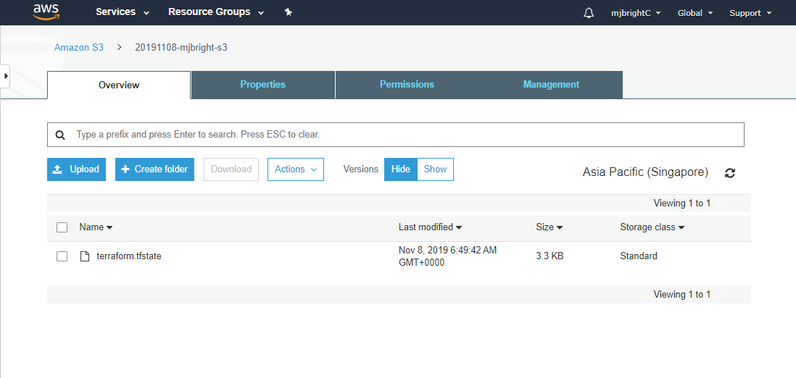
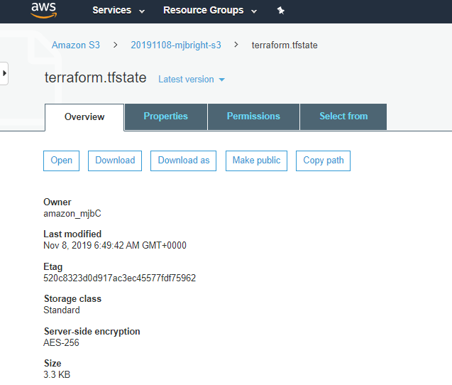
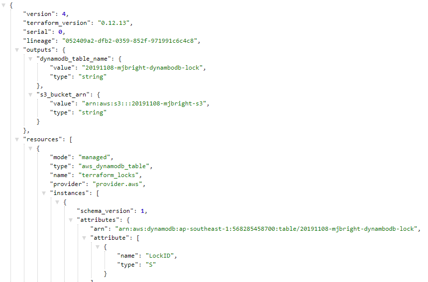

## Background:  
Here, we learn how to create S3 buckets for persistent storage and use DynamoDB to store our states in tables.  We do this so that we can store our tfstate files remotely, and securely and allow versioning control so that recovery and rollbacks can be achieved as required.  

See http://aws-cloud.guru/terraform-aws-backend-for-remote-state-files-with-s3-and-dynamodb/ for more details.

## Tasks:

### 1. Make a directory called ‘lab6’ underneath the labs directory.

### 2. Change into the directory.

### 3. Create a file main.tf

In that file define "*aws_s3_bucket*" and "*aws_dynamodb_table*" resources as below:

```tf
provider "aws" {
  region = var.region
}

resource "aws_s3_bucket" "remote_state" {
  bucket = var.unique_bucket_name
  acl    = "private"

  versioning {
    enabled = true
  }

  lifecycle { prevent_destroy = false }

  force_destroy = true # All objects to be deleted from bucket to allow bucket deletion without error
}

resource "aws_dynamodb_table" "terraform_locks" {
  name           = var.dynamodb_lock_table_name
  read_capacity  = 1
  write_capacity = 1
  hash_key       = "LockID" 

  attribute {
    name = "LockID"
    type = "S"
  }
}
```

**Note**: The table **must** have a primary key '*hash_key*' named '*LockID*'. If not present, locking will be disabled

Here we tie the state file to the dynamodb instance by creating a table in the database that uses the .tfstate file as its data source.

### 4. Create a file vars.tf - enter *your* unique values here

**Note**: I suggest you name the bucket including your student name e.g. 20201020-student21


```tf
variable region {
    default = "us-west-1"
}

variable unique_bucket_name {
    # e.g. default = "20201020-student21"
    default = "<your-unique-name-here>"
}

variable dynamodb_lock_table_name {
    default = "dynamodb-lock"
}
```

### 5. Create the S3 and DynamoDB Resources

We will now perform a terraform init and a terraform apply

**Note**: We do this before creating the backend definition file

**Note**: Alternatively we could have manually created the bucket via the AWS Console or using the cli (```sh aws s3 mb s3://20201020-student21``` )

**Note**: Alternatively, it is also possible to pass the variables directly to the init command as described here
https://www.terraform.io/docs/commands/init.html#backend-initialization

#### Initializing the workspace - *without the backend*

We first initalize the workspace.

```bash
terraform init
```

In case of errors you may wish to re-run init with trace logging:
```sh
TF_LOG=TRACE terraform init | tee terraform.init.log.1
```

#### Creating the resources

We can now create the resources

**Note**: At this stage the file *backend.tf* must not be present

```bash
terraform apply
```
#### Verifying the resources

Verify that your S3 bucket has been created:
```bash
aws s3 ls s3://20201020-student21
```

Verify that your DynamoDB table has been created:
```bash
aws dynamodb list-tables
```

### 5. Create a file backend.tf

Now that we have created the necessary resources we will
1. create a backend configuration
2. re-perform the init
3. verify the configuration

We will create a file backend.tf

This file will be used to make S3 - with DynamoDB locking - our remote_backend for storing state

Unfortunately we cannot use variables in this file as they will not be interpreted by "*terraform init*".

So you must enter the same bucket name in the content below:

```tf

terraform {
    backend "s3" {
        #key = path/to/my/key
        key = "terraform.tfstate"

        #region = var.region
        region = "us-west-1"

        # ENTRY MUST BE UPDATED !!
        # e.g. bucket = "20201020-student21"
        bucket = << YOUR BUCKET NAME >>

        #dynamodb_table = var.dynamodb_lock_table_name
        dynamodb_table = "dynamodb-lock"

        encrypt = true # Optional, S3 Bucket Server Side Encryption
     }
}

```
### 6. Initialize, preview and apply the complete configuration

### 6.1 Init
```bash
terraform init
```

#### In case of errors

In case of errors also use the TF_LOG trace option again:

```sh
TF_LOG=TRACE terraform init |& tee terraform.init.log.2
```

You can use the following command to verify that your dynamoDB table was created:
```sh
aws dynamodb list-tables
```
### 6.2 Verifying the state

If all went well you got no errors and you local terraform.tfstate file is now empty as state is written to the S3 bucket
```bash
-rw-rw-r--  1 user10 user10    0 Nov  8 06:49 terraform.tfstate
-rw-rw-r--  1 user10 user10 3338 Nov  8 06:49 terraform.tfstate.backup
```

### 7. Viewing the state in the S3 bucket

#### Accessing the state via the cli

```bash
aws s3 ls s3://20201020-student21
```
and you should see a terraform.tfstate file there

You can obtain a local copy to look at the file as follows:

```bash
aws s3 cp s3://20201020-student21/terraform.tfstate terraform.tfstate.localcopy
```

#### Accessing the state via the AWS Console

While you don't have AWS Console access, below capture shows the resource from the Console.

<!-- The S3 bucket:
 -->

#### The S3 bucket description:


#### The terraform.tfstate file in the S3 bucket:



### 8. The configuration when visualized should look like

<div>
    <object data="graph.svg" type="image/svg+xml">
    </object>
</div>


### 9. Removing the remote_backend

To undo these changes, move or remove the backend.tf file or change to another folder

Then perform "terraform init"

This should disable the "S3" remote_backend

<!-- TODO: !!
### 10. Cleanup
```bash
> terraform destroy
```
To destroy the formerly created AWS vpc, and all subnets.
-->

