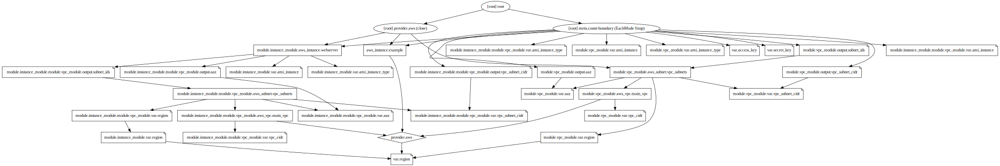

```bash

```

    2023-Jan-09:[TF-1.3.7] Lab updated on node tf[terraform 1.3.7]


<br/>

# Lab 7a - Creating Terraform Modules


<br/>

## Background:

Here, we learn how to create and use terraform modules. Modules are used to separate template groups into logical components. We will create and use a module in this exercise.

As you work through this lab, take the time to observe

- the file/directory hierarchy we are using
- the content of each .tf file
- the new *module* block type
- and the way we use *variables* to pass values to the modules
- and the way we use *outputs* to pass values from the modules back to the calling module (the *root module* in this example)


<br/>

## Tasks:
### 1. Make a directory called ‘lab7’ underneath the labs directory.
### 2. Change into the directory.
### 3. Make a directory called modules.
### 4. Change into the modules directory
### 5. Create two directories inside the modules directory
1. Create vpc sub-drectory
2. Create instances sub-drectory
### 6. Go back to the top level lab7 directory.
Create the following files: main.tf, vars.tf.

We commonly refer to this top-level configuration as the *root module*

The main.tf file should contain:


```bash
cat main.tf
```

    
    terraform {
        # Enforce Terraform version to be 1.3.x
        required_version = "~> 1.3"
    
        # Enforce AWS Provider version to be 4.x
    
        required_providers {
            aws = {
                source  = "hashicorp/aws"
                version = "~> 4.0"
            }
        }
    }
    
    provider "aws" {
        region = var.region
    }
    
    module "vpc_module" {
        source = "./modules/vpc"
        
        region = var.region
    }
    
    module "instance_module" {
        source = "./modules/instances"
        
        region = var.region
    }
    


```bash
cat > vars.tf <<EOF

variable "region" {
    default = "us-west-1"
}

EOF
```

The vars.tf file should contain:


```bash
cat vars.tf
```

    
    variable "region" {
        default = "us-west-1"
    }
    


### 7. Change to the modules/vpc directory.

Create the following files: main.tf vars.tf output.tf

The main.tf file should contain:


```bash
cat main.tf
```

    
    resource "aws_vpc" "main_vpc" {
        cidr_block       = var.vpc_cidr
        instance_tenancy = "default"
    
        tags = {
            Name = "Main"
            Location = "London"
        }
    }
    
    resource "aws_subnet" "vpc_subnets" {
        count      = length(var.vpc_subnet_cidr)
    
        vpc_id     = aws_vpc.main_vpc.id
        cidr_block = element( var.vpc_subnet_cidr,count.index)
    
        # NOW using a data source to get availability_zones:
        # availability_zone=element( var.aaz[ var.region],                  count.index)
        availability_zone = element( data.aws_availability_zones.aaz.names, count.index)
    
        tags = {
            Name = "subnet-${count.index+1}"
        }
    }
    
    


The vars.tf file should contain:


```bash
cat vars.tf
```

    
    variable "region" {}
    
    data "aws_availability_zones" "aaz" {}
    
    variable "vpc_cidr" {
        default = "192.168.0.0/16"
    }
    
    variable "vpc_subnet_cidr" {
        type = list
        default = ["192.168.100.0/24","192.168.101.0/24","192.168.102.0/24"]
    }
    
    variable "ami_instance" {
        type = map
        default = {
            "us-east-1" = "ami-0ac019f4fcb7cb7e6"
            "us-east-2" = "ami-0f65671a86f061fcd"
            "us-west-1" = "ami-063aa838bd7631e0b"
            "eu-west-3" = "ami-0df03c7641cf41947"
        }
    }
    
    variable "ami_instance_type" {
        default = "t2.micro"
    }
    


#### Outputs

**Note**: In the case of a module the variable definitions are used to define what values the "*calling module*" can pass values to this *vpc module* as arguments.

The outputs.tf file should contain:


```bash
cat outputs.tf
```

    
    output "aaz"             { value = aws_subnet.vpc_subnets.*.availability_zone }
    output "vpc_subnet_cidr" { value = var.vpc_subnet_cidr }
    output "subnet_ids"      { value = aws_subnet.vpc_subnets.*.id }
    


**Note**: In the case of a module the outputs are not just used for showing information, they are the only way that the "*calling module*" can receive values back from this *vpc module*

### 8. Change to the modules/instances directory.


```bash
cd ~/labs/lab7a/modules/instances
```

### 9. Create the following files: main.tf vars.tf


```bash
cat >main.tf <<EOF

module "vpc_module" {
    source = "../vpc"
    
    region = var.region
}

resource "aws_instance" "webserver" {
    count         = length(module.vpc_module.aaz)

    ami           = lookup(  var.ami_instance,var.region )
    subnet_id     = element( module.vpc_module.subnet_ids, count.index )
    instance_type = var.ami_instance_type
}

EOF
```

The main.tf file should contain:


```bash
cat main.tf
```

    
    module "vpc_module" {
        source = "../vpc"
        
        region = var.region
    }
    
    resource "aws_instance" "webserver" {
        count         = length(module.vpc_module.aaz)
    
        ami           = lookup(  var.ami_instance,var.region )
        subnet_id     = element( module.vpc_module.subnet_ids, count.index )
        instance_type = var.ami_instance_type
    }
    


**Note**: In the above that it is possible to call another module - this ```instances``` module calls the ```vpc``` module

**Note**: In the above we specify input variable **region** to the *vpc_module*, sourced from the current module's **var.region**

**Note**: In the above we reference output variables of the vpc_module, by accessing

* **module.vpc_module.subnet_ids** and

* **module.vpc_module.aaz**.

The vars.tf file should contain:


```bash
cat vars.tf 
```

    
    variable "region" {}
    
    variable "ami_instance" {
        type = map
        default = {
            "us-east-1" = "ami-0ac019f4fcb7cb7e6"
            "us-east-2" = "ami-0f65671a86f061fcd"
            "us-west-1" = "ami-063aa838bd7631e0b"
        }
    }
    
    variable "ami_instance_type" {
        default = "t2.micro"
    }
    


### 10. Change to the main directory for this lab.


```bash
cd ~/labs/lab7a
```

### 11. Initialize the configuration


```bash
terraform init 
```

    Initializing modules...
    - instance_module in modules/instances
    - instance_module.vpc_module in modules/vpc
    - vpc_module in modules/vpc
    
    Initializing the backend...
    
    Initializing provider plugins...
    - Finding hashicorp/aws versions matching "~> 4.0"...
    - Installing hashicorp/aws v4.49.0...
    - Installed hashicorp/aws v4.49.0 (signed by HashiCorp)
    
    Terraform has created a lock file .terraform.lock.hcl to record the provider
    selections it made above. Include this file in your version control repository
    so that Terraform can guarantee to make the same selections by default when
    you run "terraform init" in the future.
    
    Terraform has been successfully initialized!
    
    You may now begin working with Terraform. Try running "terraform plan" to see
    any changes that are required for your infrastructure. All Terraform commands
    should now work.
    
    If you ever set or change modules or backend configuration for Terraform,
    rerun this command to reinitialize your working directory. If you forget, other
    commands will detect it and remind you to do so if necessary.


### 12.  Preview the configuration


```bash
terraform plan 
```

    module.instance_module.module.vpc_module.data.aws_availability_zones.aaz: Reading...
    module.vpc_module.data.aws_availability_zones.aaz: Reading...
    module.vpc_module.data.aws_availability_zones.aaz: Read complete after 1s [id=us-west-1]
    module.instance_module.module.vpc_module.data.aws_availability_zones.aaz: Read complete after 1s [id=us-west-1]
    
    Terraform used the selected providers to generate the following execution plan.
    Resource actions are indicated with the following symbols:
      + create
    
    Terraform will perform the following actions:
    
      # module.instance_module.aws_instance.webserver[0] will be created
      + resource "aws_instance" "webserver" {
          + ami                                  = "ami-063aa838bd7631e0b"
          + arn                                  = (known after apply)
          + associate_public_ip_address          = (known after apply)
          + availability_zone                    = (known after apply)
          + cpu_core_count                       = (known after apply)
          + cpu_threads_per_core                 = (known after apply)
          + disable_api_stop                     = (known after apply)
          + disable_api_termination              = (known after apply)
          + ebs_optimized                        = (known after apply)
          + get_password_data                    = false
          + host_id                              = (known after apply)
          + host_resource_group_arn              = (known after apply)
          + iam_instance_profile                 = (known after apply)
          + id                                   = (known after apply)
          + instance_initiated_shutdown_behavior = (known after apply)
          + instance_state                       = (known after apply)
          + instance_type                        = "t2.micro"
          + ipv6_address_count                   = (known after apply)
          + ipv6_addresses                       = (known after apply)
          + key_name                             = (known after apply)
          + monitoring                           = (known after apply)
          + outpost_arn                          = (known after apply)
          + password_data                        = (known after apply)
          + placement_group                      = (known after apply)
          + placement_partition_number           = (known after apply)
          + primary_network_interface_id         = (known after apply)
          + private_dns                          = (known after apply)
          + private_ip                           = (known after apply)
          + public_dns                           = (known after apply)
          + public_ip                            = (known after apply)
          + secondary_private_ips                = (known after apply)
          + security_groups                      = (known after apply)
          + source_dest_check                    = true
          + subnet_id                            = (known after apply)
          + tags_all                             = (known after apply)
          + tenancy                              = (known after apply)
          + user_data                            = (known after apply)
          + user_data_base64                     = (known after apply)
          + user_data_replace_on_change          = false
          + vpc_security_group_ids               = (known after apply)
    
          + capacity_reservation_specification {
              + capacity_reservation_preference = (known after apply)
    
              + capacity_reservation_target {
                  + capacity_reservation_id                 = (known after apply)
                  + capacity_reservation_resource_group_arn = (known after apply)
                }
            }
    
          + ebs_block_device {
              + delete_on_termination = (known after apply)
              + device_name           = (known after apply)
              + encrypted             = (known after apply)
              + iops                  = (known after apply)
              + kms_key_id            = (known after apply)
              + snapshot_id           = (known after apply)
              + tags                  = (known after apply)
              + throughput            = (known after apply)
              + volume_id             = (known after apply)
              + volume_size           = (known after apply)
              + volume_type           = (known after apply)
            }
    
          + enclave_options {
              + enabled = (known after apply)
            }
    
          + ephemeral_block_device {
              + device_name  = (known after apply)
              + no_device    = (known after apply)
              + virtual_name = (known after apply)
            }
    
          + maintenance_options {
              + auto_recovery = (known after apply)
            }
    
          + metadata_options {
              + http_endpoint               = (known after apply)
              + http_put_response_hop_limit = (known after apply)
              + http_tokens                 = (known after apply)
              + instance_metadata_tags      = (known after apply)
            }
    
          + network_interface {
              + delete_on_termination = (known after apply)
              + device_index          = (known after apply)
              + network_card_index    = (known after apply)
              + network_interface_id  = (known after apply)
            }
    
          + private_dns_name_options {
              + enable_resource_name_dns_a_record    = (known after apply)
              + enable_resource_name_dns_aaaa_record = (known after apply)
              + hostname_type                        = (known after apply)
            }
    
          + root_block_device {
              + delete_on_termination = (known after apply)
              + device_name           = (known after apply)
              + encrypted             = (known after apply)
              + iops                  = (known after apply)
              + kms_key_id            = (known after apply)
              + tags                  = (known after apply)
              + throughput            = (known after apply)
              + volume_id             = (known after apply)
              + volume_size           = (known after apply)
              + volume_type           = (known after apply)
            }
        }
    
      # module.instance_module.aws_instance.webserver[1] will be created
      + resource "aws_instance" "webserver" {
          + ami                                  = "ami-063aa838bd7631e0b"
          + arn                                  = (known after apply)
          + associate_public_ip_address          = (known after apply)
          + availability_zone                    = (known after apply)
          + cpu_core_count                       = (known after apply)
          + cpu_threads_per_core                 = (known after apply)
          + disable_api_stop                     = (known after apply)
          + disable_api_termination              = (known after apply)
          + ebs_optimized                        = (known after apply)
          + get_password_data                    = false
          + host_id                              = (known after apply)
          + host_resource_group_arn              = (known after apply)
          + iam_instance_profile                 = (known after apply)
          + id                                   = (known after apply)
          + instance_initiated_shutdown_behavior = (known after apply)
          + instance_state                       = (known after apply)
          + instance_type                        = "t2.micro"
          + ipv6_address_count                   = (known after apply)
          + ipv6_addresses                       = (known after apply)
          + key_name                             = (known after apply)
          + monitoring                           = (known after apply)
          + outpost_arn                          = (known after apply)
          + password_data                        = (known after apply)
          + placement_group                      = (known after apply)
          + placement_partition_number           = (known after apply)
          + primary_network_interface_id         = (known after apply)
          + private_dns                          = (known after apply)
          + private_ip                           = (known after apply)
          + public_dns                           = (known after apply)
          + public_ip                            = (known after apply)
          + secondary_private_ips                = (known after apply)
          + security_groups                      = (known after apply)
          + source_dest_check                    = true
          + subnet_id                            = (known after apply)
          + tags_all                             = (known after apply)
          + tenancy                              = (known after apply)
          + user_data                            = (known after apply)
          + user_data_base64                     = (known after apply)
          + user_data_replace_on_change          = false
          + vpc_security_group_ids               = (known after apply)
    
          + capacity_reservation_specification {
              + capacity_reservation_preference = (known after apply)
    
              + capacity_reservation_target {
                  + capacity_reservation_id                 = (known after apply)
                  + capacity_reservation_resource_group_arn = (known after apply)
                }
            }
    
          + ebs_block_device {
              + delete_on_termination = (known after apply)
              + device_name           = (known after apply)
              + encrypted             = (known after apply)
              + iops                  = (known after apply)
              + kms_key_id            = (known after apply)
              + snapshot_id           = (known after apply)
              + tags                  = (known after apply)
              + throughput            = (known after apply)
              + volume_id             = (known after apply)
              + volume_size           = (known after apply)
              + volume_type           = (known after apply)
            }
    
          + enclave_options {
              + enabled = (known after apply)
            }
    
          + ephemeral_block_device {
              + device_name  = (known after apply)
              + no_device    = (known after apply)
              + virtual_name = (known after apply)
            }
    
          + maintenance_options {
              + auto_recovery = (known after apply)
            }
    
          + metadata_options {
              + http_endpoint               = (known after apply)
              + http_put_response_hop_limit = (known after apply)
              + http_tokens                 = (known after apply)
              + instance_metadata_tags      = (known after apply)
            }
    
          + network_interface {
              + delete_on_termination = (known after apply)
              + device_index          = (known after apply)
              + network_card_index    = (known after apply)
              + network_interface_id  = (known after apply)
            }
    
          + private_dns_name_options {
              + enable_resource_name_dns_a_record    = (known after apply)
              + enable_resource_name_dns_aaaa_record = (known after apply)
              + hostname_type                        = (known after apply)
            }
    
          + root_block_device {
              + delete_on_termination = (known after apply)
              + device_name           = (known after apply)
              + encrypted             = (known after apply)
              + iops                  = (known after apply)
              + kms_key_id            = (known after apply)
              + tags                  = (known after apply)
              + throughput            = (known after apply)
              + volume_id             = (known after apply)
              + volume_size           = (known after apply)
              + volume_type           = (known after apply)
            }
        }
    
      # module.instance_module.aws_instance.webserver[2] will be created
      + resource "aws_instance" "webserver" {
          + ami                                  = "ami-063aa838bd7631e0b"
          + arn                                  = (known after apply)
          + associate_public_ip_address          = (known after apply)
          + availability_zone                    = (known after apply)
          + cpu_core_count                       = (known after apply)
          + cpu_threads_per_core                 = (known after apply)
          + disable_api_stop                     = (known after apply)
          + disable_api_termination              = (known after apply)
          + ebs_optimized                        = (known after apply)
          + get_password_data                    = false
          + host_id                              = (known after apply)
          + host_resource_group_arn              = (known after apply)
          + iam_instance_profile                 = (known after apply)
          + id                                   = (known after apply)
          + instance_initiated_shutdown_behavior = (known after apply)
          + instance_state                       = (known after apply)
          + instance_type                        = "t2.micro"
          + ipv6_address_count                   = (known after apply)
          + ipv6_addresses                       = (known after apply)
          + key_name                             = (known after apply)
          + monitoring                           = (known after apply)
          + outpost_arn                          = (known after apply)
          + password_data                        = (known after apply)
          + placement_group                      = (known after apply)
          + placement_partition_number           = (known after apply)
          + primary_network_interface_id         = (known after apply)
          + private_dns                          = (known after apply)
          + private_ip                           = (known after apply)
          + public_dns                           = (known after apply)
          + public_ip                            = (known after apply)
          + secondary_private_ips                = (known after apply)
          + security_groups                      = (known after apply)
          + source_dest_check                    = true
          + subnet_id                            = (known after apply)
          + tags_all                             = (known after apply)
          + tenancy                              = (known after apply)
          + user_data                            = (known after apply)
          + user_data_base64                     = (known after apply)
          + user_data_replace_on_change          = false
          + vpc_security_group_ids               = (known after apply)
    
          + capacity_reservation_specification {
              + capacity_reservation_preference = (known after apply)
    
              + capacity_reservation_target {
                  + capacity_reservation_id                 = (known after apply)
                  + capacity_reservation_resource_group_arn = (known after apply)
                }
            }
    
          + ebs_block_device {
              + delete_on_termination = (known after apply)
              + device_name           = (known after apply)
              + encrypted             = (known after apply)
              + iops                  = (known after apply)
              + kms_key_id            = (known after apply)
              + snapshot_id           = (known after apply)
              + tags                  = (known after apply)
              + throughput            = (known after apply)
              + volume_id             = (known after apply)
              + volume_size           = (known after apply)
              + volume_type           = (known after apply)
            }
    
          + enclave_options {
              + enabled = (known after apply)
            }
    
          + ephemeral_block_device {
              + device_name  = (known after apply)
              + no_device    = (known after apply)
              + virtual_name = (known after apply)
            }
    
          + maintenance_options {
              + auto_recovery = (known after apply)
            }
    
          + metadata_options {
              + http_endpoint               = (known after apply)
              + http_put_response_hop_limit = (known after apply)
              + http_tokens                 = (known after apply)
              + instance_metadata_tags      = (known after apply)
            }
    
          + network_interface {
              + delete_on_termination = (known after apply)
              + device_index          = (known after apply)
              + network_card_index    = (known after apply)
              + network_interface_id  = (known after apply)
            }
    
          + private_dns_name_options {
              + enable_resource_name_dns_a_record    = (known after apply)
              + enable_resource_name_dns_aaaa_record = (known after apply)
              + hostname_type                        = (known after apply)
            }
    
          + root_block_device {
              + delete_on_termination = (known after apply)
              + device_name           = (known after apply)
              + encrypted             = (known after apply)
              + iops                  = (known after apply)
              + kms_key_id            = (known after apply)
              + tags                  = (known after apply)
              + throughput            = (known after apply)
              + volume_id             = (known after apply)
              + volume_size           = (known after apply)
              + volume_type           = (known after apply)
            }
        }
    
      # module.vpc_module.aws_subnet.vpc_subnets[0] will be created
      + resource "aws_subnet" "vpc_subnets" {
          + arn                                            = (known after apply)
          + assign_ipv6_address_on_creation                = false
          + availability_zone                              = "us-west-1b"
          + availability_zone_id                           = (known after apply)
          + cidr_block                                     = "192.168.100.0/24"
          + enable_dns64                                   = false
          + enable_resource_name_dns_a_record_on_launch    = false
          + enable_resource_name_dns_aaaa_record_on_launch = false
          + id                                             = (known after apply)
          + ipv6_cidr_block_association_id                 = (known after apply)
          + ipv6_native                                    = false
          + map_public_ip_on_launch                        = false
          + owner_id                                       = (known after apply)
          + private_dns_hostname_type_on_launch            = (known after apply)
          + tags                                           = {
              + "Name" = "subnet-1"
            }
          + tags_all                                       = {
              + "Name" = "subnet-1"
            }
          + vpc_id                                         = (known after apply)
        }
    
      # module.vpc_module.aws_subnet.vpc_subnets[1] will be created
      + resource "aws_subnet" "vpc_subnets" {
          + arn                                            = (known after apply)
          + assign_ipv6_address_on_creation                = false
          + availability_zone                              = "us-west-1c"
          + availability_zone_id                           = (known after apply)
          + cidr_block                                     = "192.168.101.0/24"
          + enable_dns64                                   = false
          + enable_resource_name_dns_a_record_on_launch    = false
          + enable_resource_name_dns_aaaa_record_on_launch = false
          + id                                             = (known after apply)
          + ipv6_cidr_block_association_id                 = (known after apply)
          + ipv6_native                                    = false
          + map_public_ip_on_launch                        = false
          + owner_id                                       = (known after apply)
          + private_dns_hostname_type_on_launch            = (known after apply)
          + tags                                           = {
              + "Name" = "subnet-2"
            }
          + tags_all                                       = {
              + "Name" = "subnet-2"
            }
          + vpc_id                                         = (known after apply)
        }
    
      # module.vpc_module.aws_subnet.vpc_subnets[2] will be created
      + resource "aws_subnet" "vpc_subnets" {
          + arn                                            = (known after apply)
          + assign_ipv6_address_on_creation                = false
          + availability_zone                              = "us-west-1b"
          + availability_zone_id                           = (known after apply)
          + cidr_block                                     = "192.168.102.0/24"
          + enable_dns64                                   = false
          + enable_resource_name_dns_a_record_on_launch    = false
          + enable_resource_name_dns_aaaa_record_on_launch = false
          + id                                             = (known after apply)
          + ipv6_cidr_block_association_id                 = (known after apply)
          + ipv6_native                                    = false
          + map_public_ip_on_launch                        = false
          + owner_id                                       = (known after apply)
          + private_dns_hostname_type_on_launch            = (known after apply)
          + tags                                           = {
              + "Name" = "subnet-3"
            }
          + tags_all                                       = {
              + "Name" = "subnet-3"
            }
          + vpc_id                                         = (known after apply)
        }
    
      # module.vpc_module.aws_vpc.main_vpc will be created
      + resource "aws_vpc" "main_vpc" {
          + arn                                  = (known after apply)
          + cidr_block                           = "192.168.0.0/16"
          + default_network_acl_id               = (known after apply)
          + default_route_table_id               = (known after apply)
          + default_security_group_id            = (known after apply)
          + dhcp_options_id                      = (known after apply)
          + enable_classiclink                   = (known after apply)
          + enable_classiclink_dns_support       = (known after apply)
          + enable_dns_hostnames                 = (known after apply)
          + enable_dns_support                   = true
          + enable_network_address_usage_metrics = (known after apply)
          + id                                   = (known after apply)
          + instance_tenancy                     = "default"
          + ipv6_association_id                  = (known after apply)
          + ipv6_cidr_block                      = (known after apply)
          + ipv6_cidr_block_network_border_group = (known after apply)
          + main_route_table_id                  = (known after apply)
          + owner_id                             = (known after apply)
          + tags                                 = {
              + "Location" = "London"
              + "Name"     = "Main"
            }
          + tags_all                             = {
              + "Location" = "London"
              + "Name"     = "Main"
            }
        }
    
      # module.instance_module.module.vpc_module.aws_subnet.vpc_subnets[0] will be created
      + resource "aws_subnet" "vpc_subnets" {
          + arn                                            = (known after apply)
          + assign_ipv6_address_on_creation                = false
          + availability_zone                              = "us-west-1b"
          + availability_zone_id                           = (known after apply)
          + cidr_block                                     = "192.168.100.0/24"
          + enable_dns64                                   = false
          + enable_resource_name_dns_a_record_on_launch    = false
          + enable_resource_name_dns_aaaa_record_on_launch = false
          + id                                             = (known after apply)
          + ipv6_cidr_block_association_id                 = (known after apply)
          + ipv6_native                                    = false
          + map_public_ip_on_launch                        = false
          + owner_id                                       = (known after apply)
          + private_dns_hostname_type_on_launch            = (known after apply)
          + tags                                           = {
              + "Name" = "subnet-1"
            }
          + tags_all                                       = {
              + "Name" = "subnet-1"
            }
          + vpc_id                                         = (known after apply)
        }
    
      # module.instance_module.module.vpc_module.aws_subnet.vpc_subnets[1] will be created
      + resource "aws_subnet" "vpc_subnets" {
          + arn                                            = (known after apply)
          + assign_ipv6_address_on_creation                = false
          + availability_zone                              = "us-west-1c"
          + availability_zone_id                           = (known after apply)
          + cidr_block                                     = "192.168.101.0/24"
          + enable_dns64                                   = false
          + enable_resource_name_dns_a_record_on_launch    = false
          + enable_resource_name_dns_aaaa_record_on_launch = false
          + id                                             = (known after apply)
          + ipv6_cidr_block_association_id                 = (known after apply)
          + ipv6_native                                    = false
          + map_public_ip_on_launch                        = false
          + owner_id                                       = (known after apply)
          + private_dns_hostname_type_on_launch            = (known after apply)
          + tags                                           = {
              + "Name" = "subnet-2"
            }
          + tags_all                                       = {
              + "Name" = "subnet-2"
            }
          + vpc_id                                         = (known after apply)
        }
    
      # module.instance_module.module.vpc_module.aws_subnet.vpc_subnets[2] will be created
      + resource "aws_subnet" "vpc_subnets" {
          + arn                                            = (known after apply)
          + assign_ipv6_address_on_creation                = false
          + availability_zone                              = "us-west-1b"
          + availability_zone_id                           = (known after apply)
          + cidr_block                                     = "192.168.102.0/24"
          + enable_dns64                                   = false
          + enable_resource_name_dns_a_record_on_launch    = false
          + enable_resource_name_dns_aaaa_record_on_launch = false
          + id                                             = (known after apply)
          + ipv6_cidr_block_association_id                 = (known after apply)
          + ipv6_native                                    = false
          + map_public_ip_on_launch                        = false
          + owner_id                                       = (known after apply)
          + private_dns_hostname_type_on_launch            = (known after apply)
          + tags                                           = {
              + "Name" = "subnet-3"
            }
          + tags_all                                       = {
              + "Name" = "subnet-3"
            }
          + vpc_id                                         = (known after apply)
        }
    
      # module.instance_module.module.vpc_module.aws_vpc.main_vpc will be created
      + resource "aws_vpc" "main_vpc" {
          + arn                                  = (known after apply)
          + cidr_block                           = "192.168.0.0/16"
          + default_network_acl_id               = (known after apply)
          + default_route_table_id               = (known after apply)
          + default_security_group_id            = (known after apply)
          + dhcp_options_id                      = (known after apply)
          + enable_classiclink                   = (known after apply)
          + enable_classiclink_dns_support       = (known after apply)
          + enable_dns_hostnames                 = (known after apply)
          + enable_dns_support                   = true
          + enable_network_address_usage_metrics = (known after apply)
          + id                                   = (known after apply)
          + instance_tenancy                     = "default"
          + ipv6_association_id                  = (known after apply)
          + ipv6_cidr_block                      = (known after apply)
          + ipv6_cidr_block_network_border_group = (known after apply)
          + main_route_table_id                  = (known after apply)
          + owner_id                             = (known after apply)
          + tags                                 = {
              + "Location" = "London"
              + "Name"     = "Main"
            }
          + tags_all                             = {
              + "Location" = "London"
              + "Name"     = "Main"
            }
        }
    
    Plan: 11 to add, 0 to change, 0 to destroy.
    
    ───────────────────────────────────────────────────────────────────────────────
    
    Note: You didn't use the -out option to save this plan, so Terraform can't
    guarantee to take exactly these actions if you run "terraform apply" now.


### 14. Apply the configuration

Now apply the configuration


```bash
terraform apply 
```

    module.instance_module.module.vpc_module.data.aws_availability_zones.aaz: Reading...
    module.vpc_module.data.aws_availability_zones.aaz: Reading...
    module.vpc_module.data.aws_availability_zones.aaz: Read complete after 1s [id=us-west-1]
    module.instance_module.module.vpc_module.data.aws_availability_zones.aaz: Read complete after 1s [id=us-west-1]
    
    Terraform used the selected providers to generate the following execution plan.
    Resource actions are indicated with the following symbols:
      + create
    
    Terraform will perform the following actions:
    
      # module.instance_module.aws_instance.webserver[0] will be created
      + resource "aws_instance" "webserver" {
          + ami                                  = "ami-063aa838bd7631e0b"
          + arn                                  = (known after apply)
          + associate_public_ip_address          = (known after apply)
          + availability_zone                    = (known after apply)
          + cpu_core_count                       = (known after apply)
          + cpu_threads_per_core                 = (known after apply)
          + disable_api_stop                     = (known after apply)
          + disable_api_termination              = (known after apply)
          + ebs_optimized                        = (known after apply)
          + get_password_data                    = false
          + host_id                              = (known after apply)
          + host_resource_group_arn              = (known after apply)
          + iam_instance_profile                 = (known after apply)
          + id                                   = (known after apply)
          + instance_initiated_shutdown_behavior = (known after apply)
          + instance_state                       = (known after apply)
          + instance_type                        = "t2.micro"
          + ipv6_address_count                   = (known after apply)
          + ipv6_addresses                       = (known after apply)
          + key_name                             = (known after apply)
          + monitoring                           = (known after apply)
          + outpost_arn                          = (known after apply)
          + password_data                        = (known after apply)
          + placement_group                      = (known after apply)
          + placement_partition_number           = (known after apply)
          + primary_network_interface_id         = (known after apply)
          + private_dns                          = (known after apply)
          + private_ip                           = (known after apply)
          + public_dns                           = (known after apply)
          + public_ip                            = (known after apply)
          + secondary_private_ips                = (known after apply)
          + security_groups                      = (known after apply)
          + source_dest_check                    = true
          + subnet_id                            = (known after apply)
          + tags_all                             = (known after apply)
          + tenancy                              = (known after apply)
          + user_data                            = (known after apply)
          + user_data_base64                     = (known after apply)
          + user_data_replace_on_change          = false
          + vpc_security_group_ids               = (known after apply)
    
          + capacity_reservation_specification {
              + capacity_reservation_preference = (known after apply)
    
              + capacity_reservation_target {
                  + capacity_reservation_id                 = (known after apply)
                  + capacity_reservation_resource_group_arn = (known after apply)
                }
            }
    
          + ebs_block_device {
              + delete_on_termination = (known after apply)
              + device_name           = (known after apply)
              + encrypted             = (known after apply)
              + iops                  = (known after apply)
              + kms_key_id            = (known after apply)
              + snapshot_id           = (known after apply)
              + tags                  = (known after apply)
              + throughput            = (known after apply)
              + volume_id             = (known after apply)
              + volume_size           = (known after apply)
              + volume_type           = (known after apply)
            }
    
          + enclave_options {
              + enabled = (known after apply)
            }
    
          + ephemeral_block_device {
              + device_name  = (known after apply)
              + no_device    = (known after apply)
              + virtual_name = (known after apply)
            }
    
          + maintenance_options {
              + auto_recovery = (known after apply)
            }
    
          + metadata_options {
              + http_endpoint               = (known after apply)
              + http_put_response_hop_limit = (known after apply)
              + http_tokens                 = (known after apply)
              + instance_metadata_tags      = (known after apply)
            }
    
          + network_interface {
              + delete_on_termination = (known after apply)
              + device_index          = (known after apply)
              + network_card_index    = (known after apply)
              + network_interface_id  = (known after apply)
            }
    
          + private_dns_name_options {
              + enable_resource_name_dns_a_record    = (known after apply)
              + enable_resource_name_dns_aaaa_record = (known after apply)
              + hostname_type                        = (known after apply)
            }
    
          + root_block_device {
              + delete_on_termination = (known after apply)
              + device_name           = (known after apply)
              + encrypted             = (known after apply)
              + iops                  = (known after apply)
              + kms_key_id            = (known after apply)
              + tags                  = (known after apply)
              + throughput            = (known after apply)
              + volume_id             = (known after apply)
              + volume_size           = (known after apply)
              + volume_type           = (known after apply)
            }
        }
    
      # module.instance_module.aws_instance.webserver[1] will be created
      + resource "aws_instance" "webserver" {
          + ami                                  = "ami-063aa838bd7631e0b"
          + arn                                  = (known after apply)
          + associate_public_ip_address          = (known after apply)
          + availability_zone                    = (known after apply)
          + cpu_core_count                       = (known after apply)
          + cpu_threads_per_core                 = (known after apply)
          + disable_api_stop                     = (known after apply)
          + disable_api_termination              = (known after apply)
          + ebs_optimized                        = (known after apply)
          + get_password_data                    = false
          + host_id                              = (known after apply)
          + host_resource_group_arn              = (known after apply)
          + iam_instance_profile                 = (known after apply)
          + id                                   = (known after apply)
          + instance_initiated_shutdown_behavior = (known after apply)
          + instance_state                       = (known after apply)
          + instance_type                        = "t2.micro"
          + ipv6_address_count                   = (known after apply)
          + ipv6_addresses                       = (known after apply)
          + key_name                             = (known after apply)
          + monitoring                           = (known after apply)
          + outpost_arn                          = (known after apply)
          + password_data                        = (known after apply)
          + placement_group                      = (known after apply)
          + placement_partition_number           = (known after apply)
          + primary_network_interface_id         = (known after apply)
          + private_dns                          = (known after apply)
          + private_ip                           = (known after apply)
          + public_dns                           = (known after apply)
          + public_ip                            = (known after apply)
          + secondary_private_ips                = (known after apply)
          + security_groups                      = (known after apply)
          + source_dest_check                    = true
          + subnet_id                            = (known after apply)
          + tags_all                             = (known after apply)
          + tenancy                              = (known after apply)
          + user_data                            = (known after apply)
          + user_data_base64                     = (known after apply)
          + user_data_replace_on_change          = false
          + vpc_security_group_ids               = (known after apply)
    
          + capacity_reservation_specification {
              + capacity_reservation_preference = (known after apply)
    
              + capacity_reservation_target {
                  + capacity_reservation_id                 = (known after apply)
                  + capacity_reservation_resource_group_arn = (known after apply)
                }
            }
    
          + ebs_block_device {
              + delete_on_termination = (known after apply)
              + device_name           = (known after apply)
              + encrypted             = (known after apply)
              + iops                  = (known after apply)
              + kms_key_id            = (known after apply)
              + snapshot_id           = (known after apply)
              + tags                  = (known after apply)
              + throughput            = (known after apply)
              + volume_id             = (known after apply)
              + volume_size           = (known after apply)
              + volume_type           = (known after apply)
            }
    
          + enclave_options {
              + enabled = (known after apply)
            }
    
          + ephemeral_block_device {
              + device_name  = (known after apply)
              + no_device    = (known after apply)
              + virtual_name = (known after apply)
            }
    
          + maintenance_options {
              + auto_recovery = (known after apply)
            }
    
          + metadata_options {
              + http_endpoint               = (known after apply)
              + http_put_response_hop_limit = (known after apply)
              + http_tokens                 = (known after apply)
              + instance_metadata_tags      = (known after apply)
            }
    
          + network_interface {
              + delete_on_termination = (known after apply)
              + device_index          = (known after apply)
              + network_card_index    = (known after apply)
              + network_interface_id  = (known after apply)
            }
    
          + private_dns_name_options {
              + enable_resource_name_dns_a_record    = (known after apply)
              + enable_resource_name_dns_aaaa_record = (known after apply)
              + hostname_type                        = (known after apply)
            }
    
          + root_block_device {
              + delete_on_termination = (known after apply)
              + device_name           = (known after apply)
              + encrypted             = (known after apply)
              + iops                  = (known after apply)
              + kms_key_id            = (known after apply)
              + tags                  = (known after apply)
              + throughput            = (known after apply)
              + volume_id             = (known after apply)
              + volume_size           = (known after apply)
              + volume_type           = (known after apply)
            }
        }
    
      # module.instance_module.aws_instance.webserver[2] will be created
      + resource "aws_instance" "webserver" {
          + ami                                  = "ami-063aa838bd7631e0b"
          + arn                                  = (known after apply)
          + associate_public_ip_address          = (known after apply)
          + availability_zone                    = (known after apply)
          + cpu_core_count                       = (known after apply)
          + cpu_threads_per_core                 = (known after apply)
          + disable_api_stop                     = (known after apply)
          + disable_api_termination              = (known after apply)
          + ebs_optimized                        = (known after apply)
          + get_password_data                    = false
          + host_id                              = (known after apply)
          + host_resource_group_arn              = (known after apply)
          + iam_instance_profile                 = (known after apply)
          + id                                   = (known after apply)
          + instance_initiated_shutdown_behavior = (known after apply)
          + instance_state                       = (known after apply)
          + instance_type                        = "t2.micro"
          + ipv6_address_count                   = (known after apply)
          + ipv6_addresses                       = (known after apply)
          + key_name                             = (known after apply)
          + monitoring                           = (known after apply)
          + outpost_arn                          = (known after apply)
          + password_data                        = (known after apply)
          + placement_group                      = (known after apply)
          + placement_partition_number           = (known after apply)
          + primary_network_interface_id         = (known after apply)
          + private_dns                          = (known after apply)
          + private_ip                           = (known after apply)
          + public_dns                           = (known after apply)
          + public_ip                            = (known after apply)
          + secondary_private_ips                = (known after apply)
          + security_groups                      = (known after apply)
          + source_dest_check                    = true
          + subnet_id                            = (known after apply)
          + tags_all                             = (known after apply)
          + tenancy                              = (known after apply)
          + user_data                            = (known after apply)
          + user_data_base64                     = (known after apply)
          + user_data_replace_on_change          = false
          + vpc_security_group_ids               = (known after apply)
    
          + capacity_reservation_specification {
              + capacity_reservation_preference = (known after apply)
    
              + capacity_reservation_target {
                  + capacity_reservation_id                 = (known after apply)
                  + capacity_reservation_resource_group_arn = (known after apply)
                }
            }
    
          + ebs_block_device {
              + delete_on_termination = (known after apply)
              + device_name           = (known after apply)
              + encrypted             = (known after apply)
              + iops                  = (known after apply)
              + kms_key_id            = (known after apply)
              + snapshot_id           = (known after apply)
              + tags                  = (known after apply)
              + throughput            = (known after apply)
              + volume_id             = (known after apply)
              + volume_size           = (known after apply)
              + volume_type           = (known after apply)
            }
    
          + enclave_options {
              + enabled = (known after apply)
            }
    
          + ephemeral_block_device {
              + device_name  = (known after apply)
              + no_device    = (known after apply)
              + virtual_name = (known after apply)
            }
    
          + maintenance_options {
              + auto_recovery = (known after apply)
            }
    
          + metadata_options {
              + http_endpoint               = (known after apply)
              + http_put_response_hop_limit = (known after apply)
              + http_tokens                 = (known after apply)
              + instance_metadata_tags      = (known after apply)
            }
    
          + network_interface {
              + delete_on_termination = (known after apply)
              + device_index          = (known after apply)
              + network_card_index    = (known after apply)
              + network_interface_id  = (known after apply)
            }
    
          + private_dns_name_options {
              + enable_resource_name_dns_a_record    = (known after apply)
              + enable_resource_name_dns_aaaa_record = (known after apply)
              + hostname_type                        = (known after apply)
            }
    
          + root_block_device {
              + delete_on_termination = (known after apply)
              + device_name           = (known after apply)
              + encrypted             = (known after apply)
              + iops                  = (known after apply)
              + kms_key_id            = (known after apply)
              + tags                  = (known after apply)
              + throughput            = (known after apply)
              + volume_id             = (known after apply)
              + volume_size           = (known after apply)
              + volume_type           = (known after apply)
            }
        }
    
      # module.vpc_module.aws_subnet.vpc_subnets[0] will be created
      + resource "aws_subnet" "vpc_subnets" {
          + arn                                            = (known after apply)
          + assign_ipv6_address_on_creation                = false
          + availability_zone                              = "us-west-1b"
          + availability_zone_id                           = (known after apply)
          + cidr_block                                     = "192.168.100.0/24"
          + enable_dns64                                   = false
          + enable_resource_name_dns_a_record_on_launch    = false
          + enable_resource_name_dns_aaaa_record_on_launch = false
          + id                                             = (known after apply)
          + ipv6_cidr_block_association_id                 = (known after apply)
          + ipv6_native                                    = false
          + map_public_ip_on_launch                        = false
          + owner_id                                       = (known after apply)
          + private_dns_hostname_type_on_launch            = (known after apply)
          + tags                                           = {
              + "Name" = "subnet-1"
            }
          + tags_all                                       = {
              + "Name" = "subnet-1"
            }
          + vpc_id                                         = (known after apply)
        }
    
      # module.vpc_module.aws_subnet.vpc_subnets[1] will be created
      + resource "aws_subnet" "vpc_subnets" {
          + arn                                            = (known after apply)
          + assign_ipv6_address_on_creation                = false
          + availability_zone                              = "us-west-1c"
          + availability_zone_id                           = (known after apply)
          + cidr_block                                     = "192.168.101.0/24"
          + enable_dns64                                   = false
          + enable_resource_name_dns_a_record_on_launch    = false
          + enable_resource_name_dns_aaaa_record_on_launch = false
          + id                                             = (known after apply)
          + ipv6_cidr_block_association_id                 = (known after apply)
          + ipv6_native                                    = false
          + map_public_ip_on_launch                        = false
          + owner_id                                       = (known after apply)
          + private_dns_hostname_type_on_launch            = (known after apply)
          + tags                                           = {
              + "Name" = "subnet-2"
            }
          + tags_all                                       = {
              + "Name" = "subnet-2"
            }
          + vpc_id                                         = (known after apply)
        }
    
      # module.vpc_module.aws_subnet.vpc_subnets[2] will be created
      + resource "aws_subnet" "vpc_subnets" {
          + arn                                            = (known after apply)
          + assign_ipv6_address_on_creation                = false
          + availability_zone                              = "us-west-1b"
          + availability_zone_id                           = (known after apply)
          + cidr_block                                     = "192.168.102.0/24"
          + enable_dns64                                   = false
          + enable_resource_name_dns_a_record_on_launch    = false
          + enable_resource_name_dns_aaaa_record_on_launch = false
          + id                                             = (known after apply)
          + ipv6_cidr_block_association_id                 = (known after apply)
          + ipv6_native                                    = false
          + map_public_ip_on_launch                        = false
          + owner_id                                       = (known after apply)
          + private_dns_hostname_type_on_launch            = (known after apply)
          + tags                                           = {
              + "Name" = "subnet-3"
            }
          + tags_all                                       = {
              + "Name" = "subnet-3"
            }
          + vpc_id                                         = (known after apply)
        }
    
      # module.vpc_module.aws_vpc.main_vpc will be created
      + resource "aws_vpc" "main_vpc" {
          + arn                                  = (known after apply)
          + cidr_block                           = "192.168.0.0/16"
          + default_network_acl_id               = (known after apply)
          + default_route_table_id               = (known after apply)
          + default_security_group_id            = (known after apply)
          + dhcp_options_id                      = (known after apply)
          + enable_classiclink                   = (known after apply)
          + enable_classiclink_dns_support       = (known after apply)
          + enable_dns_hostnames                 = (known after apply)
          + enable_dns_support                   = true
          + enable_network_address_usage_metrics = (known after apply)
          + id                                   = (known after apply)
          + instance_tenancy                     = "default"
          + ipv6_association_id                  = (known after apply)
          + ipv6_cidr_block                      = (known after apply)
          + ipv6_cidr_block_network_border_group = (known after apply)
          + main_route_table_id                  = (known after apply)
          + owner_id                             = (known after apply)
          + tags                                 = {
              + "Location" = "London"
              + "Name"     = "Main"
            }
          + tags_all                             = {
              + "Location" = "London"
              + "Name"     = "Main"
            }
        }
    
      # module.instance_module.module.vpc_module.aws_subnet.vpc_subnets[0] will be created
      + resource "aws_subnet" "vpc_subnets" {
          + arn                                            = (known after apply)
          + assign_ipv6_address_on_creation                = false
          + availability_zone                              = "us-west-1b"
          + availability_zone_id                           = (known after apply)
          + cidr_block                                     = "192.168.100.0/24"
          + enable_dns64                                   = false
          + enable_resource_name_dns_a_record_on_launch    = false
          + enable_resource_name_dns_aaaa_record_on_launch = false
          + id                                             = (known after apply)
          + ipv6_cidr_block_association_id                 = (known after apply)
          + ipv6_native                                    = false
          + map_public_ip_on_launch                        = false
          + owner_id                                       = (known after apply)
          + private_dns_hostname_type_on_launch            = (known after apply)
          + tags                                           = {
              + "Name" = "subnet-1"
            }
          + tags_all                                       = {
              + "Name" = "subnet-1"
            }
          + vpc_id                                         = (known after apply)
        }
    
      # module.instance_module.module.vpc_module.aws_subnet.vpc_subnets[1] will be created
      + resource "aws_subnet" "vpc_subnets" {
          + arn                                            = (known after apply)
          + assign_ipv6_address_on_creation                = false
          + availability_zone                              = "us-west-1c"
          + availability_zone_id                           = (known after apply)
          + cidr_block                                     = "192.168.101.0/24"
          + enable_dns64                                   = false
          + enable_resource_name_dns_a_record_on_launch    = false
          + enable_resource_name_dns_aaaa_record_on_launch = false
          + id                                             = (known after apply)
          + ipv6_cidr_block_association_id                 = (known after apply)
          + ipv6_native                                    = false
          + map_public_ip_on_launch                        = false
          + owner_id                                       = (known after apply)
          + private_dns_hostname_type_on_launch            = (known after apply)
          + tags                                           = {
              + "Name" = "subnet-2"
            }
          + tags_all                                       = {
              + "Name" = "subnet-2"
            }
          + vpc_id                                         = (known after apply)
        }
    
      # module.instance_module.module.vpc_module.aws_subnet.vpc_subnets[2] will be created
      + resource "aws_subnet" "vpc_subnets" {
          + arn                                            = (known after apply)
          + assign_ipv6_address_on_creation                = false
          + availability_zone                              = "us-west-1b"
          + availability_zone_id                           = (known after apply)
          + cidr_block                                     = "192.168.102.0/24"
          + enable_dns64                                   = false
          + enable_resource_name_dns_a_record_on_launch    = false
          + enable_resource_name_dns_aaaa_record_on_launch = false
          + id                                             = (known after apply)
          + ipv6_cidr_block_association_id                 = (known after apply)
          + ipv6_native                                    = false
          + map_public_ip_on_launch                        = false
          + owner_id                                       = (known after apply)
          + private_dns_hostname_type_on_launch            = (known after apply)
          + tags                                           = {
              + "Name" = "subnet-3"
            }
          + tags_all                                       = {
              + "Name" = "subnet-3"
            }
          + vpc_id                                         = (known after apply)
        }
    
      # module.instance_module.module.vpc_module.aws_vpc.main_vpc will be created
      + resource "aws_vpc" "main_vpc" {
          + arn                                  = (known after apply)
          + cidr_block                           = "192.168.0.0/16"
          + default_network_acl_id               = (known after apply)
          + default_route_table_id               = (known after apply)
          + default_security_group_id            = (known after apply)
          + dhcp_options_id                      = (known after apply)
          + enable_classiclink                   = (known after apply)
          + enable_classiclink_dns_support       = (known after apply)
          + enable_dns_hostnames                 = (known after apply)
          + enable_dns_support                   = true
          + enable_network_address_usage_metrics = (known after apply)
          + id                                   = (known after apply)
          + instance_tenancy                     = "default"
          + ipv6_association_id                  = (known after apply)
          + ipv6_cidr_block                      = (known after apply)
          + ipv6_cidr_block_network_border_group = (known after apply)
          + main_route_table_id                  = (known after apply)
          + owner_id                             = (known after apply)
          + tags                                 = {
              + "Location" = "London"
              + "Name"     = "Main"
            }
          + tags_all                             = {
              + "Location" = "London"
              + "Name"     = "Main"
            }
        }
    
    Plan: 11 to add, 0 to change, 0 to destroy.
    module.vpc_module.aws_vpc.main_vpc: Creating...
    module.instance_module.module.vpc_module.aws_vpc.main_vpc: Creating...
    module.vpc_module.aws_vpc.main_vpc: Creation complete after 3s [id=vpc-06b1a4c76bdf0e11b]
    module.vpc_module.aws_subnet.vpc_subnets[0]: Creating...
    module.vpc_module.aws_subnet.vpc_subnets[2]: Creating...
    module.vpc_module.aws_subnet.vpc_subnets[1]: Creating...
    module.instance_module.module.vpc_module.aws_vpc.main_vpc: Creation complete after 4s [id=vpc-0727aed726cf0c9db]
    module.instance_module.module.vpc_module.aws_subnet.vpc_subnets[1]: Creating...
    module.instance_module.module.vpc_module.aws_subnet.vpc_subnets[2]: Creating...
    module.instance_module.module.vpc_module.aws_subnet.vpc_subnets[0]: Creating...
    module.vpc_module.aws_subnet.vpc_subnets[0]: Creation complete after 2s [id=subnet-0a9a4f23e84785405]
    module.vpc_module.aws_subnet.vpc_subnets[1]: Creation complete after 2s [id=subnet-0e5fb03f4522e08ff]
    module.vpc_module.aws_subnet.vpc_subnets[2]: Creation complete after 2s [id=subnet-0ba59b6994fdc4026]
    module.instance_module.module.vpc_module.aws_subnet.vpc_subnets[1]: Creation complete after 1s [id=subnet-0ba550edbec788266]
    module.instance_module.module.vpc_module.aws_subnet.vpc_subnets[2]: Creation complete after 1s [id=subnet-0e5caf6f849160669]
    module.instance_module.module.vpc_module.aws_subnet.vpc_subnets[0]: Creation complete after 1s [id=subnet-0afc0df3301124a75]
    module.instance_module.aws_instance.webserver[1]: Creating...
    module.instance_module.aws_instance.webserver[0]: Creating...
    module.instance_module.aws_instance.webserver[2]: Creating...
    module.instance_module.aws_instance.webserver[1]: Still creating... [10s elapsed]
    module.instance_module.aws_instance.webserver[0]: Still creating... [10s elapsed]
    module.instance_module.aws_instance.webserver[2]: Still creating... [10s elapsed]
    module.instance_module.aws_instance.webserver[1]: Still creating... [20s elapsed]
    module.instance_module.aws_instance.webserver[0]: Still creating... [20s elapsed]
    module.instance_module.aws_instance.webserver[2]: Still creating... [20s elapsed]
    module.instance_module.aws_instance.webserver[1]: Still creating... [30s elapsed]
    module.instance_module.aws_instance.webserver[0]: Still creating... [30s elapsed]
    module.instance_module.aws_instance.webserver[2]: Still creating... [30s elapsed]
    module.instance_module.aws_instance.webserver[0]: Creation complete after 33s [id=i-0068a5e1f64cdd330]
    module.instance_module.aws_instance.webserver[2]: Creation complete after 33s [id=i-02c51b36363831e28]
    module.instance_module.aws_instance.webserver[1]: Creation complete after 33s [id=i-02a34759c8b8f9c52]
    
    Apply complete! Resources: 11 added, 0 changed, 0 destroyed.
    


Assuming that this works correctly, AWS creates a VPC, three subnets located in three
different availability zones, and an ami instance running on each subnet.

#### In case of availability zone errors
**Note**: In case you get errors of the form "*Error: error creating subnet: InvalidParameterValue: Value (us-west-1a) *"

- modify the aaz map in file modules/vpc/vars.tf
- change the offending entry to use another value, e.g. "us-west-1a" becomes "us-west-1b"

### 15. The configuration when visualized should look like

<div>
    <object data="graph.svg" type="image/svg+xml">
    </object>
</div>



#### Viewing your terraform.tfstate file as a graph

**Note:** Remember that **once you have applied this config** can obtain a representation of this graph using the ```terraform graph``` command which you can copy into the web site https://dreampuf.github.io/GraphvizOnline/


### 15. Reformatting code

Now that we have a more complex set of files, let's look at how "*terraform fmt*" can be used to reformat files

First look at the tf files in the lab7a directory


```bash
ls -altr *.tf
```

    -rw-rw-r-- 1 student student 486 Jan  9 18:56 main.tf
    -rw-rw-r-- 1 student student  50 Jan  9 18:56 vars.tf


You may want to make copies of these files under a temporary directory before running the formatter - for comparison.

Now let's run the formatter:


```bash
terraform fmt
```

    main.tf
    vars.tf


The tool will report the names of any files it modifies


Look at which files changed:


```bash
ls -altr *.tf
```

    -rw-rw-r-- 1 student student  48 Jan  9 18:59 vars.tf
    -rw-rw-r-- 1 student student 438 Jan  9 18:59 main.tf


... and look at one of the files to see any changes made:


```bash
cat main.tf
```

    
    terraform {
      # Enforce Terraform version to be 1.3.x
      required_version = "~> 1.3"
    
      # Enforce AWS Provider version to be 4.x
    
      required_providers {
        aws = {
          source  = "hashicorp/aws"
          version = "~> 4.0"
        }
      }
    }
    
    provider "aws" {
      region = var.region
    }
    
    module "vpc_module" {
      source = "./modules/vpc"
    
      region = var.region
    }
    
    module "instance_module" {
      source = "./modules/instances"
    
      region = var.region
    }
    


Now try specifying one of the module sub-directories:


```bash
terraform fmt modules/vpc/
```

    modules/vpc/main.tf
    modules/vpc/outputs.tf
    modules/vpc/vars.tf


What changed ?


<br/>

# Stretch Goal

Extend the previous example to create and use a tls_private key
- output the private key
- verify that you can use the key to ssh to the VM instances
- verify the subnet addressing

### 16. Cleanup

To destroy the formerly created AWS vpc, and all subnets.


```bash
terraform destroy 
```

    module.vpc_module.aws_vpc.main_vpc: Refreshing state... [id=vpc-06b1a4c76bdf0e11b]
    module.instance_module.module.vpc_module.data.aws_availability_zones.aaz: Reading...
    module.vpc_module.data.aws_availability_zones.aaz: Reading...
    module.instance_module.module.vpc_module.aws_vpc.main_vpc: Refreshing state... [id=vpc-0727aed726cf0c9db]
    module.instance_module.module.vpc_module.data.aws_availability_zones.aaz: Read complete after 1s [id=us-west-1]
    module.vpc_module.data.aws_availability_zones.aaz: Read complete after 1s [id=us-west-1]
    module.instance_module.module.vpc_module.aws_subnet.vpc_subnets[1]: Refreshing state... [id=subnet-0ba550edbec788266]
    module.instance_module.module.vpc_module.aws_subnet.vpc_subnets[0]: Refreshing state... [id=subnet-0afc0df3301124a75]
    module.instance_module.module.vpc_module.aws_subnet.vpc_subnets[2]: Refreshing state... [id=subnet-0e5caf6f849160669]
    module.vpc_module.aws_subnet.vpc_subnets[2]: Refreshing state... [id=subnet-0ba59b6994fdc4026]
    module.vpc_module.aws_subnet.vpc_subnets[0]: Refreshing state... [id=subnet-0a9a4f23e84785405]
    module.vpc_module.aws_subnet.vpc_subnets[1]: Refreshing state... [id=subnet-0e5fb03f4522e08ff]
    module.instance_module.aws_instance.webserver[2]: Refreshing state... [id=i-02c51b36363831e28]
    module.instance_module.aws_instance.webserver[0]: Refreshing state... [id=i-0068a5e1f64cdd330]
    module.instance_module.aws_instance.webserver[1]: Refreshing state... [id=i-02a34759c8b8f9c52]
    
    Terraform used the selected providers to generate the following execution plan.
    Resource actions are indicated with the following symbols:
      - destroy
    
    Terraform will perform the following actions:
    
      # module.instance_module.aws_instance.webserver[0] will be destroyed
      - resource "aws_instance" "webserver" {
          - ami                                  = "ami-063aa838bd7631e0b" -> null
          - arn                                  = "arn:aws:ec2:us-west-1:816376574968:instance/i-0068a5e1f64cdd330" -> null
          - associate_public_ip_address          = false -> null
          - availability_zone                    = "us-west-1b" -> null
          - cpu_core_count                       = 1 -> null
          - cpu_threads_per_core                 = 1 -> null
          - disable_api_stop                     = false -> null
          - disable_api_termination              = false -> null
          - ebs_optimized                        = false -> null
          - get_password_data                    = false -> null
          - hibernation                          = false -> null
          - id                                   = "i-0068a5e1f64cdd330" -> null
          - instance_initiated_shutdown_behavior = "stop" -> null
          - instance_state                       = "running" -> null
          - instance_type                        = "t2.micro" -> null
          - ipv6_address_count                   = 0 -> null
          - ipv6_addresses                       = [] -> null
          - monitoring                           = false -> null
          - primary_network_interface_id         = "eni-0c9a0f85dad72145d" -> null
          - private_dns                          = "ip-192-168-100-21.us-west-1.compute.internal" -> null
          - private_ip                           = "192.168.100.21" -> null
          - secondary_private_ips                = [] -> null
          - security_groups                      = [] -> null
          - source_dest_check                    = true -> null
          - subnet_id                            = "subnet-0afc0df3301124a75" -> null
          - tags                                 = {} -> null
          - tags_all                             = {} -> null
          - tenancy                              = "default" -> null
          - user_data_replace_on_change          = false -> null
          - vpc_security_group_ids               = [
              - "sg-08c715a6fc6f28b84",
            ] -> null
    
          - capacity_reservation_specification {
              - capacity_reservation_preference = "open" -> null
            }
    
          - credit_specification {
              - cpu_credits = "standard" -> null
            }
    
          - enclave_options {
              - enabled = false -> null
            }
    
          - maintenance_options {
              - auto_recovery = "default" -> null
            }
    
          - metadata_options {
              - http_endpoint               = "enabled" -> null
              - http_put_response_hop_limit = 1 -> null
              - http_tokens                 = "optional" -> null
              - instance_metadata_tags      = "disabled" -> null
            }
    
          - private_dns_name_options {
              - enable_resource_name_dns_a_record    = false -> null
              - enable_resource_name_dns_aaaa_record = false -> null
              - hostname_type                        = "ip-name" -> null
            }
    
          - root_block_device {
              - delete_on_termination = true -> null
              - device_name           = "/dev/sda1" -> null
              - encrypted             = false -> null
              - iops                  = 100 -> null
              - tags                  = {} -> null
              - throughput            = 0 -> null
              - volume_id             = "vol-00dc101448ed8d7a8" -> null
              - volume_size           = 8 -> null
              - volume_type           = "gp2" -> null
            }
        }
    
      # module.instance_module.aws_instance.webserver[1] will be destroyed
      - resource "aws_instance" "webserver" {
          - ami                                  = "ami-063aa838bd7631e0b" -> null
          - arn                                  = "arn:aws:ec2:us-west-1:816376574968:instance/i-02a34759c8b8f9c52" -> null
          - associate_public_ip_address          = false -> null
          - availability_zone                    = "us-west-1c" -> null
          - cpu_core_count                       = 1 -> null
          - cpu_threads_per_core                 = 1 -> null
          - disable_api_stop                     = false -> null
          - disable_api_termination              = false -> null
          - ebs_optimized                        = false -> null
          - get_password_data                    = false -> null
          - hibernation                          = false -> null
          - id                                   = "i-02a34759c8b8f9c52" -> null
          - instance_initiated_shutdown_behavior = "stop" -> null
          - instance_state                       = "running" -> null
          - instance_type                        = "t2.micro" -> null
          - ipv6_address_count                   = 0 -> null
          - ipv6_addresses                       = [] -> null
          - monitoring                           = false -> null
          - primary_network_interface_id         = "eni-057e695efde038d9a" -> null
          - private_dns                          = "ip-192-168-101-196.us-west-1.compute.internal" -> null
          - private_ip                           = "192.168.101.196" -> null
          - secondary_private_ips                = [] -> null
          - security_groups                      = [] -> null
          - source_dest_check                    = true -> null
          - subnet_id                            = "subnet-0ba550edbec788266" -> null
          - tags                                 = {} -> null
          - tags_all                             = {} -> null
          - tenancy                              = "default" -> null
          - user_data_replace_on_change          = false -> null
          - vpc_security_group_ids               = [
              - "sg-08c715a6fc6f28b84",
            ] -> null
    
          - capacity_reservation_specification {
              - capacity_reservation_preference = "open" -> null
            }
    
          - credit_specification {
              - cpu_credits = "standard" -> null
            }
    
          - enclave_options {
              - enabled = false -> null
            }
    
          - maintenance_options {
              - auto_recovery = "default" -> null
            }
    
          - metadata_options {
              - http_endpoint               = "enabled" -> null
              - http_put_response_hop_limit = 1 -> null
              - http_tokens                 = "optional" -> null
              - instance_metadata_tags      = "disabled" -> null
            }
    
          - private_dns_name_options {
              - enable_resource_name_dns_a_record    = false -> null
              - enable_resource_name_dns_aaaa_record = false -> null
              - hostname_type                        = "ip-name" -> null
            }
    
          - root_block_device {
              - delete_on_termination = true -> null
              - device_name           = "/dev/sda1" -> null
              - encrypted             = false -> null
              - iops                  = 100 -> null
              - tags                  = {} -> null
              - throughput            = 0 -> null
              - volume_id             = "vol-0c02746fcf4584c24" -> null
              - volume_size           = 8 -> null
              - volume_type           = "gp2" -> null
            }
        }
    
      # module.instance_module.aws_instance.webserver[2] will be destroyed
      - resource "aws_instance" "webserver" {
          - ami                                  = "ami-063aa838bd7631e0b" -> null
          - arn                                  = "arn:aws:ec2:us-west-1:816376574968:instance/i-02c51b36363831e28" -> null
          - associate_public_ip_address          = false -> null
          - availability_zone                    = "us-west-1b" -> null
          - cpu_core_count                       = 1 -> null
          - cpu_threads_per_core                 = 1 -> null
          - disable_api_stop                     = false -> null
          - disable_api_termination              = false -> null
          - ebs_optimized                        = false -> null
          - get_password_data                    = false -> null
          - hibernation                          = false -> null
          - id                                   = "i-02c51b36363831e28" -> null
          - instance_initiated_shutdown_behavior = "stop" -> null
          - instance_state                       = "running" -> null
          - instance_type                        = "t2.micro" -> null
          - ipv6_address_count                   = 0 -> null
          - ipv6_addresses                       = [] -> null
          - monitoring                           = false -> null
          - primary_network_interface_id         = "eni-0cd5965c4f96e696d" -> null
          - private_dns                          = "ip-192-168-102-245.us-west-1.compute.internal" -> null
          - private_ip                           = "192.168.102.245" -> null
          - secondary_private_ips                = [] -> null
          - security_groups                      = [] -> null
          - source_dest_check                    = true -> null
          - subnet_id                            = "subnet-0e5caf6f849160669" -> null
          - tags                                 = {} -> null
          - tags_all                             = {} -> null
          - tenancy                              = "default" -> null
          - user_data_replace_on_change          = false -> null
          - vpc_security_group_ids               = [
              - "sg-08c715a6fc6f28b84",
            ] -> null
    
          - capacity_reservation_specification {
              - capacity_reservation_preference = "open" -> null
            }
    
          - credit_specification {
              - cpu_credits = "standard" -> null
            }
    
          - enclave_options {
              - enabled = false -> null
            }
    
          - maintenance_options {
              - auto_recovery = "default" -> null
            }
    
          - metadata_options {
              - http_endpoint               = "enabled" -> null
              - http_put_response_hop_limit = 1 -> null
              - http_tokens                 = "optional" -> null
              - instance_metadata_tags      = "disabled" -> null
            }
    
          - private_dns_name_options {
              - enable_resource_name_dns_a_record    = false -> null
              - enable_resource_name_dns_aaaa_record = false -> null
              - hostname_type                        = "ip-name" -> null
            }
    
          - root_block_device {
              - delete_on_termination = true -> null
              - device_name           = "/dev/sda1" -> null
              - encrypted             = false -> null
              - iops                  = 100 -> null
              - tags                  = {} -> null
              - throughput            = 0 -> null
              - volume_id             = "vol-01c6f72fb14c9ee41" -> null
              - volume_size           = 8 -> null
              - volume_type           = "gp2" -> null
            }
        }
    
      # module.vpc_module.aws_subnet.vpc_subnets[0] will be destroyed
      - resource "aws_subnet" "vpc_subnets" {
          - arn                                            = "arn:aws:ec2:us-west-1:816376574968:subnet/subnet-0a9a4f23e84785405" -> null
          - assign_ipv6_address_on_creation                = false -> null
          - availability_zone                              = "us-west-1b" -> null
          - availability_zone_id                           = "usw1-az3" -> null
          - cidr_block                                     = "192.168.100.0/24" -> null
          - enable_dns64                                   = false -> null
          - enable_resource_name_dns_a_record_on_launch    = false -> null
          - enable_resource_name_dns_aaaa_record_on_launch = false -> null
          - id                                             = "subnet-0a9a4f23e84785405" -> null
          - ipv6_native                                    = false -> null
          - map_customer_owned_ip_on_launch                = false -> null
          - map_public_ip_on_launch                        = false -> null
          - owner_id                                       = "816376574968" -> null
          - private_dns_hostname_type_on_launch            = "ip-name" -> null
          - tags                                           = {
              - "Name" = "subnet-1"
            } -> null
          - tags_all                                       = {
              - "Name" = "subnet-1"
            } -> null
          - vpc_id                                         = "vpc-06b1a4c76bdf0e11b" -> null
        }
    
      # module.vpc_module.aws_subnet.vpc_subnets[1] will be destroyed
      - resource "aws_subnet" "vpc_subnets" {
          - arn                                            = "arn:aws:ec2:us-west-1:816376574968:subnet/subnet-0e5fb03f4522e08ff" -> null
          - assign_ipv6_address_on_creation                = false -> null
          - availability_zone                              = "us-west-1c" -> null
          - availability_zone_id                           = "usw1-az1" -> null
          - cidr_block                                     = "192.168.101.0/24" -> null
          - enable_dns64                                   = false -> null
          - enable_resource_name_dns_a_record_on_launch    = false -> null
          - enable_resource_name_dns_aaaa_record_on_launch = false -> null
          - id                                             = "subnet-0e5fb03f4522e08ff" -> null
          - ipv6_native                                    = false -> null
          - map_customer_owned_ip_on_launch                = false -> null
          - map_public_ip_on_launch                        = false -> null
          - owner_id                                       = "816376574968" -> null
          - private_dns_hostname_type_on_launch            = "ip-name" -> null
          - tags                                           = {
              - "Name" = "subnet-2"
            } -> null
          - tags_all                                       = {
              - "Name" = "subnet-2"
            } -> null
          - vpc_id                                         = "vpc-06b1a4c76bdf0e11b" -> null
        }
    
      # module.vpc_module.aws_subnet.vpc_subnets[2] will be destroyed
      - resource "aws_subnet" "vpc_subnets" {
          - arn                                            = "arn:aws:ec2:us-west-1:816376574968:subnet/subnet-0ba59b6994fdc4026" -> null
          - assign_ipv6_address_on_creation                = false -> null
          - availability_zone                              = "us-west-1b" -> null
          - availability_zone_id                           = "usw1-az3" -> null
          - cidr_block                                     = "192.168.102.0/24" -> null
          - enable_dns64                                   = false -> null
          - enable_resource_name_dns_a_record_on_launch    = false -> null
          - enable_resource_name_dns_aaaa_record_on_launch = false -> null
          - id                                             = "subnet-0ba59b6994fdc4026" -> null
          - ipv6_native                                    = false -> null
          - map_customer_owned_ip_on_launch                = false -> null
          - map_public_ip_on_launch                        = false -> null
          - owner_id                                       = "816376574968" -> null
          - private_dns_hostname_type_on_launch            = "ip-name" -> null
          - tags                                           = {
              - "Name" = "subnet-3"
            } -> null
          - tags_all                                       = {
              - "Name" = "subnet-3"
            } -> null
          - vpc_id                                         = "vpc-06b1a4c76bdf0e11b" -> null
        }
    
      # module.vpc_module.aws_vpc.main_vpc will be destroyed
      - resource "aws_vpc" "main_vpc" {
          - arn                                  = "arn:aws:ec2:us-west-1:816376574968:vpc/vpc-06b1a4c76bdf0e11b" -> null
          - assign_generated_ipv6_cidr_block     = false -> null
          - cidr_block                           = "192.168.0.0/16" -> null
          - default_network_acl_id               = "acl-06bcaeab86c68ce8b" -> null
          - default_route_table_id               = "rtb-0bbb5ea0cb3bfae6c" -> null
          - default_security_group_id            = "sg-0b4c59700f4f66934" -> null
          - dhcp_options_id                      = "dopt-5f798839" -> null
          - enable_classiclink                   = false -> null
          - enable_classiclink_dns_support       = false -> null
          - enable_dns_hostnames                 = false -> null
          - enable_dns_support                   = true -> null
          - enable_network_address_usage_metrics = false -> null
          - id                                   = "vpc-06b1a4c76bdf0e11b" -> null
          - instance_tenancy                     = "default" -> null
          - ipv6_netmask_length                  = 0 -> null
          - main_route_table_id                  = "rtb-0bbb5ea0cb3bfae6c" -> null
          - owner_id                             = "816376574968" -> null
          - tags                                 = {
              - "Location" = "London"
              - "Name"     = "Main"
            } -> null
          - tags_all                             = {
              - "Location" = "London"
              - "Name"     = "Main"
            } -> null
        }
    
      # module.instance_module.module.vpc_module.aws_subnet.vpc_subnets[0] will be destroyed
      - resource "aws_subnet" "vpc_subnets" {
          - arn                                            = "arn:aws:ec2:us-west-1:816376574968:subnet/subnet-0afc0df3301124a75" -> null
          - assign_ipv6_address_on_creation                = false -> null
          - availability_zone                              = "us-west-1b" -> null
          - availability_zone_id                           = "usw1-az3" -> null
          - cidr_block                                     = "192.168.100.0/24" -> null
          - enable_dns64                                   = false -> null
          - enable_resource_name_dns_a_record_on_launch    = false -> null
          - enable_resource_name_dns_aaaa_record_on_launch = false -> null
          - id                                             = "subnet-0afc0df3301124a75" -> null
          - ipv6_native                                    = false -> null
          - map_customer_owned_ip_on_launch                = false -> null
          - map_public_ip_on_launch                        = false -> null
          - owner_id                                       = "816376574968" -> null
          - private_dns_hostname_type_on_launch            = "ip-name" -> null
          - tags                                           = {
              - "Name" = "subnet-1"
            } -> null
          - tags_all                                       = {
              - "Name" = "subnet-1"
            } -> null
          - vpc_id                                         = "vpc-0727aed726cf0c9db" -> null
        }
    
      # module.instance_module.module.vpc_module.aws_subnet.vpc_subnets[1] will be destroyed
      - resource "aws_subnet" "vpc_subnets" {
          - arn                                            = "arn:aws:ec2:us-west-1:816376574968:subnet/subnet-0ba550edbec788266" -> null
          - assign_ipv6_address_on_creation                = false -> null
          - availability_zone                              = "us-west-1c" -> null
          - availability_zone_id                           = "usw1-az1" -> null
          - cidr_block                                     = "192.168.101.0/24" -> null
          - enable_dns64                                   = false -> null
          - enable_resource_name_dns_a_record_on_launch    = false -> null
          - enable_resource_name_dns_aaaa_record_on_launch = false -> null
          - id                                             = "subnet-0ba550edbec788266" -> null
          - ipv6_native                                    = false -> null
          - map_customer_owned_ip_on_launch                = false -> null
          - map_public_ip_on_launch                        = false -> null
          - owner_id                                       = "816376574968" -> null
          - private_dns_hostname_type_on_launch            = "ip-name" -> null
          - tags                                           = {
              - "Name" = "subnet-2"
            } -> null
          - tags_all                                       = {
              - "Name" = "subnet-2"
            } -> null
          - vpc_id                                         = "vpc-0727aed726cf0c9db" -> null
        }
    
      # module.instance_module.module.vpc_module.aws_subnet.vpc_subnets[2] will be destroyed
      - resource "aws_subnet" "vpc_subnets" {
          - arn                                            = "arn:aws:ec2:us-west-1:816376574968:subnet/subnet-0e5caf6f849160669" -> null
          - assign_ipv6_address_on_creation                = false -> null
          - availability_zone                              = "us-west-1b" -> null
          - availability_zone_id                           = "usw1-az3" -> null
          - cidr_block                                     = "192.168.102.0/24" -> null
          - enable_dns64                                   = false -> null
          - enable_resource_name_dns_a_record_on_launch    = false -> null
          - enable_resource_name_dns_aaaa_record_on_launch = false -> null
          - id                                             = "subnet-0e5caf6f849160669" -> null
          - ipv6_native                                    = false -> null
          - map_customer_owned_ip_on_launch                = false -> null
          - map_public_ip_on_launch                        = false -> null
          - owner_id                                       = "816376574968" -> null
          - private_dns_hostname_type_on_launch            = "ip-name" -> null
          - tags                                           = {
              - "Name" = "subnet-3"
            } -> null
          - tags_all                                       = {
              - "Name" = "subnet-3"
            } -> null
          - vpc_id                                         = "vpc-0727aed726cf0c9db" -> null
        }
    
      # module.instance_module.module.vpc_module.aws_vpc.main_vpc will be destroyed
      - resource "aws_vpc" "main_vpc" {
          - arn                                  = "arn:aws:ec2:us-west-1:816376574968:vpc/vpc-0727aed726cf0c9db" -> null
          - assign_generated_ipv6_cidr_block     = false -> null
          - cidr_block                           = "192.168.0.0/16" -> null
          - default_network_acl_id               = "acl-04e66def9e288ca05" -> null
          - default_route_table_id               = "rtb-0f57509ad5c5d9fae" -> null
          - default_security_group_id            = "sg-08c715a6fc6f28b84" -> null
          - dhcp_options_id                      = "dopt-5f798839" -> null
          - enable_classiclink                   = false -> null
          - enable_classiclink_dns_support       = false -> null
          - enable_dns_hostnames                 = false -> null
          - enable_dns_support                   = true -> null
          - enable_network_address_usage_metrics = false -> null
          - id                                   = "vpc-0727aed726cf0c9db" -> null
          - instance_tenancy                     = "default" -> null
          - ipv6_netmask_length                  = 0 -> null
          - main_route_table_id                  = "rtb-0f57509ad5c5d9fae" -> null
          - owner_id                             = "816376574968" -> null
          - tags                                 = {
              - "Location" = "London"
              - "Name"     = "Main"
            } -> null
          - tags_all                             = {
              - "Location" = "London"
              - "Name"     = "Main"
            } -> null
        }
    
    Plan: 0 to add, 0 to change, 11 to destroy.
    module.vpc_module.aws_subnet.vpc_subnets[1]: Destroying... [id=subnet-0e5fb03f4522e08ff]
    module.vpc_module.aws_subnet.vpc_subnets[0]: Destroying... [id=subnet-0a9a4f23e84785405]
    module.instance_module.aws_instance.webserver[1]: Destroying... [id=i-02a34759c8b8f9c52]
    module.vpc_module.aws_subnet.vpc_subnets[2]: Destroying... [id=subnet-0ba59b6994fdc4026]
    module.instance_module.aws_instance.webserver[2]: Destroying... [id=i-02c51b36363831e28]
    module.instance_module.aws_instance.webserver[0]: Destroying... [id=i-0068a5e1f64cdd330]
    module.vpc_module.aws_subnet.vpc_subnets[0]: Destruction complete after 2s
    module.vpc_module.aws_subnet.vpc_subnets[2]: Destruction complete after 2s
    module.vpc_module.aws_subnet.vpc_subnets[1]: Destruction complete after 2s
    module.vpc_module.aws_vpc.main_vpc: Destroying... [id=vpc-06b1a4c76bdf0e11b]
    module.vpc_module.aws_vpc.main_vpc: Destruction complete after 1s
    module.instance_module.aws_instance.webserver[1]: Still destroying... [id=i-02a34759c8b8f9c52, 10s elapsed]
    module.instance_module.aws_instance.webserver[2]: Still destroying... [id=i-02c51b36363831e28, 10s elapsed]
    module.instance_module.aws_instance.webserver[0]: Still destroying... [id=i-0068a5e1f64cdd330, 10s elapsed]
    module.instance_module.aws_instance.webserver[1]: Still destroying... [id=i-02a34759c8b8f9c52, 20s elapsed]
    module.instance_module.aws_instance.webserver[2]: Still destroying... [id=i-02c51b36363831e28, 20s elapsed]
    module.instance_module.aws_instance.webserver[0]: Still destroying... [id=i-0068a5e1f64cdd330, 20s elapsed]
    module.instance_module.aws_instance.webserver[1]: Still destroying... [id=i-02a34759c8b8f9c52, 30s elapsed]
    module.instance_module.aws_instance.webserver[2]: Still destroying... [id=i-02c51b36363831e28, 30s elapsed]
    module.instance_module.aws_instance.webserver[0]: Still destroying... [id=i-0068a5e1f64cdd330, 30s elapsed]
    module.instance_module.aws_instance.webserver[0]: Destruction complete after 31s
    module.instance_module.aws_instance.webserver[1]: Destruction complete after 31s
    module.instance_module.aws_instance.webserver[2]: Still destroying... [id=i-02c51b36363831e28, 40s elapsed]
    module.instance_module.aws_instance.webserver[2]: Destruction complete after 42s
    module.instance_module.module.vpc_module.aws_subnet.vpc_subnets[2]: Destroying... [id=subnet-0e5caf6f849160669]
    module.instance_module.module.vpc_module.aws_subnet.vpc_subnets[0]: Destroying... [id=subnet-0afc0df3301124a75]
    module.instance_module.module.vpc_module.aws_subnet.vpc_subnets[1]: Destroying... [id=subnet-0ba550edbec788266]
    module.instance_module.module.vpc_module.aws_subnet.vpc_subnets[2]: Destruction complete after 0s
    module.instance_module.module.vpc_module.aws_subnet.vpc_subnets[1]: Destruction complete after 0s
    module.instance_module.module.vpc_module.aws_subnet.vpc_subnets[0]: Destruction complete after 0s
    module.instance_module.module.vpc_module.aws_vpc.main_vpc: Destroying... [id=vpc-0727aed726cf0c9db]
    module.instance_module.module.vpc_module.aws_vpc.main_vpc: Destruction complete after 1s
    
    Destroy complete! Resources: 11 destroyed.
    


```bash

```

    2023-Jan-09:[TF-1.3.7] Lab updated on node tf[terraform 1.3.7]


<hr/>
<!--  -->

```bash

```

    2023-Jan-09:[TF-1.3.7] Lab updated on node tf[terraform 1.3.7]


<br/>

# Lab 7a - Creating Terraform Modules


<br/>

## Background:

Here, we learn how to create and use terraform modules. Modules are used to separate template groups into logical components. We will create and use a module in this exercise.

As you work through this lab, take the time to observe

- the file/directory hierarchy we are using
- the content of each .tf file
- the new *module* block type
- and the way we use *variables* to pass values to the modules
- and the way we use *outputs* to pass values from the modules back to the calling module (the *root module* in this example)


<br/>

## Tasks:
### 1. Make a directory called ‘lab7’ underneath the labs directory.
### 2. Change into the directory.
### 3. Make a directory called modules.
### 4. Change into the modules directory
### 5. Create two directories inside the modules directory
1. Create vpc sub-drectory
2. Create instances sub-drectory
### 6. Go back to the top level lab7 directory.
Create the following files: main.tf, vars.tf.

We commonly refer to this top-level configuration as the *root module*

The main.tf file should contain:


```bash
cat main.tf
```

    
    terraform {
        # Enforce Terraform version to be 1.3.x
        required_version = "~> 1.3"
    
        # Enforce AWS Provider version to be 4.x
    
        required_providers {
            aws = {
                source  = "hashicorp/aws"
                version = "~> 4.0"
            }
        }
    }
    
    provider "aws" {
        region = var.region
    }
    
    module "vpc_module" {
        source = "./modules/vpc"
        
        region = var.region
    }
    
    module "instance_module" {
        source = "./modules/instances"
        
        region = var.region
    }
    


```bash
cat > vars.tf <<EOF

variable "region" {
    default = "us-west-1"
}

EOF
```

The vars.tf file should contain:


```bash
cat vars.tf
```

    
    variable "region" {
        default = "us-west-1"
    }
    


### 7. Change to the modules/vpc directory.

Create the following files: main.tf vars.tf output.tf

The main.tf file should contain:


```bash
cat main.tf
```

    
    resource "aws_vpc" "main_vpc" {
        cidr_block       = var.vpc_cidr
        instance_tenancy = "default"
    
        tags = {
            Name = "Main"
            Location = "London"
        }
    }
    
    resource "aws_subnet" "vpc_subnets" {
        count      = length(var.vpc_subnet_cidr)
    
        vpc_id     = aws_vpc.main_vpc.id
        cidr_block = element( var.vpc_subnet_cidr,count.index)
    
        # NOW using a data source to get availability_zones:
        # availability_zone=element( var.aaz[ var.region],                  count.index)
        availability_zone = element( data.aws_availability_zones.aaz.names, count.index)
    
        tags = {
            Name = "subnet-${count.index+1}"
        }
    }
    
    


The vars.tf file should contain:


```bash
cat vars.tf
```

    
    variable "region" {}
    
    data "aws_availability_zones" "aaz" {}
    
    variable "vpc_cidr" {
        default = "192.168.0.0/16"
    }
    
    variable "vpc_subnet_cidr" {
        type = list
        default = ["192.168.100.0/24","192.168.101.0/24","192.168.102.0/24"]
    }
    
    variable "ami_instance" {
        type = map
        default = {
            "us-east-1" = "ami-0ac019f4fcb7cb7e6"
            "us-east-2" = "ami-0f65671a86f061fcd"
            "us-west-1" = "ami-063aa838bd7631e0b"
            "eu-west-3" = "ami-0df03c7641cf41947"
        }
    }
    
    variable "ami_instance_type" {
        default = "t2.micro"
    }
    


#### Outputs

**Note**: In the case of a module the variable definitions are used to define what values the "*calling module*" can pass values to this *vpc module* as arguments.

The outputs.tf file should contain:


```bash
cat outputs.tf
```

    
    output "aaz"             { value = aws_subnet.vpc_subnets.*.availability_zone }
    output "vpc_subnet_cidr" { value = var.vpc_subnet_cidr }
    output "subnet_ids"      { value = aws_subnet.vpc_subnets.*.id }
    


**Note**: In the case of a module the outputs are not just used for showing information, they are the only way that the "*calling module*" can receive values back from this *vpc module*

### 8. Change to the modules/instances directory.


```bash
cd ~/labs/lab7a/modules/instances
```

### 9. Create the following files: main.tf vars.tf


```bash
cat >main.tf <<EOF

module "vpc_module" {
    source = "../vpc"
    
    region = var.region
}

resource "aws_instance" "webserver" {
    count         = length(module.vpc_module.aaz)

    ami           = lookup(  var.ami_instance,var.region )
    subnet_id     = element( module.vpc_module.subnet_ids, count.index )
    instance_type = var.ami_instance_type
}

EOF
```

The main.tf file should contain:


```bash
cat main.tf
```

    
    module "vpc_module" {
        source = "../vpc"
        
        region = var.region
    }
    
    resource "aws_instance" "webserver" {
        count         = length(module.vpc_module.aaz)
    
        ami           = lookup(  var.ami_instance,var.region )
        subnet_id     = element( module.vpc_module.subnet_ids, count.index )
        instance_type = var.ami_instance_type
    }
    


**Note**: In the above that it is possible to call another module - this ```instances``` module calls the ```vpc``` module

**Note**: In the above we specify input variable **region** to the *vpc_module*, sourced from the current module's **var.region**

**Note**: In the above we reference output variables of the vpc_module, by accessing

* **module.vpc_module.subnet_ids** and

* **module.vpc_module.aaz**.

The vars.tf file should contain:


```bash
cat vars.tf 
```

    
    variable "region" {}
    
    variable "ami_instance" {
        type = map
        default = {
            "us-east-1" = "ami-0ac019f4fcb7cb7e6"
            "us-east-2" = "ami-0f65671a86f061fcd"
            "us-west-1" = "ami-063aa838bd7631e0b"
        }
    }
    
    variable "ami_instance_type" {
        default = "t2.micro"
    }
    


### 10. Change to the main directory for this lab.


```bash
cd ~/labs/lab7a
```

### 11. Initialize the configuration


```bash
terraform init 
```

    Initializing modules...
    - instance_module in modules/instances
    - instance_module.vpc_module in modules/vpc
    - vpc_module in modules/vpc
    
    Initializing the backend...
    
    Initializing provider plugins...
    - Finding hashicorp/aws versions matching "~> 4.0"...
    - Installing hashicorp/aws v4.49.0...
    - Installed hashicorp/aws v4.49.0 (signed by HashiCorp)
    
    Terraform has created a lock file .terraform.lock.hcl to record the provider
    selections it made above. Include this file in your version control repository
    so that Terraform can guarantee to make the same selections by default when
    you run "terraform init" in the future.
    
    Terraform has been successfully initialized!
    
    You may now begin working with Terraform. Try running "terraform plan" to see
    any changes that are required for your infrastructure. All Terraform commands
    should now work.
    
    If you ever set or change modules or backend configuration for Terraform,
    rerun this command to reinitialize your working directory. If you forget, other
    commands will detect it and remind you to do so if necessary.


### 12.  Preview the configuration


```bash
terraform plan 
```

    module.instance_module.module.vpc_module.data.aws_availability_zones.aaz: Reading...
    module.vpc_module.data.aws_availability_zones.aaz: Reading...
    module.vpc_module.data.aws_availability_zones.aaz: Read complete after 1s [id=us-west-1]
    module.instance_module.module.vpc_module.data.aws_availability_zones.aaz: Read complete after 1s [id=us-west-1]
    
    Terraform used the selected providers to generate the following execution plan.
    Resource actions are indicated with the following symbols:
      + create
    
    Terraform will perform the following actions:
    
      # module.instance_module.aws_instance.webserver[0] will be created
      + resource "aws_instance" "webserver" {
          + ami                                  = "ami-063aa838bd7631e0b"
          + arn                                  = (known after apply)
          + associate_public_ip_address          = (known after apply)
          + availability_zone                    = (known after apply)
          + cpu_core_count                       = (known after apply)
          + cpu_threads_per_core                 = (known after apply)
          + disable_api_stop                     = (known after apply)
          + disable_api_termination              = (known after apply)
          + ebs_optimized                        = (known after apply)
          + get_password_data                    = false
          + host_id                              = (known after apply)
          + host_resource_group_arn              = (known after apply)
          + iam_instance_profile                 = (known after apply)
          + id                                   = (known after apply)
          + instance_initiated_shutdown_behavior = (known after apply)
          + instance_state                       = (known after apply)
          + instance_type                        = "t2.micro"
          + ipv6_address_count                   = (known after apply)
          + ipv6_addresses                       = (known after apply)
          + key_name                             = (known after apply)
          + monitoring                           = (known after apply)
          + outpost_arn                          = (known after apply)
          + password_data                        = (known after apply)
          + placement_group                      = (known after apply)
          + placement_partition_number           = (known after apply)
          + primary_network_interface_id         = (known after apply)
          + private_dns                          = (known after apply)
          + private_ip                           = (known after apply)
          + public_dns                           = (known after apply)
          + public_ip                            = (known after apply)
          + secondary_private_ips                = (known after apply)
          + security_groups                      = (known after apply)
          + source_dest_check                    = true
          + subnet_id                            = (known after apply)
          + tags_all                             = (known after apply)
          + tenancy                              = (known after apply)
          + user_data                            = (known after apply)
          + user_data_base64                     = (known after apply)
          + user_data_replace_on_change          = false
          + vpc_security_group_ids               = (known after apply)
    
          + capacity_reservation_specification {
              + capacity_reservation_preference = (known after apply)
    
              + capacity_reservation_target {
                  + capacity_reservation_id                 = (known after apply)
                  + capacity_reservation_resource_group_arn = (known after apply)
                }
            }
    
          + ebs_block_device {
              + delete_on_termination = (known after apply)
              + device_name           = (known after apply)
              + encrypted             = (known after apply)
              + iops                  = (known after apply)
              + kms_key_id            = (known after apply)
              + snapshot_id           = (known after apply)
              + tags                  = (known after apply)
              + throughput            = (known after apply)
              + volume_id             = (known after apply)
              + volume_size           = (known after apply)
              + volume_type           = (known after apply)
            }
    
          + enclave_options {
              + enabled = (known after apply)
            }
    
          + ephemeral_block_device {
              + device_name  = (known after apply)
              + no_device    = (known after apply)
              + virtual_name = (known after apply)
            }
    
          + maintenance_options {
              + auto_recovery = (known after apply)
            }
    
          + metadata_options {
              + http_endpoint               = (known after apply)
              + http_put_response_hop_limit = (known after apply)
              + http_tokens                 = (known after apply)
              + instance_metadata_tags      = (known after apply)
            }
    
          + network_interface {
              + delete_on_termination = (known after apply)
              + device_index          = (known after apply)
              + network_card_index    = (known after apply)
              + network_interface_id  = (known after apply)
            }
    
          + private_dns_name_options {
              + enable_resource_name_dns_a_record    = (known after apply)
              + enable_resource_name_dns_aaaa_record = (known after apply)
              + hostname_type                        = (known after apply)
            }
    
          + root_block_device {
              + delete_on_termination = (known after apply)
              + device_name           = (known after apply)
              + encrypted             = (known after apply)
              + iops                  = (known after apply)
              + kms_key_id            = (known after apply)
              + tags                  = (known after apply)
              + throughput            = (known after apply)
              + volume_id             = (known after apply)
              + volume_size           = (known after apply)
              + volume_type           = (known after apply)
            }
        }
    
      # module.instance_module.aws_instance.webserver[1] will be created
      + resource "aws_instance" "webserver" {
          + ami                                  = "ami-063aa838bd7631e0b"
          + arn                                  = (known after apply)
          + associate_public_ip_address          = (known after apply)
          + availability_zone                    = (known after apply)
          + cpu_core_count                       = (known after apply)
          + cpu_threads_per_core                 = (known after apply)
          + disable_api_stop                     = (known after apply)
          + disable_api_termination              = (known after apply)
          + ebs_optimized                        = (known after apply)
          + get_password_data                    = false
          + host_id                              = (known after apply)
          + host_resource_group_arn              = (known after apply)
          + iam_instance_profile                 = (known after apply)
          + id                                   = (known after apply)
          + instance_initiated_shutdown_behavior = (known after apply)
          + instance_state                       = (known after apply)
          + instance_type                        = "t2.micro"
          + ipv6_address_count                   = (known after apply)
          + ipv6_addresses                       = (known after apply)
          + key_name                             = (known after apply)
          + monitoring                           = (known after apply)
          + outpost_arn                          = (known after apply)
          + password_data                        = (known after apply)
          + placement_group                      = (known after apply)
          + placement_partition_number           = (known after apply)
          + primary_network_interface_id         = (known after apply)
          + private_dns                          = (known after apply)
          + private_ip                           = (known after apply)
          + public_dns                           = (known after apply)
          + public_ip                            = (known after apply)
          + secondary_private_ips                = (known after apply)
          + security_groups                      = (known after apply)
          + source_dest_check                    = true
          + subnet_id                            = (known after apply)
          + tags_all                             = (known after apply)
          + tenancy                              = (known after apply)
          + user_data                            = (known after apply)
          + user_data_base64                     = (known after apply)
          + user_data_replace_on_change          = false
          + vpc_security_group_ids               = (known after apply)
    
          + capacity_reservation_specification {
              + capacity_reservation_preference = (known after apply)
    
              + capacity_reservation_target {
                  + capacity_reservation_id                 = (known after apply)
                  + capacity_reservation_resource_group_arn = (known after apply)
                }
            }
    
          + ebs_block_device {
              + delete_on_termination = (known after apply)
              + device_name           = (known after apply)
              + encrypted             = (known after apply)
              + iops                  = (known after apply)
              + kms_key_id            = (known after apply)
              + snapshot_id           = (known after apply)
              + tags                  = (known after apply)
              + throughput            = (known after apply)
              + volume_id             = (known after apply)
              + volume_size           = (known after apply)
              + volume_type           = (known after apply)
            }
    
          + enclave_options {
              + enabled = (known after apply)
            }
    
          + ephemeral_block_device {
              + device_name  = (known after apply)
              + no_device    = (known after apply)
              + virtual_name = (known after apply)
            }
    
          + maintenance_options {
              + auto_recovery = (known after apply)
            }
    
          + metadata_options {
              + http_endpoint               = (known after apply)
              + http_put_response_hop_limit = (known after apply)
              + http_tokens                 = (known after apply)
              + instance_metadata_tags      = (known after apply)
            }
    
          + network_interface {
              + delete_on_termination = (known after apply)
              + device_index          = (known after apply)
              + network_card_index    = (known after apply)
              + network_interface_id  = (known after apply)
            }
    
          + private_dns_name_options {
              + enable_resource_name_dns_a_record    = (known after apply)
              + enable_resource_name_dns_aaaa_record = (known after apply)
              + hostname_type                        = (known after apply)
            }
    
          + root_block_device {
              + delete_on_termination = (known after apply)
              + device_name           = (known after apply)
              + encrypted             = (known after apply)
              + iops                  = (known after apply)
              + kms_key_id            = (known after apply)
              + tags                  = (known after apply)
              + throughput            = (known after apply)
              + volume_id             = (known after apply)
              + volume_size           = (known after apply)
              + volume_type           = (known after apply)
            }
        }
    
      # module.instance_module.aws_instance.webserver[2] will be created
      + resource "aws_instance" "webserver" {
          + ami                                  = "ami-063aa838bd7631e0b"
          + arn                                  = (known after apply)
          + associate_public_ip_address          = (known after apply)
          + availability_zone                    = (known after apply)
          + cpu_core_count                       = (known after apply)
          + cpu_threads_per_core                 = (known after apply)
          + disable_api_stop                     = (known after apply)
          + disable_api_termination              = (known after apply)
          + ebs_optimized                        = (known after apply)
          + get_password_data                    = false
          + host_id                              = (known after apply)
          + host_resource_group_arn              = (known after apply)
          + iam_instance_profile                 = (known after apply)
          + id                                   = (known after apply)
          + instance_initiated_shutdown_behavior = (known after apply)
          + instance_state                       = (known after apply)
          + instance_type                        = "t2.micro"
          + ipv6_address_count                   = (known after apply)
          + ipv6_addresses                       = (known after apply)
          + key_name                             = (known after apply)
          + monitoring                           = (known after apply)
          + outpost_arn                          = (known after apply)
          + password_data                        = (known after apply)
          + placement_group                      = (known after apply)
          + placement_partition_number           = (known after apply)
          + primary_network_interface_id         = (known after apply)
          + private_dns                          = (known after apply)
          + private_ip                           = (known after apply)
          + public_dns                           = (known after apply)
          + public_ip                            = (known after apply)
          + secondary_private_ips                = (known after apply)
          + security_groups                      = (known after apply)
          + source_dest_check                    = true
          + subnet_id                            = (known after apply)
          + tags_all                             = (known after apply)
          + tenancy                              = (known after apply)
          + user_data                            = (known after apply)
          + user_data_base64                     = (known after apply)
          + user_data_replace_on_change          = false
          + vpc_security_group_ids               = (known after apply)
    
          + capacity_reservation_specification {
              + capacity_reservation_preference = (known after apply)
    
              + capacity_reservation_target {
                  + capacity_reservation_id                 = (known after apply)
                  + capacity_reservation_resource_group_arn = (known after apply)
                }
            }
    
          + ebs_block_device {
              + delete_on_termination = (known after apply)
              + device_name           = (known after apply)
              + encrypted             = (known after apply)
              + iops                  = (known after apply)
              + kms_key_id            = (known after apply)
              + snapshot_id           = (known after apply)
              + tags                  = (known after apply)
              + throughput            = (known after apply)
              + volume_id             = (known after apply)
              + volume_size           = (known after apply)
              + volume_type           = (known after apply)
            }
    
          + enclave_options {
              + enabled = (known after apply)
            }
    
          + ephemeral_block_device {
              + device_name  = (known after apply)
              + no_device    = (known after apply)
              + virtual_name = (known after apply)
            }
    
          + maintenance_options {
              + auto_recovery = (known after apply)
            }
    
          + metadata_options {
              + http_endpoint               = (known after apply)
              + http_put_response_hop_limit = (known after apply)
              + http_tokens                 = (known after apply)
              + instance_metadata_tags      = (known after apply)
            }
    
          + network_interface {
              + delete_on_termination = (known after apply)
              + device_index          = (known after apply)
              + network_card_index    = (known after apply)
              + network_interface_id  = (known after apply)
            }
    
          + private_dns_name_options {
              + enable_resource_name_dns_a_record    = (known after apply)
              + enable_resource_name_dns_aaaa_record = (known after apply)
              + hostname_type                        = (known after apply)
            }
    
          + root_block_device {
              + delete_on_termination = (known after apply)
              + device_name           = (known after apply)
              + encrypted             = (known after apply)
              + iops                  = (known after apply)
              + kms_key_id            = (known after apply)
              + tags                  = (known after apply)
              + throughput            = (known after apply)
              + volume_id             = (known after apply)
              + volume_size           = (known after apply)
              + volume_type           = (known after apply)
            }
        }
    
      # module.vpc_module.aws_subnet.vpc_subnets[0] will be created
      + resource "aws_subnet" "vpc_subnets" {
          + arn                                            = (known after apply)
          + assign_ipv6_address_on_creation                = false
          + availability_zone                              = "us-west-1b"
          + availability_zone_id                           = (known after apply)
          + cidr_block                                     = "192.168.100.0/24"
          + enable_dns64                                   = false
          + enable_resource_name_dns_a_record_on_launch    = false
          + enable_resource_name_dns_aaaa_record_on_launch = false
          + id                                             = (known after apply)
          + ipv6_cidr_block_association_id                 = (known after apply)
          + ipv6_native                                    = false
          + map_public_ip_on_launch                        = false
          + owner_id                                       = (known after apply)
          + private_dns_hostname_type_on_launch            = (known after apply)
          + tags                                           = {
              + "Name" = "subnet-1"
            }
          + tags_all                                       = {
              + "Name" = "subnet-1"
            }
          + vpc_id                                         = (known after apply)
        }
    
      # module.vpc_module.aws_subnet.vpc_subnets[1] will be created
      + resource "aws_subnet" "vpc_subnets" {
          + arn                                            = (known after apply)
          + assign_ipv6_address_on_creation                = false
          + availability_zone                              = "us-west-1c"
          + availability_zone_id                           = (known after apply)
          + cidr_block                                     = "192.168.101.0/24"
          + enable_dns64                                   = false
          + enable_resource_name_dns_a_record_on_launch    = false
          + enable_resource_name_dns_aaaa_record_on_launch = false
          + id                                             = (known after apply)
          + ipv6_cidr_block_association_id                 = (known after apply)
          + ipv6_native                                    = false
          + map_public_ip_on_launch                        = false
          + owner_id                                       = (known after apply)
          + private_dns_hostname_type_on_launch            = (known after apply)
          + tags                                           = {
              + "Name" = "subnet-2"
            }
          + tags_all                                       = {
              + "Name" = "subnet-2"
            }
          + vpc_id                                         = (known after apply)
        }
    
      # module.vpc_module.aws_subnet.vpc_subnets[2] will be created
      + resource "aws_subnet" "vpc_subnets" {
          + arn                                            = (known after apply)
          + assign_ipv6_address_on_creation                = false
          + availability_zone                              = "us-west-1b"
          + availability_zone_id                           = (known after apply)
          + cidr_block                                     = "192.168.102.0/24"
          + enable_dns64                                   = false
          + enable_resource_name_dns_a_record_on_launch    = false
          + enable_resource_name_dns_aaaa_record_on_launch = false
          + id                                             = (known after apply)
          + ipv6_cidr_block_association_id                 = (known after apply)
          + ipv6_native                                    = false
          + map_public_ip_on_launch                        = false
          + owner_id                                       = (known after apply)
          + private_dns_hostname_type_on_launch            = (known after apply)
          + tags                                           = {
              + "Name" = "subnet-3"
            }
          + tags_all                                       = {
              + "Name" = "subnet-3"
            }
          + vpc_id                                         = (known after apply)
        }
    
      # module.vpc_module.aws_vpc.main_vpc will be created
      + resource "aws_vpc" "main_vpc" {
          + arn                                  = (known after apply)
          + cidr_block                           = "192.168.0.0/16"
          + default_network_acl_id               = (known after apply)
          + default_route_table_id               = (known after apply)
          + default_security_group_id            = (known after apply)
          + dhcp_options_id                      = (known after apply)
          + enable_classiclink                   = (known after apply)
          + enable_classiclink_dns_support       = (known after apply)
          + enable_dns_hostnames                 = (known after apply)
          + enable_dns_support                   = true
          + enable_network_address_usage_metrics = (known after apply)
          + id                                   = (known after apply)
          + instance_tenancy                     = "default"
          + ipv6_association_id                  = (known after apply)
          + ipv6_cidr_block                      = (known after apply)
          + ipv6_cidr_block_network_border_group = (known after apply)
          + main_route_table_id                  = (known after apply)
          + owner_id                             = (known after apply)
          + tags                                 = {
              + "Location" = "London"
              + "Name"     = "Main"
            }
          + tags_all                             = {
              + "Location" = "London"
              + "Name"     = "Main"
            }
        }
    
      # module.instance_module.module.vpc_module.aws_subnet.vpc_subnets[0] will be created
      + resource "aws_subnet" "vpc_subnets" {
          + arn                                            = (known after apply)
          + assign_ipv6_address_on_creation                = false
          + availability_zone                              = "us-west-1b"
          + availability_zone_id                           = (known after apply)
          + cidr_block                                     = "192.168.100.0/24"
          + enable_dns64                                   = false
          + enable_resource_name_dns_a_record_on_launch    = false
          + enable_resource_name_dns_aaaa_record_on_launch = false
          + id                                             = (known after apply)
          + ipv6_cidr_block_association_id                 = (known after apply)
          + ipv6_native                                    = false
          + map_public_ip_on_launch                        = false
          + owner_id                                       = (known after apply)
          + private_dns_hostname_type_on_launch            = (known after apply)
          + tags                                           = {
              + "Name" = "subnet-1"
            }
          + tags_all                                       = {
              + "Name" = "subnet-1"
            }
          + vpc_id                                         = (known after apply)
        }
    
      # module.instance_module.module.vpc_module.aws_subnet.vpc_subnets[1] will be created
      + resource "aws_subnet" "vpc_subnets" {
          + arn                                            = (known after apply)
          + assign_ipv6_address_on_creation                = false
          + availability_zone                              = "us-west-1c"
          + availability_zone_id                           = (known after apply)
          + cidr_block                                     = "192.168.101.0/24"
          + enable_dns64                                   = false
          + enable_resource_name_dns_a_record_on_launch    = false
          + enable_resource_name_dns_aaaa_record_on_launch = false
          + id                                             = (known after apply)
          + ipv6_cidr_block_association_id                 = (known after apply)
          + ipv6_native                                    = false
          + map_public_ip_on_launch                        = false
          + owner_id                                       = (known after apply)
          + private_dns_hostname_type_on_launch            = (known after apply)
          + tags                                           = {
              + "Name" = "subnet-2"
            }
          + tags_all                                       = {
              + "Name" = "subnet-2"
            }
          + vpc_id                                         = (known after apply)
        }
    
      # module.instance_module.module.vpc_module.aws_subnet.vpc_subnets[2] will be created
      + resource "aws_subnet" "vpc_subnets" {
          + arn                                            = (known after apply)
          + assign_ipv6_address_on_creation                = false
          + availability_zone                              = "us-west-1b"
          + availability_zone_id                           = (known after apply)
          + cidr_block                                     = "192.168.102.0/24"
          + enable_dns64                                   = false
          + enable_resource_name_dns_a_record_on_launch    = false
          + enable_resource_name_dns_aaaa_record_on_launch = false
          + id                                             = (known after apply)
          + ipv6_cidr_block_association_id                 = (known after apply)
          + ipv6_native                                    = false
          + map_public_ip_on_launch                        = false
          + owner_id                                       = (known after apply)
          + private_dns_hostname_type_on_launch            = (known after apply)
          + tags                                           = {
              + "Name" = "subnet-3"
            }
          + tags_all                                       = {
              + "Name" = "subnet-3"
            }
          + vpc_id                                         = (known after apply)
        }
    
      # module.instance_module.module.vpc_module.aws_vpc.main_vpc will be created
      + resource "aws_vpc" "main_vpc" {
          + arn                                  = (known after apply)
          + cidr_block                           = "192.168.0.0/16"
          + default_network_acl_id               = (known after apply)
          + default_route_table_id               = (known after apply)
          + default_security_group_id            = (known after apply)
          + dhcp_options_id                      = (known after apply)
          + enable_classiclink                   = (known after apply)
          + enable_classiclink_dns_support       = (known after apply)
          + enable_dns_hostnames                 = (known after apply)
          + enable_dns_support                   = true
          + enable_network_address_usage_metrics = (known after apply)
          + id                                   = (known after apply)
          + instance_tenancy                     = "default"
          + ipv6_association_id                  = (known after apply)
          + ipv6_cidr_block                      = (known after apply)
          + ipv6_cidr_block_network_border_group = (known after apply)
          + main_route_table_id                  = (known after apply)
          + owner_id                             = (known after apply)
          + tags                                 = {
              + "Location" = "London"
              + "Name"     = "Main"
            }
          + tags_all                             = {
              + "Location" = "London"
              + "Name"     = "Main"
            }
        }
    
    Plan: 11 to add, 0 to change, 0 to destroy.
    
    ───────────────────────────────────────────────────────────────────────────────
    
    Note: You didn't use the -out option to save this plan, so Terraform can't
    guarantee to take exactly these actions if you run "terraform apply" now.


### 14. Apply the configuration

Now apply the configuration


```bash
terraform apply 
```

    module.instance_module.module.vpc_module.data.aws_availability_zones.aaz: Reading...
    module.vpc_module.data.aws_availability_zones.aaz: Reading...
    module.vpc_module.data.aws_availability_zones.aaz: Read complete after 1s [id=us-west-1]
    module.instance_module.module.vpc_module.data.aws_availability_zones.aaz: Read complete after 1s [id=us-west-1]
    
    Terraform used the selected providers to generate the following execution plan.
    Resource actions are indicated with the following symbols:
      + create
    
    Terraform will perform the following actions:
    
      # module.instance_module.aws_instance.webserver[0] will be created
      + resource "aws_instance" "webserver" {
          + ami                                  = "ami-063aa838bd7631e0b"
          + arn                                  = (known after apply)
          + associate_public_ip_address          = (known after apply)
          + availability_zone                    = (known after apply)
          + cpu_core_count                       = (known after apply)
          + cpu_threads_per_core                 = (known after apply)
          + disable_api_stop                     = (known after apply)
          + disable_api_termination              = (known after apply)
          + ebs_optimized                        = (known after apply)
          + get_password_data                    = false
          + host_id                              = (known after apply)
          + host_resource_group_arn              = (known after apply)
          + iam_instance_profile                 = (known after apply)
          + id                                   = (known after apply)
          + instance_initiated_shutdown_behavior = (known after apply)
          + instance_state                       = (known after apply)
          + instance_type                        = "t2.micro"
          + ipv6_address_count                   = (known after apply)
          + ipv6_addresses                       = (known after apply)
          + key_name                             = (known after apply)
          + monitoring                           = (known after apply)
          + outpost_arn                          = (known after apply)
          + password_data                        = (known after apply)
          + placement_group                      = (known after apply)
          + placement_partition_number           = (known after apply)
          + primary_network_interface_id         = (known after apply)
          + private_dns                          = (known after apply)
          + private_ip                           = (known after apply)
          + public_dns                           = (known after apply)
          + public_ip                            = (known after apply)
          + secondary_private_ips                = (known after apply)
          + security_groups                      = (known after apply)
          + source_dest_check                    = true
          + subnet_id                            = (known after apply)
          + tags_all                             = (known after apply)
          + tenancy                              = (known after apply)
          + user_data                            = (known after apply)
          + user_data_base64                     = (known after apply)
          + user_data_replace_on_change          = false
          + vpc_security_group_ids               = (known after apply)
    
          + capacity_reservation_specification {
              + capacity_reservation_preference = (known after apply)
    
              + capacity_reservation_target {
                  + capacity_reservation_id                 = (known after apply)
                  + capacity_reservation_resource_group_arn = (known after apply)
                }
            }
    
          + ebs_block_device {
              + delete_on_termination = (known after apply)
              + device_name           = (known after apply)
              + encrypted             = (known after apply)
              + iops                  = (known after apply)
              + kms_key_id            = (known after apply)
              + snapshot_id           = (known after apply)
              + tags                  = (known after apply)
              + throughput            = (known after apply)
              + volume_id             = (known after apply)
              + volume_size           = (known after apply)
              + volume_type           = (known after apply)
            }
    
          + enclave_options {
              + enabled = (known after apply)
            }
    
          + ephemeral_block_device {
              + device_name  = (known after apply)
              + no_device    = (known after apply)
              + virtual_name = (known after apply)
            }
    
          + maintenance_options {
              + auto_recovery = (known after apply)
            }
    
          + metadata_options {
              + http_endpoint               = (known after apply)
              + http_put_response_hop_limit = (known after apply)
              + http_tokens                 = (known after apply)
              + instance_metadata_tags      = (known after apply)
            }
    
          + network_interface {
              + delete_on_termination = (known after apply)
              + device_index          = (known after apply)
              + network_card_index    = (known after apply)
              + network_interface_id  = (known after apply)
            }
    
          + private_dns_name_options {
              + enable_resource_name_dns_a_record    = (known after apply)
              + enable_resource_name_dns_aaaa_record = (known after apply)
              + hostname_type                        = (known after apply)
            }
    
          + root_block_device {
              + delete_on_termination = (known after apply)
              + device_name           = (known after apply)
              + encrypted             = (known after apply)
              + iops                  = (known after apply)
              + kms_key_id            = (known after apply)
              + tags                  = (known after apply)
              + throughput            = (known after apply)
              + volume_id             = (known after apply)
              + volume_size           = (known after apply)
              + volume_type           = (known after apply)
            }
        }
    
      # module.instance_module.aws_instance.webserver[1] will be created
      + resource "aws_instance" "webserver" {
          + ami                                  = "ami-063aa838bd7631e0b"
          + arn                                  = (known after apply)
          + associate_public_ip_address          = (known after apply)
          + availability_zone                    = (known after apply)
          + cpu_core_count                       = (known after apply)
          + cpu_threads_per_core                 = (known after apply)
          + disable_api_stop                     = (known after apply)
          + disable_api_termination              = (known after apply)
          + ebs_optimized                        = (known after apply)
          + get_password_data                    = false
          + host_id                              = (known after apply)
          + host_resource_group_arn              = (known after apply)
          + iam_instance_profile                 = (known after apply)
          + id                                   = (known after apply)
          + instance_initiated_shutdown_behavior = (known after apply)
          + instance_state                       = (known after apply)
          + instance_type                        = "t2.micro"
          + ipv6_address_count                   = (known after apply)
          + ipv6_addresses                       = (known after apply)
          + key_name                             = (known after apply)
          + monitoring                           = (known after apply)
          + outpost_arn                          = (known after apply)
          + password_data                        = (known after apply)
          + placement_group                      = (known after apply)
          + placement_partition_number           = (known after apply)
          + primary_network_interface_id         = (known after apply)
          + private_dns                          = (known after apply)
          + private_ip                           = (known after apply)
          + public_dns                           = (known after apply)
          + public_ip                            = (known after apply)
          + secondary_private_ips                = (known after apply)
          + security_groups                      = (known after apply)
          + source_dest_check                    = true
          + subnet_id                            = (known after apply)
          + tags_all                             = (known after apply)
          + tenancy                              = (known after apply)
          + user_data                            = (known after apply)
          + user_data_base64                     = (known after apply)
          + user_data_replace_on_change          = false
          + vpc_security_group_ids               = (known after apply)
    
          + capacity_reservation_specification {
              + capacity_reservation_preference = (known after apply)
    
              + capacity_reservation_target {
                  + capacity_reservation_id                 = (known after apply)
                  + capacity_reservation_resource_group_arn = (known after apply)
                }
            }
    
          + ebs_block_device {
              + delete_on_termination = (known after apply)
              + device_name           = (known after apply)
              + encrypted             = (known after apply)
              + iops                  = (known after apply)
              + kms_key_id            = (known after apply)
              + snapshot_id           = (known after apply)
              + tags                  = (known after apply)
              + throughput            = (known after apply)
              + volume_id             = (known after apply)
              + volume_size           = (known after apply)
              + volume_type           = (known after apply)
            }
    
          + enclave_options {
              + enabled = (known after apply)
            }
    
          + ephemeral_block_device {
              + device_name  = (known after apply)
              + no_device    = (known after apply)
              + virtual_name = (known after apply)
            }
    
          + maintenance_options {
              + auto_recovery = (known after apply)
            }
    
          + metadata_options {
              + http_endpoint               = (known after apply)
              + http_put_response_hop_limit = (known after apply)
              + http_tokens                 = (known after apply)
              + instance_metadata_tags      = (known after apply)
            }
    
          + network_interface {
              + delete_on_termination = (known after apply)
              + device_index          = (known after apply)
              + network_card_index    = (known after apply)
              + network_interface_id  = (known after apply)
            }
    
          + private_dns_name_options {
              + enable_resource_name_dns_a_record    = (known after apply)
              + enable_resource_name_dns_aaaa_record = (known after apply)
              + hostname_type                        = (known after apply)
            }
    
          + root_block_device {
              + delete_on_termination = (known after apply)
              + device_name           = (known after apply)
              + encrypted             = (known after apply)
              + iops                  = (known after apply)
              + kms_key_id            = (known after apply)
              + tags                  = (known after apply)
              + throughput            = (known after apply)
              + volume_id             = (known after apply)
              + volume_size           = (known after apply)
              + volume_type           = (known after apply)
            }
        }
    
      # module.instance_module.aws_instance.webserver[2] will be created
      + resource "aws_instance" "webserver" {
          + ami                                  = "ami-063aa838bd7631e0b"
          + arn                                  = (known after apply)
          + associate_public_ip_address          = (known after apply)
          + availability_zone                    = (known after apply)
          + cpu_core_count                       = (known after apply)
          + cpu_threads_per_core                 = (known after apply)
          + disable_api_stop                     = (known after apply)
          + disable_api_termination              = (known after apply)
          + ebs_optimized                        = (known after apply)
          + get_password_data                    = false
          + host_id                              = (known after apply)
          + host_resource_group_arn              = (known after apply)
          + iam_instance_profile                 = (known after apply)
          + id                                   = (known after apply)
          + instance_initiated_shutdown_behavior = (known after apply)
          + instance_state                       = (known after apply)
          + instance_type                        = "t2.micro"
          + ipv6_address_count                   = (known after apply)
          + ipv6_addresses                       = (known after apply)
          + key_name                             = (known after apply)
          + monitoring                           = (known after apply)
          + outpost_arn                          = (known after apply)
          + password_data                        = (known after apply)
          + placement_group                      = (known after apply)
          + placement_partition_number           = (known after apply)
          + primary_network_interface_id         = (known after apply)
          + private_dns                          = (known after apply)
          + private_ip                           = (known after apply)
          + public_dns                           = (known after apply)
          + public_ip                            = (known after apply)
          + secondary_private_ips                = (known after apply)
          + security_groups                      = (known after apply)
          + source_dest_check                    = true
          + subnet_id                            = (known after apply)
          + tags_all                             = (known after apply)
          + tenancy                              = (known after apply)
          + user_data                            = (known after apply)
          + user_data_base64                     = (known after apply)
          + user_data_replace_on_change          = false
          + vpc_security_group_ids               = (known after apply)
    
          + capacity_reservation_specification {
              + capacity_reservation_preference = (known after apply)
    
              + capacity_reservation_target {
                  + capacity_reservation_id                 = (known after apply)
                  + capacity_reservation_resource_group_arn = (known after apply)
                }
            }
    
          + ebs_block_device {
              + delete_on_termination = (known after apply)
              + device_name           = (known after apply)
              + encrypted             = (known after apply)
              + iops                  = (known after apply)
              + kms_key_id            = (known after apply)
              + snapshot_id           = (known after apply)
              + tags                  = (known after apply)
              + throughput            = (known after apply)
              + volume_id             = (known after apply)
              + volume_size           = (known after apply)
              + volume_type           = (known after apply)
            }
    
          + enclave_options {
              + enabled = (known after apply)
            }
    
          + ephemeral_block_device {
              + device_name  = (known after apply)
              + no_device    = (known after apply)
              + virtual_name = (known after apply)
            }
    
          + maintenance_options {
              + auto_recovery = (known after apply)
            }
    
          + metadata_options {
              + http_endpoint               = (known after apply)
              + http_put_response_hop_limit = (known after apply)
              + http_tokens                 = (known after apply)
              + instance_metadata_tags      = (known after apply)
            }
    
          + network_interface {
              + delete_on_termination = (known after apply)
              + device_index          = (known after apply)
              + network_card_index    = (known after apply)
              + network_interface_id  = (known after apply)
            }
    
          + private_dns_name_options {
              + enable_resource_name_dns_a_record    = (known after apply)
              + enable_resource_name_dns_aaaa_record = (known after apply)
              + hostname_type                        = (known after apply)
            }
    
          + root_block_device {
              + delete_on_termination = (known after apply)
              + device_name           = (known after apply)
              + encrypted             = (known after apply)
              + iops                  = (known after apply)
              + kms_key_id            = (known after apply)
              + tags                  = (known after apply)
              + throughput            = (known after apply)
              + volume_id             = (known after apply)
              + volume_size           = (known after apply)
              + volume_type           = (known after apply)
            }
        }
    
      # module.vpc_module.aws_subnet.vpc_subnets[0] will be created
      + resource "aws_subnet" "vpc_subnets" {
          + arn                                            = (known after apply)
          + assign_ipv6_address_on_creation                = false
          + availability_zone                              = "us-west-1b"
          + availability_zone_id                           = (known after apply)
          + cidr_block                                     = "192.168.100.0/24"
          + enable_dns64                                   = false
          + enable_resource_name_dns_a_record_on_launch    = false
          + enable_resource_name_dns_aaaa_record_on_launch = false
          + id                                             = (known after apply)
          + ipv6_cidr_block_association_id                 = (known after apply)
          + ipv6_native                                    = false
          + map_public_ip_on_launch                        = false
          + owner_id                                       = (known after apply)
          + private_dns_hostname_type_on_launch            = (known after apply)
          + tags                                           = {
              + "Name" = "subnet-1"
            }
          + tags_all                                       = {
              + "Name" = "subnet-1"
            }
          + vpc_id                                         = (known after apply)
        }
    
      # module.vpc_module.aws_subnet.vpc_subnets[1] will be created
      + resource "aws_subnet" "vpc_subnets" {
          + arn                                            = (known after apply)
          + assign_ipv6_address_on_creation                = false
          + availability_zone                              = "us-west-1c"
          + availability_zone_id                           = (known after apply)
          + cidr_block                                     = "192.168.101.0/24"
          + enable_dns64                                   = false
          + enable_resource_name_dns_a_record_on_launch    = false
          + enable_resource_name_dns_aaaa_record_on_launch = false
          + id                                             = (known after apply)
          + ipv6_cidr_block_association_id                 = (known after apply)
          + ipv6_native                                    = false
          + map_public_ip_on_launch                        = false
          + owner_id                                       = (known after apply)
          + private_dns_hostname_type_on_launch            = (known after apply)
          + tags                                           = {
              + "Name" = "subnet-2"
            }
          + tags_all                                       = {
              + "Name" = "subnet-2"
            }
          + vpc_id                                         = (known after apply)
        }
    
      # module.vpc_module.aws_subnet.vpc_subnets[2] will be created
      + resource "aws_subnet" "vpc_subnets" {
          + arn                                            = (known after apply)
          + assign_ipv6_address_on_creation                = false
          + availability_zone                              = "us-west-1b"
          + availability_zone_id                           = (known after apply)
          + cidr_block                                     = "192.168.102.0/24"
          + enable_dns64                                   = false
          + enable_resource_name_dns_a_record_on_launch    = false
          + enable_resource_name_dns_aaaa_record_on_launch = false
          + id                                             = (known after apply)
          + ipv6_cidr_block_association_id                 = (known after apply)
          + ipv6_native                                    = false
          + map_public_ip_on_launch                        = false
          + owner_id                                       = (known after apply)
          + private_dns_hostname_type_on_launch            = (known after apply)
          + tags                                           = {
              + "Name" = "subnet-3"
            }
          + tags_all                                       = {
              + "Name" = "subnet-3"
            }
          + vpc_id                                         = (known after apply)
        }
    
      # module.vpc_module.aws_vpc.main_vpc will be created
      + resource "aws_vpc" "main_vpc" {
          + arn                                  = (known after apply)
          + cidr_block                           = "192.168.0.0/16"
          + default_network_acl_id               = (known after apply)
          + default_route_table_id               = (known after apply)
          + default_security_group_id            = (known after apply)
          + dhcp_options_id                      = (known after apply)
          + enable_classiclink                   = (known after apply)
          + enable_classiclink_dns_support       = (known after apply)
          + enable_dns_hostnames                 = (known after apply)
          + enable_dns_support                   = true
          + enable_network_address_usage_metrics = (known after apply)
          + id                                   = (known after apply)
          + instance_tenancy                     = "default"
          + ipv6_association_id                  = (known after apply)
          + ipv6_cidr_block                      = (known after apply)
          + ipv6_cidr_block_network_border_group = (known after apply)
          + main_route_table_id                  = (known after apply)
          + owner_id                             = (known after apply)
          + tags                                 = {
              + "Location" = "London"
              + "Name"     = "Main"
            }
          + tags_all                             = {
              + "Location" = "London"
              + "Name"     = "Main"
            }
        }
    
      # module.instance_module.module.vpc_module.aws_subnet.vpc_subnets[0] will be created
      + resource "aws_subnet" "vpc_subnets" {
          + arn                                            = (known after apply)
          + assign_ipv6_address_on_creation                = false
          + availability_zone                              = "us-west-1b"
          + availability_zone_id                           = (known after apply)
          + cidr_block                                     = "192.168.100.0/24"
          + enable_dns64                                   = false
          + enable_resource_name_dns_a_record_on_launch    = false
          + enable_resource_name_dns_aaaa_record_on_launch = false
          + id                                             = (known after apply)
          + ipv6_cidr_block_association_id                 = (known after apply)
          + ipv6_native                                    = false
          + map_public_ip_on_launch                        = false
          + owner_id                                       = (known after apply)
          + private_dns_hostname_type_on_launch            = (known after apply)
          + tags                                           = {
              + "Name" = "subnet-1"
            }
          + tags_all                                       = {
              + "Name" = "subnet-1"
            }
          + vpc_id                                         = (known after apply)
        }
    
      # module.instance_module.module.vpc_module.aws_subnet.vpc_subnets[1] will be created
      + resource "aws_subnet" "vpc_subnets" {
          + arn                                            = (known after apply)
          + assign_ipv6_address_on_creation                = false
          + availability_zone                              = "us-west-1c"
          + availability_zone_id                           = (known after apply)
          + cidr_block                                     = "192.168.101.0/24"
          + enable_dns64                                   = false
          + enable_resource_name_dns_a_record_on_launch    = false
          + enable_resource_name_dns_aaaa_record_on_launch = false
          + id                                             = (known after apply)
          + ipv6_cidr_block_association_id                 = (known after apply)
          + ipv6_native                                    = false
          + map_public_ip_on_launch                        = false
          + owner_id                                       = (known after apply)
          + private_dns_hostname_type_on_launch            = (known after apply)
          + tags                                           = {
              + "Name" = "subnet-2"
            }
          + tags_all                                       = {
              + "Name" = "subnet-2"
            }
          + vpc_id                                         = (known after apply)
        }
    
      # module.instance_module.module.vpc_module.aws_subnet.vpc_subnets[2] will be created
      + resource "aws_subnet" "vpc_subnets" {
          + arn                                            = (known after apply)
          + assign_ipv6_address_on_creation                = false
          + availability_zone                              = "us-west-1b"
          + availability_zone_id                           = (known after apply)
          + cidr_block                                     = "192.168.102.0/24"
          + enable_dns64                                   = false
          + enable_resource_name_dns_a_record_on_launch    = false
          + enable_resource_name_dns_aaaa_record_on_launch = false
          + id                                             = (known after apply)
          + ipv6_cidr_block_association_id                 = (known after apply)
          + ipv6_native                                    = false
          + map_public_ip_on_launch                        = false
          + owner_id                                       = (known after apply)
          + private_dns_hostname_type_on_launch            = (known after apply)
          + tags                                           = {
              + "Name" = "subnet-3"
            }
          + tags_all                                       = {
              + "Name" = "subnet-3"
            }
          + vpc_id                                         = (known after apply)
        }
    
      # module.instance_module.module.vpc_module.aws_vpc.main_vpc will be created
      + resource "aws_vpc" "main_vpc" {
          + arn                                  = (known after apply)
          + cidr_block                           = "192.168.0.0/16"
          + default_network_acl_id               = (known after apply)
          + default_route_table_id               = (known after apply)
          + default_security_group_id            = (known after apply)
          + dhcp_options_id                      = (known after apply)
          + enable_classiclink                   = (known after apply)
          + enable_classiclink_dns_support       = (known after apply)
          + enable_dns_hostnames                 = (known after apply)
          + enable_dns_support                   = true
          + enable_network_address_usage_metrics = (known after apply)
          + id                                   = (known after apply)
          + instance_tenancy                     = "default"
          + ipv6_association_id                  = (known after apply)
          + ipv6_cidr_block                      = (known after apply)
          + ipv6_cidr_block_network_border_group = (known after apply)
          + main_route_table_id                  = (known after apply)
          + owner_id                             = (known after apply)
          + tags                                 = {
              + "Location" = "London"
              + "Name"     = "Main"
            }
          + tags_all                             = {
              + "Location" = "London"
              + "Name"     = "Main"
            }
        }
    
    Plan: 11 to add, 0 to change, 0 to destroy.
    module.vpc_module.aws_vpc.main_vpc: Creating...
    module.instance_module.module.vpc_module.aws_vpc.main_vpc: Creating...
    module.vpc_module.aws_vpc.main_vpc: Creation complete after 3s [id=vpc-06b1a4c76bdf0e11b]
    module.vpc_module.aws_subnet.vpc_subnets[0]: Creating...
    module.vpc_module.aws_subnet.vpc_subnets[2]: Creating...
    module.vpc_module.aws_subnet.vpc_subnets[1]: Creating...
    module.instance_module.module.vpc_module.aws_vpc.main_vpc: Creation complete after 4s [id=vpc-0727aed726cf0c9db]
    module.instance_module.module.vpc_module.aws_subnet.vpc_subnets[1]: Creating...
    module.instance_module.module.vpc_module.aws_subnet.vpc_subnets[2]: Creating...
    module.instance_module.module.vpc_module.aws_subnet.vpc_subnets[0]: Creating...
    module.vpc_module.aws_subnet.vpc_subnets[0]: Creation complete after 2s [id=subnet-0a9a4f23e84785405]
    module.vpc_module.aws_subnet.vpc_subnets[1]: Creation complete after 2s [id=subnet-0e5fb03f4522e08ff]
    module.vpc_module.aws_subnet.vpc_subnets[2]: Creation complete after 2s [id=subnet-0ba59b6994fdc4026]
    module.instance_module.module.vpc_module.aws_subnet.vpc_subnets[1]: Creation complete after 1s [id=subnet-0ba550edbec788266]
    module.instance_module.module.vpc_module.aws_subnet.vpc_subnets[2]: Creation complete after 1s [id=subnet-0e5caf6f849160669]
    module.instance_module.module.vpc_module.aws_subnet.vpc_subnets[0]: Creation complete after 1s [id=subnet-0afc0df3301124a75]
    module.instance_module.aws_instance.webserver[1]: Creating...
    module.instance_module.aws_instance.webserver[0]: Creating...
    module.instance_module.aws_instance.webserver[2]: Creating...
    module.instance_module.aws_instance.webserver[1]: Still creating... [10s elapsed]
    module.instance_module.aws_instance.webserver[0]: Still creating... [10s elapsed]
    module.instance_module.aws_instance.webserver[2]: Still creating... [10s elapsed]
    module.instance_module.aws_instance.webserver[1]: Still creating... [20s elapsed]
    module.instance_module.aws_instance.webserver[0]: Still creating... [20s elapsed]
    module.instance_module.aws_instance.webserver[2]: Still creating... [20s elapsed]
    module.instance_module.aws_instance.webserver[1]: Still creating... [30s elapsed]
    module.instance_module.aws_instance.webserver[0]: Still creating... [30s elapsed]
    module.instance_module.aws_instance.webserver[2]: Still creating... [30s elapsed]
    module.instance_module.aws_instance.webserver[0]: Creation complete after 33s [id=i-0068a5e1f64cdd330]
    module.instance_module.aws_instance.webserver[2]: Creation complete after 33s [id=i-02c51b36363831e28]
    module.instance_module.aws_instance.webserver[1]: Creation complete after 33s [id=i-02a34759c8b8f9c52]
    
    Apply complete! Resources: 11 added, 0 changed, 0 destroyed.
    


Assuming that this works correctly, AWS creates a VPC, three subnets located in three
different availability zones, and an ami instance running on each subnet.

#### In case of availability zone errors
**Note**: In case you get errors of the form "*Error: error creating subnet: InvalidParameterValue: Value (us-west-1a) *"

- modify the aaz map in file modules/vpc/vars.tf
- change the offending entry to use another value, e.g. "us-west-1a" becomes "us-west-1b"

### 15. The configuration when visualized should look like

<div>
    <object data="graph.svg" type="image/svg+xml">
    </object>
</div>


#### Viewing your terraform.tfstate file as a graph

**Note:** Remember that **once you have applied this config** can obtain a representation of this graph using the ```terraform graph``` command which you can copy into the web site https://dreampuf.github.io/GraphvizOnline/


### 15. Reformatting code

Now that we have a more complex set of files, let's look at how "*terraform fmt*" can be used to reformat files

First look at the tf files in the lab7a directory


```bash
ls -altr *.tf
```

    -rw-rw-r-- 1 student student 486 Jan  9 18:56 main.tf
    -rw-rw-r-- 1 student student  50 Jan  9 18:56 vars.tf


You may want to make copies of these files under a temporary directory before running the formatter - for comparison.

Now let's run the formatter:


```bash
terraform fmt
```

    main.tf
    vars.tf


The tool will report the names of any files it modifies


Look at which files changed:


```bash
ls -altr *.tf
```

    -rw-rw-r-- 1 student student  48 Jan  9 18:59 vars.tf
    -rw-rw-r-- 1 student student 438 Jan  9 18:59 main.tf


... and look at one of the files to see any changes made:


```bash
cat main.tf
```

    
    terraform {
      # Enforce Terraform version to be 1.3.x
      required_version = "~> 1.3"
    
      # Enforce AWS Provider version to be 4.x
    
      required_providers {
        aws = {
          source  = "hashicorp/aws"
          version = "~> 4.0"
        }
      }
    }
    
    provider "aws" {
      region = var.region
    }
    
    module "vpc_module" {
      source = "./modules/vpc"
    
      region = var.region
    }
    
    module "instance_module" {
      source = "./modules/instances"
    
      region = var.region
    }
    


Now try specifying one of the module sub-directories:


```bash
terraform fmt modules/vpc/
```

    modules/vpc/main.tf
    modules/vpc/outputs.tf
    modules/vpc/vars.tf


What changed ?


<br/>

# Stretch Goal

Extend the previous example to create and use a tls_private key
- output the private key
- verify that you can use the key to ssh to the VM instances
- verify the subnet addressing

### 16. Cleanup

To destroy the formerly created AWS vpc, and all subnets.


```bash
terraform destroy 
```

    module.vpc_module.aws_vpc.main_vpc: Refreshing state... [id=vpc-06b1a4c76bdf0e11b]
    module.instance_module.module.vpc_module.data.aws_availability_zones.aaz: Reading...
    module.vpc_module.data.aws_availability_zones.aaz: Reading...
    module.instance_module.module.vpc_module.aws_vpc.main_vpc: Refreshing state... [id=vpc-0727aed726cf0c9db]
    module.instance_module.module.vpc_module.data.aws_availability_zones.aaz: Read complete after 1s [id=us-west-1]
    module.vpc_module.data.aws_availability_zones.aaz: Read complete after 1s [id=us-west-1]
    module.instance_module.module.vpc_module.aws_subnet.vpc_subnets[1]: Refreshing state... [id=subnet-0ba550edbec788266]
    module.instance_module.module.vpc_module.aws_subnet.vpc_subnets[0]: Refreshing state... [id=subnet-0afc0df3301124a75]
    module.instance_module.module.vpc_module.aws_subnet.vpc_subnets[2]: Refreshing state... [id=subnet-0e5caf6f849160669]
    module.vpc_module.aws_subnet.vpc_subnets[2]: Refreshing state... [id=subnet-0ba59b6994fdc4026]
    module.vpc_module.aws_subnet.vpc_subnets[0]: Refreshing state... [id=subnet-0a9a4f23e84785405]
    module.vpc_module.aws_subnet.vpc_subnets[1]: Refreshing state... [id=subnet-0e5fb03f4522e08ff]
    module.instance_module.aws_instance.webserver[2]: Refreshing state... [id=i-02c51b36363831e28]
    module.instance_module.aws_instance.webserver[0]: Refreshing state... [id=i-0068a5e1f64cdd330]
    module.instance_module.aws_instance.webserver[1]: Refreshing state... [id=i-02a34759c8b8f9c52]
    
    Terraform used the selected providers to generate the following execution plan.
    Resource actions are indicated with the following symbols:
      - destroy
    
    Terraform will perform the following actions:
    
      # module.instance_module.aws_instance.webserver[0] will be destroyed
      - resource "aws_instance" "webserver" {
          - ami                                  = "ami-063aa838bd7631e0b" -> null
          - arn                                  = "arn:aws:ec2:us-west-1:816376574968:instance/i-0068a5e1f64cdd330" -> null
          - associate_public_ip_address          = false -> null
          - availability_zone                    = "us-west-1b" -> null
          - cpu_core_count                       = 1 -> null
          - cpu_threads_per_core                 = 1 -> null
          - disable_api_stop                     = false -> null
          - disable_api_termination              = false -> null
          - ebs_optimized                        = false -> null
          - get_password_data                    = false -> null
          - hibernation                          = false -> null
          - id                                   = "i-0068a5e1f64cdd330" -> null
          - instance_initiated_shutdown_behavior = "stop" -> null
          - instance_state                       = "running" -> null
          - instance_type                        = "t2.micro" -> null
          - ipv6_address_count                   = 0 -> null
          - ipv6_addresses                       = [] -> null
          - monitoring                           = false -> null
          - primary_network_interface_id         = "eni-0c9a0f85dad72145d" -> null
          - private_dns                          = "ip-192-168-100-21.us-west-1.compute.internal" -> null
          - private_ip                           = "192.168.100.21" -> null
          - secondary_private_ips                = [] -> null
          - security_groups                      = [] -> null
          - source_dest_check                    = true -> null
          - subnet_id                            = "subnet-0afc0df3301124a75" -> null
          - tags                                 = {} -> null
          - tags_all                             = {} -> null
          - tenancy                              = "default" -> null
          - user_data_replace_on_change          = false -> null
          - vpc_security_group_ids               = [
              - "sg-08c715a6fc6f28b84",
            ] -> null
    
          - capacity_reservation_specification {
              - capacity_reservation_preference = "open" -> null
            }
    
          - credit_specification {
              - cpu_credits = "standard" -> null
            }
    
          - enclave_options {
              - enabled = false -> null
            }
    
          - maintenance_options {
              - auto_recovery = "default" -> null
            }
    
          - metadata_options {
              - http_endpoint               = "enabled" -> null
              - http_put_response_hop_limit = 1 -> null
              - http_tokens                 = "optional" -> null
              - instance_metadata_tags      = "disabled" -> null
            }
    
          - private_dns_name_options {
              - enable_resource_name_dns_a_record    = false -> null
              - enable_resource_name_dns_aaaa_record = false -> null
              - hostname_type                        = "ip-name" -> null
            }
    
          - root_block_device {
              - delete_on_termination = true -> null
              - device_name           = "/dev/sda1" -> null
              - encrypted             = false -> null
              - iops                  = 100 -> null
              - tags                  = {} -> null
              - throughput            = 0 -> null
              - volume_id             = "vol-00dc101448ed8d7a8" -> null
              - volume_size           = 8 -> null
              - volume_type           = "gp2" -> null
            }
        }
    
      # module.instance_module.aws_instance.webserver[1] will be destroyed
      - resource "aws_instance" "webserver" {
          - ami                                  = "ami-063aa838bd7631e0b" -> null
          - arn                                  = "arn:aws:ec2:us-west-1:816376574968:instance/i-02a34759c8b8f9c52" -> null
          - associate_public_ip_address          = false -> null
          - availability_zone                    = "us-west-1c" -> null
          - cpu_core_count                       = 1 -> null
          - cpu_threads_per_core                 = 1 -> null
          - disable_api_stop                     = false -> null
          - disable_api_termination              = false -> null
          - ebs_optimized                        = false -> null
          - get_password_data                    = false -> null
          - hibernation                          = false -> null
          - id                                   = "i-02a34759c8b8f9c52" -> null
          - instance_initiated_shutdown_behavior = "stop" -> null
          - instance_state                       = "running" -> null
          - instance_type                        = "t2.micro" -> null
          - ipv6_address_count                   = 0 -> null
          - ipv6_addresses                       = [] -> null
          - monitoring                           = false -> null
          - primary_network_interface_id         = "eni-057e695efde038d9a" -> null
          - private_dns                          = "ip-192-168-101-196.us-west-1.compute.internal" -> null
          - private_ip                           = "192.168.101.196" -> null
          - secondary_private_ips                = [] -> null
          - security_groups                      = [] -> null
          - source_dest_check                    = true -> null
          - subnet_id                            = "subnet-0ba550edbec788266" -> null
          - tags                                 = {} -> null
          - tags_all                             = {} -> null
          - tenancy                              = "default" -> null
          - user_data_replace_on_change          = false -> null
          - vpc_security_group_ids               = [
              - "sg-08c715a6fc6f28b84",
            ] -> null
    
          - capacity_reservation_specification {
              - capacity_reservation_preference = "open" -> null
            }
    
          - credit_specification {
              - cpu_credits = "standard" -> null
            }
    
          - enclave_options {
              - enabled = false -> null
            }
    
          - maintenance_options {
              - auto_recovery = "default" -> null
            }
    
          - metadata_options {
              - http_endpoint               = "enabled" -> null
              - http_put_response_hop_limit = 1 -> null
              - http_tokens                 = "optional" -> null
              - instance_metadata_tags      = "disabled" -> null
            }
    
          - private_dns_name_options {
              - enable_resource_name_dns_a_record    = false -> null
              - enable_resource_name_dns_aaaa_record = false -> null
              - hostname_type                        = "ip-name" -> null
            }
    
          - root_block_device {
              - delete_on_termination = true -> null
              - device_name           = "/dev/sda1" -> null
              - encrypted             = false -> null
              - iops                  = 100 -> null
              - tags                  = {} -> null
              - throughput            = 0 -> null
              - volume_id             = "vol-0c02746fcf4584c24" -> null
              - volume_size           = 8 -> null
              - volume_type           = "gp2" -> null
            }
        }
    
      # module.instance_module.aws_instance.webserver[2] will be destroyed
      - resource "aws_instance" "webserver" {
          - ami                                  = "ami-063aa838bd7631e0b" -> null
          - arn                                  = "arn:aws:ec2:us-west-1:816376574968:instance/i-02c51b36363831e28" -> null
          - associate_public_ip_address          = false -> null
          - availability_zone                    = "us-west-1b" -> null
          - cpu_core_count                       = 1 -> null
          - cpu_threads_per_core                 = 1 -> null
          - disable_api_stop                     = false -> null
          - disable_api_termination              = false -> null
          - ebs_optimized                        = false -> null
          - get_password_data                    = false -> null
          - hibernation                          = false -> null
          - id                                   = "i-02c51b36363831e28" -> null
          - instance_initiated_shutdown_behavior = "stop" -> null
          - instance_state                       = "running" -> null
          - instance_type                        = "t2.micro" -> null
          - ipv6_address_count                   = 0 -> null
          - ipv6_addresses                       = [] -> null
          - monitoring                           = false -> null
          - primary_network_interface_id         = "eni-0cd5965c4f96e696d" -> null
          - private_dns                          = "ip-192-168-102-245.us-west-1.compute.internal" -> null
          - private_ip                           = "192.168.102.245" -> null
          - secondary_private_ips                = [] -> null
          - security_groups                      = [] -> null
          - source_dest_check                    = true -> null
          - subnet_id                            = "subnet-0e5caf6f849160669" -> null
          - tags                                 = {} -> null
          - tags_all                             = {} -> null
          - tenancy                              = "default" -> null
          - user_data_replace_on_change          = false -> null
          - vpc_security_group_ids               = [
              - "sg-08c715a6fc6f28b84",
            ] -> null
    
          - capacity_reservation_specification {
              - capacity_reservation_preference = "open" -> null
            }
    
          - credit_specification {
              - cpu_credits = "standard" -> null
            }
    
          - enclave_options {
              - enabled = false -> null
            }
    
          - maintenance_options {
              - auto_recovery = "default" -> null
            }
    
          - metadata_options {
              - http_endpoint               = "enabled" -> null
              - http_put_response_hop_limit = 1 -> null
              - http_tokens                 = "optional" -> null
              - instance_metadata_tags      = "disabled" -> null
            }
    
          - private_dns_name_options {
              - enable_resource_name_dns_a_record    = false -> null
              - enable_resource_name_dns_aaaa_record = false -> null
              - hostname_type                        = "ip-name" -> null
            }
    
          - root_block_device {
              - delete_on_termination = true -> null
              - device_name           = "/dev/sda1" -> null
              - encrypted             = false -> null
              - iops                  = 100 -> null
              - tags                  = {} -> null
              - throughput            = 0 -> null
              - volume_id             = "vol-01c6f72fb14c9ee41" -> null
              - volume_size           = 8 -> null
              - volume_type           = "gp2" -> null
            }
        }
    
      # module.vpc_module.aws_subnet.vpc_subnets[0] will be destroyed
      - resource "aws_subnet" "vpc_subnets" {
          - arn                                            = "arn:aws:ec2:us-west-1:816376574968:subnet/subnet-0a9a4f23e84785405" -> null
          - assign_ipv6_address_on_creation                = false -> null
          - availability_zone                              = "us-west-1b" -> null
          - availability_zone_id                           = "usw1-az3" -> null
          - cidr_block                                     = "192.168.100.0/24" -> null
          - enable_dns64                                   = false -> null
          - enable_resource_name_dns_a_record_on_launch    = false -> null
          - enable_resource_name_dns_aaaa_record_on_launch = false -> null
          - id                                             = "subnet-0a9a4f23e84785405" -> null
          - ipv6_native                                    = false -> null
          - map_customer_owned_ip_on_launch                = false -> null
          - map_public_ip_on_launch                        = false -> null
          - owner_id                                       = "816376574968" -> null
          - private_dns_hostname_type_on_launch            = "ip-name" -> null
          - tags                                           = {
              - "Name" = "subnet-1"
            } -> null
          - tags_all                                       = {
              - "Name" = "subnet-1"
            } -> null
          - vpc_id                                         = "vpc-06b1a4c76bdf0e11b" -> null
        }
    
      # module.vpc_module.aws_subnet.vpc_subnets[1] will be destroyed
      - resource "aws_subnet" "vpc_subnets" {
          - arn                                            = "arn:aws:ec2:us-west-1:816376574968:subnet/subnet-0e5fb03f4522e08ff" -> null
          - assign_ipv6_address_on_creation                = false -> null
          - availability_zone                              = "us-west-1c" -> null
          - availability_zone_id                           = "usw1-az1" -> null
          - cidr_block                                     = "192.168.101.0/24" -> null
          - enable_dns64                                   = false -> null
          - enable_resource_name_dns_a_record_on_launch    = false -> null
          - enable_resource_name_dns_aaaa_record_on_launch = false -> null
          - id                                             = "subnet-0e5fb03f4522e08ff" -> null
          - ipv6_native                                    = false -> null
          - map_customer_owned_ip_on_launch                = false -> null
          - map_public_ip_on_launch                        = false -> null
          - owner_id                                       = "816376574968" -> null
          - private_dns_hostname_type_on_launch            = "ip-name" -> null
          - tags                                           = {
              - "Name" = "subnet-2"
            } -> null
          - tags_all                                       = {
              - "Name" = "subnet-2"
            } -> null
          - vpc_id                                         = "vpc-06b1a4c76bdf0e11b" -> null
        }
    
      # module.vpc_module.aws_subnet.vpc_subnets[2] will be destroyed
      - resource "aws_subnet" "vpc_subnets" {
          - arn                                            = "arn:aws:ec2:us-west-1:816376574968:subnet/subnet-0ba59b6994fdc4026" -> null
          - assign_ipv6_address_on_creation                = false -> null
          - availability_zone                              = "us-west-1b" -> null
          - availability_zone_id                           = "usw1-az3" -> null
          - cidr_block                                     = "192.168.102.0/24" -> null
          - enable_dns64                                   = false -> null
          - enable_resource_name_dns_a_record_on_launch    = false -> null
          - enable_resource_name_dns_aaaa_record_on_launch = false -> null
          - id                                             = "subnet-0ba59b6994fdc4026" -> null
          - ipv6_native                                    = false -> null
          - map_customer_owned_ip_on_launch                = false -> null
          - map_public_ip_on_launch                        = false -> null
          - owner_id                                       = "816376574968" -> null
          - private_dns_hostname_type_on_launch            = "ip-name" -> null
          - tags                                           = {
              - "Name" = "subnet-3"
            } -> null
          - tags_all                                       = {
              - "Name" = "subnet-3"
            } -> null
          - vpc_id                                         = "vpc-06b1a4c76bdf0e11b" -> null
        }
    
      # module.vpc_module.aws_vpc.main_vpc will be destroyed
      - resource "aws_vpc" "main_vpc" {
          - arn                                  = "arn:aws:ec2:us-west-1:816376574968:vpc/vpc-06b1a4c76bdf0e11b" -> null
          - assign_generated_ipv6_cidr_block     = false -> null
          - cidr_block                           = "192.168.0.0/16" -> null
          - default_network_acl_id               = "acl-06bcaeab86c68ce8b" -> null
          - default_route_table_id               = "rtb-0bbb5ea0cb3bfae6c" -> null
          - default_security_group_id            = "sg-0b4c59700f4f66934" -> null
          - dhcp_options_id                      = "dopt-5f798839" -> null
          - enable_classiclink                   = false -> null
          - enable_classiclink_dns_support       = false -> null
          - enable_dns_hostnames                 = false -> null
          - enable_dns_support                   = true -> null
          - enable_network_address_usage_metrics = false -> null
          - id                                   = "vpc-06b1a4c76bdf0e11b" -> null
          - instance_tenancy                     = "default" -> null
          - ipv6_netmask_length                  = 0 -> null
          - main_route_table_id                  = "rtb-0bbb5ea0cb3bfae6c" -> null
          - owner_id                             = "816376574968" -> null
          - tags                                 = {
              - "Location" = "London"
              - "Name"     = "Main"
            } -> null
          - tags_all                             = {
              - "Location" = "London"
              - "Name"     = "Main"
            } -> null
        }
    
      # module.instance_module.module.vpc_module.aws_subnet.vpc_subnets[0] will be destroyed
      - resource "aws_subnet" "vpc_subnets" {
          - arn                                            = "arn:aws:ec2:us-west-1:816376574968:subnet/subnet-0afc0df3301124a75" -> null
          - assign_ipv6_address_on_creation                = false -> null
          - availability_zone                              = "us-west-1b" -> null
          - availability_zone_id                           = "usw1-az3" -> null
          - cidr_block                                     = "192.168.100.0/24" -> null
          - enable_dns64                                   = false -> null
          - enable_resource_name_dns_a_record_on_launch    = false -> null
          - enable_resource_name_dns_aaaa_record_on_launch = false -> null
          - id                                             = "subnet-0afc0df3301124a75" -> null
          - ipv6_native                                    = false -> null
          - map_customer_owned_ip_on_launch                = false -> null
          - map_public_ip_on_launch                        = false -> null
          - owner_id                                       = "816376574968" -> null
          - private_dns_hostname_type_on_launch            = "ip-name" -> null
          - tags                                           = {
              - "Name" = "subnet-1"
            } -> null
          - tags_all                                       = {
              - "Name" = "subnet-1"
            } -> null
          - vpc_id                                         = "vpc-0727aed726cf0c9db" -> null
        }
    
      # module.instance_module.module.vpc_module.aws_subnet.vpc_subnets[1] will be destroyed
      - resource "aws_subnet" "vpc_subnets" {
          - arn                                            = "arn:aws:ec2:us-west-1:816376574968:subnet/subnet-0ba550edbec788266" -> null
          - assign_ipv6_address_on_creation                = false -> null
          - availability_zone                              = "us-west-1c" -> null
          - availability_zone_id                           = "usw1-az1" -> null
          - cidr_block                                     = "192.168.101.0/24" -> null
          - enable_dns64                                   = false -> null
          - enable_resource_name_dns_a_record_on_launch    = false -> null
          - enable_resource_name_dns_aaaa_record_on_launch = false -> null
          - id                                             = "subnet-0ba550edbec788266" -> null
          - ipv6_native                                    = false -> null
          - map_customer_owned_ip_on_launch                = false -> null
          - map_public_ip_on_launch                        = false -> null
          - owner_id                                       = "816376574968" -> null
          - private_dns_hostname_type_on_launch            = "ip-name" -> null
          - tags                                           = {
              - "Name" = "subnet-2"
            } -> null
          - tags_all                                       = {
              - "Name" = "subnet-2"
            } -> null
          - vpc_id                                         = "vpc-0727aed726cf0c9db" -> null
        }
    
      # module.instance_module.module.vpc_module.aws_subnet.vpc_subnets[2] will be destroyed
      - resource "aws_subnet" "vpc_subnets" {
          - arn                                            = "arn:aws:ec2:us-west-1:816376574968:subnet/subnet-0e5caf6f849160669" -> null
          - assign_ipv6_address_on_creation                = false -> null
          - availability_zone                              = "us-west-1b" -> null
          - availability_zone_id                           = "usw1-az3" -> null
          - cidr_block                                     = "192.168.102.0/24" -> null
          - enable_dns64                                   = false -> null
          - enable_resource_name_dns_a_record_on_launch    = false -> null
          - enable_resource_name_dns_aaaa_record_on_launch = false -> null
          - id                                             = "subnet-0e5caf6f849160669" -> null
          - ipv6_native                                    = false -> null
          - map_customer_owned_ip_on_launch                = false -> null
          - map_public_ip_on_launch                        = false -> null
          - owner_id                                       = "816376574968" -> null
          - private_dns_hostname_type_on_launch            = "ip-name" -> null
          - tags                                           = {
              - "Name" = "subnet-3"
            } -> null
          - tags_all                                       = {
              - "Name" = "subnet-3"
            } -> null
          - vpc_id                                         = "vpc-0727aed726cf0c9db" -> null
        }
    
      # module.instance_module.module.vpc_module.aws_vpc.main_vpc will be destroyed
      - resource "aws_vpc" "main_vpc" {
          - arn                                  = "arn:aws:ec2:us-west-1:816376574968:vpc/vpc-0727aed726cf0c9db" -> null
          - assign_generated_ipv6_cidr_block     = false -> null
          - cidr_block                           = "192.168.0.0/16" -> null
          - default_network_acl_id               = "acl-04e66def9e288ca05" -> null
          - default_route_table_id               = "rtb-0f57509ad5c5d9fae" -> null
          - default_security_group_id            = "sg-08c715a6fc6f28b84" -> null
          - dhcp_options_id                      = "dopt-5f798839" -> null
          - enable_classiclink                   = false -> null
          - enable_classiclink_dns_support       = false -> null
          - enable_dns_hostnames                 = false -> null
          - enable_dns_support                   = true -> null
          - enable_network_address_usage_metrics = false -> null
          - id                                   = "vpc-0727aed726cf0c9db" -> null
          - instance_tenancy                     = "default" -> null
          - ipv6_netmask_length                  = 0 -> null
          - main_route_table_id                  = "rtb-0f57509ad5c5d9fae" -> null
          - owner_id                             = "816376574968" -> null
          - tags                                 = {
              - "Location" = "London"
              - "Name"     = "Main"
            } -> null
          - tags_all                             = {
              - "Location" = "London"
              - "Name"     = "Main"
            } -> null
        }
    
    Plan: 0 to add, 0 to change, 11 to destroy.
    module.vpc_module.aws_subnet.vpc_subnets[1]: Destroying... [id=subnet-0e5fb03f4522e08ff]
    module.vpc_module.aws_subnet.vpc_subnets[0]: Destroying... [id=subnet-0a9a4f23e84785405]
    module.instance_module.aws_instance.webserver[1]: Destroying... [id=i-02a34759c8b8f9c52]
    module.vpc_module.aws_subnet.vpc_subnets[2]: Destroying... [id=subnet-0ba59b6994fdc4026]
    module.instance_module.aws_instance.webserver[2]: Destroying... [id=i-02c51b36363831e28]
    module.instance_module.aws_instance.webserver[0]: Destroying... [id=i-0068a5e1f64cdd330]
    module.vpc_module.aws_subnet.vpc_subnets[0]: Destruction complete after 2s
    module.vpc_module.aws_subnet.vpc_subnets[2]: Destruction complete after 2s
    module.vpc_module.aws_subnet.vpc_subnets[1]: Destruction complete after 2s
    module.vpc_module.aws_vpc.main_vpc: Destroying... [id=vpc-06b1a4c76bdf0e11b]
    module.vpc_module.aws_vpc.main_vpc: Destruction complete after 1s
    module.instance_module.aws_instance.webserver[1]: Still destroying... [id=i-02a34759c8b8f9c52, 10s elapsed]
    module.instance_module.aws_instance.webserver[2]: Still destroying... [id=i-02c51b36363831e28, 10s elapsed]
    module.instance_module.aws_instance.webserver[0]: Still destroying... [id=i-0068a5e1f64cdd330, 10s elapsed]
    module.instance_module.aws_instance.webserver[1]: Still destroying... [id=i-02a34759c8b8f9c52, 20s elapsed]
    module.instance_module.aws_instance.webserver[2]: Still destroying... [id=i-02c51b36363831e28, 20s elapsed]
    module.instance_module.aws_instance.webserver[0]: Still destroying... [id=i-0068a5e1f64cdd330, 20s elapsed]
    module.instance_module.aws_instance.webserver[1]: Still destroying... [id=i-02a34759c8b8f9c52, 30s elapsed]
    module.instance_module.aws_instance.webserver[2]: Still destroying... [id=i-02c51b36363831e28, 30s elapsed]
    module.instance_module.aws_instance.webserver[0]: Still destroying... [id=i-0068a5e1f64cdd330, 30s elapsed]
    module.instance_module.aws_instance.webserver[0]: Destruction complete after 31s
    module.instance_module.aws_instance.webserver[1]: Destruction complete after 31s
    module.instance_module.aws_instance.webserver[2]: Still destroying... [id=i-02c51b36363831e28, 40s elapsed]
    module.instance_module.aws_instance.webserver[2]: Destruction complete after 42s
    module.instance_module.module.vpc_module.aws_subnet.vpc_subnets[2]: Destroying... [id=subnet-0e5caf6f849160669]
    module.instance_module.module.vpc_module.aws_subnet.vpc_subnets[0]: Destroying... [id=subnet-0afc0df3301124a75]
    module.instance_module.module.vpc_module.aws_subnet.vpc_subnets[1]: Destroying... [id=subnet-0ba550edbec788266]
    module.instance_module.module.vpc_module.aws_subnet.vpc_subnets[2]: Destruction complete after 0s
    module.instance_module.module.vpc_module.aws_subnet.vpc_subnets[1]: Destruction complete after 0s
    module.instance_module.module.vpc_module.aws_subnet.vpc_subnets[0]: Destruction complete after 0s
    module.instance_module.module.vpc_module.aws_vpc.main_vpc: Destroying... [id=vpc-0727aed726cf0c9db]
    module.instance_module.module.vpc_module.aws_vpc.main_vpc: Destruction complete after 1s
    
    Destroy complete! Resources: 11 destroyed.
    


```bash

```

    2023-Jan-09:[TF-1.3.7] Lab updated on node tf[terraform 1.3.7]


<hr/>
<!--  -->

