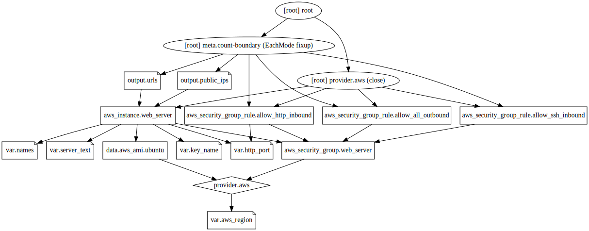

# Terraform Provisioners

## Background:

Here, we learn how to create and provision some simple web servers.

This code deploys multiple web servers in AWS, each with a different Name tag. Each web server always returns "Hello, World" on port 8080.

## Tasks:

### 1. Make a directory called ‘lab8’ underneath the labs directory.

### 2. Change into the directory.

Create the following files: main.tf, vars.tf

In the main.tf specify your provider as aws, then add the following lines:


```bash
cat main.tf
```

    
    resource "aws_instance" "web_server" {
      count         = length(var.names)
      
      ami           = data.aws_ami.ubuntu.id
      instance_type = "t2.micro"
    
      key_name               = var.key_name
      vpc_security_group_ids = [aws_security_group.web_server.id]
    
      user_data = <<-EOF
                  #!/bin/bash
                  echo ${var.server_text} > /tmp/index.html
                  cd /tmp/
                  nohup busybox httpd -f -p ${var.http_port} &
                  EOF
    
      tags = {
        Name = element(var.names, count.index)
      }
    }
    


Then add a Provider data source to get possible images:


```bash
cat data_ami.tf
```

    
    # Data source to get latest Ubuntu 18.04 LTS:
    
    data "aws_ami" "ubuntu" {
      owners      = ["099720109477"] # Canonical
    
      most_recent = true
    
      filter {
        name   = "name"
        values = ["ubuntu/images/hvm-ssd/ubuntu-bionic-18.04-amd64-server-*"]
      }
    
      filter {
        name   = "virtualization-type"
        values = ["hvm"]
      }
    }
    


Then add a security group to control Ingress/Egress traffic

**Stretch Goal:** See how you can use a dynamic block to prevent code repetition here (say *DRY*)
https://prefetch.net/blog/2020/04/29/using-terraform-for_each-statements-and-dynamic-nested-blocks-to-simply-aws-security-group-ingress-statements/


```bash
cat secgroup.tf
```

    
    resource "aws_security_group" "web_server" {
      name_prefix = "exercise-03-example"
    }
    
    resource "aws_security_group_rule" "allow_http_inbound" {
      type              = "ingress"
      from_port         = var.http_port
      to_port           = var.http_port
      protocol          = "tcp"
      security_group_id = aws_security_group.web_server.id
      cidr_blocks       = ["0.0.0.0/0"]
    }
    
    resource "aws_security_group_rule" "allow_ssh_inbound" {
      type              = "ingress"
      from_port         = 22
      to_port           = 22
      protocol          = "tcp"
      security_group_id = aws_security_group.web_server.id
    
      # To keep this example simple, we allow SSH requests from any IP.
      # In real-world usage, you should lock this down
      # to just the IPs of trusted servers (e.g., your office IPs).
      cidr_blocks = ["0.0.0.0/0"]
    }
    
    resource "aws_security_group_rule" "allow_all_outbound" {
      type              = "egress"
      from_port         = 0
      to_port           = 0
      protocol          = "-1"
      security_group_id = aws_security_group.web_server.id
      cidr_blocks       = ["0.0.0.0/0"]
    }
    


#### Create a vars.tf file

**Note:** we give less detail here as you now have experience with creating Terraform configs and so should be able to create your own files

- Create a vars.tf file to provide the following variables:

  * *aws_region*: with the value "us-west-1"

  * *names*: a list containing [ "instance1", "instance2" ] - where the names are arbitrary, what is important is the number of elements in the list, each of which will cause the creation of a separate *aws_instance*

  * *http_port*: set to 8080

  * *server_text*: the text to be sent back by your web server, choose some arbitrary text

  * *key_name*: remember to provide a value - this will be the name of the *aws_key_pair* resource which will be created

#### Create a key pair

Create a key pair using the command:

## Create a new keyfile


```bash
ssh-keygen -N '' -t rsa -f key
```

    Generating public/private rsa key pair.
    Your identification has been saved in key
    Your public key has been saved in key.pub
    The key fingerprint is:
    SHA256:QB2CCTfgRfyt/9HIRDEDssVpj99es9szPDSkbee4+8I student@tf-content
    The key's randomart image is:
    +---[RSA 3072]----+
    |  o==o+o+++      |
    | . o+o ==  +     |
    |  .  .oo o.      |
    |      ..o..    . |
    |       .S...  +  |
    |      .  o.o..o=.|
    |       .  +..o+=o|
    |        .  .. E*.|
    |         ..   +**|
    +----[SHA256]-----+


Create a aws_key_pair resource using this key's public key file


```bash
cat aws_key_pair.tf
```

    
    resource "aws_key_pair" "generated_key" {
      key_name   = var.key_name
      public_key = file("key.pub")
    }
    


#### Create an outputs.tf file

- Create a outputs.tf file to display public_ip, public_dns and private_ips

**Note:** Output separately a list of each (list of public_ip,  ... list of private_ip)

**Note:** Also output a string for each machine showing it's public_ip, private_ip, public_dns in the same line

### 3. Initialize, preview and apply the configuration


```bash
terraform init 
```

    
    Initializing the backend...
    
    Initializing provider plugins...
    - Finding latest version of hashicorp/aws...
    - Installing hashicorp/aws v4.0.0...
    - Installed hashicorp/aws v4.0.0 (signed by HashiCorp)
    
    Terraform has created a lock file .terraform.lock.hcl to record the provider
    selections it made above. Include this file in your version control repository
    so that Terraform can guarantee to make the same selections by default when
    you run "terraform init" in the future.
    
    Terraform has been successfully initialized!
    
    You may now begin working with Terraform. Try running "terraform plan" to see
    any changes that are required for your infrastructure. All Terraform commands
    should now work.
    
    If you ever set or change modules or backend configuration for Terraform,
    rerun this command to reinitialize your working directory. If you forget, other
    commands will detect it and remind you to do so if necessary.


```bash
terraform apply 
```

    
    Terraform used the selected providers to generate the following execution plan.
    Resource actions are indicated with the following symbols:
      + create
    
    Terraform will perform the following actions:
    
      # aws_instance.web_server[0] will be created
      + resource "aws_instance" "web_server" {
          + ami                                  = "ami-0fc2b82bda0559ee0"
          + arn                                  = (known after apply)
          + associate_public_ip_address          = (known after apply)
          + availability_zone                    = (known after apply)
          + cpu_core_count                       = (known after apply)
          + cpu_threads_per_core                 = (known after apply)
          + disable_api_termination              = (known after apply)
          + ebs_optimized                        = (known after apply)
          + get_password_data                    = false
          + host_id                              = (known after apply)
          + id                                   = (known after apply)
          + instance_initiated_shutdown_behavior = (known after apply)
          + instance_state                       = (known after apply)
          + instance_type                        = "t2.micro"
          + ipv6_address_count                   = (known after apply)
          + ipv6_addresses                       = (known after apply)
          + key_name                             = "20211217-key"
          + monitoring                           = (known after apply)
          + outpost_arn                          = (known after apply)
          + password_data                        = (known after apply)
          + placement_group                      = (known after apply)
          + placement_partition_number           = (known after apply)
          + primary_network_interface_id         = (known after apply)
          + private_dns                          = (known after apply)
          + private_ip                           = (known after apply)
          + public_dns                           = (known after apply)
          + public_ip                            = (known after apply)
          + secondary_private_ips                = (known after apply)
          + security_groups                      = (known after apply)
          + source_dest_check                    = true
          + subnet_id                            = (known after apply)
          + tags                                 = {
              + "Name" = "instance1"
            }
          + tags_all                             = {
              + "Name" = "instance1"
            }
          + tenancy                              = (known after apply)
          + user_data                            = "7b209b75db2375e87a55ae4411e10d7d08639bfa"
          + user_data_base64                     = (known after apply)
          + vpc_security_group_ids               = (known after apply)
    
          + capacity_reservation_specification {
              + capacity_reservation_preference = (known after apply)
    
              + capacity_reservation_target {
                  + capacity_reservation_id = (known after apply)
                }
            }
    
          + ebs_block_device {
              + delete_on_termination = (known after apply)
              + device_name           = (known after apply)
              + encrypted             = (known after apply)
              + iops                  = (known after apply)
              + kms_key_id            = (known after apply)
              + snapshot_id           = (known after apply)
              + tags                  = (known after apply)
              + throughput            = (known after apply)
              + volume_id             = (known after apply)
              + volume_size           = (known after apply)
              + volume_type           = (known after apply)
            }
    
          + enclave_options {
              + enabled = (known after apply)
            }
    
          + ephemeral_block_device {
              + device_name  = (known after apply)
              + no_device    = (known after apply)
              + virtual_name = (known after apply)
            }
    
          + metadata_options {
              + http_endpoint               = (known after apply)
              + http_put_response_hop_limit = (known after apply)
              + http_tokens                 = (known after apply)
              + instance_metadata_tags      = (known after apply)
            }
    
          + network_interface {
              + delete_on_termination = (known after apply)
              + device_index          = (known after apply)
              + network_interface_id  = (known after apply)
            }
    
          + root_block_device {
              + delete_on_termination = (known after apply)
              + device_name           = (known after apply)
              + encrypted             = (known after apply)
              + iops                  = (known after apply)
              + kms_key_id            = (known after apply)
              + tags                  = (known after apply)
              + throughput            = (known after apply)
              + volume_id             = (known after apply)
              + volume_size           = (known after apply)
              + volume_type           = (known after apply)
            }
        }
    
      # aws_instance.web_server[1] will be created
      + resource "aws_instance" "web_server" {
          + ami                                  = "ami-0fc2b82bda0559ee0"
          + arn                                  = (known after apply)
          + associate_public_ip_address          = (known after apply)
          + availability_zone                    = (known after apply)
          + cpu_core_count                       = (known after apply)
          + cpu_threads_per_core                 = (known after apply)
          + disable_api_termination              = (known after apply)
          + ebs_optimized                        = (known after apply)
          + get_password_data                    = false
          + host_id                              = (known after apply)
          + id                                   = (known after apply)
          + instance_initiated_shutdown_behavior = (known after apply)
          + instance_state                       = (known after apply)
          + instance_type                        = "t2.micro"
          + ipv6_address_count                   = (known after apply)
          + ipv6_addresses                       = (known after apply)
          + key_name                             = "20211217-key"
          + monitoring                           = (known after apply)
          + outpost_arn                          = (known after apply)
          + password_data                        = (known after apply)
          + placement_group                      = (known after apply)
          + placement_partition_number           = (known after apply)
          + primary_network_interface_id         = (known after apply)
          + private_dns                          = (known after apply)
          + private_ip                           = (known after apply)
          + public_dns                           = (known after apply)
          + public_ip                            = (known after apply)
          + secondary_private_ips                = (known after apply)
          + security_groups                      = (known after apply)
          + source_dest_check                    = true
          + subnet_id                            = (known after apply)
          + tags                                 = {
              + "Name" = "instance2"
            }
          + tags_all                             = {
              + "Name" = "instance2"
            }
          + tenancy                              = (known after apply)
          + user_data                            = "7b209b75db2375e87a55ae4411e10d7d08639bfa"
          + user_data_base64                     = (known after apply)
          + vpc_security_group_ids               = (known after apply)
    
          + capacity_reservation_specification {
              + capacity_reservation_preference = (known after apply)
    
              + capacity_reservation_target {
                  + capacity_reservation_id = (known after apply)
                }
            }
    
          + ebs_block_device {
              + delete_on_termination = (known after apply)
              + device_name           = (known after apply)
              + encrypted             = (known after apply)
              + iops                  = (known after apply)
              + kms_key_id            = (known after apply)
              + snapshot_id           = (known after apply)
              + tags                  = (known after apply)
              + throughput            = (known after apply)
              + volume_id             = (known after apply)
              + volume_size           = (known after apply)
              + volume_type           = (known after apply)
            }
    
          + enclave_options {
              + enabled = (known after apply)
            }
    
          + ephemeral_block_device {
              + device_name  = (known after apply)
              + no_device    = (known after apply)
              + virtual_name = (known after apply)
            }
    
          + metadata_options {
              + http_endpoint               = (known after apply)
              + http_put_response_hop_limit = (known after apply)
              + http_tokens                 = (known after apply)
              + instance_metadata_tags      = (known after apply)
            }
    
          + network_interface {
              + delete_on_termination = (known after apply)
              + device_index          = (known after apply)
              + network_interface_id  = (known after apply)
            }
    
          + root_block_device {
              + delete_on_termination = (known after apply)
              + device_name           = (known after apply)
              + encrypted             = (known after apply)
              + iops                  = (known after apply)
              + kms_key_id            = (known after apply)
              + tags                  = (known after apply)
              + throughput            = (known after apply)
              + volume_id             = (known after apply)
              + volume_size           = (known after apply)
              + volume_type           = (known after apply)
            }
        }
    
      # aws_key_pair.generated_key will be created
      + resource "aws_key_pair" "generated_key" {
          + arn             = (known after apply)
          + fingerprint     = (known after apply)
          + id              = (known after apply)
          + key_name        = "20211217-key"
          + key_name_prefix = (known after apply)
          + key_pair_id     = (known after apply)
          + public_key      = "ssh-rsa AAAAB3NzaC1yc2EAAAADAQABAAABgQC2rv1WOrc2HaDe9PJgWwZx89C8W7i5zuHth1f6FU83X70FKYJrAVIAirOeEwy1XcOsPhnfGJkGJh9dLd2bdKCy7fR8lxKhcwYRAuIc7eaaPFFgDyg8lzecjlE7TdTEq+Dogv9KwUaDDHC5aBetrUc/pYn72Pvttxg9+f3VDJmGEK6jbJsUMfVuzUeFAi1ebz9x1pYB2JO4JWaXgoRvf1/29BCvvjBrkDKJT1m01pB/GLdJfpY+/SkRIV75nr/WD5Tl7oQHW9VonagMtVizV2X4U0uwsfM7LRAuSBbTmfcXcNeF+HxnFO0RPYOHUI0e/n/GGOaAPbnoMxfDqPXQlqj6QtBq4HPCKq8uuAmZ8POAO1MJe8UJt8brYiunyVpi6ZeMU7SbwhhYug9OmbS7lOu/Vr+zE1PXyFDXh96n8x285o/mIZmKvBivYSfbiv+ZKe+LiS16UKeGZaDMYUyo9uzkd9qBZkXz00NTJsFaYiVXLy+in6zqHyAf0uPlp809x3k= student@tf-content"
          + tags_all        = (known after apply)
        }
    
      # aws_security_group.web_server will be created
      + resource "aws_security_group" "web_server" {
          + arn                    = (known after apply)
          + description            = "Managed by Terraform"
          + egress                 = (known after apply)
          + id                     = (known after apply)
          + ingress                = (known after apply)
          + name                   = (known after apply)
          + name_prefix            = "exercise-03-example"
          + owner_id               = (known after apply)
          + revoke_rules_on_delete = false
          + tags_all               = (known after apply)
          + vpc_id                 = (known after apply)
        }
    
      # aws_security_group_rule.allow_all_outbound will be created
      + resource "aws_security_group_rule" "allow_all_outbound" {
          + cidr_blocks              = [
              + "0.0.0.0/0",
            ]
          + from_port                = 0
          + id                       = (known after apply)
          + protocol                 = "-1"
          + security_group_id        = (known after apply)
          + self                     = false
          + source_security_group_id = (known after apply)
          + to_port                  = 0
          + type                     = "egress"
        }
    
      # aws_security_group_rule.allow_http_inbound will be created
      + resource "aws_security_group_rule" "allow_http_inbound" {
          + cidr_blocks              = [
              + "0.0.0.0/0",
            ]
          + from_port                = 8080
          + id                       = (known after apply)
          + protocol                 = "tcp"
          + security_group_id        = (known after apply)
          + self                     = false
          + source_security_group_id = (known after apply)
          + to_port                  = 8080
          + type                     = "ingress"
        }
    
      # aws_security_group_rule.allow_ssh_inbound will be created
      + resource "aws_security_group_rule" "allow_ssh_inbound" {
          + cidr_blocks              = [
              + "0.0.0.0/0",
            ]
          + from_port                = 22
          + id                       = (known after apply)
          + protocol                 = "tcp"
          + security_group_id        = (known after apply)
          + self                     = false
          + source_security_group_id = (known after apply)
          + to_port                  = 22
          + type                     = "ingress"
        }
    
    Plan: 7 to add, 0 to change, 0 to destroy.
    
    Changes to Outputs:
      + private_ips = [
          + (known after apply),
          + (known after apply),
        ]
      + public_dns  = [
          + (known after apply),
          + (known after apply),
        ]
      + public_ips  = [
          + (known after apply),
          + (known after apply),
        ]
      + vms_info    = [
          + (known after apply),
          + (known after apply),
        ]
    aws_security_group.web_server: Creating...
    aws_key_pair.generated_key: Creating...
    aws_key_pair.generated_key: Creation complete after 2s [id=20211217-key]
    aws_security_group.web_server: Creation complete after 7s [id=sg-0482d7062a89de5f7]
    aws_instance.web_server[1]: Creating...
    aws_security_group_rule.allow_all_outbound: Creating...
    aws_security_group_rule.allow_http_inbound: Creating...
    aws_security_group_rule.allow_ssh_inbound: Creating...
    aws_instance.web_server[0]: Creating...
    aws_security_group_rule.allow_ssh_inbound: Creation complete after 3s [id=sgrule-554776192]
    aws_security_group_rule.allow_all_outbound: Creation complete after 5s [id=sgrule-1717931154]
    aws_security_group_rule.allow_http_inbound: Creation complete after 8s [id=sgrule-2861831664]
    aws_instance.web_server[1]: Still creating... [10s elapsed]
    aws_instance.web_server[0]: Still creating... [10s elapsed]
    aws_instance.web_server[1]: Still creating... [20s elapsed]
    aws_instance.web_server[0]: Still creating... [20s elapsed]
    aws_instance.web_server[1]: Still creating... [30s elapsed]
    aws_instance.web_server[0]: Still creating... [30s elapsed]
    aws_instance.web_server[1]: Creation complete after 40s [id=i-0c6c9273dca5afed4]
    aws_instance.web_server[0]: Creation complete after 40s [id=i-0bee8fe5da641d83c]
    
    Apply complete! Resources: 7 added, 0 changed, 0 destroyed.
    
    Outputs:
    
    private_ips = [
      "172.31.7.185",
      "172.31.7.205",
    ]
    public_dns = [
      "ec2-52-53-194-213.us-west-1.compute.amazonaws.com",
      "ec2-18-144-171-166.us-west-1.compute.amazonaws.com",
    ]
    public_ips = [
      "52.53.194.213",
      "18.144.171.166",
    ]
    vms_info = [
      "VM 0 details: 52.53.194.213, ec2-52-53-194-213.us-west-1.compute.amazonaws.com, 172.31.7.185",
      "VM 1 details: 18.144.171.166, ec2-18-144-171-166.us-west-1.compute.amazonaws.com, 172.31.7.205",
    ]


### 4. The configuration when visualized should look like

<div>
    <object data="graph.svg" type="image/svg+xml">
    </object>
</div>



### 6. Test your web servers

When you perform the apply you should see the public ip addresses of your servers.

**IMPORTANT Note:** it may take a minute or so before the user_data script, or any provisioner is run, so the httpd server may not be running immediately after the ```terraform apply``` completes

#### ssh

First verify that you can connect to the web-servers using ssh

ssh -i key ubuntu@your-public-ip

From there verify that httpd is running and curl to 127.0.0.1:8080

disconnect from the vm

#### curl

Now check that you can curl to the port 8080, if that's the value you specified, on those 3 ip addresses

**Note**: You may need to wait a minute after the VMs have been created before the web servers will respond.

#### Stretch Goal

As a stretch goal modify the output.tf file to output the commands:
- ssh -i key ubuntu@<IP>
- curl -L http://<IP>:8080
    
Replacing "*<IP>*" with your VMs public_ips in the above commands

### 7. Implement a local-exec Provisioner

Now add a local-exec provisioner script into your main.tf file to output the public_ip and public_dns variables to a file "*./hosts.txt*"

**Note**: You can obtain the public_ip within the resource using ${self.public_ip}

**Note**: Provisioners are only executed at creation time so you will need to destroy, apply your config for this change to be made

Refer to https://sdorsett.github.io/post/2018-12-26-using-local-exec-and-remote-exec-provisioners-with-terraform/

### 8. Implement file and remote-exec Provisioners

Now
- remove or comment the line in your *user_data* which creates the file */tmp/index.html*
- add file and remote-exec provisioners into your main.tf file to create this file from a script containg:


```bash
cat /tmp/index.html
```

    <html>
    <title> (remote-exec generated) hello world - server is alive ! </title>
    <body>
      <h1> (remote-exec generated) hello world - server is alive ! </h1>
    </body>
    </html>


**Note**: Provisioners are only executed at creation time so you will need to destroy, apply your config for this change to be made

Refer to https://sdorsett.github.io/post/2018-12-26-using-local-exec-and-remote-exec-provisioners-with-terraform/

# Stretch Goals

Reimplement this exercise in a series of steps as follows using the various features and best practices we have seen during the course

### step1 : ssh
Basic VM creation, with
- creation of security group with port 22 rule for ssh
- generation of TLS key, key,pem file, aws_key_pair
- use of aws_ami data source, use of depends_on
- output of ssh commands

### step2a :
Extend the example with
- use of (cloud-init) user_data to start world's simplest web server via here-doc string
- use of dynamic block for ingress on security group
- output of curl commands to test web server (after delay)

**Note:** It may take some time for user_data to execute, to check:
- ssh to machine and check with ps -ef | grep httpd
- check under /var/lib/cloud/instance/
- check cloud-init in /var/log/syslog

### step2b :
As step2a - but use a templatefile for the user_data script

### step2c :
Use the terraform-aws-modules/ec2-instance/aws module

Consider this as an optional step - we will create a more appropriate module ourselves later

### step3a : FAILS
- Combine provisioners: file, local_exec, remote_exec (file before remote_exec)
- Also user_data for comparison

**Note:** This FAILS because key not generated

### step3b : Bad practice

As an exercise consider how you might split off key creation as a separate config

- Why is this a bad idea ?
- What is a better solution ?

### step3c : OK

Add a depends_on local_file.key_file in aws_instance resource

This is the appropriate solution

### step4a: Make multiple instances

If not done already, modify your example to create multiple VM instances

### step4b: Create your own module

Create your own module which encapsulates
- use of the aws_ami data source
- creation of the TLS private key and writing this out to a file
- creation of the aws_key_pair
- creation of multiple aws_instances


### step4c: Invoke ansible

Use one of the methods we've seen to invoke ansible to configure your instances

Configure the instance to use an nginx webserver

# 9. Cleanup

Now cleanup the resources from this exercise


```bash
terraform destroy 
```

    aws_key_pair.generated_key: Refreshing state... [id=20211217-key]
    aws_security_group.web_server: Refreshing state... [id=sg-0482d7062a89de5f7]
    aws_security_group_rule.allow_http_inbound: Refreshing state... [id=sgrule-2861831664]
    aws_security_group_rule.allow_ssh_inbound: Refreshing state... [id=sgrule-554776192]
    aws_security_group_rule.allow_all_outbound: Refreshing state... [id=sgrule-1717931154]
    aws_instance.web_server[1]: Refreshing state... [id=i-0c6c9273dca5afed4]
    aws_instance.web_server[0]: Refreshing state... [id=i-0bee8fe5da641d83c]
    
    Terraform used the selected providers to generate the following execution plan.
    Resource actions are indicated with the following symbols:
      - destroy
    
    Terraform will perform the following actions:
    
      # aws_instance.web_server[0] will be destroyed
      - resource "aws_instance" "web_server" {
          - ami                                  = "ami-0fc2b82bda0559ee0" -> null
          - arn                                  = "arn:aws:ec2:us-west-1:604682923221:instance/i-0bee8fe5da641d83c" -> null
          - associate_public_ip_address          = true -> null
          - availability_zone                    = "us-west-1b" -> null
          - cpu_core_count                       = 1 -> null
          - cpu_threads_per_core                 = 1 -> null
          - disable_api_termination              = false -> null
          - ebs_optimized                        = false -> null
          - get_password_data                    = false -> null
          - hibernation                          = false -> null
          - id                                   = "i-0bee8fe5da641d83c" -> null
          - instance_initiated_shutdown_behavior = "stop" -> null
          - instance_state                       = "running" -> null
          - instance_type                        = "t2.micro" -> null
          - ipv6_address_count                   = 0 -> null
          - ipv6_addresses                       = [] -> null
          - key_name                             = "20211217-key" -> null
          - monitoring                           = false -> null
          - primary_network_interface_id         = "eni-0d13dd83a1b6e74ac" -> null
          - private_dns                          = "ip-172-31-7-185.us-west-1.compute.internal" -> null
          - private_ip                           = "172.31.7.185" -> null
          - public_dns                           = "ec2-52-53-194-213.us-west-1.compute.amazonaws.com" -> null
          - public_ip                            = "52.53.194.213" -> null
          - secondary_private_ips                = [] -> null
          - security_groups                      = [
              - "exercise-03-example20220215125257319300000001",
            ] -> null
          - source_dest_check                    = true -> null
          - subnet_id                            = "subnet-2c6ba676" -> null
          - tags                                 = {
              - "Name" = "instance1"
            } -> null
          - tags_all                             = {
              - "Name" = "instance1"
            } -> null
          - tenancy                              = "default" -> null
          - user_data                            = "7b209b75db2375e87a55ae4411e10d7d08639bfa" -> null
          - vpc_security_group_ids               = [
              - "sg-0482d7062a89de5f7",
            ] -> null
    
          - capacity_reservation_specification {
              - capacity_reservation_preference = "open" -> null
            }
    
          - credit_specification {
              - cpu_credits = "standard" -> null
            }
    
          - enclave_options {
              - enabled = false -> null
            }
    
          - metadata_options {
              - http_endpoint               = "enabled" -> null
              - http_put_response_hop_limit = 1 -> null
              - http_tokens                 = "optional" -> null
              - instance_metadata_tags      = "disabled" -> null
            }
    
          - root_block_device {
              - delete_on_termination = true -> null
              - device_name           = "/dev/sda1" -> null
              - encrypted             = false -> null
              - iops                  = 100 -> null
              - tags                  = {} -> null
              - throughput            = 0 -> null
              - volume_id             = "vol-0fcbbbd497646fbb9" -> null
              - volume_size           = 8 -> null
              - volume_type           = "gp2" -> null
            }
        }
    
      # aws_instance.web_server[1] will be destroyed
      - resource "aws_instance" "web_server" {
          - ami                                  = "ami-0fc2b82bda0559ee0" -> null
          - arn                                  = "arn:aws:ec2:us-west-1:604682923221:instance/i-0c6c9273dca5afed4" -> null
          - associate_public_ip_address          = true -> null
          - availability_zone                    = "us-west-1b" -> null
          - cpu_core_count                       = 1 -> null
          - cpu_threads_per_core                 = 1 -> null
          - disable_api_termination              = false -> null
          - ebs_optimized                        = false -> null
          - get_password_data                    = false -> null
          - hibernation                          = false -> null
          - id                                   = "i-0c6c9273dca5afed4" -> null
          - instance_initiated_shutdown_behavior = "stop" -> null
          - instance_state                       = "running" -> null
          - instance_type                        = "t2.micro" -> null
          - ipv6_address_count                   = 0 -> null
          - ipv6_addresses                       = [] -> null
          - key_name                             = "20211217-key" -> null
          - monitoring                           = false -> null
          - primary_network_interface_id         = "eni-0492c0ccabfb2ad99" -> null
          - private_dns                          = "ip-172-31-7-205.us-west-1.compute.internal" -> null
          - private_ip                           = "172.31.7.205" -> null
          - public_dns                           = "ec2-18-144-171-166.us-west-1.compute.amazonaws.com" -> null
          - public_ip                            = "18.144.171.166" -> null
          - secondary_private_ips                = [] -> null
          - security_groups                      = [
              - "exercise-03-example20220215125257319300000001",
            ] -> null
          - source_dest_check                    = true -> null
          - subnet_id                            = "subnet-2c6ba676" -> null
          - tags                                 = {
              - "Name" = "instance2"
            } -> null
          - tags_all                             = {
              - "Name" = "instance2"
            } -> null
          - tenancy                              = "default" -> null
          - user_data                            = "7b209b75db2375e87a55ae4411e10d7d08639bfa" -> null
          - vpc_security_group_ids               = [
              - "sg-0482d7062a89de5f7",
            ] -> null
    
          - capacity_reservation_specification {
              - capacity_reservation_preference = "open" -> null
            }
    
          - credit_specification {
              - cpu_credits = "standard" -> null
            }
    
          - enclave_options {
              - enabled = false -> null
            }
    
          - metadata_options {
              - http_endpoint               = "enabled" -> null
              - http_put_response_hop_limit = 1 -> null
              - http_tokens                 = "optional" -> null
              - instance_metadata_tags      = "disabled" -> null
            }
    
          - root_block_device {
              - delete_on_termination = true -> null
              - device_name           = "/dev/sda1" -> null
              - encrypted             = false -> null
              - iops                  = 100 -> null
              - tags                  = {} -> null
              - throughput            = 0 -> null
              - volume_id             = "vol-00239d8b5ff8e3c32" -> null
              - volume_size           = 8 -> null
              - volume_type           = "gp2" -> null
            }
        }
    
      # aws_key_pair.generated_key will be destroyed
      - resource "aws_key_pair" "generated_key" {
          - arn         = "arn:aws:ec2:us-west-1:604682923221:key-pair/20211217-key" -> null
          - fingerprint = "62:ea:20:65:b0:6e:21:e6:1a:f5:2c:d7:a2:73:7f:97" -> null
          - id          = "20211217-key" -> null
          - key_name    = "20211217-key" -> null
          - key_pair_id = "key-0c795e5c620dad791" -> null
          - public_key  = "ssh-rsa AAAAB3NzaC1yc2EAAAADAQABAAABgQC2rv1WOrc2HaDe9PJgWwZx89C8W7i5zuHth1f6FU83X70FKYJrAVIAirOeEwy1XcOsPhnfGJkGJh9dLd2bdKCy7fR8lxKhcwYRAuIc7eaaPFFgDyg8lzecjlE7TdTEq+Dogv9KwUaDDHC5aBetrUc/pYn72Pvttxg9+f3VDJmGEK6jbJsUMfVuzUeFAi1ebz9x1pYB2JO4JWaXgoRvf1/29BCvvjBrkDKJT1m01pB/GLdJfpY+/SkRIV75nr/WD5Tl7oQHW9VonagMtVizV2X4U0uwsfM7LRAuSBbTmfcXcNeF+HxnFO0RPYOHUI0e/n/GGOaAPbnoMxfDqPXQlqj6QtBq4HPCKq8uuAmZ8POAO1MJe8UJt8brYiunyVpi6ZeMU7SbwhhYug9OmbS7lOu/Vr+zE1PXyFDXh96n8x285o/mIZmKvBivYSfbiv+ZKe+LiS16UKeGZaDMYUyo9uzkd9qBZkXz00NTJsFaYiVXLy+in6zqHyAf0uPlp809x3k= student@tf-content" -> null
          - tags        = {} -> null
          - tags_all    = {} -> null
        }
    
      # aws_security_group.web_server will be destroyed
      - resource "aws_security_group" "web_server" {
          - arn                    = "arn:aws:ec2:us-west-1:604682923221:security-group/sg-0482d7062a89de5f7" -> null
          - description            = "Managed by Terraform" -> null
          - egress                 = [
              - {
                  - cidr_blocks      = [
                      - "0.0.0.0/0",
                    ]
                  - description      = ""
                  - from_port        = 0
                  - ipv6_cidr_blocks = []
                  - prefix_list_ids  = []
                  - protocol         = "-1"
                  - security_groups  = []
                  - self             = false
                  - to_port          = 0
                },
            ] -> null
          - id                     = "sg-0482d7062a89de5f7" -> null
          - ingress                = [
              - {
                  - cidr_blocks      = [
                      - "0.0.0.0/0",
                    ]
                  - description      = ""
                  - from_port        = 22
                  - ipv6_cidr_blocks = []
                  - prefix_list_ids  = []
                  - protocol         = "tcp"
                  - security_groups  = []
                  - self             = false
                  - to_port          = 22
                },
              - {
                  - cidr_blocks      = [
                      - "0.0.0.0/0",
                    ]
                  - description      = ""
                  - from_port        = 8080
                  - ipv6_cidr_blocks = []
                  - prefix_list_ids  = []
                  - protocol         = "tcp"
                  - security_groups  = []
                  - self             = false
                  - to_port          = 8080
                },
            ] -> null
          - name                   = "exercise-03-example20220215125257319300000001" -> null
          - name_prefix            = "exercise-03-example" -> null
          - owner_id               = "604682923221" -> null
          - revoke_rules_on_delete = false -> null
          - tags                   = {} -> null
          - tags_all               = {} -> null
          - vpc_id                 = "vpc-af4583c9" -> null
        }
    
      # aws_security_group_rule.allow_all_outbound will be destroyed
      - resource "aws_security_group_rule" "allow_all_outbound" {
          - cidr_blocks       = [
              - "0.0.0.0/0",
            ] -> null
          - from_port         = 0 -> null
          - id                = "sgrule-1717931154" -> null
          - ipv6_cidr_blocks  = [] -> null
          - prefix_list_ids   = [] -> null
          - protocol          = "-1" -> null
          - security_group_id = "sg-0482d7062a89de5f7" -> null
          - self              = false -> null
          - to_port           = 0 -> null
          - type              = "egress" -> null
        }
    
      # aws_security_group_rule.allow_http_inbound will be destroyed
      - resource "aws_security_group_rule" "allow_http_inbound" {
          - cidr_blocks       = [
              - "0.0.0.0/0",
            ] -> null
          - from_port         = 8080 -> null
          - id                = "sgrule-2861831664" -> null
          - ipv6_cidr_blocks  = [] -> null
          - prefix_list_ids   = [] -> null
          - protocol          = "tcp" -> null
          - security_group_id = "sg-0482d7062a89de5f7" -> null
          - self              = false -> null
          - to_port           = 8080 -> null
          - type              = "ingress" -> null
        }
    
      # aws_security_group_rule.allow_ssh_inbound will be destroyed
      - resource "aws_security_group_rule" "allow_ssh_inbound" {
          - cidr_blocks       = [
              - "0.0.0.0/0",
            ] -> null
          - from_port         = 22 -> null
          - id                = "sgrule-554776192" -> null
          - ipv6_cidr_blocks  = [] -> null
          - prefix_list_ids   = [] -> null
          - protocol          = "tcp" -> null
          - security_group_id = "sg-0482d7062a89de5f7" -> null
          - self              = false -> null
          - to_port           = 22 -> null
          - type              = "ingress" -> null
        }
    
    Plan: 0 to add, 0 to change, 7 to destroy.
    
    Changes to Outputs:
      - private_ips = [
          - "172.31.7.185",
          - "172.31.7.205",
        ] -> null
      - public_dns  = [
          - "ec2-52-53-194-213.us-west-1.compute.amazonaws.com",
          - "ec2-18-144-171-166.us-west-1.compute.amazonaws.com",
        ] -> null
      - public_ips  = [
          - "52.53.194.213",
          - "18.144.171.166",
        ] -> null
      - vms_info    = [
          - "VM 0 details: 52.53.194.213, ec2-52-53-194-213.us-west-1.compute.amazonaws.com, 172.31.7.185",
          - "VM 1 details: 18.144.171.166, ec2-18-144-171-166.us-west-1.compute.amazonaws.com, 172.31.7.205",
        ] -> null
    aws_key_pair.generated_key: Destroying... [id=20211217-key]
    aws_security_group_rule.allow_http_inbound: Destroying... [id=sgrule-2861831664]
    aws_security_group_rule.allow_ssh_inbound: Destroying... [id=sgrule-554776192]
    aws_security_group_rule.allow_all_outbound: Destroying... [id=sgrule-1717931154]
    aws_instance.web_server[1]: Destroying... [id=i-0c6c9273dca5afed4]
    aws_instance.web_server[0]: Destroying... [id=i-0bee8fe5da641d83c]
    aws_key_pair.generated_key: Destruction complete after 1s
    aws_security_group_rule.allow_http_inbound: Destruction complete after 2s
    aws_security_group_rule.allow_ssh_inbound: Destruction complete after 4s
    aws_security_group_rule.allow_all_outbound: Destruction complete after 6s
    aws_instance.web_server[1]: Still destroying... [id=i-0c6c9273dca5afed4, 10s elapsed]
    aws_instance.web_server[0]: Still destroying... [id=i-0bee8fe5da641d83c, 10s elapsed]
    aws_instance.web_server[1]: Still destroying... [id=i-0c6c9273dca5afed4, 20s elapsed]
    aws_instance.web_server[0]: Still destroying... [id=i-0bee8fe5da641d83c, 20s elapsed]


<hr/>
<!--  --> 
# Terraform Provisioners

## Background:

Here, we learn how to create and provision some simple web servers.

This code deploys multiple web servers in AWS, each with a different Name tag. Each web server always returns "Hello, World" on port 8080.

## Tasks:

### 1. Make a directory called ‘lab8’ underneath the labs directory.

### 2. Change into the directory.

Create the following files: main.tf, vars.tf

In the main.tf specify your provider as aws, then add the following lines:


```bash
cat main.tf
```

    
    resource "aws_instance" "web_server" {
      count         = length(var.names)
      
      ami           = data.aws_ami.ubuntu.id
      instance_type = "t2.micro"
    
      key_name               = var.key_name
      vpc_security_group_ids = [aws_security_group.web_server.id]
    
      user_data = <<-EOF
                  #!/bin/bash
                  echo ${var.server_text} > /tmp/index.html
                  cd /tmp/
                  nohup busybox httpd -f -p ${var.http_port} &
                  EOF
    
      tags = {
        Name = element(var.names, count.index)
      }
    }
    


Then add a Provider data source to get possible images:


```bash
cat data_ami.tf
```

    
    # Data source to get latest Ubuntu 18.04 LTS:
    
    data "aws_ami" "ubuntu" {
      owners      = ["099720109477"] # Canonical
    
      most_recent = true
    
      filter {
        name   = "name"
        values = ["ubuntu/images/hvm-ssd/ubuntu-bionic-18.04-amd64-server-*"]
      }
    
      filter {
        name   = "virtualization-type"
        values = ["hvm"]
      }
    }
    


Then add a security group to control Ingress/Egress traffic

**Stretch Goal:** See how you can use a dynamic block to prevent code repetition here (say *DRY*)
https://prefetch.net/blog/2020/04/29/using-terraform-for_each-statements-and-dynamic-nested-blocks-to-simply-aws-security-group-ingress-statements/


```bash
cat secgroup.tf
```

    
    resource "aws_security_group" "web_server" {
      name_prefix = "exercise-03-example"
    }
    
    resource "aws_security_group_rule" "allow_http_inbound" {
      type              = "ingress"
      from_port         = var.http_port
      to_port           = var.http_port
      protocol          = "tcp"
      security_group_id = aws_security_group.web_server.id
      cidr_blocks       = ["0.0.0.0/0"]
    }
    
    resource "aws_security_group_rule" "allow_ssh_inbound" {
      type              = "ingress"
      from_port         = 22
      to_port           = 22
      protocol          = "tcp"
      security_group_id = aws_security_group.web_server.id
    
      # To keep this example simple, we allow SSH requests from any IP.
      # In real-world usage, you should lock this down
      # to just the IPs of trusted servers (e.g., your office IPs).
      cidr_blocks = ["0.0.0.0/0"]
    }
    
    resource "aws_security_group_rule" "allow_all_outbound" {
      type              = "egress"
      from_port         = 0
      to_port           = 0
      protocol          = "-1"
      security_group_id = aws_security_group.web_server.id
      cidr_blocks       = ["0.0.0.0/0"]
    }
    


#### Create a vars.tf file

**Note:** we give less detail here as you now have experience with creating Terraform configs and so should be able to create your own files

- Create a vars.tf file to provide the following variables:

  * *aws_region*: with the value "us-west-1"

  * *names*: a list containing [ "instance1", "instance2" ] - where the names are arbitrary, what is important is the number of elements in the list, each of which will cause the creation of a separate *aws_instance*

  * *http_port*: set to 8080

  * *server_text*: the text to be sent back by your web server, choose some arbitrary text

  * *key_name*: remember to provide a value - this will be the name of the *aws_key_pair* resource which will be created

#### Create a key pair

Create a key pair using the command:

## Create a new keyfile


```bash
ssh-keygen -N '' -t rsa -f key
```

    Generating public/private rsa key pair.
    Your identification has been saved in key
    Your public key has been saved in key.pub
    The key fingerprint is:
    SHA256:QB2CCTfgRfyt/9HIRDEDssVpj99es9szPDSkbee4+8I student@tf-content
    The key's randomart image is:
    +---[RSA 3072]----+
    |  o==o+o+++      |
    | . o+o ==  +     |
    |  .  .oo o.      |
    |      ..o..    . |
    |       .S...  +  |
    |      .  o.o..o=.|
    |       .  +..o+=o|
    |        .  .. E*.|
    |         ..   +**|
    +----[SHA256]-----+


Create a aws_key_pair resource using this key's public key file


```bash
cat aws_key_pair.tf
```

    
    resource "aws_key_pair" "generated_key" {
      key_name   = var.key_name
      public_key = file("key.pub")
    }
    


#### Create an outputs.tf file

- Create a outputs.tf file to display public_ip, public_dns and private_ips

**Note:** Output separately a list of each (list of public_ip,  ... list of private_ip)

**Note:** Also output a string for each machine showing it's public_ip, private_ip, public_dns in the same line

### 3. Initialize, preview and apply the configuration


```bash
terraform init 
```

    
    Initializing the backend...
    
    Initializing provider plugins...
    - Finding latest version of hashicorp/aws...
    - Installing hashicorp/aws v4.0.0...
    - Installed hashicorp/aws v4.0.0 (signed by HashiCorp)
    
    Terraform has created a lock file .terraform.lock.hcl to record the provider
    selections it made above. Include this file in your version control repository
    so that Terraform can guarantee to make the same selections by default when
    you run "terraform init" in the future.
    
    Terraform has been successfully initialized!
    
    You may now begin working with Terraform. Try running "terraform plan" to see
    any changes that are required for your infrastructure. All Terraform commands
    should now work.
    
    If you ever set or change modules or backend configuration for Terraform,
    rerun this command to reinitialize your working directory. If you forget, other
    commands will detect it and remind you to do so if necessary.


```bash
terraform apply 
```

    
    Terraform used the selected providers to generate the following execution plan.
    Resource actions are indicated with the following symbols:
      + create
    
    Terraform will perform the following actions:
    
      # aws_instance.web_server[0] will be created
      + resource "aws_instance" "web_server" {
          + ami                                  = "ami-0fc2b82bda0559ee0"
          + arn                                  = (known after apply)
          + associate_public_ip_address          = (known after apply)
          + availability_zone                    = (known after apply)
          + cpu_core_count                       = (known after apply)
          + cpu_threads_per_core                 = (known after apply)
          + disable_api_termination              = (known after apply)
          + ebs_optimized                        = (known after apply)
          + get_password_data                    = false
          + host_id                              = (known after apply)
          + id                                   = (known after apply)
          + instance_initiated_shutdown_behavior = (known after apply)
          + instance_state                       = (known after apply)
          + instance_type                        = "t2.micro"
          + ipv6_address_count                   = (known after apply)
          + ipv6_addresses                       = (known after apply)
          + key_name                             = "20211217-key"
          + monitoring                           = (known after apply)
          + outpost_arn                          = (known after apply)
          + password_data                        = (known after apply)
          + placement_group                      = (known after apply)
          + placement_partition_number           = (known after apply)
          + primary_network_interface_id         = (known after apply)
          + private_dns                          = (known after apply)
          + private_ip                           = (known after apply)
          + public_dns                           = (known after apply)
          + public_ip                            = (known after apply)
          + secondary_private_ips                = (known after apply)
          + security_groups                      = (known after apply)
          + source_dest_check                    = true
          + subnet_id                            = (known after apply)
          + tags                                 = {
              + "Name" = "instance1"
            }
          + tags_all                             = {
              + "Name" = "instance1"
            }
          + tenancy                              = (known after apply)
          + user_data                            = "7b209b75db2375e87a55ae4411e10d7d08639bfa"
          + user_data_base64                     = (known after apply)
          + vpc_security_group_ids               = (known after apply)
    
          + capacity_reservation_specification {
              + capacity_reservation_preference = (known after apply)
    
              + capacity_reservation_target {
                  + capacity_reservation_id = (known after apply)
                }
            }
    
          + ebs_block_device {
              + delete_on_termination = (known after apply)
              + device_name           = (known after apply)
              + encrypted             = (known after apply)
              + iops                  = (known after apply)
              + kms_key_id            = (known after apply)
              + snapshot_id           = (known after apply)
              + tags                  = (known after apply)
              + throughput            = (known after apply)
              + volume_id             = (known after apply)
              + volume_size           = (known after apply)
              + volume_type           = (known after apply)
            }
    
          + enclave_options {
              + enabled = (known after apply)
            }
    
          + ephemeral_block_device {
              + device_name  = (known after apply)
              + no_device    = (known after apply)
              + virtual_name = (known after apply)
            }
    
          + metadata_options {
              + http_endpoint               = (known after apply)
              + http_put_response_hop_limit = (known after apply)
              + http_tokens                 = (known after apply)
              + instance_metadata_tags      = (known after apply)
            }
    
          + network_interface {
              + delete_on_termination = (known after apply)
              + device_index          = (known after apply)
              + network_interface_id  = (known after apply)
            }
    
          + root_block_device {
              + delete_on_termination = (known after apply)
              + device_name           = (known after apply)
              + encrypted             = (known after apply)
              + iops                  = (known after apply)
              + kms_key_id            = (known after apply)
              + tags                  = (known after apply)
              + throughput            = (known after apply)
              + volume_id             = (known after apply)
              + volume_size           = (known after apply)
              + volume_type           = (known after apply)
            }
        }
    
      # aws_instance.web_server[1] will be created
      + resource "aws_instance" "web_server" {
          + ami                                  = "ami-0fc2b82bda0559ee0"
          + arn                                  = (known after apply)
          + associate_public_ip_address          = (known after apply)
          + availability_zone                    = (known after apply)
          + cpu_core_count                       = (known after apply)
          + cpu_threads_per_core                 = (known after apply)
          + disable_api_termination              = (known after apply)
          + ebs_optimized                        = (known after apply)
          + get_password_data                    = false
          + host_id                              = (known after apply)
          + id                                   = (known after apply)
          + instance_initiated_shutdown_behavior = (known after apply)
          + instance_state                       = (known after apply)
          + instance_type                        = "t2.micro"
          + ipv6_address_count                   = (known after apply)
          + ipv6_addresses                       = (known after apply)
          + key_name                             = "20211217-key"
          + monitoring                           = (known after apply)
          + outpost_arn                          = (known after apply)
          + password_data                        = (known after apply)
          + placement_group                      = (known after apply)
          + placement_partition_number           = (known after apply)
          + primary_network_interface_id         = (known after apply)
          + private_dns                          = (known after apply)
          + private_ip                           = (known after apply)
          + public_dns                           = (known after apply)
          + public_ip                            = (known after apply)
          + secondary_private_ips                = (known after apply)
          + security_groups                      = (known after apply)
          + source_dest_check                    = true
          + subnet_id                            = (known after apply)
          + tags                                 = {
              + "Name" = "instance2"
            }
          + tags_all                             = {
              + "Name" = "instance2"
            }
          + tenancy                              = (known after apply)
          + user_data                            = "7b209b75db2375e87a55ae4411e10d7d08639bfa"
          + user_data_base64                     = (known after apply)
          + vpc_security_group_ids               = (known after apply)
    
          + capacity_reservation_specification {
              + capacity_reservation_preference = (known after apply)
    
              + capacity_reservation_target {
                  + capacity_reservation_id = (known after apply)
                }
            }
    
          + ebs_block_device {
              + delete_on_termination = (known after apply)
              + device_name           = (known after apply)
              + encrypted             = (known after apply)
              + iops                  = (known after apply)
              + kms_key_id            = (known after apply)
              + snapshot_id           = (known after apply)
              + tags                  = (known after apply)
              + throughput            = (known after apply)
              + volume_id             = (known after apply)
              + volume_size           = (known after apply)
              + volume_type           = (known after apply)
            }
    
          + enclave_options {
              + enabled = (known after apply)
            }
    
          + ephemeral_block_device {
              + device_name  = (known after apply)
              + no_device    = (known after apply)
              + virtual_name = (known after apply)
            }
    
          + metadata_options {
              + http_endpoint               = (known after apply)
              + http_put_response_hop_limit = (known after apply)
              + http_tokens                 = (known after apply)
              + instance_metadata_tags      = (known after apply)
            }
    
          + network_interface {
              + delete_on_termination = (known after apply)
              + device_index          = (known after apply)
              + network_interface_id  = (known after apply)
            }
    
          + root_block_device {
              + delete_on_termination = (known after apply)
              + device_name           = (known after apply)
              + encrypted             = (known after apply)
              + iops                  = (known after apply)
              + kms_key_id            = (known after apply)
              + tags                  = (known after apply)
              + throughput            = (known after apply)
              + volume_id             = (known after apply)
              + volume_size           = (known after apply)
              + volume_type           = (known after apply)
            }
        }
    
      # aws_key_pair.generated_key will be created
      + resource "aws_key_pair" "generated_key" {
          + arn             = (known after apply)
          + fingerprint     = (known after apply)
          + id              = (known after apply)
          + key_name        = "20211217-key"
          + key_name_prefix = (known after apply)
          + key_pair_id     = (known after apply)
          + public_key      = "ssh-rsa AAAAB3NzaC1yc2EAAAADAQABAAABgQC2rv1WOrc2HaDe9PJgWwZx89C8W7i5zuHth1f6FU83X70FKYJrAVIAirOeEwy1XcOsPhnfGJkGJh9dLd2bdKCy7fR8lxKhcwYRAuIc7eaaPFFgDyg8lzecjlE7TdTEq+Dogv9KwUaDDHC5aBetrUc/pYn72Pvttxg9+f3VDJmGEK6jbJsUMfVuzUeFAi1ebz9x1pYB2JO4JWaXgoRvf1/29BCvvjBrkDKJT1m01pB/GLdJfpY+/SkRIV75nr/WD5Tl7oQHW9VonagMtVizV2X4U0uwsfM7LRAuSBbTmfcXcNeF+HxnFO0RPYOHUI0e/n/GGOaAPbnoMxfDqPXQlqj6QtBq4HPCKq8uuAmZ8POAO1MJe8UJt8brYiunyVpi6ZeMU7SbwhhYug9OmbS7lOu/Vr+zE1PXyFDXh96n8x285o/mIZmKvBivYSfbiv+ZKe+LiS16UKeGZaDMYUyo9uzkd9qBZkXz00NTJsFaYiVXLy+in6zqHyAf0uPlp809x3k= student@tf-content"
          + tags_all        = (known after apply)
        }
    
      # aws_security_group.web_server will be created
      + resource "aws_security_group" "web_server" {
          + arn                    = (known after apply)
          + description            = "Managed by Terraform"
          + egress                 = (known after apply)
          + id                     = (known after apply)
          + ingress                = (known after apply)
          + name                   = (known after apply)
          + name_prefix            = "exercise-03-example"
          + owner_id               = (known after apply)
          + revoke_rules_on_delete = false
          + tags_all               = (known after apply)
          + vpc_id                 = (known after apply)
        }
    
      # aws_security_group_rule.allow_all_outbound will be created
      + resource "aws_security_group_rule" "allow_all_outbound" {
          + cidr_blocks              = [
              + "0.0.0.0/0",
            ]
          + from_port                = 0
          + id                       = (known after apply)
          + protocol                 = "-1"
          + security_group_id        = (known after apply)
          + self                     = false
          + source_security_group_id = (known after apply)
          + to_port                  = 0
          + type                     = "egress"
        }
    
      # aws_security_group_rule.allow_http_inbound will be created
      + resource "aws_security_group_rule" "allow_http_inbound" {
          + cidr_blocks              = [
              + "0.0.0.0/0",
            ]
          + from_port                = 8080
          + id                       = (known after apply)
          + protocol                 = "tcp"
          + security_group_id        = (known after apply)
          + self                     = false
          + source_security_group_id = (known after apply)
          + to_port                  = 8080
          + type                     = "ingress"
        }
    
      # aws_security_group_rule.allow_ssh_inbound will be created
      + resource "aws_security_group_rule" "allow_ssh_inbound" {
          + cidr_blocks              = [
              + "0.0.0.0/0",
            ]
          + from_port                = 22
          + id                       = (known after apply)
          + protocol                 = "tcp"
          + security_group_id        = (known after apply)
          + self                     = false
          + source_security_group_id = (known after apply)
          + to_port                  = 22
          + type                     = "ingress"
        }
    
    Plan: 7 to add, 0 to change, 0 to destroy.
    
    Changes to Outputs:
      + private_ips = [
          + (known after apply),
          + (known after apply),
        ]
      + public_dns  = [
          + (known after apply),
          + (known after apply),
        ]
      + public_ips  = [
          + (known after apply),
          + (known after apply),
        ]
      + vms_info    = [
          + (known after apply),
          + (known after apply),
        ]
    aws_security_group.web_server: Creating...
    aws_key_pair.generated_key: Creating...
    aws_key_pair.generated_key: Creation complete after 2s [id=20211217-key]
    aws_security_group.web_server: Creation complete after 7s [id=sg-0482d7062a89de5f7]
    aws_instance.web_server[1]: Creating...
    aws_security_group_rule.allow_all_outbound: Creating...
    aws_security_group_rule.allow_http_inbound: Creating...
    aws_security_group_rule.allow_ssh_inbound: Creating...
    aws_instance.web_server[0]: Creating...
    aws_security_group_rule.allow_ssh_inbound: Creation complete after 3s [id=sgrule-554776192]
    aws_security_group_rule.allow_all_outbound: Creation complete after 5s [id=sgrule-1717931154]
    aws_security_group_rule.allow_http_inbound: Creation complete after 8s [id=sgrule-2861831664]
    aws_instance.web_server[1]: Still creating... [10s elapsed]
    aws_instance.web_server[0]: Still creating... [10s elapsed]
    aws_instance.web_server[1]: Still creating... [20s elapsed]
    aws_instance.web_server[0]: Still creating... [20s elapsed]
    aws_instance.web_server[1]: Still creating... [30s elapsed]
    aws_instance.web_server[0]: Still creating... [30s elapsed]
    aws_instance.web_server[1]: Creation complete after 40s [id=i-0c6c9273dca5afed4]
    aws_instance.web_server[0]: Creation complete after 40s [id=i-0bee8fe5da641d83c]
    
    Apply complete! Resources: 7 added, 0 changed, 0 destroyed.
    
    Outputs:
    
    private_ips = [
      "172.31.7.185",
      "172.31.7.205",
    ]
    public_dns = [
      "ec2-52-53-194-213.us-west-1.compute.amazonaws.com",
      "ec2-18-144-171-166.us-west-1.compute.amazonaws.com",
    ]
    public_ips = [
      "52.53.194.213",
      "18.144.171.166",
    ]
    vms_info = [
      "VM 0 details: 52.53.194.213, ec2-52-53-194-213.us-west-1.compute.amazonaws.com, 172.31.7.185",
      "VM 1 details: 18.144.171.166, ec2-18-144-171-166.us-west-1.compute.amazonaws.com, 172.31.7.205",
    ]


### 4. The configuration when visualized should look like

<div>
    <object data="graph.svg" type="image/svg+xml">
    </object>
</div>


### 6. Test your web servers

When you perform the apply you should see the public ip addresses of your servers.

**IMPORTANT Note:** it may take a minute or so before the user_data script, or any provisioner is run, so the httpd server may not be running immediately after the ```terraform apply``` completes

#### ssh

First verify that you can connect to the web-servers using ssh

ssh -i key ubuntu@your-public-ip

From there verify that httpd is running and curl to 127.0.0.1:8080

disconnect from the vm

#### curl

Now check that you can curl to the port 8080, if that's the value you specified, on those 3 ip addresses

**Note**: You may need to wait a minute after the VMs have been created before the web servers will respond.

#### Stretch Goal

As a stretch goal modify the output.tf file to output the commands:
- ssh -i key ubuntu@<IP>
- curl -L http://<IP>:8080
    
Replacing "*<IP>*" with your VMs public_ips in the above commands

### 7. Implement a local-exec Provisioner

Now add a local-exec provisioner script into your main.tf file to output the public_ip and public_dns variables to a file "*./hosts.txt*"

**Note**: You can obtain the public_ip within the resource using ${self.public_ip}

**Note**: Provisioners are only executed at creation time so you will need to destroy, apply your config for this change to be made

Refer to https://sdorsett.github.io/post/2018-12-26-using-local-exec-and-remote-exec-provisioners-with-terraform/

### 8. Implement file and remote-exec Provisioners

Now
- remove or comment the line in your *user_data* which creates the file */tmp/index.html*
- add file and remote-exec provisioners into your main.tf file to create this file from a script containg:


```bash
cat /tmp/index.html
```

    <html>
    <title> (remote-exec generated) hello world - server is alive ! </title>
    <body>
      <h1> (remote-exec generated) hello world - server is alive ! </h1>
    </body>
    </html>


**Note**: Provisioners are only executed at creation time so you will need to destroy, apply your config for this change to be made

Refer to https://sdorsett.github.io/post/2018-12-26-using-local-exec-and-remote-exec-provisioners-with-terraform/

# Stretch Goals

Reimplement this exercise in a series of steps as follows using the various features and best practices we have seen during the course

### step1 : ssh
Basic VM creation, with
- creation of security group with port 22 rule for ssh
- generation of TLS key, key,pem file, aws_key_pair
- use of aws_ami data source, use of depends_on
- output of ssh commands

### step2a :
Extend the example with
- use of (cloud-init) user_data to start world's simplest web server via here-doc string
- use of dynamic block for ingress on security group
- output of curl commands to test web server (after delay)

**Note:** It may take some time for user_data to execute, to check:
- ssh to machine and check with ps -ef | grep httpd
- check under /var/lib/cloud/instance/
- check cloud-init in /var/log/syslog

### step2b :
As step2a - but use a templatefile for the user_data script

### step2c :
Use the terraform-aws-modules/ec2-instance/aws module

Consider this as an optional step - we will create a more appropriate module ourselves later

### step3a : FAILS
- Combine provisioners: file, local_exec, remote_exec (file before remote_exec)
- Also user_data for comparison

**Note:** This FAILS because key not generated

### step3b : Bad practice

As an exercise consider how you might split off key creation as a separate config

- Why is this a bad idea ?
- What is a better solution ?

### step3c : OK

Add a depends_on local_file.key_file in aws_instance resource

This is the appropriate solution

### step4a: Make multiple instances

If not done already, modify your example to create multiple VM instances

### step4b: Create your own module

Create your own module which encapsulates
- use of the aws_ami data source
- creation of the TLS private key and writing this out to a file
- creation of the aws_key_pair
- creation of multiple aws_instances


### step4c: Invoke ansible

Use one of the methods we've seen to invoke ansible to configure your instances

Configure the instance to use an nginx webserver

# 9. Cleanup

Now cleanup the resources from this exercise


```bash
terraform destroy 
```

    aws_key_pair.generated_key: Refreshing state... [id=20211217-key]
    aws_security_group.web_server: Refreshing state... [id=sg-0482d7062a89de5f7]
    aws_security_group_rule.allow_http_inbound: Refreshing state... [id=sgrule-2861831664]
    aws_security_group_rule.allow_ssh_inbound: Refreshing state... [id=sgrule-554776192]
    aws_security_group_rule.allow_all_outbound: Refreshing state... [id=sgrule-1717931154]
    aws_instance.web_server[1]: Refreshing state... [id=i-0c6c9273dca5afed4]
    aws_instance.web_server[0]: Refreshing state... [id=i-0bee8fe5da641d83c]
    
    Terraform used the selected providers to generate the following execution plan.
    Resource actions are indicated with the following symbols:
      - destroy
    
    Terraform will perform the following actions:
    
      # aws_instance.web_server[0] will be destroyed
      - resource "aws_instance" "web_server" {
          - ami                                  = "ami-0fc2b82bda0559ee0" -> null
          - arn                                  = "arn:aws:ec2:us-west-1:604682923221:instance/i-0bee8fe5da641d83c" -> null
          - associate_public_ip_address          = true -> null
          - availability_zone                    = "us-west-1b" -> null
          - cpu_core_count                       = 1 -> null
          - cpu_threads_per_core                 = 1 -> null
          - disable_api_termination              = false -> null
          - ebs_optimized                        = false -> null
          - get_password_data                    = false -> null
          - hibernation                          = false -> null
          - id                                   = "i-0bee8fe5da641d83c" -> null
          - instance_initiated_shutdown_behavior = "stop" -> null
          - instance_state                       = "running" -> null
          - instance_type                        = "t2.micro" -> null
          - ipv6_address_count                   = 0 -> null
          - ipv6_addresses                       = [] -> null
          - key_name                             = "20211217-key" -> null
          - monitoring                           = false -> null
          - primary_network_interface_id         = "eni-0d13dd83a1b6e74ac" -> null
          - private_dns                          = "ip-172-31-7-185.us-west-1.compute.internal" -> null
          - private_ip                           = "172.31.7.185" -> null
          - public_dns                           = "ec2-52-53-194-213.us-west-1.compute.amazonaws.com" -> null
          - public_ip                            = "52.53.194.213" -> null
          - secondary_private_ips                = [] -> null
          - security_groups                      = [
              - "exercise-03-example20220215125257319300000001",
            ] -> null
          - source_dest_check                    = true -> null
          - subnet_id                            = "subnet-2c6ba676" -> null
          - tags                                 = {
              - "Name" = "instance1"
            } -> null
          - tags_all                             = {
              - "Name" = "instance1"
            } -> null
          - tenancy                              = "default" -> null
          - user_data                            = "7b209b75db2375e87a55ae4411e10d7d08639bfa" -> null
          - vpc_security_group_ids               = [
              - "sg-0482d7062a89de5f7",
            ] -> null
    
          - capacity_reservation_specification {
              - capacity_reservation_preference = "open" -> null
            }
    
          - credit_specification {
              - cpu_credits = "standard" -> null
            }
    
          - enclave_options {
              - enabled = false -> null
            }
    
          - metadata_options {
              - http_endpoint               = "enabled" -> null
              - http_put_response_hop_limit = 1 -> null
              - http_tokens                 = "optional" -> null
              - instance_metadata_tags      = "disabled" -> null
            }
    
          - root_block_device {
              - delete_on_termination = true -> null
              - device_name           = "/dev/sda1" -> null
              - encrypted             = false -> null
              - iops                  = 100 -> null
              - tags                  = {} -> null
              - throughput            = 0 -> null
              - volume_id             = "vol-0fcbbbd497646fbb9" -> null
              - volume_size           = 8 -> null
              - volume_type           = "gp2" -> null
            }
        }
    
      # aws_instance.web_server[1] will be destroyed
      - resource "aws_instance" "web_server" {
          - ami                                  = "ami-0fc2b82bda0559ee0" -> null
          - arn                                  = "arn:aws:ec2:us-west-1:604682923221:instance/i-0c6c9273dca5afed4" -> null
          - associate_public_ip_address          = true -> null
          - availability_zone                    = "us-west-1b" -> null
          - cpu_core_count                       = 1 -> null
          - cpu_threads_per_core                 = 1 -> null
          - disable_api_termination              = false -> null
          - ebs_optimized                        = false -> null
          - get_password_data                    = false -> null
          - hibernation                          = false -> null
          - id                                   = "i-0c6c9273dca5afed4" -> null
          - instance_initiated_shutdown_behavior = "stop" -> null
          - instance_state                       = "running" -> null
          - instance_type                        = "t2.micro" -> null
          - ipv6_address_count                   = 0 -> null
          - ipv6_addresses                       = [] -> null
          - key_name                             = "20211217-key" -> null
          - monitoring                           = false -> null
          - primary_network_interface_id         = "eni-0492c0ccabfb2ad99" -> null
          - private_dns                          = "ip-172-31-7-205.us-west-1.compute.internal" -> null
          - private_ip                           = "172.31.7.205" -> null
          - public_dns                           = "ec2-18-144-171-166.us-west-1.compute.amazonaws.com" -> null
          - public_ip                            = "18.144.171.166" -> null
          - secondary_private_ips                = [] -> null
          - security_groups                      = [
              - "exercise-03-example20220215125257319300000001",
            ] -> null
          - source_dest_check                    = true -> null
          - subnet_id                            = "subnet-2c6ba676" -> null
          - tags                                 = {
              - "Name" = "instance2"
            } -> null
          - tags_all                             = {
              - "Name" = "instance2"
            } -> null
          - tenancy                              = "default" -> null
          - user_data                            = "7b209b75db2375e87a55ae4411e10d7d08639bfa" -> null
          - vpc_security_group_ids               = [
              - "sg-0482d7062a89de5f7",
            ] -> null
    
          - capacity_reservation_specification {
              - capacity_reservation_preference = "open" -> null
            }
    
          - credit_specification {
              - cpu_credits = "standard" -> null
            }
    
          - enclave_options {
              - enabled = false -> null
            }
    
          - metadata_options {
              - http_endpoint               = "enabled" -> null
              - http_put_response_hop_limit = 1 -> null
              - http_tokens                 = "optional" -> null
              - instance_metadata_tags      = "disabled" -> null
            }
    
          - root_block_device {
              - delete_on_termination = true -> null
              - device_name           = "/dev/sda1" -> null
              - encrypted             = false -> null
              - iops                  = 100 -> null
              - tags                  = {} -> null
              - throughput            = 0 -> null
              - volume_id             = "vol-00239d8b5ff8e3c32" -> null
              - volume_size           = 8 -> null
              - volume_type           = "gp2" -> null
            }
        }
    
      # aws_key_pair.generated_key will be destroyed
      - resource "aws_key_pair" "generated_key" {
          - arn         = "arn:aws:ec2:us-west-1:604682923221:key-pair/20211217-key" -> null
          - fingerprint = "62:ea:20:65:b0:6e:21:e6:1a:f5:2c:d7:a2:73:7f:97" -> null
          - id          = "20211217-key" -> null
          - key_name    = "20211217-key" -> null
          - key_pair_id = "key-0c795e5c620dad791" -> null
          - public_key  = "ssh-rsa AAAAB3NzaC1yc2EAAAADAQABAAABgQC2rv1WOrc2HaDe9PJgWwZx89C8W7i5zuHth1f6FU83X70FKYJrAVIAirOeEwy1XcOsPhnfGJkGJh9dLd2bdKCy7fR8lxKhcwYRAuIc7eaaPFFgDyg8lzecjlE7TdTEq+Dogv9KwUaDDHC5aBetrUc/pYn72Pvttxg9+f3VDJmGEK6jbJsUMfVuzUeFAi1ebz9x1pYB2JO4JWaXgoRvf1/29BCvvjBrkDKJT1m01pB/GLdJfpY+/SkRIV75nr/WD5Tl7oQHW9VonagMtVizV2X4U0uwsfM7LRAuSBbTmfcXcNeF+HxnFO0RPYOHUI0e/n/GGOaAPbnoMxfDqPXQlqj6QtBq4HPCKq8uuAmZ8POAO1MJe8UJt8brYiunyVpi6ZeMU7SbwhhYug9OmbS7lOu/Vr+zE1PXyFDXh96n8x285o/mIZmKvBivYSfbiv+ZKe+LiS16UKeGZaDMYUyo9uzkd9qBZkXz00NTJsFaYiVXLy+in6zqHyAf0uPlp809x3k= student@tf-content" -> null
          - tags        = {} -> null
          - tags_all    = {} -> null
        }
    
      # aws_security_group.web_server will be destroyed
      - resource "aws_security_group" "web_server" {
          - arn                    = "arn:aws:ec2:us-west-1:604682923221:security-group/sg-0482d7062a89de5f7" -> null
          - description            = "Managed by Terraform" -> null
          - egress                 = [
              - {
                  - cidr_blocks      = [
                      - "0.0.0.0/0",
                    ]
                  - description      = ""
                  - from_port        = 0
                  - ipv6_cidr_blocks = []
                  - prefix_list_ids  = []
                  - protocol         = "-1"
                  - security_groups  = []
                  - self             = false
                  - to_port          = 0
                },
            ] -> null
          - id                     = "sg-0482d7062a89de5f7" -> null
          - ingress                = [
              - {
                  - cidr_blocks      = [
                      - "0.0.0.0/0",
                    ]
                  - description      = ""
                  - from_port        = 22
                  - ipv6_cidr_blocks = []
                  - prefix_list_ids  = []
                  - protocol         = "tcp"
                  - security_groups  = []
                  - self             = false
                  - to_port          = 22
                },
              - {
                  - cidr_blocks      = [
                      - "0.0.0.0/0",
                    ]
                  - description      = ""
                  - from_port        = 8080
                  - ipv6_cidr_blocks = []
                  - prefix_list_ids  = []
                  - protocol         = "tcp"
                  - security_groups  = []
                  - self             = false
                  - to_port          = 8080
                },
            ] -> null
          - name                   = "exercise-03-example20220215125257319300000001" -> null
          - name_prefix            = "exercise-03-example" -> null
          - owner_id               = "604682923221" -> null
          - revoke_rules_on_delete = false -> null
          - tags                   = {} -> null
          - tags_all               = {} -> null
          - vpc_id                 = "vpc-af4583c9" -> null
        }
    
      # aws_security_group_rule.allow_all_outbound will be destroyed
      - resource "aws_security_group_rule" "allow_all_outbound" {
          - cidr_blocks       = [
              - "0.0.0.0/0",
            ] -> null
          - from_port         = 0 -> null
          - id                = "sgrule-1717931154" -> null
          - ipv6_cidr_blocks  = [] -> null
          - prefix_list_ids   = [] -> null
          - protocol          = "-1" -> null
          - security_group_id = "sg-0482d7062a89de5f7" -> null
          - self              = false -> null
          - to_port           = 0 -> null
          - type              = "egress" -> null
        }
    
      # aws_security_group_rule.allow_http_inbound will be destroyed
      - resource "aws_security_group_rule" "allow_http_inbound" {
          - cidr_blocks       = [
              - "0.0.0.0/0",
            ] -> null
          - from_port         = 8080 -> null
          - id                = "sgrule-2861831664" -> null
          - ipv6_cidr_blocks  = [] -> null
          - prefix_list_ids   = [] -> null
          - protocol          = "tcp" -> null
          - security_group_id = "sg-0482d7062a89de5f7" -> null
          - self              = false -> null
          - to_port           = 8080 -> null
          - type              = "ingress" -> null
        }
    
      # aws_security_group_rule.allow_ssh_inbound will be destroyed
      - resource "aws_security_group_rule" "allow_ssh_inbound" {
          - cidr_blocks       = [
              - "0.0.0.0/0",
            ] -> null
          - from_port         = 22 -> null
          - id                = "sgrule-554776192" -> null
          - ipv6_cidr_blocks  = [] -> null
          - prefix_list_ids   = [] -> null
          - protocol          = "tcp" -> null
          - security_group_id = "sg-0482d7062a89de5f7" -> null
          - self              = false -> null
          - to_port           = 22 -> null
          - type              = "ingress" -> null
        }
    
    Plan: 0 to add, 0 to change, 7 to destroy.
    
    Changes to Outputs:
      - private_ips = [
          - "172.31.7.185",
          - "172.31.7.205",
        ] -> null
      - public_dns  = [
          - "ec2-52-53-194-213.us-west-1.compute.amazonaws.com",
          - "ec2-18-144-171-166.us-west-1.compute.amazonaws.com",
        ] -> null
      - public_ips  = [
          - "52.53.194.213",
          - "18.144.171.166",
        ] -> null
      - vms_info    = [
          - "VM 0 details: 52.53.194.213, ec2-52-53-194-213.us-west-1.compute.amazonaws.com, 172.31.7.185",
          - "VM 1 details: 18.144.171.166, ec2-18-144-171-166.us-west-1.compute.amazonaws.com, 172.31.7.205",
        ] -> null
    aws_key_pair.generated_key: Destroying... [id=20211217-key]
    aws_security_group_rule.allow_http_inbound: Destroying... [id=sgrule-2861831664]
    aws_security_group_rule.allow_ssh_inbound: Destroying... [id=sgrule-554776192]
    aws_security_group_rule.allow_all_outbound: Destroying... [id=sgrule-1717931154]
    aws_instance.web_server[1]: Destroying... [id=i-0c6c9273dca5afed4]
    aws_instance.web_server[0]: Destroying... [id=i-0bee8fe5da641d83c]
    aws_key_pair.generated_key: Destruction complete after 1s
    aws_security_group_rule.allow_http_inbound: Destruction complete after 2s
    aws_security_group_rule.allow_ssh_inbound: Destruction complete after 4s
    aws_security_group_rule.allow_all_outbound: Destruction complete after 6s
    aws_instance.web_server[1]: Still destroying... [id=i-0c6c9273dca5afed4, 10s elapsed]
    aws_instance.web_server[0]: Still destroying... [id=i-0bee8fe5da641d83c, 10s elapsed]
    aws_instance.web_server[1]: Still destroying... [id=i-0c6c9273dca5afed4, 20s elapsed]
    aws_instance.web_server[0]: Still destroying... [id=i-0bee8fe5da641d83c, 20s elapsed]


<hr/>
<!--  --> 
