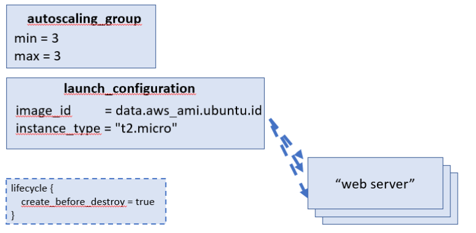
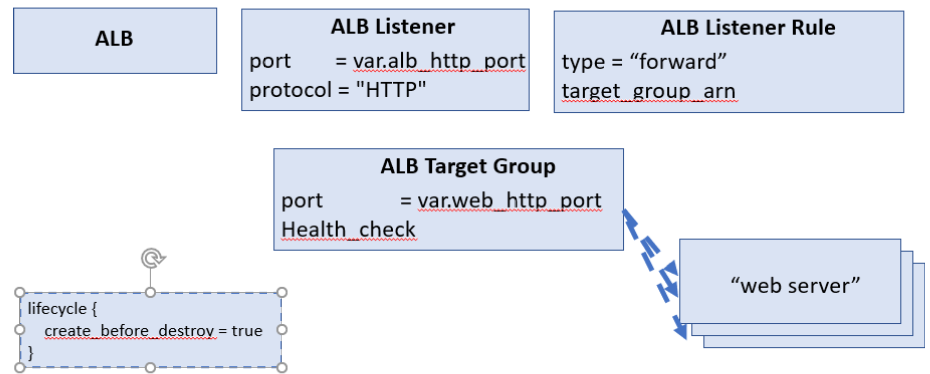

## Background:

In this lab, we will take the web servers that we created in lab 8 and deploy them to an Amazon AWS Auto Scaling Group and also deploy a load balancer to share the traffic between them.

Tasks.
- As before, create a new directory lab 9, and create three files, resources.tf, main.tf and vars.tf.
- You will create an auto scaling group with a desired capacity of three servers.
- Use the template files from the previous lab.

## Tasks

### 1. Create a new Lab directory ~/labs/lab9


```bash
mkdir -p ~/labs/lab9
cd        ~/labs/lab9
```


```bash
cp -a ~/labs/lab8a/secgroup.tf .
cp -a ~/labs/lab8a/data_ami.tf .
```

### 2. Create an auto-scaling group and a launch template for the web servers

#### Lab 8 Variables:

In lab 8 we defined the following variables:

*  "aws_region"

*  "names"

*  "key_name"

*  "http_port"

*  "server_text"


#### Lab 9 Variables:

In lab 9 we will define the following variables:

*  "aws_region"

*  "name"   (*name* not *names*)

*  "key_name"

*  "web_server_http_port"

*  "alb_http_port"

*  "server_text"

Note that we no longer define individual "*names*" for the web servers, but let the Autoscaling Group create names for us.

So we define a "*name*" variable to be used by the Autoscaling group.

We also change the name of "*http_port*" to *web_server_http_port* - this is an internal port number used by the web servers.

We now define *alb_http_port* as the port defined for the Application Load Balancer.  External requests will be made to this port.


#### Lab 8 Outputs:

In Lab 8 we output the public_ips and the URLs of each individual web server

#### Lab 9 Outputs:

Now in Lab 9 we will use a front end ALB, so we output it's dns_name and also it's url.


#### Lab 8 Resouces:
**Note**: In lab 8 we created the following resources in the root module:

* resource "aws_instance" "web_server" - https://registry.terraform.io/providers/hashicorp/aws/latest/docs/resources/instance

* resource "aws_security_group" "web_server" - https://registry.terraform.io/providers/hashicorp/aws/latest/docs/resources/security_group

* resource "aws_security_group_rule" "allow_http_inbound" - https://registry.terraform.io/providers/hashicorp/aws/latest/docs/resources/security_group_rule

* resource "aws_security_group_rule" "allow_ssh_inbound"

* resource "aws_security_group_rule" "allow_all_outbound"


#### Lab 9 Resouces:

To support rolling deployments we will set the create_before_destroy parameter in the ASG livecycle to true.

In implementing this lab we will not directly define the individual web servers, we will define an *AutoscalingGroup* which will have a *launch_configuration* to create the web server instances for us 

* resource "aws_autoscaling_group" "web_servers" - https://registry.terraform.io/providers/hashicorp/aws/latest/docs/resources/autoscaling_group




**Note**: the lifecycle structure shown bottom left of the above schema is to be added in all ASG/ALB related resources - see comment in the code below.

For the auto scaling group we will define a minimum and maximum of three servers.

### 3. create the autoscaling group resource definition

Add the following definition to the main.tf resources to define the AutoScaling Group:


```bash
cat keypair.tf
```


```bash
cat main.tf
```

**Note**: the use of depends_on above to ensure that the ASG group doesn't get created before the load balancer listening service is created.

* resource "aws_launch_configuration" "web_servers" - https://registry.terraform.io/providers/hashicorp/aws/latest/docs/data-sources/launch_configuration

Add the following definition to the main.tf resources to define the LaunchConfiguration used by the AutoScaling Group:


```bash
 tail main.tf
```


```bash
cat vars.tf
```

### 4. Show the hostname

Modify the above so that the served up text includes the serving hostname.

Add "from $(hostname)" into the index.html,

i.e. change the line:
```echo "${var.server_text}"```
to be
```echo "from $(hostname): ${var.server_text}"```

### 5. Modify the security group

The *web_server* security group will be the same, but using  the new *web_server_http_port* variable.

* resource "aws_security_group" "web_server"

* resource "aws_security_group_rule" "web_server_allow_http_inbound"

* resource "aws_security_group_rule" "web_server_allow_ssh_inbound"

* resource "aws_security_group_rule" "web_server_allow_all_outbound"


```bash
cat secgroup.tf
```

We must also create a new *alb* security group allowing inbound traffic on the *alb_http_port* variable and all outbound traffic.

Add the security group and associated rules into main.tf.

* resource "aws_security_group" "alb"

* resource "aws_security_group_rule" "alb_allow_http_inbound"

* resource "aws_security_group_rule" "allow_all_outbound"


```bash
cat secgroup_alb.tf
```

### 2. Create a load balancer for the web servers.



It is also necessary to create the ALB resources.

* resource "aws_alb" "web_servers" - https://registry.terraform.io/modules/terraform-aws-modules/alb/aws/latest
   
* resource "aws_alb_listener" "http" - https://registry.terraform.io/providers/hashicorp/aws/latest/docs/resources/lb_listener

* resource "aws_alb_listener_rule" "send_all_to_web_servers" - https://registry.terraform.io/providers/hashicorp/aws/latest/docs/resources/lb_listener_rule

* resource "aws_alb_target_group" "web_servers" - https://registry.terraform.io/providers/hashicorp/aws/latest/docs/resources/lb_listener


Create the following alb.tf:


```bash
cat alb.tf
```

### Add a new alb_http_port variable

Add the ```alb_http_port``` variable to the vars.tf file with a default value of 8080


```bash
cat outputs.tf
```


```bash
terraform init 
```


```bash
terraform apply 
```

### 3. The configuration when visualized should look like


<div>
    <object data="graph.svg" type="image/svg+xml">
    </object>
</div>

### 4. Now apply the new config

At the end of the apply the url of the ALB should be output

### 5. Test the ALB is wotking

Now we test the ALB by performing a curl on the output URL, e.g.

```curl -L alb-webserver-687206123.us-west-1.elb.amazonaws.com:8080```

Verify that the reported hostname changes due to the Round Robin Load Balancing, e.g.


```bash
CURL_CMD=$( terraform output alb_curl_dns | sed 's/,//' | jq -r '.[]' )

$CURL_CMD
```


```bash

let LOOP=10

CURL_CMD=$( terraform output alb_curl_dns | sed 's/,//' | jq -r '.[]' )

while [ $LOOP -gt 0 ]; do
    $CURL_CMD 
    let LOOP=LOOP-1
done

```

### 6. Cleanup


```bash
terraform destroy 
```

<div id="TOC" >
</div>
## Background:

In this lab, we will take the web servers that we created in lab 8 and deploy them to an Amazon AWS Auto Scaling Group and also deploy a load balancer to share the traffic between them.

Tasks.
- As before, create a new directory lab 9, and create three files, resources.tf, main.tf and vars.tf.
- You will create an auto scaling group with a desired capacity of three servers.
- Use the template files from the previous lab.

## Tasks

### 1. Create a new Lab directory ~/labs/lab9


```bash
mkdir -p ~/labs/lab9
cd        ~/labs/lab9
```


```bash
cp -a ~/labs/lab8a/secgroup.tf .
cp -a ~/labs/lab8a/data_ami.tf .
```

### 2. Create an auto-scaling group and a launch template for the web servers

#### Lab 8 Variables:

In lab 8 we defined the following variables:

*  "aws_region"

*  "names"

*  "key_name"

*  "http_port"

*  "server_text"


#### Lab 9 Variables:

In lab 9 we will define the following variables:

*  "aws_region"

*  "name"   (*name* not *names*)

*  "key_name"

*  "web_server_http_port"

*  "alb_http_port"

*  "server_text"

Note that we no longer define individual "*names*" for the web servers, but let the Autoscaling Group create names for us.

So we define a "*name*" variable to be used by the Autoscaling group.

We also change the name of "*http_port*" to *web_server_http_port* - this is an internal port number used by the web servers.

We now define *alb_http_port* as the port defined for the Application Load Balancer.  External requests will be made to this port.


#### Lab 8 Outputs:

In Lab 8 we output the public_ips and the URLs of each individual web server

#### Lab 9 Outputs:

Now in Lab 9 we will use a front end ALB, so we output it's dns_name and also it's url.


#### Lab 8 Resouces:
**Note**: In lab 8 we created the following resources in the root module:

* resource "aws_instance" "web_server" - https://registry.terraform.io/providers/hashicorp/aws/latest/docs/resources/instance

* resource "aws_security_group" "web_server" - https://registry.terraform.io/providers/hashicorp/aws/latest/docs/resources/security_group

* resource "aws_security_group_rule" "allow_http_inbound" - https://registry.terraform.io/providers/hashicorp/aws/latest/docs/resources/security_group_rule

* resource "aws_security_group_rule" "allow_ssh_inbound"

* resource "aws_security_group_rule" "allow_all_outbound"


#### Lab 9 Resouces:

To support rolling deployments we will set the create_before_destroy parameter in the ASG livecycle to true.

In implementing this lab we will not directly define the individual web servers, we will define an *AutoscalingGroup* which will have a *launch_configuration* to create the web server instances for us 

* resource "aws_autoscaling_group" "web_servers" - https://registry.terraform.io/providers/hashicorp/aws/latest/docs/resources/autoscaling_group


**Note**: the lifecycle structure shown bottom left of the above schema is to be added in all ASG/ALB related resources - see comment in the code below.

For the auto scaling group we will define a minimum and maximum of three servers.

### 3. create the autoscaling group resource definition

Add the following definition to the main.tf resources to define the AutoScaling Group:


```bash
cat keypair.tf
```


```bash
cat main.tf
```

**Note**: the use of depends_on above to ensure that the ASG group doesn't get created before the load balancer listening service is created.

* resource "aws_launch_configuration" "web_servers" - https://registry.terraform.io/providers/hashicorp/aws/latest/docs/data-sources/launch_configuration

Add the following definition to the main.tf resources to define the LaunchConfiguration used by the AutoScaling Group:


```bash
 tail main.tf
```


```bash
cat vars.tf
```

### 4. Show the hostname

Modify the above so that the served up text includes the serving hostname.

Add "from $(hostname)" into the index.html,

i.e. change the line:
```echo "${var.server_text}"```
to be
```echo "from $(hostname): ${var.server_text}"```

### 5. Modify the security group

The *web_server* security group will be the same, but using  the new *web_server_http_port* variable.

* resource "aws_security_group" "web_server"

* resource "aws_security_group_rule" "web_server_allow_http_inbound"

* resource "aws_security_group_rule" "web_server_allow_ssh_inbound"

* resource "aws_security_group_rule" "web_server_allow_all_outbound"


```bash
cat secgroup.tf
```

We must also create a new *alb* security group allowing inbound traffic on the *alb_http_port* variable and all outbound traffic.

Add the security group and associated rules into main.tf.

* resource "aws_security_group" "alb"

* resource "aws_security_group_rule" "alb_allow_http_inbound"

* resource "aws_security_group_rule" "allow_all_outbound"


```bash
cat secgroup_alb.tf
```

### 2. Create a load balancer for the web servers.


It is also necessary to create the ALB resources.

* resource "aws_alb" "web_servers" - https://registry.terraform.io/modules/terraform-aws-modules/alb/aws/latest
   
* resource "aws_alb_listener" "http" - https://registry.terraform.io/providers/hashicorp/aws/latest/docs/resources/lb_listener

* resource "aws_alb_listener_rule" "send_all_to_web_servers" - https://registry.terraform.io/providers/hashicorp/aws/latest/docs/resources/lb_listener_rule

* resource "aws_alb_target_group" "web_servers" - https://registry.terraform.io/providers/hashicorp/aws/latest/docs/resources/lb_listener


Create the following alb.tf:


```bash
cat alb.tf
```

### Add a new alb_http_port variable

Add the ```alb_http_port``` variable to the vars.tf file with a default value of 8080


```bash
cat outputs.tf
```


```bash
terraform init 
```


```bash
terraform apply 
```

### 3. The configuration when visualized should look like


<div>
    <object data="graph.svg" type="image/svg+xml">
    </object>
</div>

### 4. Now apply the new config

At the end of the apply the url of the ALB should be output

### 5. Test the ALB is wotking

Now we test the ALB by performing a curl on the output URL, e.g.

```curl -L alb-webserver-687206123.us-west-1.elb.amazonaws.com:8080```

Verify that the reported hostname changes due to the Round Robin Load Balancing, e.g.


```bash
CURL_CMD=$( terraform output alb_curl_dns | sed 's/,//' | jq -r '.[]' )

$CURL_CMD
```


```bash

let LOOP=10

CURL_CMD=$( terraform output alb_curl_dns | sed 's/,//' | jq -r '.[]' )

while [ $LOOP -gt 0 ]; do
    $CURL_CMD 
    let LOOP=LOOP-1
done

```

### 6. Cleanup


```bash
terraform destroy 
```

<div id="TOC" >
</div>
