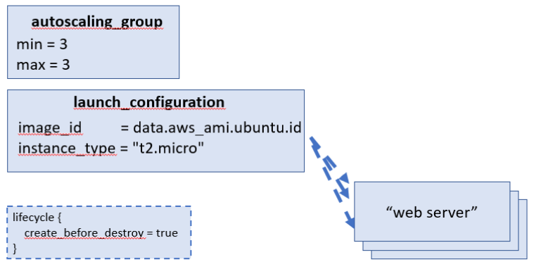
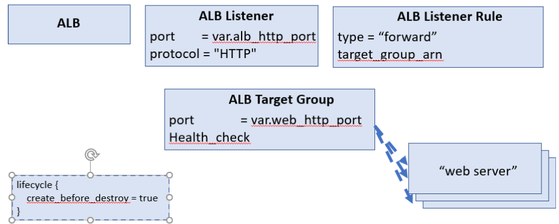

## Background:

In this lab, we will take the web servers that we created in lab 8 and deploy them to an Amazon AWS Auto Scaling Group and also deploy a load balancer to share the traffic between them.

Tasks.
- As before, create a new directory lab 9, and create three files, resources.tf, main.tf and vars.tf.
- You will create an auto scaling group with a desired capacity of three servers.
- Use the template files from the previous lab.

## Tasks

### 1. Create an auto-scaling group and a launch template for the web servers

#### Lab 8 Variables:

In lab 8 we defined the following variables:

*  "aws_region"

*  "names"

*  "key_name"

*  "http_port"

*  "server_text"


#### Lab 9 Variables:

In lab 9 we will define the following variables:

*  "aws_region"

*  "name"

*  "key_name"

*  "web_server_http_port"

*  "alb_http_port"

*  "server_text"

Note that we no longer define individual "*names*" for the web servers, but let the Autoscaling Group create names for us.

So we define a "*name*" variable to be used by the Autoscaling group.

We also change the name of "*http_port*" to *web_server_http_port* - this is an internal port number used by the web servers.

We now define *alb_http_port* as the port defined for the Application Load Balancer.  External requests will be made to this port.


#### Lab 8 Outputs:

In Lab 8 we output the public_ips and the URLs of each individual web server

#### Lab 9 Outputs:

Now in Lab 9 we will use a front end ALB, so we output it's dns_name and also it's url.


#### Lab 8 Resouces:
**Note**: In lab 8 we created the following resources in the root module:

* resource "aws_instance" "web_server" - https://registry.terraform.io/providers/hashicorp/aws/latest/docs/resources/instance

* resource "aws_security_group" "web_server" - https://registry.terraform.io/providers/hashicorp/aws/latest/docs/resources/security_group

* resource "aws_security_group_rule" "allow_http_inbound" - https://registry.terraform.io/providers/hashicorp/aws/latest/docs/resources/security_group_rule

* resource "aws_security_group_rule" "allow_ssh_inbound"

* resource "aws_security_group_rule" "allow_all_outbound"


#### Lab 9 Resouces:

To support rolling deployments we will set the create_before_destroy parameter in the ASG livecycle to true.

In implementing this lab we will not directly define the individual web servers, we will define an *AutoscalingGroup* which will have a *launch_configuration* to create the web server instances for us 

* resource "aws_autoscaling_group" "web_servers" - https://registry.terraform.io/providers/hashicorp/aws/latest/docs/resources/autoscaling_group




**Note**: the lifecycle structure shown bottom left of the above schema is to be added in all ASG/ALB related resources - see comment in the code below.

For the auto scaling group we will define a minimum and maximum of three servers.

Add the following definition to the main.tf resources to define the AutoScaling Group:
```tf
resource "aws_autoscaling_group" "web_servers" {
  # Note that we intentionally depend on the Launch Configuration name so that creating a new Launch Configuration
  # (e.g. to deploy a new AMI) creates a new Auto Scaling Group. This will allow for rolling deployments.
  name = aws_launch_configuration.web_servers.name

  launch_configuration = aws_launch_configuration.web_servers.name

  min_size         = 3
  max_size         = 3
  desired_capacity = 3
  min_elb_capacity = 3

  # Deploy all the subnets (and therefore AZs) available
  vpc_zone_identifier = data.aws_subnet_ids.default.ids

  # Automatically register this ASG's Instances in the ALB and use the ALB's health check to determine when an Instance
  # needs to be replaced
  health_check_type = "ELB"

  target_group_arns = [aws_alb_target_group.web_servers.arn]

  tag {
    key                 = "Name"
    value               = var.name
    propagate_at_launch = true
  }
  # To support rolling deployments, we tell Terraform to create a new ASG before deleting the old one. Note: as
  # soon as you set create_before_destroy = true in one resource, you must also set it in every resource that it
  # depends on, or you'll get an error about cyclic dependencies (especially when removing resources).
  lifecycle {
    create_before_destroy = true
  }

  # This needs to be here to ensure the ALB has at least one listener rule before the ASG is created. Otherwise, on the
  # very first deployment, the ALB won't bother doing any health checks, which means min_elb_capacity will not be
  # achieved, and the whole deployment will fail.
  depends_on = [aws_alb_listener.http]
}
```

**Note**: the use of depends_on above to ensure that the ASG group doesn't get created before the load balancer listening service is created.

* resource "aws_launch_configuration" "web_servers" - https://registry.terraform.io/providers/hashicorp/aws/latest/docs/data-sources/launch_configuration

Add the following definition to the main.tf resources to define the LaunchConfiguration used by the AutoScaling Group:
```tf
resource "aws_launch_configuration" "web_servers" {
  image_id      = data.aws_ami.ubuntu.id
  instance_type = "t2.micro"

  key_name        = var.key_name
  security_groups = [aws_security_group.web_server.id]

  # To keep this example simple, we run a web server as a User Data script. In real-world usage, you would typically
  # install the web server and its dependencies in the AMI.
  user_data = <<-EOF
              #!/bin/bash
              echo "${var.server_text}" > index.html
              nohup busybox httpd -f -p "${var.web_server_http_port}" &
              EOF

  # When used with an aws_autoscaling_group resource, the aws_launch_configuration must set create_before_destroy to
  # true. Note: as soon as you set create_before_destroy = true in one resource, you must also set it in every resource
  # that it depends on, or you'll get an error about cyclic dependencies (especially when removing resources).
  lifecycle {
    create_before_destroy = true
  }
}

```

Modify the above so that the served up text includes the serving hostname.

Add "from $(hostname)" into the index.html


The *web_server* security group will be the same, but using  the new *web_server_http_port* variable.

* resource "aws_security_group" "web_server"

* resource "aws_security_group_rule" "web_server_allow_http_inbound"

* resource "aws_security_group_rule" "web_server_allow_ssh_inbound"

* resource "aws_security_group_rule" "web_server_allow_all_outbound"

We must also create a new *alb* security group allowing inbound traffic on the *alb_http_port* variable and all outbound traffic.

Add the security group and associated rules into main.tf.


* resource "aws_security_group" "alb"

* resource "aws_security_group_rule" "alb_allow_http_inbound"

* resource "aws_security_group_rule" "allow_all_outbound"

### 2. Create a load balancer for the web servers.



It is also necessary to create the ALB resources.

* resource "aws_alb" "web_servers" - https://registry.terraform.io/modules/terraform-aws-modules/alb/aws/latest
   
* resource "aws_alb_listener" "http" - https://registry.terraform.io/providers/hashicorp/aws/latest/docs/resources/lb_listener

* resource "aws_alb_listener_rule" "send_all_to_web_servers" - https://registry.terraform.io/providers/hashicorp/aws/latest/docs/resources/lb_listener_rule

* resource "aws_alb_target_group" "web_servers" - https://registry.terraform.io/providers/hashicorp/aws/latest/docs/resources/lb_listener


Add the following lines to main.tf:

```tf
resource "aws_alb" "web_servers" {
  name            = var.name
  security_groups = [aws_security_group.alb.id]
  subnets         = data.aws_subnet_ids.default.ids

  # This is here because aws_alb_listener.htp depends on this resource and sets create_before_destroy to true
  lifecycle {
    create_before_destroy = true
  }
}

resource "aws_alb_listener" "http" {
  load_balancer_arn = aws_alb.web_servers.arn
  port              = var.alb_http_port
  protocol          = "HTTP"

  default_action {
    type             = "forward"
    target_group_arn = aws_alb_target_group.web_servers.arn
  }

  # This is here because aws_autoscaling_group.web_servers depends on this resource and sets create_before_destroy
  # to true
  lifecycle {
    create_before_destroy = true
  }
}

resource "aws_alb_target_group" "web_servers" {
  name     = var.name
  port     = var.web_server_http_port
  protocol = "HTTP"
  vpc_id   = data.aws_vpc.default.id

  # Give existing connections 10 seconds to complete before deregistering an instance. The default delay is 300 seconds
  # (5 minutes), which significantly slows down redeploys. In theory, the ALB should deregister the instance as long as
  # there are no open connections; in practice, it waits the full five minutes every time. If your requests are
  # generally processed quickly, set this to something lower (such as 10 seconds) to keep redeploys fast.
  deregistration_delay = 10

  health_check {
    path                = "/"
    interval            = 15
    healthy_threshold   = 2
    unhealthy_threshold = 2
    timeout             = 5
  }

  # This is here because aws_autoscaling_group.web_servers depends on this resource and sets create_before_destroy
  # to true
  lifecycle {
    create_before_destroy = true
  }
}

resource "aws_alb_listener_rule" "send_all_to_web_servers" {
  listener_arn = aws_alb_listener.http.arn
  priority     = 100

  action {
    type             = "forward"
    target_group_arn = aws_alb_target_group.web_servers.arn
  }

  condition {
    path_pattern {
      values = ["*"]
    }
  }
}


# ---------------------------------------------------------------------------------------------------------------------
# DEPLOY INTO THE DEFAULT VPC AND SUBNETS
# To keep this example simple, we are deploying into the Default VPC and its subnets. In real-world usage, you should
# deploy into a custom VPC and private subnets.
# ---------------------------------------------------------------------------------------------------------------------

data "aws_vpc" "default" {
  default = true
}

data "aws_subnet_ids" "default" {
  vpc_id = data.aws_vpc.default.id
}


```


### 3. The configuration when visualized should look like

<div>
    <object data="graph.svg" type="image/svg+xml">
    </object>
</div>

### 4. Now apply the new config

At the end of the apply the url of the ALB should be output

### 5. Test the ALB is wotking

Now we test the ALB by performing a curl on the output URL, e.g.
```bash
curl http://asg-alb-example-1773578702.us-west-1.elb.amazonaws.com
```

Verify that the reported hostname changes due to the Round Robin Load Balancing, e.g.
```
> curl http://asg-alb-example-1773578702.us-west-1.elb.amazonaws.com
Hello, World from ip-172-31-5-21
> curl http://asg-alb-example-1773578702.us-west-1.elb.amazonaws.com
Hello, World from ip-172-31-5-10
> curl http://asg-alb-example-1773578702.us-west-1.elb.amazonaws.com
Hello, World from ip-172-31-5-10
> curl http://asg-alb-example-1773578702.us-west-1.elb.amazonaws.com
Hello, World from ip-172-31-21-23


```


### 6. Cleanup
```bash
> terraform destroy
```
To destroy the formerly created AWS vpc, and all subnets.

